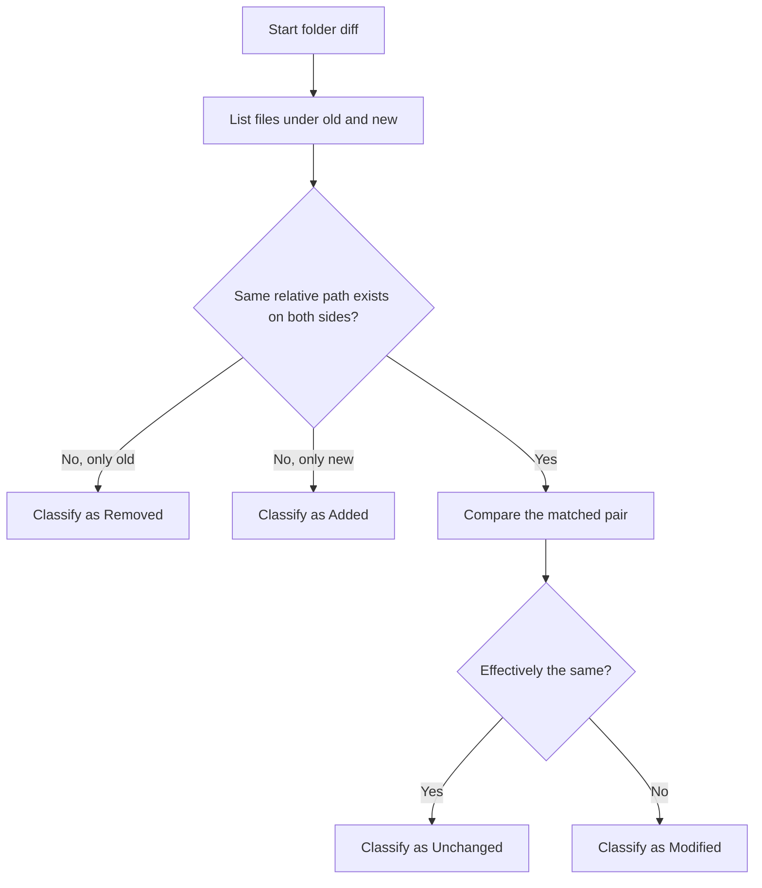
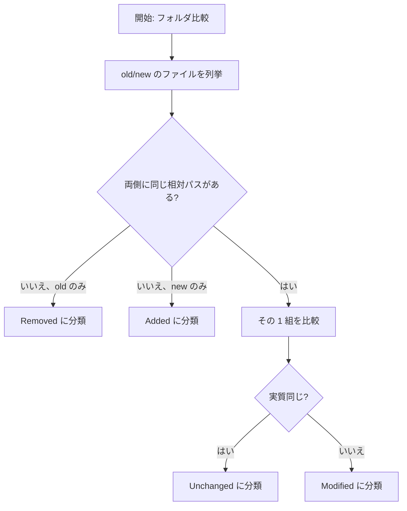

# FolderDiffIL4DotNet

`FolderDiffIL4DotNet` is a .NET console application that compares two folders and outputs a Markdown report.
For .NET assemblies, it compares IL while ignoring build-specific information such as `// MVID:` lines, so assemblies whose contents are effectively the same can still be judged equal.

Developer-focused details (architecture, CI, tests, implementation cautions):
- [doc/DEVELOPER_GUIDE.md](doc/DEVELOPER_GUIDE.md)

<a id="readme-en-doc-map"></a>
## Documentation Map

| Need | Document |
| --- | --- |
| Product overview, setup, usage, and configuration | [README.md](README.md#readme-en-usage) |
| Runtime architecture, execution flow, DI scopes, and implementation guardrails | [doc/DEVELOPER_GUIDE.md](doc/DEVELOPER_GUIDE.md#guide-en-map) |
| Test strategy, local test commands, coverage, and isolation rules | [doc/TESTING_GUIDE.md](doc/TESTING_GUIDE.md#testing-en-run-tests) |
| Generated API reference from XML documentation comments | [api/index.md](api/index.md) via [docfx.json](docfx.json) |

## Requirements

- [.NET SDK 8.x](https://dotnet.microsoft.com/en-us/download/dotnet/8.0)
- macOS / Windows / Linux / Unix-like OS
- IL disassembler (auto-probed per file)
  - Preferred: [`dotnet-ildasm`](https://www.nuget.org/packages/dotnet-ildasm/) or [`dotnet ildasm`](https://www.nuget.org/packages/dotnet-ildasm/)
  - Fallback: [`ilspycmd`](https://www.nuget.org/packages/ilspycmd/)

[.NET SDK 8.x](https://dotnet.microsoft.com/en-us/download/dotnet/8.0) installation examples:

```powershell
# Windows (winget)
winget install Microsoft.DotNet.SDK.8 --source winget
```

```powershell
# Windows (dotnet-install script)
powershell -ExecutionPolicy Bypass -c "& { iwr https://dot.net/v1/dotnet-install.ps1 -OutFile dotnet-install.ps1; .\dotnet-install.ps1 -Channel 8.0 }"
```

```bash
# macOS/Linux/Unix (dotnet-install script)
curl -fsSL https://dot.net/v1/dotnet-install.sh | bash /dev/stdin --channel 8.0
```

IL disassembler installation examples:

```bash
dotnet tool install --global dotnet-ildasm
# add $HOME/.dotnet/tools (macOS/Linux/Unix) or %USERPROFILE%\.dotnet\tools (Windows) to PATH if needed

# verify installation and version (both commands invoke the same dotnet-ildasm tool)
dotnet-ildasm --version
dotnet ildasm --version
```

```bash
dotnet tool install --global ilspycmd
# add $HOME/.dotnet/tools (macOS/Linux/Unix) or %USERPROFILE%\.dotnet\tools (Windows) to PATH if needed
```

<a id="readme-en-usage"></a>
## Usage

1. Place [`config.json`](config.json) next to the executable.
2. Run with arguments:
- old folder absolute path
- new folder absolute path
- report label
3. Add `--no-pause` if you want to skip key-wait at process end.

```bash
dotnet build
dotnet run "/Users/UserA/workspace/old" "/Users/UserA/workspace/new" "YYYYMMDD" --no-pause
```

Main output:
- `Reports/<label>/diff_report.md`
- Optional IL dumps under `Reports/<label>/IL/old` and `Reports/<label>/IL/new` when [`ShouldOutputILText`](#configuration-table-en) is `true`

Example `diff_report.md` (trimmed):

```md
# Folder Diff Report
- App Version: FolderDiffIL4DotNet 1.0.0
- Computer: dev-machine
- Old: /Users/UserA/workspace/old
- New: /Users/UserA/workspace/new
- Ignored Extensions: .cache, .DS_Store, .db, .ilcache, .log, .pdb
- Text File Extensions: .asax, .ascx, .asmx, .aspx, .bat, .c, .cmd, .config, .cpp, .cs, .cshtml, .csproj, .csx, .css, .csv, .editorconfig, .env, .fs, .fsi, .fsproj, .fsx, .gitattributes, .gitignore, .gitmodules, .go, .gql, .graphql, .h, .hpp, .htm, .html, .http, .ini, .js, .json, .jsx, .less, .manifest, .md, .mod, .nlog, .nuspec, .plist, .props, .ps1, .psd1, .psm1, .py, .razor, .resx, .rst, .sass, .scss, .sh, .sln, .sql, .sqlproj, .sum, .svg, .targets, .toml, .ts, .tsv, .tsx, .txt, .vb, .vbproj, .vue, .xaml, .xml, .yaml, .yml
- IL Disassembler: dotnet-ildasm (version: 0.12.2)
- Elapsed Time: 00:00:01.234
- Note: When diffing IL, lines starting with "// MVID:" (if present) are ignored because they contain disassembler-emitted Module Version ID metadata that can change on rebuild without meaning the executable IL changed.
- Note: When diffing IL, lines containing any of the configured strings are ignored: "buildserver1_", "buildserver2_".
- Legend:
  - `MD5Match` / `MD5Mismatch`: MD5 hash match / mismatch
  - `ILMatch` / `ILMismatch`: IL(Intermediate Language) match / mismatch
  - `TextMatch` / `TextMismatch`: Text match / mismatch

## [ x ] Ignored Files
- [ x ] bin/MyApp.pdb (old/new) <u>(updated_old: 2026-03-15 08:57:00.000 +09:00, updated_new: 2026-03-15 09:03:00.000 +09:00)</u>

## [ = ] Unchanged Files
- [ = ] appsettings.json <u>(updated: 2026-03-15 09:00:00.000 +09:00)</u> `TextMatch`

## [ + ] Added Files
- [ + ] /Users/UserA/workspace/new/docs/guide.md <u>(updated: 2026-03-15 09:01:00.000 +09:00)</u>

## [ - ] Removed Files
- [ - ] /Users/UserA/workspace/old/legacy/old-tool.txt <u>(updated: 2026-03-15 08:55:00.000 +09:00)</u>

## [ * ] Modified Files
- [ * ] src/MyApp.dll <u>(updated_old: 2026-03-15 08:58:00.000 +09:00, updated_new: 2026-03-15 09:02:00.000 +09:00)</u> `ILMismatch` `dotnet-ildasm (version: 0.12.2)`
- [ * ] payload.bin <u>(updated_old: 2026-03-15 08:59:00.000 +09:00, updated_new: 2026-03-15 08:54:00.000 +09:00)</u> `MD5Mismatch`

## Summary
- Ignored   : 1
- Unchanged : 1
- Added     : 1
- Removed   : 1
- Modified  : 2
- Compared  : 5 (Old) vs 5 (New)

## Warnings
- **WARNING:** One or more files were classified as `MD5Mismatch`. Manual review is recommended because only an MD5 hash comparison was possible.
- **WARNING:** One or more files in `new` have older last-modified timestamps than the corresponding files in `old`.
  - payload.bin (updated_old: 2026-03-15 08:59:00.000 +09:00, updated_new: 2026-03-15 08:54:00.000 +09:00)
```

<a id="readme-en-runtime-composition"></a>
## Runtime Composition

- [`Program.cs`](Program.cs) is intentionally thin and only resolves [`ProgramRunner`](ProgramRunner.cs).
- [`ProgramRunner`](ProgramRunner.cs) keeps `RunAsync()` as a phase-oriented coordinator by delegating logger initialization, argument validation, configuration loading, run-scope creation, diff execution, and report generation to focused helpers.
- [`ProgramRunner`](ProgramRunner.cs) also owns aggregated end-of-run console warnings such as `MD5Mismatch` and timestamp-regression notices.
- [`DiffExecutionContext`](Services/DiffExecutionContext.cs) carries run-specific paths and network-mode decisions.
- Domain-independent console, diagnostics, I/O, and text helpers now live under [`FolderDiffIL4DotNet.Core/`](FolderDiffIL4DotNet.Core/), so the main executable project stays focused on folder-diff behavior.
- [`FolderDiffExecutionStrategy`](Services/FolderDiffExecutionStrategy.cs) owns discovery filtering and auto-parallelism policy, so [`FolderDiffService`](Services/FolderDiffService.cs) can stay focused on progress, orchestration, and result routing.
- [`FolderDiffService`](Services/FolderDiffService.cs) uses [`IFileSystemService`](Services/IFileSystemService.cs) for discovery/output I/O, including lazy file enumeration via `EnumerateFiles(...)`, and [`FileDiffService`](Services/FileDiffService.cs) uses [`IFileComparisonService`](Services/IFileComparisonService.cs) for hash, text, and chunk-read operations, which keeps permission and disk-failure paths unit-testable without changing runtime behavior.
- Core pipeline services ([`FolderDiffService`](Services/FolderDiffService.cs), [`FileDiffService`](Services/FileDiffService.cs), [`ILOutputService`](Services/ILOutputService.cs)) depend on interfaces and injected context rather than static fields or `ActivatorUtilities.CreateInstance`, which keeps behavior stable while improving test substitution.

<a id="readme-en-comparison-flow"></a>
## Comparison Flow

At a high level, the tool first matches files by relative path, then decides whether each matched pair is effectively the same.



For one matched pair, the decision order is:

1. Try an exact byte-level match with MD5.
2. If MD5 differs and the old-side file is a .NET executable, compare filtered IL instead of raw bytes.
3. If it is not in the IL path and the extension is listed in [`TextFileExtensions`](#configuration-table-en), compare it as text.
4. If none of the checks say "same", treat it as a normal mismatch.

Important details:
- `Added`, `Removed`, `Unchanged`, and `Modified` are decided by relative path, not by file name alone.
- IL comparison always ignores `// MVID:` lines, so build-specific assembly noise does not create false differences.
- If [`ShouldIgnoreILLinesContainingConfiguredStrings`](#configuration-table-en) is `true`, lines containing any configured ignore string are also skipped during IL comparison.
- Text files may use different internal strategies depending on size and runtime mode. If chunk-parallel comparison for a large local file throws, the run logs a warning and retries with sequential text comparison.
- Warm-up, cache cleanup, and post-write read-only protection are best-effort paths that log warnings and continue. Folder enumeration, matched-pair comparison, and report writing log and rethrow expected runtime exceptions because they affect correctness or required output.
- If IL comparison itself fails, the run stops instead of silently falling back to a weaker comparison.

## Configuration ([`config.json`](config.json))

Place [`config.json`](config.json) next to the executable. All keys are optional; omitted keys use the code-defined defaults in [`ConfigSettings`](Models/ConfigSettings.cs). If the defaults are acceptable, this file can be just:

```json
{}
```

Override only the settings you want to change. For example:

```json
{
  "ShouldIgnoreILLinesContainingConfiguredStrings": true,
  "ILIgnoreLineContainingStrings": ["buildserver1_", "buildserver2_"],
  "ShouldOutputFileTimestamps": false,
  "ShouldOutputILText": false,
  "ShouldIncludeIgnoredFiles": false
}
```

### Configuration Table EN

<table>
  <thead>
    <tr>
      <th>Key</th>
      <th>Default</th>
      <th>Description</th>
    </tr>
  </thead>
  <tbody>
    <tr id="config-en-ignoredextensions">
      <td><code>IgnoredExtensions</code></td>
      <td><code>.cache</code>, <code>.DS_Store</code>, <code>.db</code>, <code>.ilcache</code>, <code>.log</code>, <code>.pdb</code></td>
      <td>Excludes matching extensions from comparison.</td>
    </tr>
    <tr id="config-en-textfileextensions">
      <td><code>TextFileExtensions</code></td>
      <td>Built-in extension list in <a href="Models/ConfigSettings.cs"><code>ConfigSettings</code></a></td>
      <td>Treats matching extensions as text. Include dot (<code>.cs</code>, <code>.json</code>). Matching is case-insensitive.</td>
    </tr>
    <tr id="config-en-maxloggenerations">
      <td><code>MaxLogGenerations</code></td>
      <td><code>5</code></td>
      <td>Number of log files kept in rotation.</td>
    </tr>
    <tr id="config-en-shouldincludeunchangedfiles">
      <td><code>ShouldIncludeUnchangedFiles</code></td>
      <td><code>true</code></td>
      <td>Includes <code>Unchanged</code> section in report.</td>
    </tr>
    <tr id="config-en-shouldincludeignoredfiles">
      <td><code>ShouldIncludeIgnoredFiles</code></td>
      <td><code>true</code></td>
      <td>Includes <code>Ignored Files</code> section before <code>Unchanged</code>.</td>
    </tr>
    <tr id="config-en-shouldoutputiltext">
      <td><code>ShouldOutputILText</code></td>
      <td><code>true</code></td>
      <td>Outputs IL dumps under <code>Reports/&lt;label&gt;/IL/old,new</code>.</td>
    </tr>
    <tr id="config-en-shouldignoreillinescontainingconfiguredstrings">
      <td><code>ShouldIgnoreILLinesContainingConfiguredStrings</code></td>
      <td><code>false</code></td>
      <td>Enables additional IL line-ignore filter by substring.</td>
    </tr>
    <tr id="config-en-ilignorelinecontainingstrings">
      <td><code>ILIgnoreLineContainingStrings</code></td>
      <td><code>[]</code></td>
      <td>String list used by IL substring-ignore filter.</td>
    </tr>
    <tr id="config-en-shouldoutputfiletimestamps">
      <td><code>ShouldOutputFileTimestamps</code></td>
      <td><code>true</code></td>
      <td>Adds last-modified timestamps to report entries.</td>
    </tr>
    <tr id="config-en-shouldwarnwhennewfiletimestampisolderthanoldfiletimestamp">
      <td><code>ShouldWarnWhenNewFileTimestampIsOlderThanOldFileTimestamp</code></td>
      <td><code>true</code></td>
      <td>Warns if a file in <code>new</code> has an older last-modified timestamp than the matching file in <code>old</code>, prints the warning at the end of the run, and appends a final <code>Warnings</code> section to <code>diff_report.md</code>.</td>
    </tr>
    <tr id="config-en-maxparallelism">
      <td><code>MaxParallelism</code></td>
      <td><code>0</code></td>
      <td>Max compare parallelism. <code>0</code> or less = auto.</td>
    </tr>
    <tr id="config-en-textdiffparallelthresholdkilobytes">
      <td><code>TextDiffParallelThresholdKilobytes</code></td>
      <td><code>512</code></td>
      <td>Text diff size threshold (KiB) for chunk-parallel mode.</td>
    </tr>
    <tr id="config-en-textdiffchunksizekilobytes">
      <td><code>TextDiffChunkSizeKilobytes</code></td>
      <td><code>64</code></td>
      <td>Chunk size (KiB) for parallel text diff.</td>
    </tr>
    <tr id="config-en-enableilcache">
      <td><code>EnableILCache</code></td>
      <td><code>true</code></td>
      <td>Enables IL cache (memory + optional disk).</td>
    </tr>
    <tr id="config-en-ilcachedirectoryabsolutepath">
      <td><code>ILCacheDirectoryAbsolutePath</code></td>
      <td><code>""</code></td>
      <td>IL cache directory. Empty = <code>&lt;exe&gt;/ILCache</code>.</td>
    </tr>
    <tr id="config-en-ilcachestatslogintervalseconds">
      <td><code>ILCacheStatsLogIntervalSeconds</code></td>
      <td><code>60</code></td>
      <td>IL cache stats log interval. <code>&lt;=0</code> uses default 60s.</td>
    </tr>
    <tr id="config-en-ilcachemaxdiskfilecount">
      <td><code>ILCacheMaxDiskFileCount</code></td>
      <td><code>1000</code></td>
      <td>Disk cache file count cap. <code>&lt;=0</code> means unlimited.</td>
    </tr>
    <tr id="config-en-ilcachemaxdiskmegabytes">
      <td><code>ILCacheMaxDiskMegabytes</code></td>
      <td><code>512</code></td>
      <td>Disk cache size cap (MB). <code>&lt;=0</code> means unlimited.</td>
    </tr>
    <tr id="config-en-optimizefornetworkshares">
      <td><code>OptimizeForNetworkShares</code></td>
      <td><code>false</code></td>
      <td>Enables network-share optimization mode.</td>
    </tr>
    <tr id="config-en-autodetectnetworkshares">
      <td><code>AutoDetectNetworkShares</code></td>
      <td><code>true</code></td>
      <td>Auto-detects network paths and enables optimization mode as needed.</td>
    </tr>
  </tbody>
</table>

Notes:
- Built-in defaults, including the full [`IgnoredExtensions`](#configuration-table-en) and [`TextFileExtensions`](#configuration-table-en) lists, are defined in [`Models/ConfigSettings.cs`](Models/ConfigSettings.cs).
- Cross-project byte-size and timestamp literals are defined in [`FolderDiffIL4DotNet.Core/Common/CoreConstants.cs`](FolderDiffIL4DotNet.Core/Common/CoreConstants.cs), and app-level constants remain in [`Common/Constants.cs`](Common/Constants.cs), so shared formats do not drift independently across projects.
- Files without extension are still compared.
- If you want extensionless files treated as text, include empty string (`""`) in [`TextFileExtensions`](#configuration-table-en).
- Timestamp-regression warnings are evaluated only for files that exist in both `old` and `new`.
- If any file ends as `MD5Mismatch`, the report writes that warning in the final `Warnings` section before any timestamp-regression entries, and the same message is printed once at run completion.
- Internal IL cache defaults that are not exposed in [`config.json`](config.json) are currently `2000` in-memory entries, `12` hours TTL, and `60` seconds for internal stats logging; [`ProgramRunner`](ProgramRunner.cs) keeps them as shared code defaults to balance reuse against console-tool memory/log growth.

<a id="readme-en-generated-artifacts"></a>
## Generated Artifacts

- `Reports/<label>/diff_report.md`
- `Logs/log_YYYYMMDD.log`
- Optional: `Reports/<label>/IL/old/*.txt`, `Reports/<label>/IL/new/*.txt`

Report and IL-text creation are treated as required output, so write failures stop the run. After writing, the files are set to read-only when possible, and that protection step remains warning-only.

<a id="readme-en-api-docs"></a>
## API Documentation

API reference pages are generated with DocFX from the XML documentation comments emitted by both [`FolderDiffIL4DotNet.csproj`](FolderDiffIL4DotNet.csproj) and [`FolderDiffIL4DotNet.Core/FolderDiffIL4DotNet.Core.csproj`](FolderDiffIL4DotNet.Core/FolderDiffIL4DotNet.Core.csproj).

Local refresh:

```bash
dotnet build FolderDiffIL4DotNet.sln --configuration Release
dotnet tool update --global docfx --version '2.*'
export PATH="$PATH:$HOME/.dotnet/tools"
docfx metadata docfx.json
docfx build docfx.json
```

Generated outputs:
- Site root: `_site/index.html`
- API metadata intermediate files: `api/*.yml`

CI also generates the same site and uploads it as the `DocumentationSite` artifact.

<a id="readme-en-ci-automation"></a>
## CI/CD and Security Automation

- [`.github/workflows/dotnet.yml`](.github/workflows/dotnet.yml) builds, tests, generates DocFX output, uploads artifacts, and already enforces total coverage thresholds of `73%` line and `71%` branch.
- [`.github/workflows/release.yml`](.github/workflows/release.yml) creates a GitHub Release when a `v*` tag is pushed and attaches zipped publish output, zipped documentation, and SHA-256 checksums.
- [`.github/workflows/codeql.yml`](.github/workflows/codeql.yml) runs scheduled and on-change CodeQL analysis for both C# and GitHub Actions workflows.
- [`.github/dependabot.yml`](.github/dependabot.yml) enables weekly update PRs for NuGet packages and GitHub Actions.

## License

- [MIT License](LICENSE)

---

# FolderDiffIL4DotNet（日本語）

`FolderDiffIL4DotNet` は、2つのフォルダを比較して Markdown レポートを出力する .NET コンソールアプリです。
.NET アセンブリは `// MVID:` などのビルド固有情報を除外して IL 比較することで、アセンブリの中身が実質的に同じであれば同一と判断します。

開発者向けの詳細（設計、CI、テスト、実装上の注意点）は以下に分離しました。
- [doc/DEVELOPER_GUIDE.md](doc/DEVELOPER_GUIDE.md)

<a id="readme-ja-doc-map"></a>
## ドキュメントの見取り図

| 見たい内容 | ドキュメント |
| --- | --- |
| 製品概要、導入、使い方、設定 | [README.md](README.md#readme-ja-usage) |
| 実行時アーキテクチャ、実行フロー、DI スコープ、実装上の注意点 | [doc/DEVELOPER_GUIDE.md](doc/DEVELOPER_GUIDE.md#guide-ja-map) |
| テスト戦略、ローカル実行コマンド、カバレッジ、分離ルール | [doc/TESTING_GUIDE.md](doc/TESTING_GUIDE.md#testing-ja-run-tests) |
| XML ドキュメントコメントから生成する API リファレンス | [api/index.md](api/index.md) と [docfx.json](docfx.json) |

## 必要環境

- [.NET SDK 8.x](https://dotnet.microsoft.com/ja-jp/download/dotnet/8.0)
- macOS / Windows / Linux / Unix 系 OS
- IL 逆アセンブラ（ファイルごとに自動判定）
  - 優先: [`dotnet-ildasm`](https://www.nuget.org/packages/dotnet-ildasm/) または [`dotnet ildasm`](https://www.nuget.org/packages/dotnet-ildasm/)
  - 代替: [`ilspycmd`](https://www.nuget.org/packages/ilspycmd/)

[.NET SDK 8.x](https://dotnet.microsoft.com/ja-jp/download/dotnet/8.0) のインストール例:

```powershell
# Windows (winget)
winget install Microsoft.DotNet.SDK.8 --source winget
```

```powershell
# Windows (dotnet-install スクリプト)
powershell -ExecutionPolicy Bypass -c "& { iwr https://dot.net/v1/dotnet-install.ps1 -OutFile dotnet-install.ps1; .\dotnet-install.ps1 -Channel 8.0 }"
```

```bash
# macOS/Linux/Unix (dotnet-install スクリプト)
curl -fsSL https://dot.net/v1/dotnet-install.sh | bash /dev/stdin --channel 8.0
```

IL 逆アセンブラのインストール例:

```bash
dotnet tool install --global dotnet-ildasm
# 必要に応じて PATH へ追加
# macOS/Linux/Unix: $HOME/.dotnet/tools
# Windows: %USERPROFILE%\.dotnet\tools

# インストール確認とバージョン確認（どちらも同じ dotnet-ildasm を実行）
dotnet-ildasm --version
dotnet ildasm --version
```

```bash
dotnet tool install --global ilspycmd
# 必要に応じて PATH へ追加
# macOS/Linux/Unix: $HOME/.dotnet/tools
# Windows: %USERPROFILE%\.dotnet\tools
```

<a id="readme-ja-usage"></a>
## 使い方

1. 実行ファイルと同じ場所に [`config.json`](config.json) を配置します。
2. 次の引数で実行します。
- 旧フォルダ（比較元）の絶対パス
- 新フォルダ（比較先）の絶対パス
- レポートラベル
3. 終了時のキー待ちを省略する場合は `--no-pause` を付けます。

```bash
dotnet build
dotnet run "/Users/UserA/workspace/old" "/Users/UserA/workspace/new" "YYYYMMDD" --no-pause
```

主な出力:
- `Reports/<label>/diff_report.md`
- [`ShouldOutputILText`](#configuration-table-ja) が `true` の場合は `Reports/<label>/IL/old` と `Reports/<label>/IL/new` に IL テキスト

`diff_report.md` の簡単な例:

```md
# Folder Diff Report
- App Version: FolderDiffIL4DotNet 1.0.0
- Computer: dev-machine
- Old: /Users/UserA/workspace/old
- New: /Users/UserA/workspace/new
- Ignored Extensions: .cache, .DS_Store, .db, .ilcache, .log, .pdb
- Text File Extensions: .asax, .ascx, .asmx, .aspx, .bat, .c, .cmd, .config, .cpp, .cs, .cshtml, .csproj, .csx, .css, .csv, .editorconfig, .env, .fs, .fsi, .fsproj, .fsx, .gitattributes, .gitignore, .gitmodules, .go, .gql, .graphql, .h, .hpp, .htm, .html, .http, .ini, .js, .json, .jsx, .less, .manifest, .md, .mod, .nlog, .nuspec, .plist, .props, .ps1, .psd1, .psm1, .py, .razor, .resx, .rst, .sass, .scss, .sh, .sln, .sql, .sqlproj, .sum, .svg, .targets, .toml, .ts, .tsv, .tsx, .txt, .vb, .vbproj, .vue, .xaml, .xml, .yaml, .yml
- IL Disassembler: dotnet-ildasm (version: 0.12.2)
- Elapsed Time: 00:00:01.234
- Note: When diffing IL, lines starting with "// MVID:" (if present) are ignored because they contain disassembler-emitted Module Version ID metadata that can change on rebuild without meaning the executable IL changed.
- Note: When diffing IL, lines containing any of the configured strings are ignored: "buildserver1_", "buildserver2_".
- Legend:
  - `MD5Match` / `MD5Mismatch`: MD5 hash match / mismatch
  - `ILMatch` / `ILMismatch`: IL(Intermediate Language) match / mismatch
  - `TextMatch` / `TextMismatch`: Text match / mismatch

## [ x ] Ignored Files
- [ x ] bin/MyApp.pdb (old/new) <u>(updated_old: 2026-03-15 08:57:00.000 +09:00, updated_new: 2026-03-15 09:03:00.000 +09:00)</u>

## [ = ] Unchanged Files
- [ = ] appsettings.json <u>(updated: 2026-03-15 09:00:00.000 +09:00)</u> `TextMatch`

## [ + ] Added Files
- [ + ] /Users/UserA/workspace/new/docs/guide.md <u>(updated: 2026-03-15 09:01:00.000 +09:00)</u>

## [ - ] Removed Files
- [ - ] /Users/UserA/workspace/old/legacy/old-tool.txt <u>(updated: 2026-03-15 08:55:00.000 +09:00)</u>

## [ * ] Modified Files
- [ * ] src/MyApp.dll <u>(updated_old: 2026-03-15 08:58:00.000 +09:00, updated_new: 2026-03-15 09:02:00.000 +09:00)</u> `ILMismatch` `dotnet-ildasm (version: 0.12.2)`
- [ * ] payload.bin <u>(updated_old: 2026-03-15 08:59:00.000 +09:00, updated_new: 2026-03-15 08:54:00.000 +09:00)</u> `MD5Mismatch`

## Summary
- Ignored   : 1
- Unchanged : 1
- Added     : 1
- Removed   : 1
- Modified  : 2
- Compared  : 5 (Old) vs 5 (New)

## Warnings
- **WARNING:** One or more files were classified as `MD5Mismatch`. Manual review is recommended because only an MD5 hash comparison was possible.
- **WARNING:** One or more files in `new` have older last-modified timestamps than the corresponding files in `old`.
  - payload.bin (updated_old: 2026-03-15 08:59:00.000 +09:00, updated_new: 2026-03-15 08:54:00.000 +09:00)
```

<a id="readme-ja-runtime-composition"></a>
## 実行時構成

- [`Program.cs`](Program.cs) は薄いエントリーポイントで、[`ProgramRunner`](ProgramRunner.cs) の解決だけを行います。
- [`ProgramRunner`](ProgramRunner.cs) は `RunAsync()` をフェーズ調停役に絞り、ロガー初期化、引数検証、設定読込、実行スコープ生成、差分実行、レポート生成を専用 helper へ委譲します。
- [`ProgramRunner`](ProgramRunner.cs) は `MD5Mismatch` や更新日時逆転のような集約後の終了時コンソール警告も担当します。
- [`DiffExecutionContext`](Services/DiffExecutionContext.cs) が実行ごとのパスやネットワークモード判定を保持します。
- ドメイン非依存の console / diagnostics / I/O / text helper は [`FolderDiffIL4DotNet.Core/`](FolderDiffIL4DotNet.Core/) へ分離し、実行ファイル側のプロジェクトはフォルダ差分の振る舞いへ集中させています。
- [`FolderDiffExecutionStrategy`](Services/FolderDiffExecutionStrategy.cs) が、ファイル探索時の除外ルール適用と自動並列度の決定を担当し、[`FolderDiffService`](Services/FolderDiffService.cs) は進捗・実行制御・結果振り分けへ寄せています。
- [`FolderDiffService`](Services/FolderDiffService.cs) は列挙/出力系 I/O を [`IFileSystemService`](Services/IFileSystemService.cs) に委譲しており、ファイル列挙も `EnumerateFiles(...)` による遅延列挙で扱います。[`FileDiffService`](Services/FileDiffService.cs) はハッシュ/テキスト/チャンク読み出し系 I/O を [`IFileComparisonService`](Services/IFileComparisonService.cs) に委譲しており、権限エラーやディスク系失敗の経路も実ファイルなしでユニットテストできます。
- 主要パイプラインサービス（[`FolderDiffService`](Services/FolderDiffService.cs), [`FileDiffService`](Services/FileDiffService.cs), [`ILOutputService`](Services/ILOutputService.cs)）は、静的フィールドや `ActivatorUtilities.CreateInstance` ではなく、インターフェースとコンテキスト注入に依存します。これにより既存動作を維持したままテスト差し替え性を高めています。

<a id="readme-ja-comparison-flow"></a>
## 比較フロー

大まかには、まず相対パスでファイルを突き合わせてから、両側に存在するファイルが「実質同じか」を判定します。



同じ相対パスの 1 組に対しては、次の順番で判定します。

1. まず MD5 で完全一致かを確認します。
2. MD5 が不一致で、old 側ファイルが .NET 実行可能なら、バイト列ではなく IL を比較します。
3. IL 経路に入らず、拡張子が [`TextFileExtensions`](#configuration-table-ja) に含まれるなら、テキストとして比較します。
4. どの比較でも「同じ」と言えなければ、通常の不一致として扱います。

重要な点:
- `Added` / `Removed` / `Unchanged` / `Modified` は、ファイル名だけでなく相対パスを基準に決まります。
- [`ShouldIgnoreILLinesContainingConfiguredStrings`](#configuration-table-ja) が `true` の場合は、設定した文字列を含む行も IL 比較から除外します。
- テキスト比較の内部実装はファイルサイズや実行モードで変わることがあります。大きいローカルファイルの並列比較で例外が出た場合は warning を記録し、逐次比較へフォールバックします。
- ウォームアップ、キャッシュ削除、書き込み後の読み取り専用化は best-effort として warning を記録して継続します。一方、フォルダ列挙、対応ファイル比較、レポート書き込みは正しさや成果物に直結するため、想定される実行時例外でもログ出力のうえ再スローします。
- IL 比較そのものに失敗した場合は、弱い比較へ黙って落とさず、その実行全体を停止します。

## 設定（[`config.json`](config.json)）

実行ファイルと同じディレクトリに配置します。全項目省略可能で、未指定の項目は [`ConfigSettings`](Models/ConfigSettings.cs) に定義されたコード既定値を使います。既定値のままでよければ、次のように空オブジェクトだけで構いません。

```json
{}
```

変更したい項目だけを書けば十分です。例:

```json
{
  "ShouldIgnoreILLinesContainingConfiguredStrings": true,
  "ILIgnoreLineContainingStrings": ["buildserver1_", "buildserver2_"],
  "ShouldOutputFileTimestamps": false,
  "ShouldOutputILText": false,
  "ShouldIncludeIgnoredFiles": false
}
```

### Configuration Table JA

<table>
  <thead>
    <tr>
      <th>項目</th>
      <th>既定値</th>
      <th>説明</th>
    </tr>
  </thead>
  <tbody>
    <tr id="config-ja-ignoredextensions">
      <td><code>IgnoredExtensions</code></td>
      <td><code>.cache</code>, <code>.DS_Store</code>, <code>.db</code>, <code>.ilcache</code>, <code>.log</code>, <code>.pdb</code></td>
      <td>指定拡張子を比較対象から除外します。</td>
    </tr>
    <tr id="config-ja-textfileextensions">
      <td><code>TextFileExtensions</code></td>
      <td><a href="Models/ConfigSettings.cs"><code>ConfigSettings</code></a> 内の組み込み拡張子一覧</td>
      <td>指定拡張子をテキスト比較対象にします（<code>.</code> 付き指定、大小無視）。</td>
    </tr>
    <tr id="config-ja-maxloggenerations">
      <td><code>MaxLogGenerations</code></td>
      <td><code>5</code></td>
      <td>ログローテーション世代数。</td>
    </tr>
    <tr id="config-ja-shouldincludeunchangedfiles">
      <td><code>ShouldIncludeUnchangedFiles</code></td>
      <td><code>true</code></td>
      <td>レポートに <code>Unchanged</code> セクションを出力するか。</td>
    </tr>
    <tr id="config-ja-shouldincludeignoredfiles">
      <td><code>ShouldIncludeIgnoredFiles</code></td>
      <td><code>true</code></td>
      <td>レポートに <code>Ignored Files</code> セクションを出力するか。</td>
    </tr>
    <tr id="config-ja-shouldoutputiltext">
      <td><code>ShouldOutputILText</code></td>
      <td><code>true</code></td>
      <td><code>Reports/&lt;label&gt;/IL/old,new</code> へ IL を出力するか。</td>
    </tr>
    <tr id="config-ja-shouldignoreillinescontainingconfiguredstrings">
      <td><code>ShouldIgnoreILLinesContainingConfiguredStrings</code></td>
      <td><code>false</code></td>
      <td>IL 比較時の追加行除外（部分一致）を有効化するか。</td>
    </tr>
    <tr id="config-ja-ilignorelinecontainingstrings">
      <td><code>ILIgnoreLineContainingStrings</code></td>
      <td><code>[]</code></td>
      <td>IL 行除外に使う文字列一覧。</td>
    </tr>
    <tr id="config-ja-shouldoutputfiletimestamps">
      <td><code>ShouldOutputFileTimestamps</code></td>
      <td><code>true</code></td>
      <td>レポート各行に更新日時を併記するか。</td>
    </tr>
    <tr id="config-ja-shouldwarnwhennewfiletimestampisolderthanoldfiletimestamp">
      <td><code>ShouldWarnWhenNewFileTimestampIsOlderThanOldFileTimestamp</code></td>
      <td><code>true</code></td>
      <td><code>new</code> 側の更新日時が対応する <code>old</code> 側より古いファイルを検出し、実行終了時のコンソールと <code>diff_report.md</code> 末尾の <code>Warnings</code> セクションへ一覧を出力します。</td>
    </tr>
    <tr id="config-ja-maxparallelism">
      <td><code>MaxParallelism</code></td>
      <td><code>0</code></td>
      <td>比較の最大並列度。<code>0</code> 以下は自動。</td>
    </tr>
    <tr id="config-ja-textdiffparallelthresholdkilobytes">
      <td><code>TextDiffParallelThresholdKilobytes</code></td>
      <td><code>512</code></td>
      <td>並列テキスト比較へ切替える閾値（KiB）。</td>
    </tr>
    <tr id="config-ja-textdiffchunksizekilobytes">
      <td><code>TextDiffChunkSizeKilobytes</code></td>
      <td><code>64</code></td>
      <td>並列テキスト比較のチャンクサイズ（KiB）。</td>
    </tr>
    <tr id="config-ja-enableilcache">
      <td><code>EnableILCache</code></td>
      <td><code>true</code></td>
      <td>IL キャッシュ（メモリ + 任意ディスク）を有効化するか。</td>
    </tr>
    <tr id="config-ja-ilcachedirectoryabsolutepath">
      <td><code>ILCacheDirectoryAbsolutePath</code></td>
      <td><code>""</code></td>
      <td>IL キャッシュディレクトリ。空なら <code>&lt;exe&gt;/ILCache</code>。</td>
    </tr>
    <tr id="config-ja-ilcachestatslogintervalseconds">
      <td><code>ILCacheStatsLogIntervalSeconds</code></td>
      <td><code>60</code></td>
      <td>IL キャッシュ統計ログ間隔。<code>&lt;=0</code> で既定 60 秒。</td>
    </tr>
    <tr id="config-ja-ilcachemaxdiskfilecount">
      <td><code>ILCacheMaxDiskFileCount</code></td>
      <td><code>1000</code></td>
      <td>ディスクキャッシュ最大ファイル数。<code>&lt;=0</code> で無制限。</td>
    </tr>
    <tr id="config-ja-ilcachemaxdiskmegabytes">
      <td><code>ILCacheMaxDiskMegabytes</code></td>
      <td><code>512</code></td>
      <td>ディスクキャッシュ容量上限（MB）。<code>&lt;=0</code> で無制限。</td>
    </tr>
    <tr id="config-ja-optimizefornetworkshares">
      <td><code>OptimizeForNetworkShares</code></td>
      <td><code>false</code></td>
      <td>ネットワーク共有向け最適化モードを有効化。</td>
    </tr>
    <tr id="config-ja-autodetectnetworkshares">
      <td><code>AutoDetectNetworkShares</code></td>
      <td><code>true</code></td>
      <td>ネットワーク共有を自動検出して最適化モードを必要時に有効化。</td>
    </tr>
  </tbody>
</table>

補足:
- [`IgnoredExtensions`](#configuration-table-ja) と [`TextFileExtensions`](#configuration-table-ja) を含む組み込み既定値の全体は [`Models/ConfigSettings.cs`](Models/ConfigSettings.cs) に定義しています。
- プロジェクト横断で使うバイト換算値や日時フォーマットは [`FolderDiffIL4DotNet.Core/Common/CoreConstants.cs`](FolderDiffIL4DotNet.Core/Common/CoreConstants.cs) に置き、アプリ固有の定数は [`Common/Constants.cs`](Common/Constants.cs) で管理しているため、共有書式がプロジェクトごとにずれません。
- 拡張子なしファイルも比較対象です。
- 拡張子なしファイルをテキスト扱いしたい場合は [`TextFileExtensions`](#configuration-table-ja) に空文字（`""`）を含めてください。
- 更新日時逆転の警告は、`old` と `new` の両方に存在する同一相対パスのファイルだけを対象に判定します。
- `MD5Mismatch` が1件でもある場合、その警告はレポート末尾の `Warnings` セクションで更新日時逆転警告より先に出し、同じ文言を実行終了時のコンソールにも1回だけ出力します。
- [`config.json`](config.json) に公開していない内部 IL キャッシュ既定値は、現在メモリ `2000` 件、TTL `12` 時間、内部統計ログ `60` 秒です。[`ProgramRunner`](ProgramRunner.cs) で共通既定値として管理し、再利用効率とコンソールツールとしてのメモリ/ログ増加のバランスを取っています。

<a id="readme-ja-generated-artifacts"></a>
## 生成物

- `Reports/<label>/diff_report.md`
- `Logs/log_YYYYMMDD.log`
- 任意: `Reports/<label>/IL/old/*.txt`, `Reports/<label>/IL/new/*.txt`

レポート本体と IL テキストの生成は必須成果物として扱うため、書き込み失敗時は実行を停止します。生成後の読み取り専用化は可能な範囲で行い、失敗しても警告のみです。

<a id="readme-ja-api-docs"></a>
## API ドキュメント

API リファレンスは、[`FolderDiffIL4DotNet.csproj`](FolderDiffIL4DotNet.csproj) と [`FolderDiffIL4DotNet.Core/FolderDiffIL4DotNet.Core.csproj`](FolderDiffIL4DotNet.Core/FolderDiffIL4DotNet.Core.csproj) が出力する XML ドキュメントコメントを DocFX で収集して生成します。

ローカル更新手順:

```bash
dotnet build FolderDiffIL4DotNet.sln --configuration Release
dotnet tool update --global docfx --version '2.*'
export PATH="$PATH:$HOME/.dotnet/tools"
docfx metadata docfx.json
docfx build docfx.json
```

生成物:
- サイト本体: `_site/index.html`
- API メタデータ中間生成物: `api/*.yml`

CI でも同じサイトを生成し、`DocumentationSite` artifact としてアップロードします。

<a id="readme-ja-ci-automation"></a>
## CI/CD とセキュリティ自動化

- [`.github/workflows/dotnet.yml`](.github/workflows/dotnet.yml) はビルド、テスト、DocFX 生成、artifact 公開を行い、すでに total 行 `73%` / 分岐 `71%` のカバレッジしきい値も強制しています。
- [`.github/workflows/release.yml`](.github/workflows/release.yml) は `v*` タグ push 時に GitHub Release を作成し、publish 出力 ZIP、ドキュメント ZIP、SHA-256 チェックサムを添付します。
- [`.github/workflows/codeql.yml`](.github/workflows/codeql.yml) は C# と GitHub Actions を対象に、変更時と定期実行の CodeQL 解析を行います。
- [`.github/dependabot.yml`](.github/dependabot.yml) は NuGet と GitHub Actions の更新 PR を週次で作成します。

## ライセンス

- [MIT License](LICENSE)
