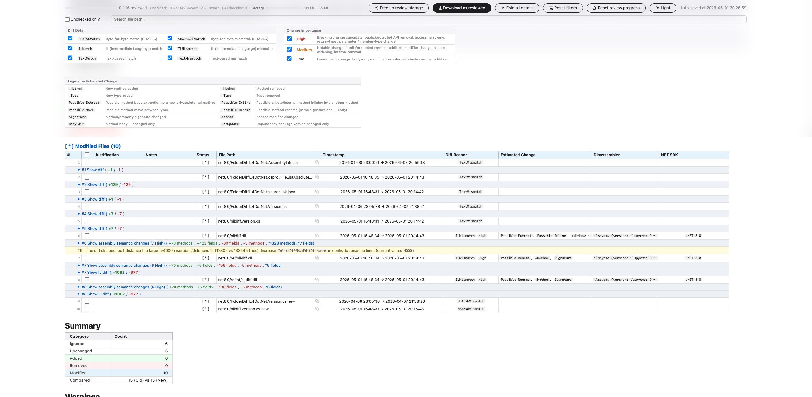

# FolderDiffIL4DotNet / `nildiff` (English)

> **[日本語版はこちら / Japanese version](#readme-ja)**

[](https://github.com/Widthdom/FolderDiffIL4DotNet/actions/workflows/dotnet.yml)
[](https://github.com/Widthdom/FolderDiffIL4DotNet/actions/workflows/codeql.yml)
[](https://github.com/Widthdom/FolderDiffIL4DotNet/actions/workflows/release.yml)
[](https://github.com/Widthdom/FolderDiffIL4DotNet/actions/workflows/benchmark-regression.yml)


`FolderDiffIL4DotNet` is distributed as the `nildiff` .NET global tool. It compares old/new build folders, reduces .NET assembly false positives from IL metadata noise, and writes review artifacts that can be archived for release sign-off.

<p align="center">
  
</p>

Why this exists:

- Compare old/new builds without chasing false positives from MVIDs, timestamps, and other build metadata.
- Produce Markdown, interactive HTML, and JSON audit artifacts for human review.
- Keep release comparison self-contained and offline-friendly.

For the full usage and configuration reference, see [USER_GUIDE.md](USER_GUIDE.md).

<a id="readme-en-quick-start"></a>
## Quick Start

Requires [.NET SDK 8.x](https://dotnet.microsoft.com/en-us/download/dotnet/8.0) or later.

```bash
dotnet tool install -g nildiff
dotnet tool install -g dotnet-ildasm
nildiff "/path/to/old-folder" "/path/to/new-folder" "my-comparison" --no-pause
```

Open the reports folder:

```bash
nildiff --open-reports
```

Check IL disassembler detection:

```bash
nildiff --doctor
```

Build from source:

```bash
git clone <repository-url>
cd FolderDiffIL4DotNet
dotnet build
dotnet run -- "/path/to/old-folder" "/path/to/new-folder" "my-comparison" --no-pause
```

<a id="readme-en-usage"></a>
## Usage

```bash
nildiff <old-folder> <new-folder> [report-label] [options]
```

Common options:

| Option | Purpose |
| --- | --- |
| `--config <path>` | Load a specific `config.json`. |
| `--output <path>` | Write reports under a custom output directory. |
| `--skip-il` | Skip IL comparison and use SHA256/text comparison only. |
| `--threads <n>` | Override comparison parallelism for this run. |
| `--print-config` | Print the effective builder state after env-var and supported CLI overrides without semantic validation. |
| `--validate-config` | Validate `config.json` plus `FOLDERDIFF_*` environment-variable overrides before runtime CLI overrides are applied. |
| `--open-reports` | Open the reports folder and exit. |
| `--doctor` | Probe `dotnet-ildasm` / `ilspycmd` availability and print install guidance. |

Full CLI behavior, HTML review workflow, integrity checks, semantic-change tables, and configuration details live in [USER_GUIDE.md](USER_GUIDE.md#readme-en-usage).

<a id="readme-en-config"></a>
## Configuration

`config.json` is optional; omitted keys use code-defined defaults. For normal diff runs, after loading [`config.json`](config.json) and applying environment-variable plus runtime CLI overrides, the effective configuration is validated before the comparison starts.

The detailed configuration table moved to [USER_GUIDE.md](USER_GUIDE.md#readme-en-config). The annotated sample remains in [doc/config.sample.jsonc](doc/config.sample.jsonc), and the JSON Schema for IDE completion is [doc/config.schema.json](doc/config.schema.json).

Current validated numeric constraints include [`InlineDiffContextLines`](USER_GUIDE.md#config-en-inlinediffcontextlines) >= `0` and [`ILCacheMaxMemoryMegabytes`](USER_GUIDE.md#config-en-ilcachemaxmemorymegabytes) >= `0`.

<a id="readme-en-artifacts"></a>
## Generated Artifacts

By default each run writes a labeled report folder under `Reports/<label>/`:

- [`diff_report.md`](doc/samples/diff_report.md)
- [`diff_report.html`](doc/samples/diff_report.html)
- [`audit_log.json`](doc/samples/audit_log.json)
- Optional SBOM files when SBOM generation is enabled.
- Optional `IL/old/*.txt` and `IL/new/*.txt` when IL text output is enabled.

`diff_report.html` is a standalone review document with filters, notes, reviewed-download export, and SHA256 integrity verification.

<a id="readme-en-doc-map"></a>
## Documentation

| Need | Document |
| --- | --- |
| Full user guide | [USER_GUIDE.md](USER_GUIDE.md) |
| Configuration sample | [doc/config.sample.jsonc](doc/config.sample.jsonc) |
| Troubleshooting | [doc/TROUBLESHOOTING.md](doc/TROUBLESHOOTING.md) |
| Runtime architecture and contributor guardrails | [doc/DEVELOPER_GUIDE.md](doc/DEVELOPER_GUIDE.md) |
| Test strategy and local commands | [doc/TESTING_GUIDE.md](doc/TESTING_GUIDE.md) |
| Shared AI-agent instructions | [AGENT_GUIDE.md](AGENT_GUIDE.md) |
| Security model and reporting path | [SECURITY.md](SECURITY.md) |
| Release notes | [CHANGELOG.md](CHANGELOG.md) |

> **Review responsibility:** This tool reduces review noise, but it does not guarantee zero false negatives and must not replace human release judgment. Before shipping, a human reviewer should confirm the final decision against the relevant commit/PR diff, source code, and built artifacts.

## License

MIT. See [LICENSE](LICENSE).

<a id="readme-ja"></a>
# FolderDiffIL4DotNet / `nildiff`（日本語）

> **[English version](#folderdiffil4dotnet--nildiff-english)**

`FolderDiffIL4DotNet` は `nildiff` という .NET global tool として配布されます。旧/新ビルドフォルダを比較し、.NET アセンブリの IL メタデータ由来ノイズを減らし、リリースサインオフ用に保存できるレビュー成果物を出力します。

<p align="center">
  
</p>

このツールの目的:

- MVID、timestamp、その他のビルドメタデータによる false positive を追いかけずに old/new ビルドを比較する。
- Markdown、インタラクティブ HTML、JSON 監査ログを human review 用に出力する。
- リリース比較を自己完結・オフライン対応にする。

詳細な使い方と設定リファレンスは [USER_GUIDE.md](USER_GUIDE.md#readme-ja) に移動しました。

<a id="readme-ja-quick-start"></a>
## クイックスタート

[.NET SDK 8.x](https://dotnet.microsoft.com/ja-jp/download/dotnet/8.0) 以降が必要です。

```bash
dotnet tool install -g nildiff
dotnet tool install -g dotnet-ildasm
nildiff "/path/to/old-folder" "/path/to/new-folder" "my-comparison" --no-pause
```

レポートフォルダを開く:

```bash
nildiff --open-reports
```

IL 逆アセンブラ検出を確認する:

```bash
nildiff --doctor
```

ソースからビルドする:

```bash
git clone <repository-url>
cd FolderDiffIL4DotNet
dotnet build
dotnet run -- "/path/to/old-folder" "/path/to/new-folder" "my-comparison" --no-pause
```

<a id="readme-ja-usage"></a>
## 使い方

```bash
nildiff <old-folder> <new-folder> [report-label] [options]
```

よく使うオプション:

| オプション | 用途 |
| --- | --- |
| `--config <path>` | 指定した `config.json` を読み込みます。 |
| `--output <path>` | カスタム出力ディレクトリ配下にレポートを書き出します。 |
| `--skip-il` | IL 比較をスキップし、SHA256/text 比較のみを使います。 |
| `--threads <n>` | この実行だけ比較並列度を上書きします。 |
| `--print-config` | 環境変数と対応 CLI オーバーライドを適用した builder 状態を、セマンティック検証なしでそのまま出力するため、範囲外を含む effective config の診断にも使えます。 |
| `--validate-config` | [`config.json`](config.json) に `FOLDERDIFF_*` 環境変数オーバーライドを適用した状態を、実行時 CLI オーバーライド適用前に検証します。 |
| `--open-reports` | レポートフォルダを開いて終了します。 |
| `--doctor` | `dotnet-ildasm` / `ilspycmd` の利用可否を確認し、インストール案内を出します。 |

CLI の詳細、HTML レビュー手順、整合性検証、セマンティック変更テーブル、設定詳細は [USER_GUIDE.md](USER_GUIDE.md#readme-ja-usage) を参照してください。

<a id="readme-ja-config"></a>
## 設定

`config.json` は任意です。省略したキーはコード定義の既定値を使います。通常の diff 実行では、[`config.json`](config.json) の読み込み後、環境変数および実行時 CLI オーバーライドを適用した実効設定に範囲外の値がある場合、比較開始前に検証エラーになります。

詳細な設定表は [USER_GUIDE.md](USER_GUIDE.md#readme-ja-config) に移動しました。注釈付きサンプルは [doc/config.sample.jsonc](doc/config.sample.jsonc)、IDE 補完用 JSON Schema は [doc/config.schema.json](doc/config.schema.json) です。

現在の数値制約には [`InlineDiffContextLines`](USER_GUIDE.md#config-ja-inlinediffcontextlines) >= `0` と [`ILCacheMaxMemoryMegabytes`](USER_GUIDE.md#config-ja-ilcachemaxmemorymegabytes) >= `0` が含まれます。

<a id="readme-ja-artifacts"></a>
## 生成物

既定では、各実行で `Reports/<label>/` 配下に次を出力します。

- [`diff_report.md`](doc/samples/diff_report.md)
- [`diff_report.html`](doc/samples/diff_report.html)
- [`audit_log.json`](doc/samples/audit_log.json)
- SBOM 生成が有効な場合は SBOM ファイル。
- IL テキスト出力が有効な場合は `IL/old/*.txt` と `IL/new/*.txt`。

`diff_report.html` は、フィルタ、メモ、レビュー済み HTML ダウンロード、SHA256 整合性検証を備えた自己完結型レビュー文書です。

<a id="readme-ja-doc-map"></a>
## ドキュメント

| 目的 | ドキュメント |
| --- | --- |
| 詳細ユーザーガイド | [USER_GUIDE.md](USER_GUIDE.md#readme-ja) |
| 設定サンプル | [doc/config.sample.jsonc](doc/config.sample.jsonc) |
| トラブルシューティング | [doc/TROUBLESHOOTING.md](doc/TROUBLESHOOTING.md#troubleshooting-ja) |
| ランタイム設計とコントリビューター向け注意点 | [doc/DEVELOPER_GUIDE.md](doc/DEVELOPER_GUIDE.md#guide-ja-map) |
| テスト方針とローカルコマンド | [doc/TESTING_GUIDE.md](doc/TESTING_GUIDE.md#testing-ja-run-tests) |
| AI エージェント向け共通指示 | [AGENT_GUIDE.md](AGENT_GUIDE.md#japanese) |
| セキュリティモデルと報告先 | [SECURITY.md](SECURITY.md#japanese) |
| 変更履歴 | [CHANGELOG.md](CHANGELOG.md#日本語) |

> **レビュー責任:** このツールはレビューのノイズを減らしますが、false negative がゼロであることは保証せず、人間のリリース判断の代替にはなりません。出荷前に、関連する commit / PR diff、ソースコード、ビルド成果物と照合して最終判断してください。

## ライセンス

MIT。詳細は [LICENSE](LICENSE) を参照してください。
