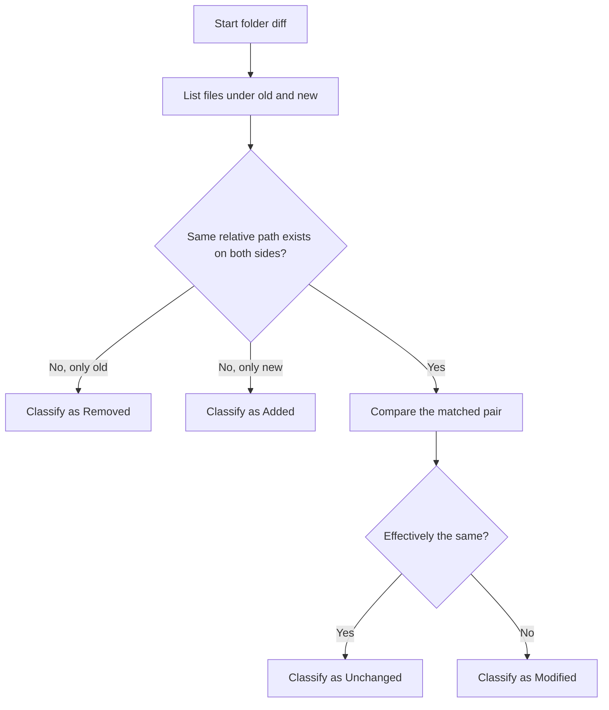
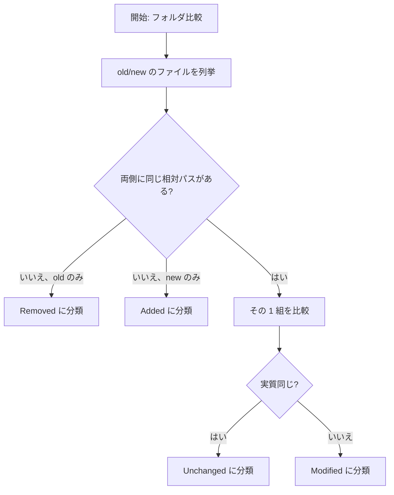

# FolderDiffIL4DotNet (English)

`FolderDiffIL4DotNet` is a .NET console application that compares two folders and outputs a Markdown report.
For .NET assemblies, it compares IL while ignoring build-specific information such as `// MVID:` lines, so assemblies whose contents are effectively the same can still be judged equal.

Developer-focused details (architecture, CI, tests, implementation cautions):
- [doc/DEVELOPER_GUIDE.md](doc/DEVELOPER_GUIDE.md)

<a id="readme-en-doc-map"></a>
## Documentation Map

| Need | Document |
| --- | --- |
| Product overview, setup, usage, and configuration | [README.md](README.md#readme-en-usage) |
| Assembly semantic change detection | [README.md](README.md#readme-en-assembly-semantic-changes) |
| Runtime architecture, execution flow, DI scopes, and implementation guardrails | [doc/DEVELOPER_GUIDE.md](doc/DEVELOPER_GUIDE.md#guide-en-map) |
| Test strategy, local test commands, coverage, and isolation rules | [doc/TESTING_GUIDE.md](doc/TESTING_GUIDE.md#testing-en-run-tests) |
| Generated API reference from XML documentation comments | [api/index.md](api/index.md) via [docfx.json](docfx.json) |

## Requirements

- [.NET SDK 8.x](https://dotnet.microsoft.com/en-us/download/dotnet/8.0)
- macOS / Windows / Linux / Unix-like OS
- IL disassembler (auto-probed per file)
  - Preferred: [`dotnet-ildasm`](https://www.nuget.org/packages/dotnet-ildasm/) or [`dotnet ildasm`](https://www.nuget.org/packages/dotnet-ildasm/)
  - Fallback: [`ilspycmd`](https://www.nuget.org/packages/ilspycmd/)

[.NET SDK 8.x](https://dotnet.microsoft.com/en-us/download/dotnet/8.0) installation examples:

```powershell
# Windows (winget)
winget install Microsoft.DotNet.SDK.8 --source winget
```

```powershell
# Windows (dotnet-install script)
powershell -ExecutionPolicy Bypass -c "& { iwr https://dot.net/v1/dotnet-install.ps1 -OutFile dotnet-install.ps1; .\dotnet-install.ps1 -Channel 8.0 }"
```

```bash
# macOS/Linux/Unix (dotnet-install script)
curl -fsSL https://dot.net/v1/dotnet-install.sh | bash /dev/stdin --channel 8.0
```

IL disassembler installation examples:

```bash
dotnet tool install --global dotnet-ildasm
# add $HOME/.dotnet/tools (macOS/Linux/Unix) or %USERPROFILE%\.dotnet\tools (Windows) to PATH if needed

# verify installation and version (both commands invoke the same dotnet-ildasm tool)
dotnet-ildasm --version
dotnet ildasm --version
```

```bash
dotnet tool install --global ilspycmd
# add $HOME/.dotnet/tools (macOS/Linux/Unix) or %USERPROFILE%\.dotnet\tools (Windows) to PATH if needed
```

<a id="readme-en-usage"></a>
## Usage

```
FolderDiffIL4DotNet <oldFolder> <newFolder> <reportLabel> [options]
```

**Arguments:**

| Argument | Description |
|---|---|
| `<oldFolder>` | Absolute path to the baseline (old) folder. |
| `<newFolder>` | Absolute path to the comparison (new) folder. |
| `<reportLabel>` | Label used as the subfolder name under `Reports/`. |

**Options:**

| Option | Description |
|---|---|
| `--help`, `-h` | Show help and exit (code `0`). |
| `--version` | Show the application version and exit (code `0`). |
| `--print-config` | Print the effective configuration as indented JSON and exit (code `0`). Reflects `config.json` + all `FOLDERDIFF_*` env var overrides. Use `--config <path>` to load a non-default file. Config errors exit with code `3`. |
| `--no-pause` | Skip key-wait at process end. |
| `--config <path>` | Load config from `<path>` instead of the default `<exe>/[`config.json`](config.json)`. |
| `--threads <N>` | Override [`MaxParallelism`](#config-en-maxparallelism) for this run (`0` = auto). |
| `--no-il-cache` | Disable the IL cache for this run. |
| `--skip-il` | Skip IL comparison for .NET assemblies entirely. |
| `--no-timestamp-warnings` | Suppress timestamp-regression warnings. |

```bash
dotnet build
dotnet run "/Users/UserA/workspace/old" "/Users/UserA/workspace/new" "YYYYMMDD" --no-pause

# Override threads and skip IL for a quick diff
dotnet run "/path/old" "/path/new" "label" --threads 4 --skip-il --no-pause

# Use a custom config file
dotnet run "/path/old" "/path/new" "label" --config /etc/my-config.json --no-pause
```

Main output:
- `Reports/<label>/`[`diff_report.md`](doc/samples/diff_report.md)
- `Reports/<label>/`[`diff_report.html`](doc/samples/diff_report.html) (disable with `"ShouldGenerateHtmlReport": false` in [`config.json`](config.json))
- `Reports/<label>/`[`audit_log.json`](doc/samples/audit_log.json) — structured audit log with SHA256 integrity hashes for tamper detection (disable with `"ShouldGenerateAuditLog": false`)
- Optional IL dumps under `Reports/<label>/IL/old` and `Reports/<label>/IL/new` when [`ShouldOutputILText`](#config-en-shouldoutputiltext) is `true`

Process exit codes:
- `0`: success
- `2`: invalid arguments or input paths (includes preflight failures — see below)
- `3`: configuration load/parse error
- `4`: diff execution or report generation failure
- `1`: unexpected internal error

Before loading configuration, three preflight checks run against the reports output path (all failures produce exit code `2`):
1. **Path length** — the constructed `Reports/<label>` path must not exceed the OS limit (260 chars on Windows without long-path opt-in, 1024 on macOS, 4096 on Linux).
2. **Disk space** — at least 100 MB of free space is required on the drive that will hold the reports folder. The check is best-effort and skips silently when drive information is unavailable (e.g., network shares).
3. **Write permission** — a temporary probe file is created and deleted in the `Reports/` parent directory to verify that the process has write access before any actual output is produced.

See [doc/samples/diff_report.md](doc/samples/diff_report.md) for a full sample of the Markdown report.

<a id="readme-en-html-report"></a>
## Interactive HTML Review Report

Each run also produces **[`diff_report.html`](doc/samples/diff_report.html)** alongside [`diff_report.md`](doc/samples/diff_report.md) (disable with `"ShouldGenerateHtmlReport": false` in [`config.json`](config.json)).

The HTML report is a self-contained single file that opens in any browser — no server, no extensions required. Every file entry is displayed in a table with interactive columns for sign-off:

| Column | Description |
|---|---|
| ✓ | Checkbox to mark a file as reviewed |
| Justification | Free-text input — explain why the change is expected |
| Notes | Free-text input — additional remarks |
| File Path | Path label (relative for Modified/Unchanged; absolute for Added/Removed; Ignored single-side entries show absolute path, both-sides show relative) |
| Timestamp | Old → New last-modified times (or single value for Added/Removed) |
| Diff Reason | Diff type only: `SHA256Mismatch`, `ILMatch`, `ILMismatch`, `TextMismatch`, etc. |
| Disassembler | Disassembler label and version used for IL comparison (e.g. [`dotnet-ildasm`](https://www.nuget.org/packages/dotnet-ildasm/) `(version: dotnet ildasm 0.12.2.0)`); empty for non-IL files |

Column headers for Added / Removed / Modified use colour-coded backgrounds (**green** / **red** / **blue**); section headings for Added / Removed / Modified use colour-coded text in the same colours. Ignored / Unchanged column headers and section headings use the default style.

**Table sort order:** Unchanged Files rows are sorted by diff-detail result (`SHA256Match` → `ILMatch` → `TextMatch`), then by File Path ascending. Modified Files rows (and the Timestamps Regressed warning table) are sorted by diff-detail result (`TextMismatch` → `ILMismatch` → `SHA256Mismatch`), then by File Path ascending. The SHA256Mismatch warning table in the Warnings section lists files alphabetically by path.

Inline diff `<summary>` labels also include a one-based `#N` prefix such as `#3 Show diff` / `#3 Show IL diff`; this number matches the leftmost `#` column for the same row.

See [doc/samples/diff_report.html](doc/samples/diff_report.html) for a live sample (open in a browser).

### Review workflow

```
1. Open diff_report.html in a browser (double-click the file).
2. Work through each Modified / Added / Removed row:
     ☑ check the checkbox, type the OK reason, add notes if needed.
3. State is auto-saved to the browser's localStorage as you type
     — close the tab and reopen the same file to resume.
4. When all rows are reviewed, click "Download as reviewed".
     A new file (e.g. diff_report_20260315_reviewed.html) is downloaded
     with the current checkbox, justification, and notes state embedded in the HTML source.
     A companion SHA256 verification file (e.g. diff_report_20260315_reviewed.html.sha256)
     is also downloaded for integrity verification of the reviewed HTML.
5. Archive or share the downloaded file as the sign-off record,
     or print it to PDF for a hard-copy audit trail.
     To verify integrity: sha256sum -c diff_report_20260315_reviewed.html.sha256
```

### Integrity verification flow

```
 ┌─────────────────────────────────────────────────────────────────┐
 │  1. Run tool                                                    │
 │     → diff_report.md, diff_report.html, audit_log.json          │
 │       audit_log.json records SHA256 of .md and .html            │
 ├─────────────────────────────────────────────────────────────────┤
 │  2. Verify original reports (optional)                          │
 │     Compare SHA256 of diff_report.md / diff_report.html         │
 │     against reportSha256 / htmlReportSha256 in audit_log.json   │
 ├─────────────────────────────────────────────────────────────────┤
 │  3. Review in browser                                           │
 │     Check rows, add justifications → auto-saved to localStorage │
 ├─────────────────────────────────────────────────────────────────┤
 │  4. Download as reviewed                                        │
 │     → diff_report_YYYYMMDD_reviewed.html                        │
 │     → diff_report_YYYYMMDD_reviewed.html.sha256                 │
 ├─────────────────────────────────────────────────────────────────┤
 │  5. Verify reviewed HTML (anytime later)                        │
 │     sha256sum -c diff_report_YYYYMMDD_reviewed.html.sha256      │
 └─────────────────────────────────────────────────────────────────┘
```

<a id="readme-en-comparison-flow"></a>
## Comparison Flow

At a high level, the tool first matches files by relative path, then decides whether each matched pair is effectively the same.



For one matched pair, the decision order is:

1. Try an exact byte-level match with SHA256.
2. If SHA256 differs and the old-side file is a .NET executable, compare filtered IL instead of raw bytes.
3. If it is not in the IL path and the extension is listed in [`TextFileExtensions`](#config-en-textfileextensions), compare it as text.
4. If none of the checks say "same", treat it as a normal mismatch.

Important details:
- `Added`, `Removed`, `Unchanged`, and `Modified` are decided by relative path, not by file name alone.
- IL comparison always ignores `// MVID:` lines, so build-specific assembly noise does not create false differences.
- If [`ShouldIgnoreILLinesContainingConfiguredStrings`](#config-en-shouldignoreillinescontainingconfiguredstrings) is `true`, lines containing any configured ignore string are also skipped during IL comparison.
- If IL comparison itself fails, the run stops instead of silently falling back to a weaker comparison.

<a id="readme-en-assembly-semantic-changes"></a>
## Assembly Semantic Changes

When an assembly is classified as `ILMismatch`, the tool performs an additional **semantic analysis** using [`System.Reflection.Metadata`](https://learn.microsoft.com/dotnet/api/system.reflection.metadata) to identify exactly what changed at the member level. Results appear as an expandable inline row in the HTML report (the Markdown report does not include this section).

### What is detected

| Category | Detected changes |
|----------|-----------------|
| **Type** | Additions and removals (including nested types), with base type and implemented interfaces |
| **Method** | Additions, removals, IL body modifications, access modifier changes, and modifier changes |
| **Property** | Additions, removals, type changes, access modifier changes, and modifier changes |
| **Field** | Additions, removals, type changes, access modifier changes, and modifier changes |
| **Access** | `public`, `protected`, `internal`, `private`, `protected internal`, `private protected` |
| **Modifiers** | For types: `sealed`, `abstract`, `static`. For members: `static`, `abstract`, `virtual`, `override`, `sealed override`, `const`, `readonly` |

### Report table columns

| Column | Description | Example |
|--------|-------------|---------|
| Class | Fully qualified type name | MyNamespace.MyClass |
| BaseType | Base type and implemented interfaces (omits trivial bases like System.Object) | MyApp.BaseController, System.IDisposable |
| Status | `[ + ]` (Added), `[ - ]` (Removed), or `[ * ]` (Modified) | `[ + ]` |
| Kind | Member kind: `Class`, `Record`, `Struct`, `Interface`, `Enum`, `Constructor`, `StaticConstructor`, `Method`, `Property`, `Field` | `Method` |
| Access | Access modifier. For `Modified` entries, shows old → new when access changed (e.g. public → internal) | public, public → internal |
| Modifiers | Other modifiers (for types: sealed, abstract, static; for members: static, virtual, override, etc.). For `Modified` entries, shows old → new when modifiers changed | sealed, virtual → override |
| Type | Declared type for Field/Property using fully qualified .NET type names (empty for Method/Constructor/Class/Record). For `Modified` entries, shows old → new when type changed (e.g. System.String → System.Int32) | System.Int32, System.String → System.Int32 |
| Name | Member name (constructors use the class name; empty for Class/Record/Struct/Interface/Enum entries) | DoWork |
| ReturnType | Return type for Method/Constructor using fully qualified .NET type names (empty for Field/Property/Class/Record) | System.Void |
| Parameters | Parameter list for Method/Constructor using fully qualified .NET type names (empty for Field/Property/Class/Record) | System.String name, System.Int32 count = 0 |
| Body | `Changed` when method body or field initializer IL has changed; otherwise empty | `Changed` |

Controlled by [`ShouldIncludeAssemblySemanticChangesInReport`](#config-en-shouldincludeassemblysemanticchangesinreport) (default: `true`).

A summary count table (`Class | Status | Count`) follows, grouping entries by class and status. Consecutive rows with the same class name suppress the class column for readability.

> **Note:** The semantic summary is supplementary information. Always verify the final details in the inline IL diff.

## Configuration ([`config.json`](config.json))

Place [`config.json`](config.json) next to the executable. All keys are optional; omitted keys use the code-defined defaults in [`ConfigSettings`](Models/ConfigSettings.cs). If the defaults are acceptable, this file can be just:

```json
{}
```

Override only the settings you want to change. For example:

```json
{
  "ShouldIgnoreILLinesContainingConfiguredStrings": true,
  "ILIgnoreLineContainingStrings": ["buildserver1_", "buildserver2_", "// Method begins at Relative Virtual Address (RVA) 0x", ".publickeytoken = ( ", ".custom instance void class [System.Windows.Forms]System.Windows.Forms.AxHost/TypeLibraryTimeStampAttribute::.ctor(string) = ( ", "// Code size "],
  "ShouldOutputFileTimestamps": false,
  "ShouldOutputILText": false,
  "ShouldIncludeIgnoredFiles": false,
  "ShouldIncludeILCacheStatsInReport": true
}
```

### Configuration Table

<table>
  <thead>
    <tr>
      <th>Key</th>
      <th>Default</th>
      <th>Description</th>
    </tr>
  </thead>
  <tbody>
    <tr id="config-en-ignoredextensions">
      <td><code>IgnoredExtensions</code></td>
      <td><code>.cache</code>, <code>.DS_Store</code>, <code>.db</code>, <code>.ilcache</code>, <code>.log</code>, <code>.pdb</code></td>
      <td>Excludes matching extensions from comparison.</td>
    </tr>
    <tr id="config-en-textfileextensions">
      <td><code>TextFileExtensions</code></td>
      <td>Built-in extension list in <a href="Models/ConfigSettings.cs"><code>ConfigSettings</code></a></td>
      <td>Treats matching extensions as text. Include dot (<code>.cs</code>, <code>.json</code>). Matching is case-insensitive.</td>
    </tr>
    <tr id="config-en-maxloggenerations">
      <td><code>MaxLogGenerations</code></td>
      <td><code>5</code></td>
      <td>Number of log files kept in rotation.</td>
    </tr>
    <tr id="config-en-shouldincludeunchangedfiles">
      <td><code>ShouldIncludeUnchangedFiles</code></td>
      <td><code>true</code></td>
      <td>Includes <code>Unchanged</code> section in report.</td>
    </tr>
    <tr id="config-en-shouldincludeignoredfiles">
      <td><code>ShouldIncludeIgnoredFiles</code></td>
      <td><code>true</code></td>
      <td>Includes <code>Ignored Files</code> section before <code>Unchanged</code>.</td>
    </tr>
    <tr id="config-en-shouldincludeassemblysemanticchangesinreport">
      <td><code>ShouldIncludeAssemblySemanticChangesInReport</code></td>
      <td><code>true</code></td>
      <td>When <code>true</code>, includes <code>Assembly Semantic Changes</code> for <code>ILMismatch</code> assemblies. Uses <code>System.Reflection.Metadata</code> to detect type/method/property/field additions, removals, and modifications. Shown as an expandable inline row above the IL diff in the HTML report.</td>
    </tr>
    <tr id="config-en-shouldincludeilcachestatsInreport">
      <td><code>ShouldIncludeILCacheStatsInReport</code></td>
      <td><code>false</code></td>
      <td>When <code>true</code>, appends an <code>IL Cache Stats</code> section (hits, misses, hit-rate, stores, evicted, expired) between <code>Summary</code> and <code>Warnings</code>. Has no effect when <code>EnableILCache</code> is <code>false</code>.</td>
    </tr>
    <tr id="config-en-shouldoutputiltext">
      <td><code>ShouldOutputILText</code></td>
      <td><code>true</code></td>
      <td>Outputs IL dumps under <code>Reports/&lt;label&gt;/IL/old,new</code>.</td>
    </tr>
    <tr id="config-en-shouldignoreillinescontainingconfiguredstrings">
      <td><code>ShouldIgnoreILLinesContainingConfiguredStrings</code></td>
      <td><code>false</code></td>
      <td>Enables additional IL line-ignore filter by substring.</td>
    </tr>
    <tr id="config-en-ilignorelinecontainingstrings">
      <td><code>ILIgnoreLineContainingStrings</code></td>
      <td><code>[]</code></td>
      <td>String list used by IL substring-ignore filter.</td>
    </tr>
    <tr id="config-en-shouldoutputfiletimestamps">
      <td><code>ShouldOutputFileTimestamps</code></td>
      <td><code>true</code></td>
      <td>Adds last-modified timestamps to report entries as supplementary information. Timestamps are not used in comparison; results (Unchanged / Modified / etc.) are determined solely by file content.</td>
    </tr>
    <tr id="config-en-shouldwarnwhennewfiletimestampisolderthanoldfiletimestamp">
      <td><code>ShouldWarnWhenNewFileTimestampIsOlderThanOldFileTimestamp</code></td>
      <td><code>true</code></td>
      <td>Warns if a <strong>modified</strong> file in <code>new</code> has an older last-modified timestamp than the matching file in <code>old</code>, prints the warning at the end of the run, and appends a final <code>Warnings</code> section to <a href="doc/samples/diff_report.md"><code>diff_report.md</code></a>. Unchanged files are excluded from this check.</td>
    </tr>
    <tr id="config-en-maxparallelism">
      <td><code>MaxParallelism</code></td>
      <td><code>0</code></td>
      <td>Max compare parallelism. <code>0</code> or less = auto.</td>
    </tr>
    <tr id="config-en-textdiffparallelthresholdkilobytes">
      <td><code>TextDiffParallelThresholdKilobytes</code></td>
      <td><code>512</code></td>
      <td>Text diff size threshold (KiB) for chunk-parallel mode.</td>
    </tr>
    <tr id="config-en-textdiffchunksizekilobytes">
      <td><code>TextDiffChunkSizeKilobytes</code></td>
      <td><code>64</code></td>
      <td>Chunk size (KiB) for parallel text diff.</td>
    </tr>
    <tr id="config-en-textdiffparallelmemorylimitmegabytes">
      <td><code>TextDiffParallelMemoryLimitMegabytes</code></td>
      <td><code>0</code></td>
      <td>Optional additional buffer budget (MB) for chunk-parallel text diff. <code>&lt;=0</code> means unlimited; otherwise the run reduces worker count or falls back to sequential comparison and logs the current managed-heap size.</td>
    </tr>
    <tr id="config-en-enableilcache">
      <td><code>EnableILCache</code></td>
      <td><code>true</code></td>
      <td>Enables IL cache (memory + optional disk).</td>
    </tr>
    <tr id="config-en-ilcachedirectoryabsolutepath">
      <td><code>ILCacheDirectoryAbsolutePath</code></td>
      <td><code>""</code></td>
      <td>IL cache directory. Empty = <code>%LOCALAPPDATA%\FolderDiffIL4DotNet\ILCache</code> on Windows, <code>~/.local/share/FolderDiffIL4DotNet/ILCache</code> on macOS/Linux.</td>
    </tr>
    <tr id="config-en-ilcachestatslogintervalseconds">
      <td><code>ILCacheStatsLogIntervalSeconds</code></td>
      <td><code>60</code></td>
      <td>IL cache stats log interval. <code>&lt;=0</code> uses default 60s.</td>
    </tr>
    <tr id="config-en-ilcachemaxdiskfilecount">
      <td><code>ILCacheMaxDiskFileCount</code></td>
      <td><code>1000</code></td>
      <td>Disk cache file count cap. <code>&lt;=0</code> means unlimited.</td>
    </tr>
    <tr id="config-en-ilcachemaxdiskmegabytes">
      <td><code>ILCacheMaxDiskMegabytes</code></td>
      <td><code>512</code></td>
      <td>Disk cache size cap (MB). <code>&lt;=0</code> means unlimited.</td>
    </tr>
    <tr id="config-en-ilprecomputebatchsize">
      <td><code>ILPrecomputeBatchSize</code></td>
      <td><code>2048</code></td>
      <td>Batch size for IL-related precompute. <code>&lt;=0</code> uses the default and avoids building one extra all-files list for very large trees.</td>
    </tr>
    <tr id="config-en-optimizefornetworkshares">
      <td><code>OptimizeForNetworkShares</code></td>
      <td><code>false</code></td>
      <td>Enables network-share optimization mode.</td>
    </tr>
    <tr id="config-en-autodetectnetworkshares">
      <td><code>AutoDetectNetworkShares</code></td>
      <td><code>true</code></td>
      <td>Auto-detects network paths and enables optimization mode as needed.</td>
    </tr>
    <tr id="config-en-disassemblerblacklistttlminutes">
      <td><code>DisassemblerBlacklistTtlMinutes</code></td>
      <td><code>10</code></td>
      <td>Minutes before a blacklisted disassembler tool — one that has failed <code>DISASSEMBLE_FAIL_THRESHOLD</code> (3) times consecutively — is removed from the blacklist and retried on the next call.</td>
    </tr>
    <tr id="config-en-skipil">
      <td><code>SkipIL</code></td>
      <td><code>false</code></td>
      <td>When <code>true</code>, skips IL decompilation and IL diff for .NET assemblies. SHA256-mismatched assemblies are treated as binary diffs. Equivalent to the <code>--skip-il</code> CLI flag.</td>
    </tr>
    <tr id="config-en-enableinlinediff">
      <td><code>EnableInlineDiff</code></td>
      <td><code>true</code></td>
      <td>When <code>true</code>, text-mismatched and IL-mismatched files in the HTML report include an expandable inline diff showing added and removed lines. For IL-mismatched files, <code>ShouldOutputILText</code> must also be <code>true</code> (the default) so that the <code>*_IL.txt</code> source files exist.</td>
    </tr>
    <tr id="config-en-inlinediffcontextlines">
      <td><code>InlineDiffContextLines</code></td>
      <td><code>0</code></td>
      <td>Number of unchanged context lines to show above and below each changed hunk in inline diffs. <code>0</code> shows only the changed lines themselves.</td>
    </tr>
    <tr id="config-en-inlinediffmaxeditdistance">
      <td><code>InlineDiffMaxEditDistance</code></td>
      <td><code>4000</code></td>
      <td>Maximum allowed edit distance (total inserted + deleted lines) for inline diff computation. If the actual diff exceeds this value the inline diff is skipped. Uses Myers diff algorithm (<a href="http://www.xmailserver.org/diff2.pdf">E. W. Myers, "An O(ND) Difference Algorithm and Its Variations", 1986</a>) with O(D²&nbsp;+&nbsp;N&nbsp;+&nbsp;M) complexity, so very large files with few changes are handled efficiently. File size alone does not cause a skip.</td>
    </tr>
    <tr id="config-en-inlinediffmaxdifflines">
      <td><code>InlineDiffMaxDiffLines</code></td>
      <td><code>10000</code></td>
      <td>Maximum number of diff output lines (added + removed + context + hunk headers) before the inline diff display is suppressed for that entry. The diff is computed first; if the result exceeds this threshold the entry is skipped. Guards against very large diffs causing slow HTML rendering.</td>
    </tr>
    <tr id="config-en-inlinediffmaxoutputlines">
      <td><code>InlineDiffMaxOutputLines</code></td>
      <td><code>10000</code></td>
      <td>Maximum number of output lines produced by a single inline diff. When exceeded, the diff is truncated and a note is shown in the report.</td>
    </tr>
    <tr id="config-en-inlinedifflazyrender">
      <td><code>InlineDiffLazyRender</code></td>
      <td><code>true</code></td>
      <td>When <code>true</code> (default), inline diff tables are Base64-encoded and stored in a <code>data-diff-html</code> attribute; JavaScript decodes and injects them into the DOM only when the user expands a <code>&lt;details&gt;</code> row. This dramatically reduces the initial DOM node count when there are many modified files (e.g. 5 000 files × 200 diff rows = 1 M fewer nodes), making the page much faster to load and interact with. Set to <code>false</code> if you need the browser's <em>Find in page</em> to search inside collapsed diff content.</td>
    </tr>
    <tr>
      <td id="config-en-spinnerframes"><code>SpinnerFrames</code></td>
      <td><code>["|", "/", "-", "\"]</code></td>
      <td>Array of strings used for the console spinner animation. Each element is one frame in the rotation, so multi-character strings (e.g. block characters, emoji) are supported. Must contain at least one element. Setting <code>null</code> restores the default.</td>
    </tr>
    <tr id="config-en-shouldgeneratehtmlreport">
      <td><code>ShouldGenerateHtmlReport</code></td>
      <td><code>true</code></td>
      <td>When <code>true</code>, generates <a href="doc/samples/diff_report.html"><code>diff_report.html</code></a> alongside <a href="doc/samples/diff_report.md"><code>diff_report.md</code></a>. The HTML file is a self-contained interactive review document with checkboxes, text inputs, localStorage auto-save, and a download function that bakes the current review state into a portable snapshot. Set to <code>false</code> to produce only the Markdown report.</td>
    </tr>
    <tr id="config-en-shouldgenerateauditlog">
      <td><code>ShouldGenerateAuditLog</code></td>
      <td><code>true</code></td>
      <td>When <code>true</code>, generates <a href="doc/samples/audit_log.json"><code>audit_log.json</code></a> alongside the diff reports. The JSON file records per-file comparison results, run metadata (app version, computer name, timestamps), summary statistics, and SHA256 integrity hashes of <code>diff_report.md</code> and <code>diff_report.html</code> for tamper detection. Set to <code>false</code> to skip audit log generation.</td>
    </tr>
  </tbody>
</table>

<a id="readme-en-env-var-overrides"></a>
### Environment Variable Overrides

Any scalar (non-list) setting in [`config.json`](config.json) can be overridden at runtime via an environment variable without modifying the file. This is useful in CI pipelines, Docker containers, or read-only deployments.

**Naming convention:** `FOLDERDIFF_` + the property name in upper case.

```sh
# Common CI overrides
export FOLDERDIFF_MAXPARALLELISM=4
export FOLDERDIFF_ENABLEILCACHE=false
export FOLDERDIFF_SKIPIL=true
export FOLDERDIFF_SHOULDGENERATEHTMLREPORT=false
export FOLDERDIFF_ILCACHEDIRECTORYABSOLUTEPATH=/tmp/il-cache
```

| Type | Accepted values |
|------|----------------|
| `bool` | `true` / `false` (case-insensitive), `1` / `0` |
| `int` | Any valid integer |
| `string` | Raw value as-is |

Rules:
- Environment variables are applied **after** `config.json` is loaded and **before** validation, so env-var values are subject to the same validation constraints as JSON values.
- If an env var has an unrecognised value for its type (e.g. `"yes"` for a bool, `"x"` for an int), it is silently ignored and the JSON (or built-in default) value is kept.
- List properties ([`IgnoredExtensions`](#config-en-ignoredextensions), [`TextFileExtensions`](#config-en-textfileextensions), [`ILIgnoreLineContainingStrings`](#config-en-ilignorelinecontainingstrings), [`SpinnerFrames`](#config-en-spinnerframes)) cannot be overridden via environment variables; edit [`config.json`](config.json) for those.

Notes:
- Built-in defaults, including the full [`IgnoredExtensions`](#config-en-ignoredextensions) and [`TextFileExtensions`](#config-en-textfileextensions) lists, are defined in [`Models/ConfigSettings.cs`](Models/ConfigSettings.cs).
- After loading [`config.json`](config.json), if any value is out of range the run fails immediately with exit code `3` and an error message listing every invalid setting. Validated constraints: [`MaxLogGenerations`](#config-en-maxloggenerations) >= `1`; [`TextDiffParallelThresholdKilobytes`](#config-en-textdiffparallelthresholdkilobytes) >= `1`; [`TextDiffChunkSizeKilobytes`](#config-en-textdiffchunksizekilobytes) >= `1`; [`TextDiffChunkSizeKilobytes`](#config-en-textdiffchunksizekilobytes) must be less than [`TextDiffParallelThresholdKilobytes`](#config-en-textdiffparallelthresholdkilobytes); and [`SpinnerFrames`](#config-en-spinnerframes) must contain at least one element.
- **JSON syntax errors** (e.g. a trailing comma after the last property or array element) are caught immediately at startup, logged to the run log file, and printed to the console in red with the line number and a hint — the run exits with code `3`. Standard JSON does not allow trailing commas: `"Key": "value",}` is invalid; remove the final comma.
- Files without extension are still compared.
- If you want extensionless files treated as text, include empty string (`""`) in [`TextFileExtensions`](#config-en-textfileextensions).
- Timestamp-regression warnings are evaluated only for files classified as **modified** (files that exist in both `old` and `new` but whose content differs). Unchanged files are excluded even if their timestamps are reversed.
- If any file ends as `SHA256Mismatch`, the report writes that warning in the final `Warnings` section before any timestamp-regression entries, and the same message is printed once at run completion. A detail table titled `[ ! ] Modified Files — SHA256Mismatch (Manual Review Recommended)` lists all affected files with their timestamps and diff detail.

<a id="readme-en-generated-artifacts"></a>
## Generated Artifacts

- `Reports/<label>/`[`diff_report.md`](doc/samples/diff_report.md)
- `Reports/<label>/`[`diff_report.html`](doc/samples/diff_report.html) (unless [`ShouldGenerateHtmlReport`](#config-en-shouldgeneratehtmlreport) is `false`)
- `Reports/<label>/`[`audit_log.json`](doc/samples/audit_log.json) (unless [`ShouldGenerateAuditLog`](#config-en-shouldgenerateauditlog) is `false`)
- `Logs/log_YYYYMMDD.log`
- Optional: `Reports/<label>/IL/old/*.txt`, `Reports/<label>/IL/new/*.txt`

For developer-focused details (architecture, exception handling, test setup, CI/CD, API docs), see [doc/DEVELOPER_GUIDE.md](doc/DEVELOPER_GUIDE.md).

## License

- [MIT License](LICENSE)

---

# FolderDiffIL4DotNet（日本語）

`FolderDiffIL4DotNet` は、2つのフォルダを比較して Markdown レポートを出力する .NET コンソールアプリです。
.NET アセンブリは `// MVID:` などのビルド固有情報を除外して IL 比較することで、アセンブリの中身が実質的に同じであれば同一と判断します。

開発者向けの詳細（設計、CI、テスト、実装上の注意点）は以下に分離しました。
- [doc/DEVELOPER_GUIDE.md](doc/DEVELOPER_GUIDE.md)

<a id="readme-ja-doc-map"></a>
## ドキュメントの見取り図

| 見たい内容 | ドキュメント |
| --- | --- |
| 製品概要、導入、使い方、設定 | [README.md](README.md#readme-ja-usage) |
| アセンブリ セマンティック変更の検出 | [README.md](README.md#readme-ja-assembly-semantic-changes) |
| 実行時アーキテクチャ、実行フロー、DI スコープ、実装上の注意点 | [doc/DEVELOPER_GUIDE.md](doc/DEVELOPER_GUIDE.md#guide-ja-map) |
| テスト戦略、ローカル実行コマンド、カバレッジ、分離ルール | [doc/TESTING_GUIDE.md](doc/TESTING_GUIDE.md#testing-ja-run-tests) |
| XML ドキュメントコメントから生成する API リファレンス | [docfx.json](docfx.json) 経由 [api/index.md](api/index.md) |

## 必要環境

- [.NET SDK 8.x](https://dotnet.microsoft.com/ja-jp/download/dotnet/8.0)
- macOS / Windows / Linux / Unix 系 OS
- IL 逆アセンブラ（ファイルごとに自動判定）
  - 優先: [`dotnet-ildasm`](https://www.nuget.org/packages/dotnet-ildasm/) または [`dotnet ildasm`](https://www.nuget.org/packages/dotnet-ildasm/)
  - 代替: [`ilspycmd`](https://www.nuget.org/packages/ilspycmd/)

[.NET SDK 8.x](https://dotnet.microsoft.com/ja-jp/download/dotnet/8.0) のインストール例:

```powershell
# Windows (winget)
winget install Microsoft.DotNet.SDK.8 --source winget
```

```powershell
# Windows (dotnet-install スクリプト)
powershell -ExecutionPolicy Bypass -c "& { iwr https://dot.net/v1/dotnet-install.ps1 -OutFile dotnet-install.ps1; .\dotnet-install.ps1 -Channel 8.0 }"
```

```bash
# macOS/Linux/Unix (dotnet-install スクリプト)
curl -fsSL https://dot.net/v1/dotnet-install.sh | bash /dev/stdin --channel 8.0
```

IL 逆アセンブラのインストール例:

```bash
dotnet tool install --global dotnet-ildasm
# 必要に応じて PATH へ追加
# macOS/Linux/Unix: $HOME/.dotnet/tools
# Windows: %USERPROFILE%\.dotnet\tools

# インストール確認とバージョン確認（どちらも同じ dotnet-ildasm を実行）
dotnet-ildasm --version
dotnet ildasm --version
```

```bash
dotnet tool install --global ilspycmd
# 必要に応じて PATH へ追加
# macOS/Linux/Unix: $HOME/.dotnet/tools
# Windows: %USERPROFILE%\.dotnet\tools
```

<a id="readme-ja-usage"></a>
## 使い方

```
FolderDiffIL4DotNet <oldFolder> <newFolder> <reportLabel> [options]
```

**引数:**

| 引数 | 説明 |
|---|---|
| `<oldFolder>` | 比較元（旧）フォルダの絶対パス。 |
| `<newFolder>` | 比較先（新）フォルダの絶対パス。 |
| `<reportLabel>` | `Reports/` 配下のサブフォルダ名に使うラベル。 |

**オプション:**

| オプション | 説明 |
|---|---|
| `--help`, `-h` | 使い方を表示してコード `0` で終了します。 |
| `--version` | アプリバージョンを表示してコード `0` で終了します。 |
| `--print-config` | 有効な設定をインデント付き JSON として出力してコード `0` で終了します。`config.json` のデシリアライズ値に `FOLDERDIFF_*` 環境変数オーバーライドを適用した最終状態を表示します。`--config <path>` との組み合わせ可。設定エラーはコード `3` で終了します。 |
| `--no-pause` | 終了時のキー待ちをスキップします。 |
| `--config <path>` | デフォルトの `<exe>/[`config.json`](config.json)` の代わりに `<path>` から設定を読み込みます。 |
| `--threads <N>` | 今回の実行に限り [`MaxParallelism`](#config-ja-maxparallelism) を上書きします（`0` = 自動）。 |
| `--no-il-cache` | 今回の実行に限り IL キャッシュを無効化します。 |
| `--skip-il` | .NET アセンブリの IL 比較をまるごとスキップします。 |
| `--no-timestamp-warnings` | タイムスタンプ逆転警告を抑制します。 |

```bash
dotnet build
dotnet run "/Users/UserA/workspace/old" "/Users/UserA/workspace/new" "YYYYMMDD" --no-pause

# スレッド数指定・IL スキップで高速差分
dotnet run "/path/old" "/path/new" "label" --threads 4 --skip-il --no-pause

# カスタム設定ファイルを指定
dotnet run "/path/old" "/path/new" "label" --config /etc/my-config.json --no-pause
```

主な出力:
- `Reports/<label>/`[`diff_report.md`](doc/samples/diff_report.md)
- `Reports/<label>/`[`diff_report.html`](doc/samples/diff_report.html)（[`config.json`](config.json) で `"ShouldGenerateHtmlReport": false` を指定すると無効化可）
- `Reports/<label>/`[`audit_log.json`](doc/samples/audit_log.json) — 改ざん検知用 SHA256 インテグリティハッシュを含む構造化監査ログ（`"ShouldGenerateAuditLog": false` で無効化可）
- [`ShouldOutputILText`](#config-ja-shouldoutputiltext) が `true` の場合は `Reports/<label>/IL/old` と `Reports/<label>/IL/new` に IL テキスト

プロセス終了コード:
- `0`: 正常終了
- `2`: 引数または入力パス不正（下記プリフライトチェック失敗を含む）
- `3`: 設定ファイルの読込/解析失敗
- `4`: 差分実行またはレポート生成失敗
- `1`: 想定外の内部エラー

設定読み込みの前に、レポート出力パスに対して 3 つのプリフライトチェックを実行します（いずれの失敗も終了コード `2`）:
1. **パス長** — 構築した `Reports/<label>` パスが OS の上限を超えていないこと（Windows 標準は 260 文字、macOS は 1024 文字、Linux は 4096 文字）。
2. **ディスク空き容量** — レポートフォルダを作成するドライブに 100 MB 以上の空き容量があること。ドライブ情報を取得できない場合（ネットワーク共有など）は best-effort でスキップします。
3. **書き込み権限** — `Reports/` 親ディレクトリに一時プローブファイルを作成・削除して、プロセスが書き込み権限を持つことを確認します。

Markdown レポートの全サンプルは [doc/samples/diff_report.md](doc/samples/diff_report.md) を参照してください。

<a id="readme-ja-html-report"></a>
## インタラクティブ HTML レビューレポート

実行のたびに [`diff_report.md`](doc/samples/diff_report.md) と並行して **[`diff_report.html`](doc/samples/diff_report.html)** も生成されます（[`config.json`](config.json) で `"ShouldGenerateHtmlReport": false` を指定すると無効化できます）。

HTML レポートはブラウザで開くだけで動く自己完結ファイルです。サーバー不要、拡張機能不要。全ファイルエントリが表でまとめられており、承認サインオフ用のインタラクティブな列を備えています。

| 列 | 説明 |
|---|---|
| ✓ | チェックボックス（確認済みマーク） |
| Justification | 自由テキスト入力 — 変更が想定内である理由を記入 |
| Notes | 自由テキスト入力 — 補足メモ |
| File Path | パスラベル（Modified/Unchanged は相対パス、Added/Removed は絶対パス、Ignored は片側のみのエントリは絶対パス・両側のエントリは相対パス） |
| Timestamp | 旧→新の更新日時（Added/Removed は片方のみ） |
| Diff Reason | 差分タイプのみ: `SHA256Mismatch`・`ILMatch`・`ILMismatch`・`TextMismatch` など |
| Disassembler | IL 比較に使用した逆アセンブラのラベルとバージョン（例: [`dotnet-ildasm`](https://www.nuget.org/packages/dotnet-ildasm/) `(version: dotnet ildasm 0.12.2.0)`）。IL 比較対象外のファイルは空欄 |

Added / Removed / Modified の列ヘッダはそれぞれ**緑・赤・青**の背景色で色付けされ、セクション見出しも同様に緑・赤・青の文字色で表示されます。Ignored・Unchanged の列ヘッダおよびセクション見出しはデフォルトのスタイルです。

**テーブルのソート順:** Unchanged Files の行は diff-detail 結果（`SHA256Match` → `ILMatch` → `TextMatch`）の順でソートされ、次にファイルパスの昇順でソートされます。Modified Files の行（および Timestamps Regressed 警告テーブル）は diff-detail 結果（`TextMismatch` → `ILMismatch` → `SHA256Mismatch`）の順でソートされ、次にファイルパスの昇順でソートされます。警告セクション内の SHA256Mismatch 警告テーブルはファイルパスのアルファベット順でソートされます。

インライン差分の `<summary>` ラベルにも `#3 Show diff` / `#3 Show IL diff` のような 1 始まりの `#N` プレフィックスが付き、この番号は同じ行の左端 `#` 列と一致します。

ライブサンプルは [doc/samples/diff_report.html](doc/samples/diff_report.html) を参照してください（ブラウザで開いてください）。

### レビュー手順

```
1. ブラウザで diff_report.html を開く（ファイルをダブルクリック）。
2. Modified / Added / Removed の各行を確認する:
     ☑ チェックを入れ、Justification（根拠）を入力し、必要なら備考も追記。
3. 入力のたびにブラウザの localStorage へ自動保存される
     — タブを閉じても同じファイルを再度開けば再開可能。
4. 全行確認後、「Download as reviewed」ボタンをクリック。
     現在のチェック状態とテキストを埋め込んだ新しい HTML がダウンロードされる
     （例: diff_report_20260315_reviewed.html）。
     同時に SHA256 検証ファイル（例: diff_report_20260315_reviewed.html.sha256）も
     ダウンロードされ、レビュー済み HTML の整合性を検証可能。
5. ダウンロードしたファイルをサインオフ記録として保管・共有、
     または PDF 印刷して書面の監査証跡として利用。
     整合性検証: sha256sum -c diff_report_20260315_reviewed.html.sha256
```

### 整合性検証フロー

```
 ┌─────────────────────────────────────────────────────────────────┐
 │  1. ツール実行                                                   │
 │     → diff_report.md, diff_report.html, audit_log.json          │
 │       audit_log.json に .md と .html の SHA256 を記録            │
 ├─────────────────────────────────────────────────────────────────┤
 │  2. オリジナルレポートの検証（任意）                                │
 │     diff_report.md / diff_report.html の SHA256 を                │
 │     audit_log.json の reportSha256 / htmlReportSha256 と比較      │
 ├─────────────────────────────────────────────────────────────────┤
 │  3. ブラウザでレビュー                                            │
 │     各行をチェック、根拠を記入 → localStorage に自動保存           │
 ├─────────────────────────────────────────────────────────────────┤
 │  4. 「Download as reviewed」でダウンロード                        │
 │     → diff_report_YYYYMMDD_reviewed.html                        │
 │     → diff_report_YYYYMMDD_reviewed.html.sha256                 │
 ├─────────────────────────────────────────────────────────────────┤
 │  5. レビュー済み HTML の検証（いつでも可能）                       │
 │     sha256sum -c diff_report_YYYYMMDD_reviewed.html.sha256      │
 └─────────────────────────────────────────────────────────────────┘
```

<a id="readme-ja-comparison-flow"></a>
## 比較フロー

大まかには、まず相対パスでファイルを突き合わせてから、両側に存在するファイルが「実質同じか」を判定します。



同じ相対パスの 1 組に対しては、次の順番で判定します。

1. まず SHA256 で完全一致かを確認します。
2. SHA256 が不一致で、old 側ファイルが .NET 実行可能なら、バイト列ではなく IL を比較します。
3. IL 経路に入らず、拡張子が [`TextFileExtensions`](#config-ja-textfileextensions) に含まれるなら、テキストとして比較します。
4. どの比較でも「同じ」と言えなければ、通常の不一致として扱います。

重要な点:
- `Added` / `Removed` / `Unchanged` / `Modified` は、ファイル名だけでなく相対パスを基準に決まります。
- [`ShouldIgnoreILLinesContainingConfiguredStrings`](#config-ja-shouldignoreillinescontainingconfiguredstrings) が `true` の場合は、設定した文字列を含む行も IL 比較から除外します。
- IL 比較そのものに失敗した場合は、弱い比較へ黙って落とさず、その実行全体を停止します。

<a id="readme-ja-assembly-semantic-changes"></a>
## アセンブリ セマンティック変更

アセンブリが `ILMismatch` に分類された場合、[`System.Reflection.Metadata`](https://learn.microsoft.com/dotnet/api/system.reflection.metadata) を使用してメンバーレベルの**セマンティック解析**を追加実行します。結果は HTML レポートの展開可能なインライン行に表示されます（Markdown レポートにはこのセクションは含まれません）。

### 検出対象

| カテゴリ | 検出内容 |
|---------|---------|
| **Type** | 型の追加・削除（ネスト型を含む）、基底型および実装インターフェース情報付き |
| **Method** | メソッドの追加・削除・IL ボディの変更・アクセス修飾子の変更・修飾子の変更 |
| **Property** | プロパティの追加・削除・型の変更・アクセス修飾子の変更・修飾子の変更 |
| **Field** | フィールドの追加・削除・型の変更・アクセス修飾子の変更・修飾子の変更 |
| **Access** | `public`, `protected`, `internal`, `private`, `protected internal`, `private protected` |
| **Modifiers** | 型: `sealed`, `abstract`, `static`。メンバー: `static`, `abstract`, `virtual`, `override`, `sealed override`, `const`, `readonly` |

### レポートテーブル列

| 列 | 説明 | 例 |
|----|------|-----|
| Class | 完全修飾型名 | MyNamespace.MyClass |
| BaseType | 基底型および実装インターフェース（System.Object 等の自明な基底型は省略） | MyApp.BaseController, System.IDisposable |
| Status | `[ + ]`（Added）、`[ - ]`（Removed）、`[ * ]`（Modified） | `[ + ]` |
| Kind | メンバー種別: `Class`, `Record`, `Struct`, `Interface`, `Enum`, `Constructor`, `StaticConstructor`, `Method`, `Property`, `Field` | `Method` |
| Access | アクセス修飾子。`Modified` エントリでアクセス修飾子が変更された場合は 旧 → 新 で表示（例: public → internal） | public、public → internal |
| Modifiers | その他の修飾子（型: sealed, abstract, static、メンバー: static, virtual 等）。`Modified` エントリで修飾子が変更された場合は 旧 → 新 で表示 | sealed、virtual → override |
| Type | Field/Property の宣言型（完全修飾 .NET 型名、Method/Constructor/Class/Record の場合は空）。`Modified` エントリで型が変更された場合は 旧 → 新 で表示（例: System.String → System.Int32） | System.Int32、System.String → System.Int32 |
| Name | メンバー名（コンストラクタはクラス名、Class/Record/Struct/Interface/Enum エントリの場合は空） | DoWork |
| ReturnType | Method/Constructor の戻り値型（完全修飾 .NET 型名、Field/Property/Class/Record の場合は空） | System.Void |
| Parameters | Method/Constructor のパラメータ一覧（完全修飾 .NET 型名、Field/Property/Class/Record の場合は空） | System.String name, System.Int32 count = 0 |
| Body | メソッドボディまたはフィールド初期化子の IL が変更された場合 `Changed`、それ以外は空 | `Changed` |

[`ShouldIncludeAssemblySemanticChangesInReport`](#config-ja-shouldincludeassemblysemanticchangesinreport)（既定値: `true`）で制御します。

テーブル下に集計テーブル（`Class | Status | Count`）を表示し、クラスとステータスごとのカウントをまとめます。同一クラスが連続する場合、Class 列は先頭行のみに表示されます。

> **注:** セマンティックサマリーは補助情報です。最終確認は必ず IL インライン差分で行ってください。

## 設定（[`config.json`](config.json)）

実行ファイルと同じディレクトリに配置します。全項目省略可能で、未指定の項目は [`ConfigSettings`](Models/ConfigSettings.cs) に定義されたコード既定値を使います。既定値のままでよければ、次のように空オブジェクトだけで構いません。

```json
{}
```

変更したい項目だけを書けば十分です。例:

```json
{
  "ShouldIgnoreILLinesContainingConfiguredStrings": true,
  "ILIgnoreLineContainingStrings": ["buildserver1_", "buildserver2_", "// Method begins at Relative Virtual Address (RVA) 0x", ".publickeytoken = ( ", ".custom instance void class [System.Windows.Forms]System.Windows.Forms.AxHost/TypeLibraryTimeStampAttribute::.ctor(string) = ( ", "// Code size "],
  "ShouldOutputFileTimestamps": false,
  "ShouldOutputILText": false,
  "ShouldIncludeIgnoredFiles": false,
  "ShouldIncludeILCacheStatsInReport": true
}
```

### 設定項目一覧

<table>
  <thead>
    <tr>
      <th>項目</th>
      <th>既定値</th>
      <th>説明</th>
    </tr>
  </thead>
  <tbody>
    <tr id="config-ja-ignoredextensions">
      <td><code>IgnoredExtensions</code></td>
      <td><code>.cache</code>, <code>.DS_Store</code>, <code>.db</code>, <code>.ilcache</code>, <code>.log</code>, <code>.pdb</code></td>
      <td>指定拡張子を比較対象から除外します。</td>
    </tr>
    <tr id="config-ja-textfileextensions">
      <td><code>TextFileExtensions</code></td>
      <td><a href="Models/ConfigSettings.cs"><code>ConfigSettings</code></a> 内の組み込み拡張子一覧</td>
      <td>指定拡張子をテキスト比較対象にします（<code>.</code> 付き指定、大小無視）。</td>
    </tr>
    <tr id="config-ja-maxloggenerations">
      <td><code>MaxLogGenerations</code></td>
      <td><code>5</code></td>
      <td>ログローテーション世代数。</td>
    </tr>
    <tr id="config-ja-shouldincludeunchangedfiles">
      <td><code>ShouldIncludeUnchangedFiles</code></td>
      <td><code>true</code></td>
      <td>レポートに <code>Unchanged</code> セクションを出力するか。</td>
    </tr>
    <tr id="config-ja-shouldincludeignoredfiles">
      <td><code>ShouldIncludeIgnoredFiles</code></td>
      <td><code>true</code></td>
      <td>レポートに <code>Ignored Files</code> セクションを出力するか。</td>
    </tr>
    <tr id="config-ja-shouldincludeassemblysemanticchangesinreport">
      <td><code>ShouldIncludeAssemblySemanticChangesInReport</code></td>
      <td><code>true</code></td>
      <td><code>true</code> の場合、<code>ILMismatch</code> と判定された .NET アセンブリについて <code>Assembly Semantic Changes</code> を出力します。<code>System.Reflection.Metadata</code> を使用して型・メソッド・プロパティ・フィールドの増減および変更を検出します。HTML レポートでは IL diff の上に展開可能なインライン行として表示されます。</td>
    </tr>
    <tr id="config-ja-shouldincludeilcachestatsInreport">
      <td><code>ShouldIncludeILCacheStatsInReport</code></td>
      <td><code>false</code></td>
      <td><code>true</code> の場合、<code>Summary</code> と <code>Warnings</code> の間に <code>IL Cache Stats</code> セクション（ヒット数・ミス数・ヒット率・保存数・退避数・期限切れ数）を出力します。<code>EnableILCache</code> が <code>false</code> の場合は本設定が <code>true</code> でも出力されません。</td>
    </tr>
    <tr id="config-ja-shouldoutputiltext">
      <td><code>ShouldOutputILText</code></td>
      <td><code>true</code></td>
      <td><code>Reports/&lt;label&gt;/IL/old,new</code> へ IL を出力するか。</td>
    </tr>
    <tr id="config-ja-shouldignoreillinescontainingconfiguredstrings">
      <td><code>ShouldIgnoreILLinesContainingConfiguredStrings</code></td>
      <td><code>false</code></td>
      <td>IL 比較時の追加行除外（部分一致）を有効化するか。</td>
    </tr>
    <tr id="config-ja-ilignorelinecontainingstrings">
      <td><code>ILIgnoreLineContainingStrings</code></td>
      <td><code>[]</code></td>
      <td>IL 行除外に使う文字列一覧。</td>
    </tr>
    <tr id="config-ja-shouldoutputfiletimestamps">
      <td><code>ShouldOutputFileTimestamps</code></td>
      <td><code>true</code></td>
      <td>レポート各行に更新日時を補助情報として併記するか。更新日時は比較には使用しない。Unchanged / Modified 等の判定はあくまでファイル内容のみで行われる。</td>
    </tr>
    <tr id="config-ja-shouldwarnwhennewfiletimestampisolderthanoldfiletimestamp">
      <td><code>ShouldWarnWhenNewFileTimestampIsOlderThanOldFileTimestamp</code></td>
      <td><code>true</code></td>
      <td><strong>Modified</strong> と判定されたファイルのうち、<code>new</code> 側の更新日時が対応する <code>old</code> 側より古いものを検出し、実行終了時のコンソールと <a href="doc/samples/diff_report.md"><code>diff_report.md</code></a> 末尾の <code>Warnings</code> セクションへ一覧を出力します。Unchanged ファイルはこのチェックの対象外です。</td>
    </tr>
    <tr id="config-ja-maxparallelism">
      <td><code>MaxParallelism</code></td>
      <td><code>0</code></td>
      <td>比較の最大並列度。<code>0</code> 以下は自動。</td>
    </tr>
    <tr id="config-ja-textdiffparallelthresholdkilobytes">
      <td><code>TextDiffParallelThresholdKilobytes</code></td>
      <td><code>512</code></td>
      <td>並列テキスト比較へ切替える閾値（KiB）。</td>
    </tr>
    <tr id="config-ja-textdiffchunksizekilobytes">
      <td><code>TextDiffChunkSizeKilobytes</code></td>
      <td><code>64</code></td>
      <td>並列テキスト比較のチャンクサイズ（KiB）。</td>
    </tr>
    <tr id="config-ja-textdiffparallelmemorylimitmegabytes">
      <td><code>TextDiffParallelMemoryLimitMegabytes</code></td>
      <td><code>0</code></td>
      <td>並列テキスト比較で追加確保してよいバッファ予算（MB）。<code>&lt;=0</code> は無制限で、それ以外はワーカー数を減らすか逐次比較へ切り替え、その際の managed heap 使用量をログへ出力します。</td>
    </tr>
    <tr id="config-ja-enableilcache">
      <td><code>EnableILCache</code></td>
      <td><code>true</code></td>
      <td>IL キャッシュ（メモリ + 任意ディスク）を有効化するか。</td>
    </tr>
    <tr id="config-ja-ilcachedirectoryabsolutepath">
      <td><code>ILCacheDirectoryAbsolutePath</code></td>
      <td><code>""</code></td>
      <td>IL キャッシュディレクトリ。空なら Windows は <code>%LOCALAPPDATA%\FolderDiffIL4DotNet\ILCache</code>、macOS/Linux は <code>~/.local/share/FolderDiffIL4DotNet/ILCache</code>。</td>
    </tr>
    <tr id="config-ja-ilcachestatslogintervalseconds">
      <td><code>ILCacheStatsLogIntervalSeconds</code></td>
      <td><code>60</code></td>
      <td>IL キャッシュ統計ログ間隔。<code>&lt;=0</code> で既定 60 秒。</td>
    </tr>
    <tr id="config-ja-ilcachemaxdiskfilecount">
      <td><code>ILCacheMaxDiskFileCount</code></td>
      <td><code>1000</code></td>
      <td>ディスクキャッシュ最大ファイル数。<code>&lt;=0</code> で無制限。</td>
    </tr>
    <tr id="config-ja-ilcachemaxdiskmegabytes">
      <td><code>ILCacheMaxDiskMegabytes</code></td>
      <td><code>512</code></td>
      <td>ディスクキャッシュ容量上限（MB）。<code>&lt;=0</code> で無制限。</td>
    </tr>
    <tr id="config-ja-ilprecomputebatchsize">
      <td><code>ILPrecomputeBatchSize</code></td>
      <td><code>2048</code></td>
      <td>IL 関連事前計算のバッチサイズ。<code>&lt;=0</code> で既定値を使い、非常に大きいツリーでも余分な全件リストを追加生成しないようにします。</td>
    </tr>
    <tr id="config-ja-optimizefornetworkshares">
      <td><code>OptimizeForNetworkShares</code></td>
      <td><code>false</code></td>
      <td>ネットワーク共有向け最適化モードを有効化。</td>
    </tr>
    <tr id="config-ja-autodetectnetworkshares">
      <td><code>AutoDetectNetworkShares</code></td>
      <td><code>true</code></td>
      <td>ネットワーク共有を自動検出して最適化モードを必要時に有効化。</td>
    </tr>
    <tr id="config-ja-disassemblerblacklistttlminutes">
      <td><code>DisassemblerBlacklistTtlMinutes</code></td>
      <td><code>10</code></td>
      <td>連続失敗回数が <code>DISASSEMBLE_FAIL_THRESHOLD</code>（3 回）に達してブラックリスト入りした逆アセンブラツールが、ブラックリストから除外されて再試行されるまでの分数。</td>
    </tr>
    <tr id="config-ja-skipil">
      <td><code>SkipIL</code></td>
      <td><code>false</code></td>
      <td><code>true</code> の場合、.NET アセンブリの IL 逆アセンブルと IL 差分比較をまるごとスキップします。SHA256 不一致のアセンブリはバイナリ差分として扱います。CLI フラグ <code>--skip-il</code> と同等。</td>
    </tr>
    <tr id="config-ja-enableinlinediff">
      <td><code>EnableInlineDiff</code></td>
      <td><code>true</code></td>
      <td><code>true</code> の場合、HTML レポートのテキスト不一致・IL 不一致ファイルに、追加行・削除行を示す折り畳み式インライン差分を表示します。IL 不一致ファイルのインライン差分には、<code>ShouldOutputILText</code> も <code>true</code>（既定値）である必要があります（<code>*_IL.txt</code> ファイルが生成されるため）。</td>
    </tr>
    <tr id="config-ja-inlinediffcontextlines">
      <td><code>InlineDiffContextLines</code></td>
      <td><code>0</code></td>
      <td>インライン差分で各変更ハンクの前後に表示する未変更コンテキスト行数。<code>0</code> では変更行のみを表示します。</td>
    </tr>
    <tr id="config-ja-inlinediffmaxeditdistance">
      <td><code>InlineDiffMaxEditDistance</code></td>
      <td><code>4000</code></td>
      <td>インライン差分計算に許容する最大編集距離（挿入行数 + 削除行数の合計）。実際の差分がこの値を超えた場合はインライン差分の表示をスキップします。Myers diff algorithm（<a href="http://www.xmailserver.org/diff2.pdf">E. W. Myers, "An O(ND) Difference Algorithm and Its Variations", 1986</a>）を使用するため、差分が少なければ数百万行のファイルも高速に処理できます。ファイルサイズ単体はスキップの原因になりません。</td>
    </tr>
    <tr id="config-ja-inlinediffmaxdifflines">
      <td><code>InlineDiffMaxDiffLines</code></td>
      <td><code>10000</code></td>
      <td>差分の出力行数（追加・削除・コンテキスト・ハンクヘッダを含む）がこの値を超えた場合、そのエントリのインライン差分表示をスキップします。差分を計算した後で判定するため、元ファイルの行数ではなく実際の差分量に応じてスキップが制御されます。非常に大きい差分による HTML レンダリングの遅延を防ぎます。</td>
    </tr>
    <tr id="config-ja-inlinediffmaxoutputlines">
      <td><code>InlineDiffMaxOutputLines</code></td>
      <td><code>10000</code></td>
      <td>1 件のインライン差分で生成する最大出力行数。超過した場合は差分を打ち切り、レポートに注記を表示します。</td>
    </tr>
    <tr id="config-ja-inlinedifflazyrender">
      <td><code>InlineDiffLazyRender</code></td>
      <td><code>true</code></td>
      <td><code>true</code>（既定）の場合、インライン差分テーブルの HTML を Base64 エンコードして <code>data-diff-html</code> 属性に格納し、ユーザーが <code>&lt;details&gt;</code> 行を展開したときだけ JavaScript でデコード・DOM に挿入します。Modified ファイルが大量にある場合（例: 5,000 件 × 200 diff 行 = 100 万ノード削減）に初期 DOM ノード数を大幅に削減でき、ページの初期表示・操作が高速になります。<code>false</code> にすると全差分テーブルを DOM に直接埋め込みます（ブラウザの「ページ内検索」で折りたたまれた差分内容も検索したい場合に有用）。</td>
    </tr>
    <tr id="config-ja-spinnerframes">
      <td><code>SpinnerFrames</code></td>
      <td><code>["|", "/", "-", "\"]</code></td>
      <td>コンソールスピナーアニメーションに使用する文字列の配列。各要素が 1 フレームになるため、複数文字のフレーム（ブロック文字・絵文字など）も指定できます。1 件以上必須です。<code>null</code> を指定すると既定値に戻ります。</td>
    </tr>
    <tr id="config-ja-shouldgeneratehtmlreport">
      <td><code>ShouldGenerateHtmlReport</code></td>
      <td><code>true</code></td>
      <td><code>true</code> の場合、<a href="doc/samples/diff_report.md"><code>diff_report.md</code></a> と並んで <a href="doc/samples/diff_report.html"><code>diff_report.html</code></a> を生成します。HTML ファイルはチェックボックス・テキスト入力・localStorage 自動保存・ダウンロード機能を持つ自己完結型インタラクティブレビュードキュメントです。<code>false</code> にすると Markdown レポートのみを生成します。</td>
    </tr>
    <tr id="config-ja-shouldgenerateauditlog">
      <td><code>ShouldGenerateAuditLog</code></td>
      <td><code>true</code></td>
      <td><code>true</code> の場合、差分レポートと合わせて <a href="doc/samples/audit_log.json"><code>audit_log.json</code></a> を生成します。JSON ファイルにはファイルごとの比較結果、実行メタデータ（アプリバージョン、マシン名、タイムスタンプ）、サマリー統計、および改ざん検知用の <code>diff_report.md</code> / <code>diff_report.html</code> の SHA256 インテグリティハッシュが含まれます。<code>false</code> にすると監査ログ生成をスキップします。</td>
    </tr>
  </tbody>
</table>

<a id="readme-ja-env-var-overrides"></a>
### 環境変数によるオーバーライド

[`config.json`](config.json) のスカラー（リスト以外）設定はすべて、ファイルを変更せずに環境変数で実行時に上書きできます。CI パイプライン・Docker コンテナ・読み取り専用デプロイ環境で便利です。

**命名規則:** `FOLDERDIFF_` + プロパティ名（大文字）

```sh
# CI でよく使うオーバーライド例
export FOLDERDIFF_MAXPARALLELISM=4
export FOLDERDIFF_ENABLEILCACHE=false
export FOLDERDIFF_SKIPIL=true
export FOLDERDIFF_SHOULDGENERATEHTMLREPORT=false
export FOLDERDIFF_ILCACHEDIRECTORYABSOLUTEPATH=/tmp/il-cache
```

| 型 | 受け付ける値 |
|----|-------------|
| `bool` | `true` / `false`（大文字小文字不問）、`1` / `0` |
| `int` | 任意の整数 |
| `string` | 入力値をそのまま使用 |

ルール:
- 環境変数は `config.json` 読み込み**後**・バリデーション**前**に適用されます。そのため、環境変数で設定した値も JSON と同じバリデーション制約の対象になります。
- 型に合わない値（bool に `"yes"`、int に `"x"` など）は警告なしで無視され、JSON（または組み込み既定値）が引き続き使用されます。
- リスト型プロパティ（[`IgnoredExtensions`](#config-ja-ignoredextensions)、[`TextFileExtensions`](#config-ja-textfileextensions)、[`ILIgnoreLineContainingStrings`](#config-ja-ilignorelinecontainingstrings)、[`SpinnerFrames`](#config-ja-spinnerframes)）は環境変数でのオーバーライドに対応していません。これらは [`config.json`](config.json) を編集してください。

補足:
- [`IgnoredExtensions`](#config-ja-ignoredextensions) と [`TextFileExtensions`](#config-ja-textfileextensions) を含む組み込み既定値の全体は [`Models/ConfigSettings.cs`](Models/ConfigSettings.cs) に定義しています。
- [`config.json`](config.json) の読み込み後、範囲外の値がある場合は終了コード `3` で即座に失敗し、全エラーを列挙したエラーメッセージを表示します。検証対象の制約: [`MaxLogGenerations`](#config-ja-maxloggenerations) >= `1`、[`TextDiffParallelThresholdKilobytes`](#config-ja-textdiffparallelthresholdkilobytes) >= `1`、[`TextDiffChunkSizeKilobytes`](#config-ja-textdiffchunksizekilobytes) >= `1`、[`TextDiffChunkSizeKilobytes`](#config-ja-textdiffchunksizekilobytes) は [`TextDiffParallelThresholdKilobytes`](#config-ja-textdiffparallelthresholdkilobytes) 未満であること、[`SpinnerFrames`](#config-ja-spinnerframes) は 1 件以上の要素を含むこと。
- **JSON 書式エラー**（最後のプロパティや配列要素の後のトレイリングカンマなど）はアプリ起動直後に検出され、実行ログへ書き込まれてコンソールに赤字で行番号とヒントを表示し、終了コード `3` で失敗します。標準 JSON はトレイリングカンマを許容しないため、`"Key": "value",}` のように末尾のカンマがある場合は削除してください。
- 拡張子なしファイルも比較対象です。
- 拡張子なしファイルをテキスト扱いしたい場合は [`TextFileExtensions`](#config-ja-textfileextensions) に空文字（`""`）を含めてください。
- 更新日時逆転の警告は、**Modified（内容変更あり）と判定されたファイル**のみを対象に判定します。内容が同一の Unchanged ファイルは、更新日時が逆転していても警告対象外です。
- `SHA256Mismatch` が1件でもある場合、その警告はレポート末尾の `Warnings` セクションで更新日時逆転警告より先に出し、同じ文言を実行終了時のコンソールにも1回だけ出力します。`[ ! ] Modified Files — SHA256Mismatch (Manual Review Recommended)` というタイトルの詳細テーブルに、該当ファイルのタイムスタンプと diff 詳細が一覧されます。

<a id="readme-ja-generated-artifacts"></a>
## 生成物

- `Reports/<label>/`[`diff_report.md`](doc/samples/diff_report.md)
- `Reports/<label>/`[`diff_report.html`](doc/samples/diff_report.html)（[`ShouldGenerateHtmlReport`](#config-ja-shouldgeneratehtmlreport) が `false` の場合は生成されません）
- `Reports/<label>/`[`audit_log.json`](doc/samples/audit_log.json)（[`ShouldGenerateAuditLog`](#config-ja-shouldgenerateauditlog) が `false` の場合は生成されません）
- `Logs/log_YYYYMMDD.log`
- 任意: `Reports/<label>/IL/old/*.txt`, `Reports/<label>/IL/new/*.txt`

開発者向けの詳細（アーキテクチャ、例外ハンドリング、テスト設定、CI/CD、API ドキュメント）は [doc/DEVELOPER_GUIDE.md](doc/DEVELOPER_GUIDE.md) を参照してください。

## ライセンス

- [MIT License](LICENSE)
