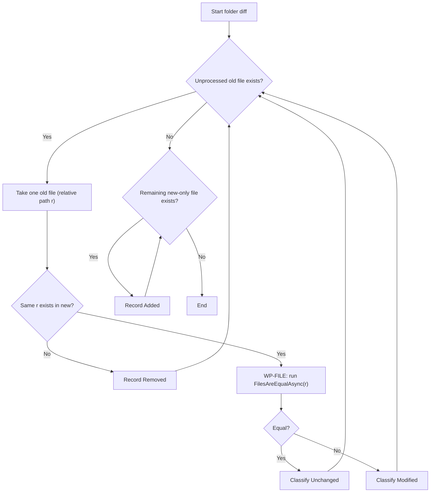
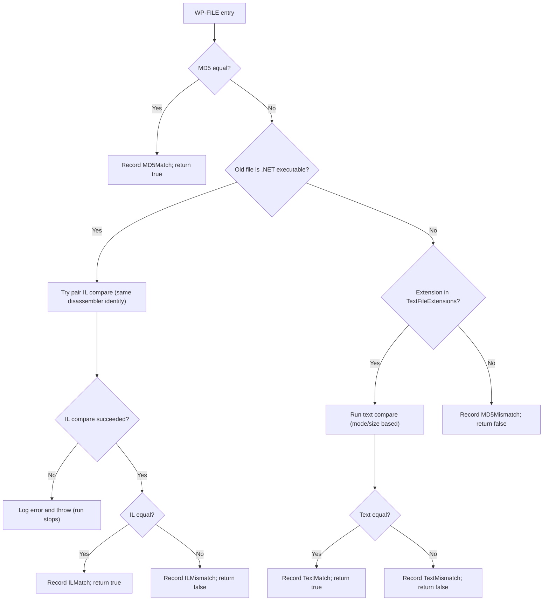
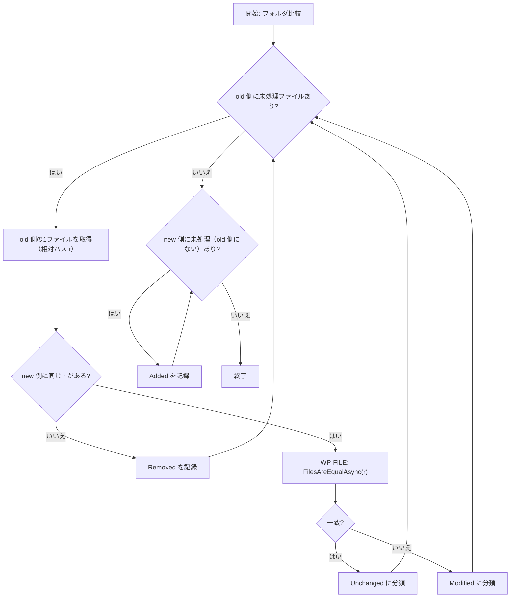
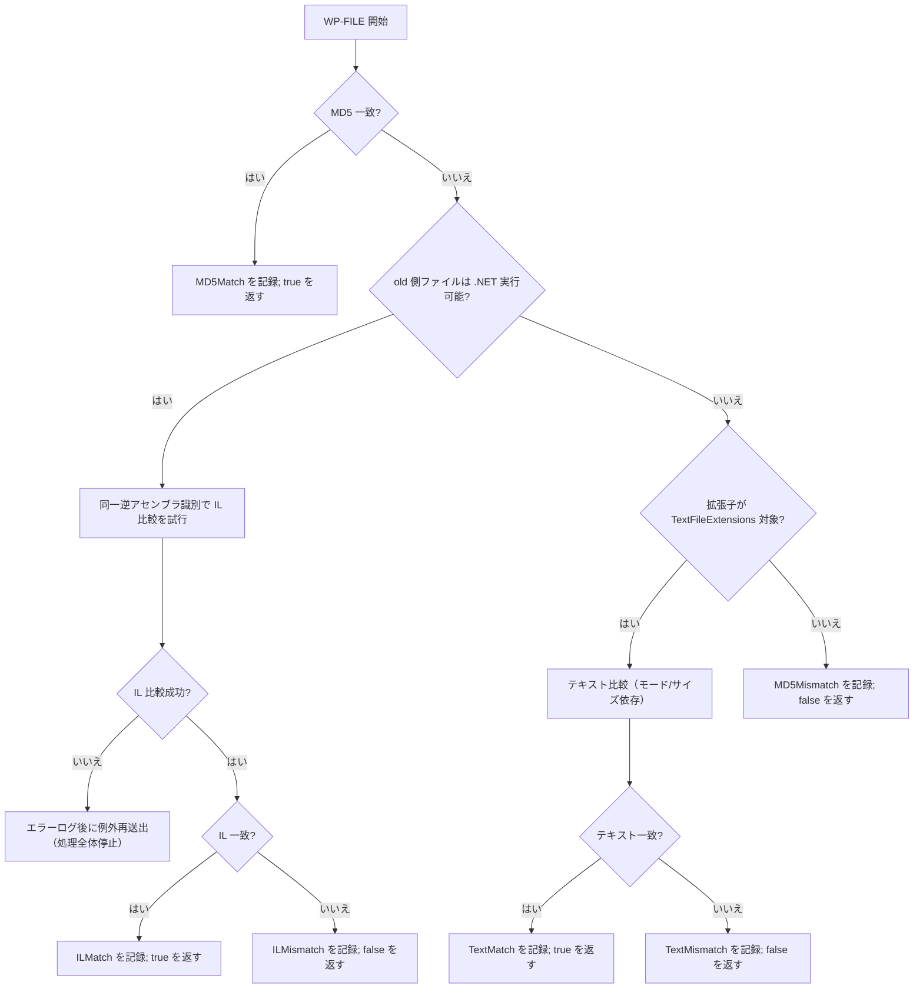

# FolderDiffIL4DotNet

`FolderDiffIL4DotNet` is a .NET console application that compares two folders and outputs a Markdown report.
For .NET assemblies, it compares IL while ignoring build-specific noise such as `// MVID:` lines, so behaviorally equivalent binaries can be treated as equal even when build timestamps differ.

Developer-focused details (architecture, CI, tests, implementation cautions):
- [doc/DEVELOPER_GUIDE.md](doc/DEVELOPER_GUIDE.md)

## Requirements

- .NET SDK 8.x
- macOS / Windows / Linux / Unix-like OS
- IL disassembler (auto-probed per file)
- Preferred: `dotnet-ildasm` or `dotnet ildasm`
- Fallback: `ilspycmd`

.NET SDK 8.x installation examples:

```powershell
# Windows (winget)
winget install Microsoft.DotNet.SDK.8 --source winget
```

```powershell
# Windows (dotnet-install script)
powershell -ExecutionPolicy Bypass -c "& { iwr https://dot.net/v1/dotnet-install.ps1 -OutFile dotnet-install.ps1; .\dotnet-install.ps1 -Channel 8.0 }"
```

```bash
# macOS/Linux/Unix (dotnet-install script)
curl -fsSL https://dot.net/v1/dotnet-install.sh | bash /dev/stdin --channel 8.0
```

IL disassembler installation examples:

```bash
dotnet tool install --global dotnet-ildasm
# add $HOME/.dotnet/tools (macOS/Linux/Unix) or %USERPROFILE%\.dotnet\tools (Windows) to PATH if needed

# verify installation and version (both commands invoke the same dotnet-ildasm tool)
dotnet-ildasm --version
dotnet ildasm --version
```

```bash
dotnet tool install --global ilspycmd
# add $HOME/.dotnet/tools (macOS/Linux/Unix) or %USERPROFILE%\.dotnet\tools (Windows) to PATH if needed
```

## Usage

1. Place `config.json` next to the executable.
2. Run with arguments:
- old folder absolute path
- new folder absolute path
- report label
3. Add `--no-pause` if you want to skip key-wait at process end.

```bash
dotnet build
dotnet run "/Users/UserA/workspace/old" "/Users/UserA/workspace/new" "YYYYMMDD" --no-pause
```

Main output:
- `Reports/<label>/diff_report.md`
- Optional IL dumps under `Reports/<label>/IL/old` and `Reports/<label>/IL/new` when `ShouldOutputILText=true`

## Comparison Flow

Flow A: Folder-level routing



Flow B: `WP-FILE` (per matched file)



1. Folder-level classification (`FolderDiffService`):
- If an old-side file has no same relative path in new, it is `Removed` and the flow moves to the next file.
- If both sides have the same relative path, the flow jumps to `WP-FILE` and `FilesAreEqualAsync` decides `Unchanged` or `Modified`.
- After old-side processing finishes, remaining new-only files are `Added`.
2. Per matched file (`FileDiffService.FilesAreEqualAsync`), checks continue only while undecided:
- MD5 equal: record `MD5Match`, return `true` immediately (decision fixed for that file).
- MD5 mismatch + old-side file is .NET executable: run IL compare with the same disassembler identity.
- IL ignores `// MVID:` lines always.
- If `ShouldIgnoreILLinesContainingConfiguredStrings=true`, lines containing any value in `ILIgnoreLineContainingStrings` are also ignored (substring, case-sensitive).
- IL equal: record `ILMatch`, return `true`. IL mismatch: record `ILMismatch`, return `false`.
- If not in IL path and extension is in `TextFileExtensions`, run text compare and return `TextMatch`/`TextMismatch`.
- If text parallel path errors, it falls back to sequential text compare and then returns a final text decision.
- Otherwise, record `MD5Mismatch` and return `false`.
3. Important runtime behavior:
- Once one diff detail is recorded for a file, no further checks run for that file; processing moves to the next target file.
- In parallel mode, the same short-circuit rule applies independently per file.
- IL compare failure (`InvalidOperationException`) is rethrown, so the whole folder-diff run stops.

## Configuration (`config.json`)

Place `config.json` next to the executable. Example:

```json
{
  "IgnoredExtensions": [".cache", ".DS_Store", ".db", ".ilcache", ".log", ".pdb"],
  "TextFileExtensions": [
    ".asax",
    ".ascx",
    ".asmx",
    ".aspx",
    ".bat",
    ".c",
    ".cmd",
    ".config",
    ".cpp",
    ".cs",
    ".cshtml",
    ".csproj",
    ".csx",
    ".css",
    ".csv",
    ".editorconfig",
    ".env",
    ".fs",
    ".fsi",
    ".fsproj",
    ".fsx",
    ".gitattributes",
    ".gitignore",
    ".gitmodules",
    ".go",
    ".gql",
    ".graphql",
    ".h",
    ".hpp",
    ".htm",
    ".html",
    ".http",
    ".ini",
    ".js",
    ".json",
    ".jsx",
    ".less",
    ".manifest",
    ".md",
    ".mod",
    ".nlog",
    ".nuspec",
    ".plist",
    ".props",
    ".ps1",
    ".psd1",
    ".psm1",
    ".py",
    ".razor",
    ".resx",
    ".rst",
    ".sass",
    ".scss",
    ".sh",
    ".sln",
    ".sql",
    ".sqlproj",
    ".sum",
    ".svg",
    ".targets",
    ".toml",
    ".ts",
    ".tsv",
    ".tsx",
    ".txt",
    ".vb",
    ".vbproj",
    ".vue",
    ".xaml",
    ".xml",
    ".yaml",
    ".yml"
  ],
  "MaxLogGenerations": 5,
  "ShouldIncludeUnchangedFiles": true,
  "ShouldIncludeIgnoredFiles": true,
  "ShouldOutputILText": true,
  "ShouldIgnoreILLinesContainingConfiguredStrings": false,
  "ILIgnoreLineContainingStrings": [],
  "ShouldOutputFileTimestamps": true,
  "MaxParallelism": 0,
  "TextDiffParallelThresholdKilobytes": 512,
  "TextDiffChunkSizeKilobytes": 64,
  "EnableILCache": true,
  "ILCacheDirectoryAbsolutePath": "",
  "ILCacheStatsLogIntervalSeconds": 60,
  "ILCacheMaxDiskFileCount": 1000,
  "ILCacheMaxDiskMegabytes": 512,
  "OptimizeForNetworkShares": false,
  "AutoDetectNetworkShares": true
}
```

| Key | Description |
| --- | --- |
| `IgnoredExtensions` | Excludes matching extensions from comparison. |
| `TextFileExtensions` | Treats matching extensions as text. Include dot (`.cs`, `.json`). Matching is case-insensitive. |
| `MaxLogGenerations` | Number of log files kept in rotation. |
| `ShouldIncludeUnchangedFiles` | Includes `Unchanged` section in report. |
| `ShouldIncludeIgnoredFiles` | Includes `Ignored Files` section before `Unchanged`. |
| `ShouldOutputILText` | Outputs IL dumps under `Reports/<label>/IL/old,new`. |
| `ShouldIgnoreILLinesContainingConfiguredStrings` | Enables additional IL line-ignore filter by substring. |
| `ILIgnoreLineContainingStrings` | String list used by IL substring-ignore filter. |
| `ShouldOutputFileTimestamps` | Adds last-modified timestamps to report entries. |
| `MaxParallelism` | Max compare parallelism. `0` or less = auto. |
| `TextDiffParallelThresholdKilobytes` | Text diff size threshold (KiB) for chunk-parallel mode. |
| `TextDiffChunkSizeKilobytes` | Chunk size (KiB) for parallel text diff. |
| `EnableILCache` | Enables IL cache (memory + optional disk). |
| `ILCacheDirectoryAbsolutePath` | IL cache directory. Empty = `<exe>/ILCache`. |
| `ILCacheStatsLogIntervalSeconds` | IL cache stats log interval. `<=0` uses default 60s. |
| `ILCacheMaxDiskFileCount` | Disk cache file count cap. `<=0` means unlimited. |
| `ILCacheMaxDiskMegabytes` | Disk cache size cap (MB). `<=0` means unlimited. |
| `OptimizeForNetworkShares` | Enables network-share optimization mode. |
| `AutoDetectNetworkShares` | Auto-detects network paths and enables optimization mode as needed. |

Notes:
- Files without extension are still compared.
- If you want extensionless files treated as text, include empty string (`""`) in `TextFileExtensions`.

## Generated Artifacts

- `Reports/<label>/diff_report.md`
- `Logs/log_YYYYMMDD.log`
- Optional: `Reports/<label>/IL/old/*.txt`, `Reports/<label>/IL/new/*.txt`

After writing, report/IL files are set to read-only when possible (failures are warning-only).

## License

- [MIT License](LICENSE)

---

# FolderDiffIL4DotNet（日本語）

`FolderDiffIL4DotNet` は、2つのフォルダを比較して Markdown レポートを出力する .NET コンソールアプリです。
.NET アセンブリは `// MVID:` などのビルド固有差分を除外して IL 比較するため、ビルド日時が違っても実質同等なら同一として扱えます。

開発者向けの詳細（設計、CI、テスト、実装上の注意点）は以下に分離しました。
- [doc/DEVELOPER_GUIDE.md](doc/DEVELOPER_GUIDE.md)

## 必要環境

- .NET SDK 8.x
- macOS / Windows / Linux / Unix 系 OS
- IL 逆アセンブラ（ファイルごとに自動判定）
- 優先: `dotnet-ildasm` または `dotnet ildasm`
- 代替: `ilspycmd`

.NET SDK 8.x のインストール例:

```powershell
# Windows (winget)
winget install Microsoft.DotNet.SDK.8 --source winget
```

```powershell
# Windows (dotnet-install スクリプト)
powershell -ExecutionPolicy Bypass -c "& { iwr https://dot.net/v1/dotnet-install.ps1 -OutFile dotnet-install.ps1; .\dotnet-install.ps1 -Channel 8.0 }"
```

```bash
# macOS/Linux/Unix (dotnet-install スクリプト)
curl -fsSL https://dot.net/v1/dotnet-install.sh | bash /dev/stdin --channel 8.0
```

IL 逆アセンブラのインストール例:

```bash
dotnet tool install --global dotnet-ildasm
# 必要に応じて PATH へ追加
# macOS/Linux/Unix: $HOME/.dotnet/tools
# Windows: %USERPROFILE%\.dotnet\tools

# インストール確認とバージョン確認（どちらも同じ dotnet-ildasm を実行）
dotnet-ildasm --version
dotnet ildasm --version
```

```bash
dotnet tool install --global ilspycmd
# 必要に応じて PATH へ追加
# macOS/Linux/Unix: $HOME/.dotnet/tools
# Windows: %USERPROFILE%\.dotnet\tools
```

## 使い方

1. 実行ファイルと同じ場所に `config.json` を配置します。
2. 次の引数で実行します。
- 旧フォルダ（比較元）の絶対パス
- 新フォルダ（比較先）の絶対パス
- レポートラベル
3. 終了時のキー待ちを省略する場合は `--no-pause` を付けます。

```bash
dotnet build
dotnet run "/Users/UserA/workspace/old" "/Users/UserA/workspace/new" "YYYYMMDD" --no-pause
```

主な出力:
- `Reports/<label>/diff_report.md`
- `ShouldOutputILText=true` の場合は `Reports/<label>/IL/old` と `Reports/<label>/IL/new` に IL テキスト

## 比較フロー

Flow A: フォルダ側ルーティング



Flow B: `WP-FILE`（同一相対パス1件の判定）



1. フォルダ単位の分類（`FolderDiffService`）:
- old 側にしか存在しない相対パスは `Removed` を確定し、次のファイルへ進みます。
- old/new の両方に同じ相対パスがある場合は `WP-FILE` へ進み、`FilesAreEqualAsync` で `Unchanged` か `Modified` を決めます。
- old 側の走査が終わった後、new 側にだけ残ったファイルを `Added` として記録します。
2. 同一相対パスのファイル判定（`FileDiffService.FilesAreEqualAsync`）:
- 判定未確定の間だけ次の判定へ進み、確定した時点でそのファイルの判定は終了します。
- MD5 一致なら `MD5Match` を記録して即 `true` を返します。
- MD5 不一致かつ old 側が .NET 実行可能なら IL 比較を試行します。
- IL 比較では `// MVID:` 行を常に除外し、`ShouldIgnoreILLinesContainingConfiguredStrings=true` の場合は `ILIgnoreLineContainingStrings` の部分一致（大文字小文字区別あり）も除外します。
- IL 一致なら `ILMatch`（`true`）、不一致なら `ILMismatch`（`false`）を記録して返します。
- IL 経路に入らず拡張子が `TextFileExtensions` 対象ならテキスト比較を行い、`TextMatch` / `TextMismatch` を返します。
- テキスト並列比較で例外時は逐次比較にフォールバックして最終判定を返します。
- どの条件にも該当しなければ `MD5Mismatch`（`false`）です。
3. 実行時の重要な挙動:
- 1ファイルで1つの詳細判定（`MD5Match` など）が記録された時点で、そのファイルの追加判定は行われず次の対象へ進みます。
- 並列実行時も、この短絡ルールは各ファイルごとに独立して同じです。
- IL 比較で `InvalidOperationException` が発生した場合は再送出され、フォルダ比較全体が停止します。

## 設定（`config.json`）

実行ファイルと同じディレクトリに配置します。例:

```json
{
  "IgnoredExtensions": [".cache", ".DS_Store", ".db", ".ilcache", ".log", ".pdb"],
  "TextFileExtensions": [
    ".asax",
    ".ascx",
    ".asmx",
    ".aspx",
    ".bat",
    ".c",
    ".cmd",
    ".config",
    ".cpp",
    ".cs",
    ".cshtml",
    ".csproj",
    ".csx",
    ".css",
    ".csv",
    ".editorconfig",
    ".env",
    ".fs",
    ".fsi",
    ".fsproj",
    ".fsx",
    ".gitattributes",
    ".gitignore",
    ".gitmodules",
    ".go",
    ".gql",
    ".graphql",
    ".h",
    ".hpp",
    ".htm",
    ".html",
    ".http",
    ".ini",
    ".js",
    ".json",
    ".jsx",
    ".less",
    ".manifest",
    ".md",
    ".mod",
    ".nlog",
    ".nuspec",
    ".plist",
    ".props",
    ".ps1",
    ".psd1",
    ".psm1",
    ".py",
    ".razor",
    ".resx",
    ".rst",
    ".sass",
    ".scss",
    ".sh",
    ".sln",
    ".sql",
    ".sqlproj",
    ".sum",
    ".svg",
    ".targets",
    ".toml",
    ".ts",
    ".tsv",
    ".tsx",
    ".txt",
    ".vb",
    ".vbproj",
    ".vue",
    ".xaml",
    ".xml",
    ".yaml",
    ".yml"
  ],
  "MaxLogGenerations": 5,
  "ShouldIncludeUnchangedFiles": true,
  "ShouldIncludeIgnoredFiles": true,
  "ShouldOutputILText": true,
  "ShouldIgnoreILLinesContainingConfiguredStrings": false,
  "ILIgnoreLineContainingStrings": [],
  "ShouldOutputFileTimestamps": true,
  "MaxParallelism": 0,
  "TextDiffParallelThresholdKilobytes": 512,
  "TextDiffChunkSizeKilobytes": 64,
  "EnableILCache": true,
  "ILCacheDirectoryAbsolutePath": "",
  "ILCacheStatsLogIntervalSeconds": 60,
  "ILCacheMaxDiskFileCount": 1000,
  "ILCacheMaxDiskMegabytes": 512,
  "OptimizeForNetworkShares": false,
  "AutoDetectNetworkShares": true
}
```

| 項目 | 説明 |
| --- | --- |
| `IgnoredExtensions` | 指定拡張子を比較対象から除外します。 |
| `TextFileExtensions` | 指定拡張子をテキスト比較対象にします（`.` 付き指定、大小無視）。 |
| `MaxLogGenerations` | ログローテーション世代数。 |
| `ShouldIncludeUnchangedFiles` | レポートに `Unchanged` セクションを出力するか。 |
| `ShouldIncludeIgnoredFiles` | レポートに `Ignored Files` セクションを出力するか。 |
| `ShouldOutputILText` | `Reports/<label>/IL/old,new` へ IL を出力するか。 |
| `ShouldIgnoreILLinesContainingConfiguredStrings` | IL 比較時の追加行除外（部分一致）を有効化するか。 |
| `ILIgnoreLineContainingStrings` | IL 行除外に使う文字列一覧。 |
| `ShouldOutputFileTimestamps` | レポート各行に更新日時を併記するか。 |
| `MaxParallelism` | 比較の最大並列度。`0` 以下は自動。 |
| `TextDiffParallelThresholdKilobytes` | 並列テキスト比較へ切替える閾値（KiB）。 |
| `TextDiffChunkSizeKilobytes` | 並列テキスト比較のチャンクサイズ（KiB）。 |
| `EnableILCache` | IL キャッシュ（メモリ + 任意ディスク）を有効化するか。 |
| `ILCacheDirectoryAbsolutePath` | IL キャッシュディレクトリ。空なら `<exe>/ILCache`。 |
| `ILCacheStatsLogIntervalSeconds` | IL キャッシュ統計ログ間隔。`<=0` で既定 60 秒。 |
| `ILCacheMaxDiskFileCount` | ディスクキャッシュ最大ファイル数。`<=0` で無制限。 |
| `ILCacheMaxDiskMegabytes` | ディスクキャッシュ容量上限（MB）。`<=0` で無制限。 |
| `OptimizeForNetworkShares` | ネットワーク共有向け最適化モードを有効化。 |
| `AutoDetectNetworkShares` | ネットワーク共有を自動検出して最適化モードを必要時に有効化。 |

補足:
- 拡張子なしファイルも比較対象です。
- 拡張子なしファイルをテキスト扱いしたい場合は `TextFileExtensions` に空文字（`""`）を含めてください。

## 生成物

- `Reports/<label>/diff_report.md`
- `Logs/log_YYYYMMDD.log`
- 任意: `Reports/<label>/IL/old/*.txt`, `Reports/<label>/IL/new/*.txt`

レポート/IL 出力ファイルは可能な範囲で読み取り専用化されます（失敗時は警告のみ）。

## ライセンス

- [MIT License](LICENSE)
