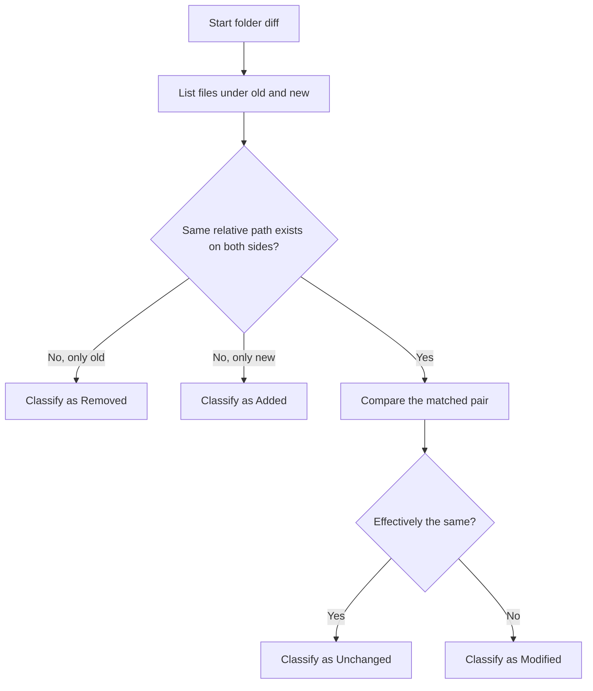
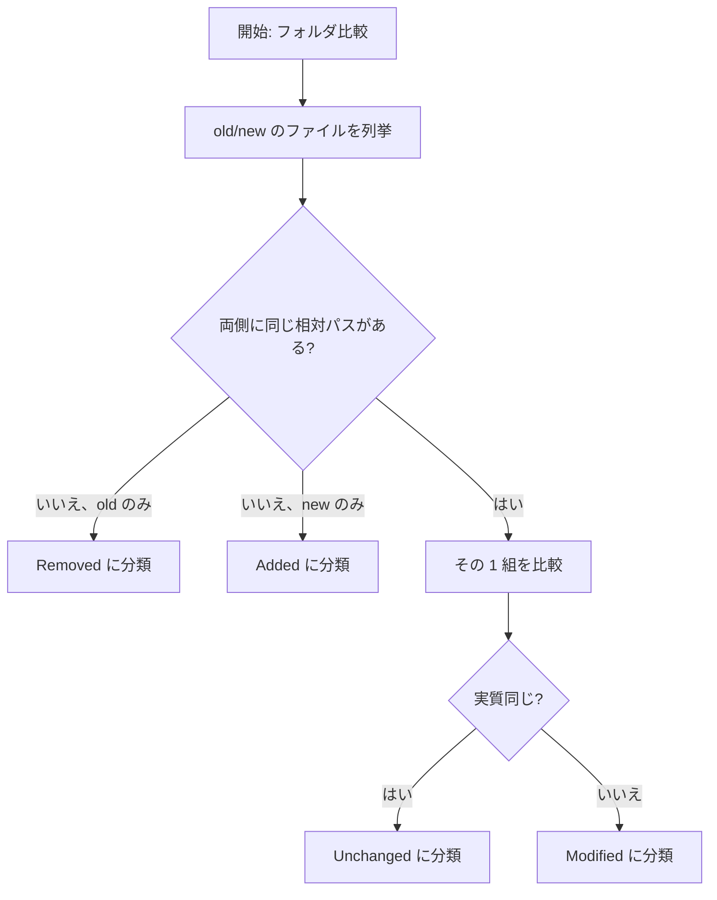

# FolderDiffIL4DotNet

`FolderDiffIL4DotNet` is a .NET console application that compares two folders and outputs a Markdown report.
For .NET assemblies, it compares IL while ignoring build-specific information such as `// MVID:` lines, so assemblies whose contents are effectively the same can still be judged equal.

Developer-focused details (architecture, CI, tests, implementation cautions):
- [doc/DEVELOPER_GUIDE.md](doc/DEVELOPER_GUIDE.md)

<a id="readme-en-doc-map"></a>
## Documentation Map

| Need | Document |
| --- | --- |
| Product overview, setup, usage, and configuration | [README.md](README.md#readme-en-usage) |
| Runtime architecture, execution flow, DI scopes, and implementation guardrails | [doc/DEVELOPER_GUIDE.md](doc/DEVELOPER_GUIDE.md#guide-en-map) |
| Test strategy, local test commands, coverage, and isolation rules | [doc/TESTING_GUIDE.md](doc/TESTING_GUIDE.md#testing-en-run-tests) |
| Generated API reference from XML documentation comments | [api/index.md](api/index.md) via [docfx.json](docfx.json) |

## Requirements

- [.NET SDK 8.x](https://dotnet.microsoft.com/en-us/download/dotnet/8.0)
- macOS / Windows / Linux / Unix-like OS
- IL disassembler (auto-probed per file)
  - Preferred: [`dotnet-ildasm`](https://www.nuget.org/packages/dotnet-ildasm/) or [`dotnet ildasm`](https://www.nuget.org/packages/dotnet-ildasm/)
  - Fallback: [`ilspycmd`](https://www.nuget.org/packages/ilspycmd/)

[.NET SDK 8.x](https://dotnet.microsoft.com/en-us/download/dotnet/8.0) installation examples:

```powershell
# Windows (winget)
winget install Microsoft.DotNet.SDK.8 --source winget
```

```powershell
# Windows (dotnet-install script)
powershell -ExecutionPolicy Bypass -c "& { iwr https://dot.net/v1/dotnet-install.ps1 -OutFile dotnet-install.ps1; .\dotnet-install.ps1 -Channel 8.0 }"
```

```bash
# macOS/Linux/Unix (dotnet-install script)
curl -fsSL https://dot.net/v1/dotnet-install.sh | bash /dev/stdin --channel 8.0
```

IL disassembler installation examples:

```bash
dotnet tool install --global dotnet-ildasm
# add $HOME/.dotnet/tools (macOS/Linux/Unix) or %USERPROFILE%\.dotnet\tools (Windows) to PATH if needed

# verify installation and version (both commands invoke the same dotnet-ildasm tool)
dotnet-ildasm --version
dotnet ildasm --version
```

```bash
dotnet tool install --global ilspycmd
# add $HOME/.dotnet/tools (macOS/Linux/Unix) or %USERPROFILE%\.dotnet\tools (Windows) to PATH if needed
```

<a id="readme-en-usage"></a>
## Usage

```
FolderDiffIL4DotNet <oldFolder> <newFolder> <reportLabel> [options]
```

**Arguments:**

| Argument | Description |
|---|---|
| `<oldFolder>` | Absolute path to the baseline (old) folder. |
| `<newFolder>` | Absolute path to the comparison (new) folder. |
| `<reportLabel>` | Label used as the subfolder name under `Reports/`. |

**Options:**

| Option | Description |
|---|---|
| `--help`, `-h` | Show help and exit (code `0`). |
| `--version` | Show the application version and exit (code `0`). |
| `--no-pause` | Skip key-wait at process end. |
| `--config <path>` | Load config from `<path>` instead of the default `<exe>/config.json`. |
| `--threads <N>` | Override `MaxParallelism` for this run (`0` = auto). |
| `--no-il-cache` | Disable the IL cache for this run. |
| `--skip-il` | Skip IL comparison for .NET assemblies entirely. |
| `--no-timestamp-warnings` | Suppress timestamp-regression warnings. |

```bash
dotnet build
dotnet run "/Users/UserA/workspace/old" "/Users/UserA/workspace/new" "YYYYMMDD" --no-pause

# Override threads and skip IL for a quick diff
dotnet run "/path/old" "/path/new" "label" --threads 4 --skip-il --no-pause

# Use a custom config file
dotnet run "/path/old" "/path/new" "label" --config /etc/my-config.json --no-pause
```

Main output:
- `Reports/<label>/diff_report.md`
- `Reports/<label>/diff_report.html` (disable with `"ShouldGenerateHtmlReport": false` in `config.json`)
- Optional IL dumps under `Reports/<label>/IL/old` and `Reports/<label>/IL/new` when [`ShouldOutputILText`](#configuration-table-en) is `true`

Process exit codes:
- `0`: success
- `2`: invalid arguments or input paths (includes preflight failures — see below)
- `3`: configuration load/parse error
- `4`: diff execution or report generation failure
- `1`: unexpected internal error

Before loading configuration, three preflight checks run against the reports output path (all failures produce exit code `2`):
1. **Path length** — the constructed `Reports/<label>` path must not exceed the OS limit (260 chars on Windows without long-path opt-in, 1024 on macOS, 4096 on Linux).
2. **Disk space** — at least 100 MB of free space is required on the drive that will hold the reports folder. The check is best-effort and skips silently when drive information is unavailable (e.g., network shares).
3. **Write permission** — a temporary probe file is created and deleted in the `Reports/` parent directory to verify that the process has write access before any actual output is produced.

See [doc/samples/diff_report.md](doc/samples/diff_report.md) for a full sample of the Markdown report.

<a id="readme-en-html-report"></a>
## Interactive HTML Review Report

Each run also produces **`diff_report.html`** alongside `diff_report.md` (disable with `"ShouldGenerateHtmlReport": false` in `config.json`).

The HTML report is a self-contained single file that opens in any browser — no server, no extensions required. Every file entry is displayed in a table with interactive columns for sign-off:

| Column | Description |
|---|---|
| ✓ | Checkbox to mark a file as reviewed |
| Justification | Free-text input — explain why the change is expected |
| Notes | Free-text input — additional remarks |
| File Path | Path label (relative for Modified/Unchanged; absolute for Added/Removed; Ignored single-side entries show absolute path, both-sides show relative) |
| Timestamp | Old → New last-modified times (or single value for Added/Removed) |
| Diff Reason | `MD5Mismatch`, `ILMatch`, `TextMismatch`, tool label for IL files (e.g. `ILMismatch dotnet-ildasm (version: 0.12.2)`), etc. |

Section heading and column header colours indicate the type of change: **red** for Removed, **green** for Added, **blue** for Modified. Ignored and Unchanged use the default colour.

See [doc/samples/diff_report.html](doc/samples/diff_report.html) for a live sample (open in a browser).

### Review workflow

```
1. Open diff_report.html in a browser (double-click the file).
2. Work through each Modified / Added / Removed row:
     ☑ check the checkbox, type the OK reason, add notes if needed.
3. State is auto-saved to the browser's localStorage as you type
     — close the tab and reopen the same file to resume.
4. When all rows are reviewed, click "Download as reviewed".
     A new file (e.g. diff_report_20260315_reviewed.html) is downloaded
     with the current checkbox, justification, and notes state embedded in the HTML source.
5. Archive or share the downloaded file as the sign-off record,
     or print it to PDF for a hard-copy audit trail.
```

<a id="readme-en-comparison-flow"></a>
## Comparison Flow

At a high level, the tool first matches files by relative path, then decides whether each matched pair is effectively the same.



For one matched pair, the decision order is:

1. Try an exact byte-level match with MD5.
2. If MD5 differs and the old-side file is a .NET executable, compare filtered IL instead of raw bytes.
3. If it is not in the IL path and the extension is listed in [`TextFileExtensions`](#configuration-table-en), compare it as text.
4. If none of the checks say "same", treat it as a normal mismatch.

Important details:
- `Added`, `Removed`, `Unchanged`, and `Modified` are decided by relative path, not by file name alone.
- IL comparison always ignores `// MVID:` lines, so build-specific assembly noise does not create false differences.
- If [`ShouldIgnoreILLinesContainingConfiguredStrings`](#configuration-table-en) is `true`, lines containing any configured ignore string are also skipped during IL comparison.
- Warm-up, cache cleanup, and post-write read-only protection are best-effort paths that log warnings and continue. Folder enumeration, matched-pair comparison, and report writing log and rethrow expected runtime exceptions because they affect correctness or required output.
- If IL comparison itself fails, the run stops instead of silently falling back to a weaker comparison.

## Configuration ([`config.json`](config.json))

Place [`config.json`](config.json) next to the executable. All keys are optional; omitted keys use the code-defined defaults in [`ConfigSettings`](Models/ConfigSettings.cs). If the defaults are acceptable, this file can be just:

```json
{}
```

Override only the settings you want to change. For example:

```json
{
  "ShouldIgnoreILLinesContainingConfiguredStrings": true,
  "ILIgnoreLineContainingStrings": ["buildserver1_", "buildserver2_"],
  "ShouldOutputFileTimestamps": false,
  "ShouldOutputILText": false,
  "ShouldIncludeIgnoredFiles": false,
  "ShouldIncludeILCacheStatsInReport": true
}
```

### Configuration Table

<table>
  <thead>
    <tr>
      <th>Key</th>
      <th>Default</th>
      <th>Description</th>
    </tr>
  </thead>
  <tbody>
    <tr id="config-en-ignoredextensions">
      <td><code>IgnoredExtensions</code></td>
      <td><code>.cache</code>, <code>.DS_Store</code>, <code>.db</code>, <code>.ilcache</code>, <code>.log</code>, <code>.pdb</code></td>
      <td>Excludes matching extensions from comparison.</td>
    </tr>
    <tr id="config-en-textfileextensions">
      <td><code>TextFileExtensions</code></td>
      <td>Built-in extension list in <a href="Models/ConfigSettings.cs"><code>ConfigSettings</code></a></td>
      <td>Treats matching extensions as text. Include dot (<code>.cs</code>, <code>.json</code>). Matching is case-insensitive.</td>
    </tr>
    <tr id="config-en-maxloggenerations">
      <td><code>MaxLogGenerations</code></td>
      <td><code>5</code></td>
      <td>Number of log files kept in rotation.</td>
    </tr>
    <tr id="config-en-shouldincludeunchangedfiles">
      <td><code>ShouldIncludeUnchangedFiles</code></td>
      <td><code>true</code></td>
      <td>Includes <code>Unchanged</code> section in report.</td>
    </tr>
    <tr id="config-en-shouldincludeignoredfiles">
      <td><code>ShouldIncludeIgnoredFiles</code></td>
      <td><code>true</code></td>
      <td>Includes <code>Ignored Files</code> section before <code>Unchanged</code>.</td>
    </tr>
    <tr id="config-en-shouldincludeilcachestatsInreport">
      <td><code>ShouldIncludeILCacheStatsInReport</code></td>
      <td><code>false</code></td>
      <td>When <code>true</code>, appends an <code>IL Cache Stats</code> section (hits, misses, hit-rate, stores, evicted, expired) between <code>Summary</code> and <code>Warnings</code>. Has no effect when <code>EnableILCache</code> is <code>false</code>.</td>
    </tr>
    <tr id="config-en-shouldoutputiltext">
      <td><code>ShouldOutputILText</code></td>
      <td><code>true</code></td>
      <td>Outputs IL dumps under <code>Reports/&lt;label&gt;/IL/old,new</code>.</td>
    </tr>
    <tr id="config-en-shouldignoreillinescontainingconfiguredstrings">
      <td><code>ShouldIgnoreILLinesContainingConfiguredStrings</code></td>
      <td><code>false</code></td>
      <td>Enables additional IL line-ignore filter by substring.</td>
    </tr>
    <tr id="config-en-ilignorelinecontainingstrings">
      <td><code>ILIgnoreLineContainingStrings</code></td>
      <td><code>[]</code></td>
      <td>String list used by IL substring-ignore filter.</td>
    </tr>
    <tr id="config-en-shouldoutputfiletimestamps">
      <td><code>ShouldOutputFileTimestamps</code></td>
      <td><code>true</code></td>
      <td>Adds last-modified timestamps to report entries as supplementary information. Timestamps are not used in comparison; results (Unchanged / Modified / etc.) are determined solely by file content.</td>
    </tr>
    <tr id="config-en-shouldwarnwhennewfiletimestampisolderthanoldfiletimestamp">
      <td><code>ShouldWarnWhenNewFileTimestampIsOlderThanOldFileTimestamp</code></td>
      <td><code>true</code></td>
      <td>Warns if a <strong>modified</strong> file in <code>new</code> has an older last-modified timestamp than the matching file in <code>old</code>, prints the warning at the end of the run, and appends a final <code>Warnings</code> section to <code>diff_report.md</code>. Unchanged files are excluded from this check.</td>
    </tr>
    <tr id="config-en-maxparallelism">
      <td><code>MaxParallelism</code></td>
      <td><code>0</code></td>
      <td>Max compare parallelism. <code>0</code> or less = auto.</td>
    </tr>
    <tr id="config-en-textdiffparallelthresholdkilobytes">
      <td><code>TextDiffParallelThresholdKilobytes</code></td>
      <td><code>512</code></td>
      <td>Text diff size threshold (KiB) for chunk-parallel mode.</td>
    </tr>
    <tr id="config-en-textdiffchunksizekilobytes">
      <td><code>TextDiffChunkSizeKilobytes</code></td>
      <td><code>64</code></td>
      <td>Chunk size (KiB) for parallel text diff.</td>
    </tr>
    <tr id="config-en-textdiffparallelmemorylimitmegabytes">
      <td><code>TextDiffParallelMemoryLimitMegabytes</code></td>
      <td><code>0</code></td>
      <td>Optional additional buffer budget (MB) for chunk-parallel text diff. <code>&lt;=0</code> means unlimited; otherwise the run reduces worker count or falls back to sequential comparison and logs the current managed-heap size.</td>
    </tr>
    <tr id="config-en-enableilcache">
      <td><code>EnableILCache</code></td>
      <td><code>true</code></td>
      <td>Enables IL cache (memory + optional disk).</td>
    </tr>
    <tr id="config-en-ilcachedirectoryabsolutepath">
      <td><code>ILCacheDirectoryAbsolutePath</code></td>
      <td><code>""</code></td>
      <td>IL cache directory. Empty = <code>&lt;exe&gt;/ILCache</code>.</td>
    </tr>
    <tr id="config-en-ilcachestatslogintervalseconds">
      <td><code>ILCacheStatsLogIntervalSeconds</code></td>
      <td><code>60</code></td>
      <td>IL cache stats log interval. <code>&lt;=0</code> uses default 60s.</td>
    </tr>
    <tr id="config-en-ilcachemaxdiskfilecount">
      <td><code>ILCacheMaxDiskFileCount</code></td>
      <td><code>1000</code></td>
      <td>Disk cache file count cap. <code>&lt;=0</code> means unlimited.</td>
    </tr>
    <tr id="config-en-ilcachemaxdiskmegabytes">
      <td><code>ILCacheMaxDiskMegabytes</code></td>
      <td><code>512</code></td>
      <td>Disk cache size cap (MB). <code>&lt;=0</code> means unlimited.</td>
    </tr>
    <tr id="config-en-ilprecomputebatchsize">
      <td><code>ILPrecomputeBatchSize</code></td>
      <td><code>2048</code></td>
      <td>Batch size for IL-related precompute. <code>&lt;=0</code> uses the default and avoids building one extra all-files list for very large trees.</td>
    </tr>
    <tr id="config-en-optimizefornetworkshares">
      <td><code>OptimizeForNetworkShares</code></td>
      <td><code>false</code></td>
      <td>Enables network-share optimization mode.</td>
    </tr>
    <tr id="config-en-autodetectnetworkshares">
      <td><code>AutoDetectNetworkShares</code></td>
      <td><code>true</code></td>
      <td>Auto-detects network paths and enables optimization mode as needed.</td>
    </tr>
    <tr id="config-en-disassemblerblacklistttlminutes">
      <td><code>DisassemblerBlacklistTtlMinutes</code></td>
      <td><code>10</code></td>
      <td>Minutes before a blacklisted disassembler tool — one that has failed <code>DISASSEMBLE_FAIL_THRESHOLD</code> (3) times consecutively — is removed from the blacklist and retried on the next call.</td>
    </tr>
    <tr id="config-en-skipil">
      <td><code>SkipIL</code></td>
      <td><code>false</code></td>
      <td>When <code>true</code>, skips IL decompilation and IL diff for .NET assemblies. MD5-mismatched assemblies are treated as binary diffs. Equivalent to the <code>--skip-il</code> CLI flag.</td>
    </tr>
    <tr id="config-en-enableinlinediff">
      <td><code>EnableInlineDiff</code></td>
      <td><code>true</code></td>
      <td>When <code>true</code>, text-mismatched and IL-mismatched files in the HTML report include an expandable inline diff showing added and removed lines.</td>
    </tr>
    <tr id="config-en-inlinediffcontextlines">
      <td><code>InlineDiffContextLines</code></td>
      <td><code>0</code></td>
      <td>Number of unchanged context lines to show above and below each changed hunk in inline diffs. <code>0</code> shows only the changed lines themselves.</td>
    </tr>
    <tr id="config-en-inlinediffmaxinputlines">
      <td><code>InlineDiffMaxInputLines</code></td>
      <td><code>1000</code></td>
      <td>Maximum line count of either file before inline diff is skipped for that entry. Guards against very large files causing slow HTML rendering.</td>
    </tr>
    <tr id="config-en-inlinediffmaxoutputlines">
      <td><code>InlineDiffMaxOutputLines</code></td>
      <td><code>500</code></td>
      <td>Maximum number of output lines produced by a single inline diff. When exceeded, the diff is truncated and a note is shown in the report.</td>
    </tr>
    <tr id="config-en-spinnerframes">
      <td><code>SpinnerFrames</code></td>
      <td><code>["|", "/", "-", "\\"]</code></td>
      <td>Array of strings used for the console spinner animation. Each element is one frame in the rotation, so multi-character strings (e.g. block characters, emoji) are supported. Must contain at least one element. Setting <code>null</code> restores the default.</td>
    </tr>
    <tr id="config-en-shouldgeneratehtmlreport">
      <td><code>ShouldGenerateHtmlReport</code></td>
      <td><code>true</code></td>
      <td>When <code>true</code>, generates <code>diff_report.html</code> alongside <code>diff_report.md</code>. The HTML file is a self-contained interactive review document with checkboxes, text inputs, localStorage auto-save, and a download function that bakes the current review state into a portable snapshot. Set to <code>false</code> to produce only the Markdown report.</td>
    </tr>
  </tbody>
</table>

Notes:
- Built-in defaults, including the full [`IgnoredExtensions`](#configuration-table-en) and [`TextFileExtensions`](#configuration-table-en) lists, are defined in [`Models/ConfigSettings.cs`](Models/ConfigSettings.cs).
- Cross-project byte-size and timestamp literals are defined in [`FolderDiffIL4DotNet.Core/Common/CoreConstants.cs`](FolderDiffIL4DotNet.Core/Common/CoreConstants.cs), and app-level constants remain in [`Common/Constants.cs`](Common/Constants.cs), so shared formats do not drift independently across projects.
- After loading `config.json`, settings are validated by [`ConfigSettings.Validate()`](Models/ConfigSettings.cs). If any value is out of range, the run fails immediately with exit code `3` and an error message listing every invalid setting. Validated constraints: `MaxLogGenerations >= 1`; `TextDiffParallelThresholdKilobytes >= 1`; `TextDiffChunkSizeKilobytes >= 1`; `TextDiffChunkSizeKilobytes` must be less than `TextDiffParallelThresholdKilobytes`; and `SpinnerFrames` must contain at least one element.
- **JSON syntax errors** (e.g. a trailing comma after the last property or array element) are caught immediately at startup, logged to the run log file, and printed to the console in red with the line number and a hint — the run exits with code `3`. Standard JSON does not allow trailing commas: `"Key": "value",}` is invalid; remove the final comma.
- Files without extension are still compared.
- If you want extensionless files treated as text, include empty string (`""`) in [`TextFileExtensions`](#configuration-table-en).
- Timestamp-regression warnings are evaluated only for files classified as **modified** (files that exist in both `old` and `new` but whose content differs). Unchanged files are excluded even if their timestamps are reversed.
- If any file ends as `MD5Mismatch`, the report writes that warning in the final `Warnings` section before any timestamp-regression entries, and the same message is printed once at run completion.

<a id="readme-en-generated-artifacts"></a>
## Generated Artifacts

- `Reports/<label>/diff_report.md`
- `Reports/<label>/diff_report.html` (unless `ShouldGenerateHtmlReport` is `false`)
- `Logs/log_YYYYMMDD.log`
- Optional: `Reports/<label>/IL/old/*.txt`, `Reports/<label>/IL/new/*.txt`

Report and IL-text creation are treated as required output, so write failures stop the run. After writing, the files are set to read-only when possible, and that protection step remains warning-only.

Some tests show as **Skipped** when running locally — this is expected and safe. See [doc/DEVELOPER_GUIDE.md](doc/DEVELOPER_GUIDE.md#guide-en-skipped-tests) for details.

For API documentation generation, CI/CD pipeline details, and release automation, see [doc/DEVELOPER_GUIDE.md](doc/DEVELOPER_GUIDE.md#guide-en-ci-release).

## License

- [MIT License](LICENSE)

---

# FolderDiffIL4DotNet（日本語）

`FolderDiffIL4DotNet` は、2つのフォルダを比較して Markdown レポートを出力する .NET コンソールアプリです。
.NET アセンブリは `// MVID:` などのビルド固有情報を除外して IL 比較することで、アセンブリの中身が実質的に同じであれば同一と判断します。

開発者向けの詳細（設計、CI、テスト、実装上の注意点）は以下に分離しました。
- [doc/DEVELOPER_GUIDE.md](doc/DEVELOPER_GUIDE.md)

<a id="readme-ja-doc-map"></a>
## ドキュメントの見取り図

| 見たい内容 | ドキュメント |
| --- | --- |
| 製品概要、導入、使い方、設定 | [README.md](README.md#readme-ja-usage) |
| 実行時アーキテクチャ、実行フロー、DI スコープ、実装上の注意点 | [doc/DEVELOPER_GUIDE.md](doc/DEVELOPER_GUIDE.md#guide-ja-map) |
| テスト戦略、ローカル実行コマンド、カバレッジ、分離ルール | [doc/TESTING_GUIDE.md](doc/TESTING_GUIDE.md#testing-ja-run-tests) |
| XML ドキュメントコメントから生成する API リファレンス | [api/index.md](api/index.md) と [docfx.json](docfx.json) |

## 必要環境

- [.NET SDK 8.x](https://dotnet.microsoft.com/ja-jp/download/dotnet/8.0)
- macOS / Windows / Linux / Unix 系 OS
- IL 逆アセンブラ（ファイルごとに自動判定）
  - 優先: [`dotnet-ildasm`](https://www.nuget.org/packages/dotnet-ildasm/) または [`dotnet ildasm`](https://www.nuget.org/packages/dotnet-ildasm/)
  - 代替: [`ilspycmd`](https://www.nuget.org/packages/ilspycmd/)

[.NET SDK 8.x](https://dotnet.microsoft.com/ja-jp/download/dotnet/8.0) のインストール例:

```powershell
# Windows (winget)
winget install Microsoft.DotNet.SDK.8 --source winget
```

```powershell
# Windows (dotnet-install スクリプト)
powershell -ExecutionPolicy Bypass -c "& { iwr https://dot.net/v1/dotnet-install.ps1 -OutFile dotnet-install.ps1; .\dotnet-install.ps1 -Channel 8.0 }"
```

```bash
# macOS/Linux/Unix (dotnet-install スクリプト)
curl -fsSL https://dot.net/v1/dotnet-install.sh | bash /dev/stdin --channel 8.0
```

IL 逆アセンブラのインストール例:

```bash
dotnet tool install --global dotnet-ildasm
# 必要に応じて PATH へ追加
# macOS/Linux/Unix: $HOME/.dotnet/tools
# Windows: %USERPROFILE%\.dotnet\tools

# インストール確認とバージョン確認（どちらも同じ dotnet-ildasm を実行）
dotnet-ildasm --version
dotnet ildasm --version
```

```bash
dotnet tool install --global ilspycmd
# 必要に応じて PATH へ追加
# macOS/Linux/Unix: $HOME/.dotnet/tools
# Windows: %USERPROFILE%\.dotnet\tools
```

<a id="readme-ja-usage"></a>
## 使い方

```
FolderDiffIL4DotNet <oldFolder> <newFolder> <reportLabel> [options]
```

**引数:**

| 引数 | 説明 |
|---|---|
| `<oldFolder>` | 比較元（旧）フォルダの絶対パス。 |
| `<newFolder>` | 比較先（新）フォルダの絶対パス。 |
| `<reportLabel>` | `Reports/` 配下のサブフォルダ名に使うラベル。 |

**オプション:**

| オプション | 説明 |
|---|---|
| `--help`, `-h` | 使い方を表示してコード `0` で終了します。 |
| `--version` | アプリバージョンを表示してコード `0` で終了します。 |
| `--no-pause` | 終了時のキー待ちをスキップします。 |
| `--config <path>` | デフォルトの `<exe>/config.json` の代わりに `<path>` から設定を読み込みます。 |
| `--threads <N>` | 今回の実行に限り `MaxParallelism` を上書きします（`0` = 自動）。 |
| `--no-il-cache` | 今回の実行に限り IL キャッシュを無効化します。 |
| `--skip-il` | .NET アセンブリの IL 比較をまるごとスキップします。 |
| `--no-timestamp-warnings` | タイムスタンプ逆転警告を抑制します。 |

```bash
dotnet build
dotnet run "/Users/UserA/workspace/old" "/Users/UserA/workspace/new" "YYYYMMDD" --no-pause

# スレッド数指定・IL スキップで高速差分
dotnet run "/path/old" "/path/new" "label" --threads 4 --skip-il --no-pause

# カスタム設定ファイルを指定
dotnet run "/path/old" "/path/new" "label" --config /etc/my-config.json --no-pause
```

主な出力:
- `Reports/<label>/diff_report.md`
- `Reports/<label>/diff_report.html`（`config.json` で `"ShouldGenerateHtmlReport": false` を指定すると無効化可）
- [`ShouldOutputILText`](#configuration-table-ja) が `true` の場合は `Reports/<label>/IL/old` と `Reports/<label>/IL/new` に IL テキスト

プロセス終了コード:
- `0`: 正常終了
- `2`: 引数または入力パス不正（下記プリフライトチェック失敗を含む）
- `3`: 設定ファイルの読込/解析失敗
- `4`: 差分実行またはレポート生成失敗
- `1`: 想定外の内部エラー

設定読み込みの前に、レポート出力パスに対して 3 つのプリフライトチェックを実行します（いずれの失敗も終了コード `2`）:
1. **パス長** — 構築した `Reports/<label>` パスが OS の上限を超えていないこと（Windows 標準は 260 文字、macOS は 1024 文字、Linux は 4096 文字）。
2. **ディスク空き容量** — レポートフォルダを作成するドライブに 100 MB 以上の空き容量があること。ドライブ情報を取得できない場合（ネットワーク共有など）は best-effort でスキップします。
3. **書き込み権限** — `Reports/` 親ディレクトリに一時プローブファイルを作成・削除して、プロセスが書き込み権限を持つことを確認します。

Markdown レポートの全サンプルは [doc/samples/diff_report.md](doc/samples/diff_report.md) を参照してください。

<a id="readme-ja-html-report"></a>
## インタラクティブ HTML レビューレポート

実行のたびに `diff_report.md` と並行して **`diff_report.html`** も生成されます（`config.json` で `"ShouldGenerateHtmlReport": false` を指定すると無効化できます）。

HTML レポートはブラウザで開くだけで動く自己完結ファイルです。サーバー不要、拡張機能不要。全ファイルエントリが表でまとめられており、承認サインオフ用のインタラクティブな列を備えています。

| 列 | 説明 |
|---|---|
| ✓ | チェックボックス（確認済みマーク） |
| Justification | 自由テキスト入力 — 変更が想定内である理由を記入 |
| Notes | 自由テキスト入力 — 補足メモ |
| File Path | パスラベル（Modified/Unchanged は相対パス、Added/Removed は絶対パス、Ignored は片側のみのエントリは絶対パス・両側のエントリは相対パス） |
| Timestamp | 旧→新の更新日時（Added/Removed は片方のみ） |
| Diff Reason | `MD5Mismatch`・`ILMatch`・`TextMismatch`、IL 比較ファイルはツールラベル付き（例: `ILMismatch dotnet-ildasm (version: 0.12.2)`）など |

セクション見出しと列ヘッダの文字色は変更種別を示します: Removed は**赤**、Added は**緑**、Modified は**青**。Ignored・Unchanged はデフォルト色です。

ライブサンプルは [doc/samples/diff_report.html](doc/samples/diff_report.html) を参照してください（ブラウザで開いてください）。

### レビュー手順

```
1. ブラウザで diff_report.html を開く（ファイルをダブルクリック）。
2. Modified / Added / Removed の各行を確認する:
     ☑ チェックを入れ、Justification（根拠）を入力し、必要なら備考も追記。
3. 入力のたびにブラウザの localStorage へ自動保存される
     — タブを閉じても同じファイルを再度開けば再開可能。
4. 全行確認後、「Download as reviewed」ボタンをクリック。
     現在のチェック状態とテキストを埋め込んだ新しい HTML がダウンロードされる
     （例: diff_report_20260315_reviewed.html）。
5. ダウンロードしたファイルをサインオフ記録として保管・共有、
     または PDF 印刷して書面の監査証跡として利用。
```

<a id="readme-ja-comparison-flow"></a>
## 比較フロー

大まかには、まず相対パスでファイルを突き合わせてから、両側に存在するファイルが「実質同じか」を判定します。



同じ相対パスの 1 組に対しては、次の順番で判定します。

1. まず MD5 で完全一致かを確認します。
2. MD5 が不一致で、old 側ファイルが .NET 実行可能なら、バイト列ではなく IL を比較します。
3. IL 経路に入らず、拡張子が [`TextFileExtensions`](#configuration-table-ja) に含まれるなら、テキストとして比較します。
4. どの比較でも「同じ」と言えなければ、通常の不一致として扱います。

重要な点:
- `Added` / `Removed` / `Unchanged` / `Modified` は、ファイル名だけでなく相対パスを基準に決まります。
- [`ShouldIgnoreILLinesContainingConfiguredStrings`](#configuration-table-ja) が `true` の場合は、設定した文字列を含む行も IL 比較から除外します。
- ウォームアップ、キャッシュ削除、書き込み後の読み取り専用化は best-effort として warning を記録して継続します。一方、フォルダ列挙、対応ファイル比較、レポート書き込みは正しさや成果物に直結するため、想定される実行時例外でもログ出力のうえ再スローします。
- IL 比較そのものに失敗した場合は、弱い比較へ黙って落とさず、その実行全体を停止します。

## 設定（[`config.json`](config.json)）

実行ファイルと同じディレクトリに配置します。全項目省略可能で、未指定の項目は [`ConfigSettings`](Models/ConfigSettings.cs) に定義されたコード既定値を使います。既定値のままでよければ、次のように空オブジェクトだけで構いません。

```json
{}
```

変更したい項目だけを書けば十分です。例:

```json
{
  "ShouldIgnoreILLinesContainingConfiguredStrings": true,
  "ILIgnoreLineContainingStrings": ["buildserver1_", "buildserver2_"],
  "ShouldOutputFileTimestamps": false,
  "ShouldOutputILText": false,
  "ShouldIncludeIgnoredFiles": false,
  "ShouldIncludeILCacheStatsInReport": true
}
```

### 設定項目一覧

<table>
  <thead>
    <tr>
      <th>項目</th>
      <th>既定値</th>
      <th>説明</th>
    </tr>
  </thead>
  <tbody>
    <tr id="config-ja-ignoredextensions">
      <td><code>IgnoredExtensions</code></td>
      <td><code>.cache</code>, <code>.DS_Store</code>, <code>.db</code>, <code>.ilcache</code>, <code>.log</code>, <code>.pdb</code></td>
      <td>指定拡張子を比較対象から除外します。</td>
    </tr>
    <tr id="config-ja-textfileextensions">
      <td><code>TextFileExtensions</code></td>
      <td><a href="Models/ConfigSettings.cs"><code>ConfigSettings</code></a> 内の組み込み拡張子一覧</td>
      <td>指定拡張子をテキスト比較対象にします（<code>.</code> 付き指定、大小無視）。</td>
    </tr>
    <tr id="config-ja-maxloggenerations">
      <td><code>MaxLogGenerations</code></td>
      <td><code>5</code></td>
      <td>ログローテーション世代数。</td>
    </tr>
    <tr id="config-ja-shouldincludeunchangedfiles">
      <td><code>ShouldIncludeUnchangedFiles</code></td>
      <td><code>true</code></td>
      <td>レポートに <code>Unchanged</code> セクションを出力するか。</td>
    </tr>
    <tr id="config-ja-shouldincludeignoredfiles">
      <td><code>ShouldIncludeIgnoredFiles</code></td>
      <td><code>true</code></td>
      <td>レポートに <code>Ignored Files</code> セクションを出力するか。</td>
    </tr>
    <tr id="config-ja-shouldincludeilcachestatsInreport">
      <td><code>ShouldIncludeILCacheStatsInReport</code></td>
      <td><code>false</code></td>
      <td><code>true</code> の場合、<code>Summary</code> と <code>Warnings</code> の間に <code>IL Cache Stats</code> セクション（ヒット数・ミス数・ヒット率・保存数・退避数・期限切れ数）を出力します。<code>EnableILCache</code> が <code>false</code> の場合は本設定が <code>true</code> でも出力されません。</td>
    </tr>
    <tr id="config-ja-shouldoutputiltext">
      <td><code>ShouldOutputILText</code></td>
      <td><code>true</code></td>
      <td><code>Reports/&lt;label&gt;/IL/old,new</code> へ IL を出力するか。</td>
    </tr>
    <tr id="config-ja-shouldignoreillinescontainingconfiguredstrings">
      <td><code>ShouldIgnoreILLinesContainingConfiguredStrings</code></td>
      <td><code>false</code></td>
      <td>IL 比較時の追加行除外（部分一致）を有効化するか。</td>
    </tr>
    <tr id="config-ja-ilignorelinecontainingstrings">
      <td><code>ILIgnoreLineContainingStrings</code></td>
      <td><code>[]</code></td>
      <td>IL 行除外に使う文字列一覧。</td>
    </tr>
    <tr id="config-ja-shouldoutputfiletimestamps">
      <td><code>ShouldOutputFileTimestamps</code></td>
      <td><code>true</code></td>
      <td>レポート各行に更新日時を補助情報として併記するか。更新日時は比較には使用しない。Unchanged / Modified 等の判定はあくまでファイル内容のみで行われる。</td>
    </tr>
    <tr id="config-ja-shouldwarnwhennewfiletimestampisolderthanoldfiletimestamp">
      <td><code>ShouldWarnWhenNewFileTimestampIsOlderThanOldFileTimestamp</code></td>
      <td><code>true</code></td>
      <td><strong>Modified</strong> と判定されたファイルのうち、<code>new</code> 側の更新日時が対応する <code>old</code> 側より古いものを検出し、実行終了時のコンソールと <code>diff_report.md</code> 末尾の <code>Warnings</code> セクションへ一覧を出力します。Unchanged ファイルはこのチェックの対象外です。</td>
    </tr>
    <tr id="config-ja-maxparallelism">
      <td><code>MaxParallelism</code></td>
      <td><code>0</code></td>
      <td>比較の最大並列度。<code>0</code> 以下は自動。</td>
    </tr>
    <tr id="config-ja-textdiffparallelthresholdkilobytes">
      <td><code>TextDiffParallelThresholdKilobytes</code></td>
      <td><code>512</code></td>
      <td>並列テキスト比較へ切替える閾値（KiB）。</td>
    </tr>
    <tr id="config-ja-textdiffchunksizekilobytes">
      <td><code>TextDiffChunkSizeKilobytes</code></td>
      <td><code>64</code></td>
      <td>並列テキスト比較のチャンクサイズ（KiB）。</td>
    </tr>
    <tr id="config-ja-textdiffparallelmemorylimitmegabytes">
      <td><code>TextDiffParallelMemoryLimitMegabytes</code></td>
      <td><code>0</code></td>
      <td>並列テキスト比較で追加確保してよいバッファ予算（MB）。<code>&lt;=0</code> は無制限で、それ以外はワーカー数を減らすか逐次比較へ切り替え、その際の managed heap 使用量をログへ出力します。</td>
    </tr>
    <tr id="config-ja-enableilcache">
      <td><code>EnableILCache</code></td>
      <td><code>true</code></td>
      <td>IL キャッシュ（メモリ + 任意ディスク）を有効化するか。</td>
    </tr>
    <tr id="config-ja-ilcachedirectoryabsolutepath">
      <td><code>ILCacheDirectoryAbsolutePath</code></td>
      <td><code>""</code></td>
      <td>IL キャッシュディレクトリ。空なら <code>&lt;exe&gt;/ILCache</code>。</td>
    </tr>
    <tr id="config-ja-ilcachestatslogintervalseconds">
      <td><code>ILCacheStatsLogIntervalSeconds</code></td>
      <td><code>60</code></td>
      <td>IL キャッシュ統計ログ間隔。<code>&lt;=0</code> で既定 60 秒。</td>
    </tr>
    <tr id="config-ja-ilcachemaxdiskfilecount">
      <td><code>ILCacheMaxDiskFileCount</code></td>
      <td><code>1000</code></td>
      <td>ディスクキャッシュ最大ファイル数。<code>&lt;=0</code> で無制限。</td>
    </tr>
    <tr id="config-ja-ilcachemaxdiskmegabytes">
      <td><code>ILCacheMaxDiskMegabytes</code></td>
      <td><code>512</code></td>
      <td>ディスクキャッシュ容量上限（MB）。<code>&lt;=0</code> で無制限。</td>
    </tr>
    <tr id="config-ja-ilprecomputebatchsize">
      <td><code>ILPrecomputeBatchSize</code></td>
      <td><code>2048</code></td>
      <td>IL 関連事前計算のバッチサイズ。<code>&lt;=0</code> で既定値を使い、非常に大きいツリーでも余分な全件リストを追加生成しないようにします。</td>
    </tr>
    <tr id="config-ja-optimizefornetworkshares">
      <td><code>OptimizeForNetworkShares</code></td>
      <td><code>false</code></td>
      <td>ネットワーク共有向け最適化モードを有効化。</td>
    </tr>
    <tr id="config-ja-autodetectnetworkshares">
      <td><code>AutoDetectNetworkShares</code></td>
      <td><code>true</code></td>
      <td>ネットワーク共有を自動検出して最適化モードを必要時に有効化。</td>
    </tr>
    <tr id="config-ja-disassemblerblacklistttlminutes">
      <td><code>DisassemblerBlacklistTtlMinutes</code></td>
      <td><code>10</code></td>
      <td>連続失敗回数が <code>DISASSEMBLE_FAIL_THRESHOLD</code>（3 回）に達してブラックリスト入りした逆アセンブラツールが、ブラックリストから除外されて再試行されるまでの分数。</td>
    </tr>
    <tr id="config-ja-skipil">
      <td><code>SkipIL</code></td>
      <td><code>false</code></td>
      <td><code>true</code> の場合、.NET アセンブリの IL 逆アセンブルと IL 差分比較をまるごとスキップします。MD5 不一致のアセンブリはバイナリ差分として扱います。CLI フラグ <code>--skip-il</code> と同等。</td>
    </tr>
    <tr id="config-ja-enableinlinediff">
      <td><code>EnableInlineDiff</code></td>
      <td><code>true</code></td>
      <td><code>true</code> の場合、HTML レポートのテキスト不一致・IL 不一致ファイルに、追加行・削除行を示す折り畳み式インライン差分を表示します。</td>
    </tr>
    <tr id="config-ja-inlinediffcontextlines">
      <td><code>InlineDiffContextLines</code></td>
      <td><code>0</code></td>
      <td>インライン差分で各変更ハンクの前後に表示する未変更コンテキスト行数。<code>0</code> では変更行のみを表示します。</td>
    </tr>
    <tr id="config-ja-inlinediffmaxinputlines">
      <td><code>InlineDiffMaxInputLines</code></td>
      <td><code>1000</code></td>
      <td>いずれかのファイルの行数がこの値を超えた場合、そのエントリのインライン差分をスキップします。非常に大きいファイルによる HTML レンダリングの遅延を防ぎます。</td>
    </tr>
    <tr id="config-ja-inlinediffmaxoutputlines">
      <td><code>InlineDiffMaxOutputLines</code></td>
      <td><code>500</code></td>
      <td>1 件のインライン差分で生成する最大出力行数。超過した場合は差分を打ち切り、レポートに注記を表示します。</td>
    </tr>
    <tr id="config-ja-spinnerframes">
      <td><code>SpinnerFrames</code></td>
      <td><code>["|", "/", "-", "\\"]</code></td>
      <td>コンソールスピナーアニメーションに使用する文字列の配列。各要素が 1 フレームになるため、複数文字のフレーム（ブロック文字・絵文字など）も指定できます。1 件以上必須です。<code>null</code> を指定すると既定値に戻ります。</td>
    </tr>
    <tr id="config-ja-shouldgeneratehtmlreport">
      <td><code>ShouldGenerateHtmlReport</code></td>
      <td><code>true</code></td>
      <td><code>true</code> の場合、<code>diff_report.md</code> と並んで <code>diff_report.html</code> を生成します。HTML ファイルはチェックボックス・テキスト入力・localStorage 自動保存・ダウンロード機能を持つ自己完結型インタラクティブレビュードキュメントです。<code>false</code> にすると Markdown レポートのみを生成します。</td>
    </tr>
  </tbody>
</table>

補足:
- [`IgnoredExtensions`](#configuration-table-ja) と [`TextFileExtensions`](#configuration-table-ja) を含む組み込み既定値の全体は [`Models/ConfigSettings.cs`](Models/ConfigSettings.cs) に定義しています。
- プロジェクト横断で使うバイト換算値や日時フォーマットは [`FolderDiffIL4DotNet.Core/Common/CoreConstants.cs`](FolderDiffIL4DotNet.Core/Common/CoreConstants.cs) に置き、アプリ固有の定数は [`Common/Constants.cs`](Common/Constants.cs) で管理しているため、共有書式がプロジェクトごとにずれません。
- `config.json` の読み込み後、[`ConfigSettings.Validate()`](Models/ConfigSettings.cs) で設定値を検証します。範囲外の値がある場合は終了コード `3` で即座に失敗し、全エラーを列挙したエラーメッセージを表示します。検証対象の制約: `MaxLogGenerations >= 1`、`TextDiffParallelThresholdKilobytes >= 1`、`TextDiffChunkSizeKilobytes >= 1`、`TextDiffChunkSizeKilobytes` は `TextDiffParallelThresholdKilobytes` 未満であること、`SpinnerFrames` は 1 件以上の要素を含むこと。
- **JSON 書式エラー**（最後のプロパティや配列要素の後のトレイリングカンマなど）はアプリ起動直後に検出され、実行ログへ書き込まれてコンソールに赤字で行番号とヒントを表示し、終了コード `3` で失敗します。標準 JSON はトレイリングカンマを許容しないため、`"Key": "value",}` のように末尾のカンマがある場合は削除してください。
- 拡張子なしファイルも比較対象です。
- 拡張子なしファイルをテキスト扱いしたい場合は [`TextFileExtensions`](#configuration-table-ja) に空文字（`""`）を含めてください。
- 更新日時逆転の警告は、**Modified（内容変更あり）と判定されたファイル**のみを対象に判定します。内容が同一の Unchanged ファイルは、更新日時が逆転していても警告対象外です。
- `MD5Mismatch` が1件でもある場合、その警告はレポート末尾の `Warnings` セクションで更新日時逆転警告より先に出し、同じ文言を実行終了時のコンソールにも1回だけ出力します。

<a id="readme-ja-generated-artifacts"></a>
## 生成物

- `Reports/<label>/diff_report.md`
- `Reports/<label>/diff_report.html`（`ShouldGenerateHtmlReport` が `false` の場合は生成されません）
- `Logs/log_YYYYMMDD.log`
- 任意: `Reports/<label>/IL/old/*.txt`, `Reports/<label>/IL/new/*.txt`

レポート本体と IL テキストの生成は必須成果物として扱うため、書き込み失敗時は実行を停止します。生成後の読み取り専用化は可能な範囲で行い、失敗しても警告のみです。

ローカルでテストを実行すると一部が **Skipped（スキップ）** と表示されることがありますが、問題ありません。詳細は [doc/DEVELOPER_GUIDE.md](doc/DEVELOPER_GUIDE.md#guide-ja-skipped-tests) を参照してください。

API ドキュメントの生成手順、CI/CD パイプラインの詳細、リリース自動化については [doc/DEVELOPER_GUIDE.md](doc/DEVELOPER_GUIDE.md#guide-en-ci-release) を参照してください。

## ライセンス

- [MIT License](LICENSE)
