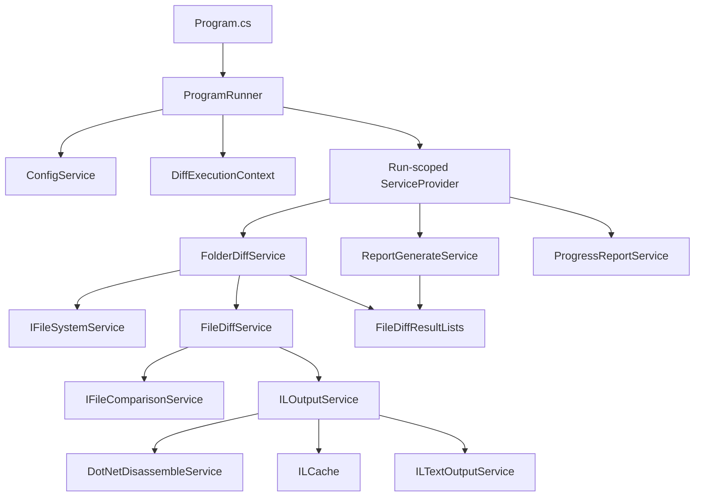
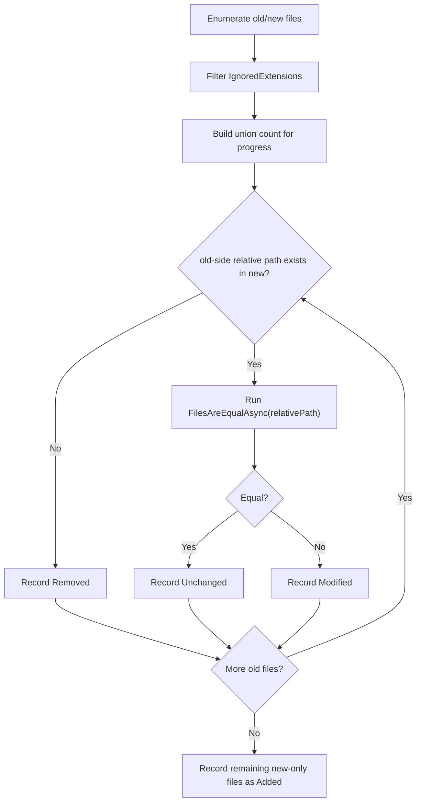
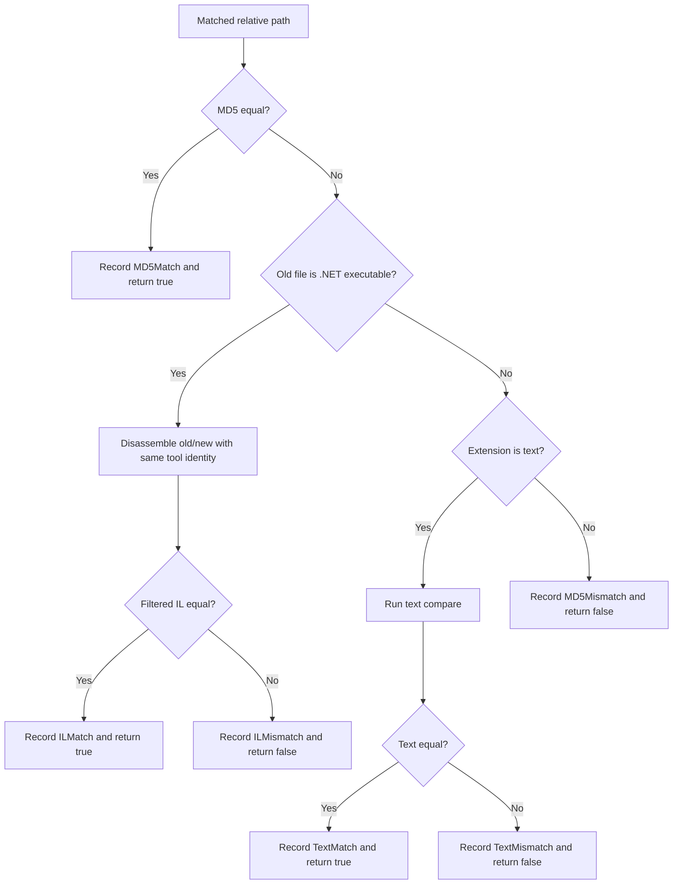
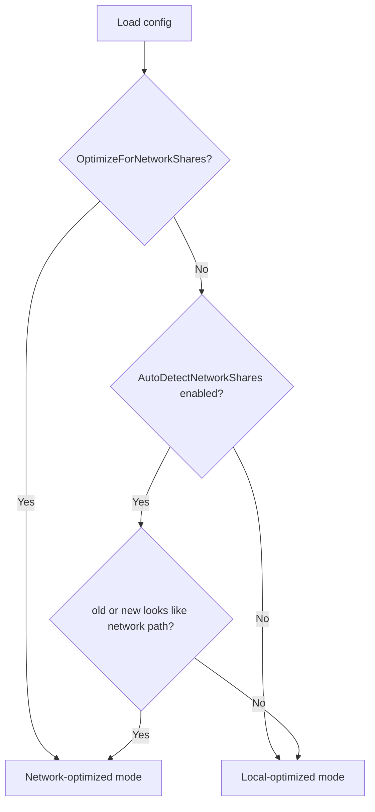
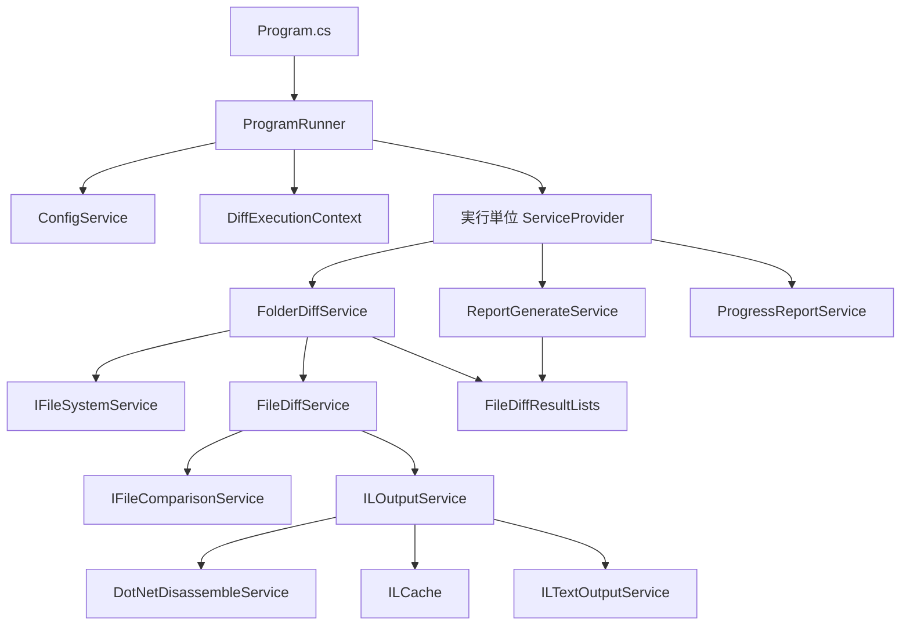
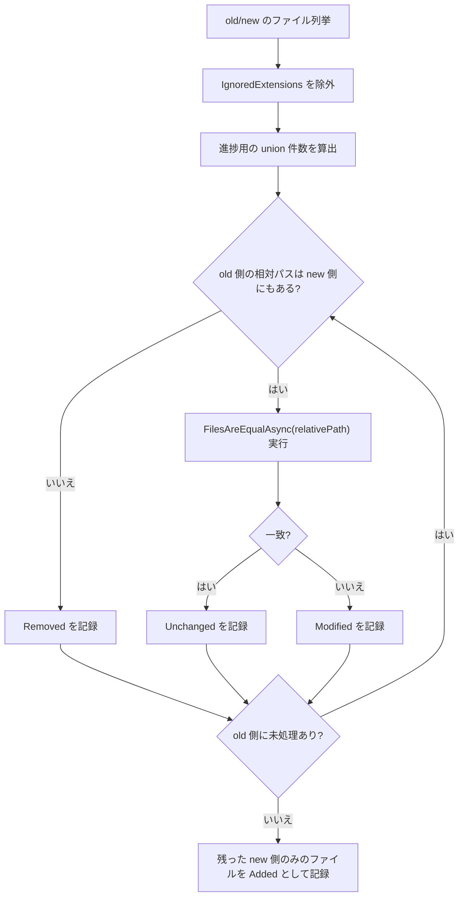
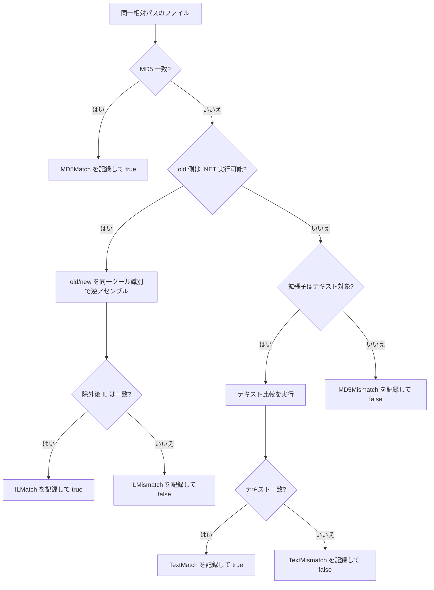
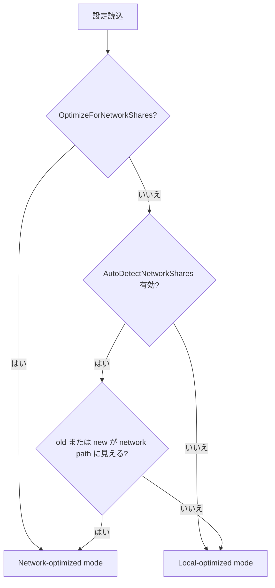

# Developer Guide

This guide is for maintainers who need to change runtime behavior, extend the diff pipeline, or keep CI and tests aligned with implementation changes.

Related documents:
- [README.md](../README.md): product overview, installation, usage, and configuration reference
- [doc/TESTING_GUIDE.md](TESTING_GUIDE.md): test strategy, local commands, and isolation rules
- [api/index.md](../api/index.md): generated API reference landing page
- [docfx.json](../docfx.json): DocFX metadata/build configuration
- [.github/workflows/dotnet.yml](../.github/workflows/dotnet.yml): CI pipeline definition

## Document Map

| If you need to... | Start here |
| --- | --- |
| Understand the end-to-end execution flow | [Execution Lifecycle](#execution-lifecycle) |
| Trace service boundaries and DI scopes | [Dependency Injection Layout](#dependency-injection-layout) |
| Change file classification behavior | [Comparison Pipeline](#comparison-pipeline) |
| Tune performance or network-share behavior | [Performance and Runtime Modes](#performance-and-runtime-modes) |
| Refresh the generated API reference site | [Documentation Site and API Reference](#documentation-site-and-api-reference) |
| Update build, test, or artifact behavior | [CI and Release Notes](#ci-and-release-notes) |
| Safely extend the codebase | [Change Checklist](#change-checklist) |

## Local Development

Prerequisites:
- .NET SDK `8.0.413` ([`global.json`](../global.json))
- One IL disassembler available on `PATH`
- `dotnet-ildasm` or `dotnet ildasm` preferred
- `ilspycmd` supported as fallback

Common commands:

```bash
dotnet restore FolderDiffIL4DotNet.sln
dotnet build FolderDiffIL4DotNet.sln --configuration Release
dotnet test FolderDiffIL4DotNet.Tests/FolderDiffIL4DotNet.Tests.csproj --nologo -p:UseAppHost=false
```

Refresh the documentation site locally:

```bash
dotnet tool update --global docfx --version '2.*'
export PATH="$PATH:$HOME/.dotnet/tools"
docfx metadata docfx.json
docfx build docfx.json
```

Debugging a local run:

```bash
dotnet run -- "/absolute/path/to/old" "/absolute/path/to/new" "dev-run" --no-pause
```

Generated during a run:
- `Reports/<label>/diff_report.md`
- `Reports/<label>/IL/old/*.txt` and `Reports/<label>/IL/new/*.txt` when `ShouldOutputILText=true`
- `Logs/log_YYYYMMDD.log`
- `ILCache/` under the app base directory when disk cache is enabled and no custom cache directory is configured

## Source Style Notes

Keep internal formatting choices simple and local:
- Prefer interpolated strings for fixed-format messages that are only used once.
- Keep shared format templates only when the same message shape is intentionally reused in multiple places.
- Avoid adding new `#region` blocks unless they solve a concrete readability problem that file structure and naming do not already solve.

## Architecture Overview



Design intent:
- [`Program.cs`](../Program.cs) stays minimal and owns only application-root service registration.
- `ProgramRunner` is the orchestration boundary for one console execution.
- `DiffExecutionContext` carries immutable run-specific paths and mode decisions.
- Core pipeline services use constructor injection and interfaces instead of static mutable state or ad hoc object creation.
- `IFileSystemService` and `IFileComparisonService` are the low-level seams that keep discovery/compare I/O unit-testable without changing the production decision tree.
- `FileDiffResultLists` is the run-scoped aggregation hub shared by diffing and reporting.

## Execution Lifecycle

### Startup Sequence


### What happens inside `RunAsync`

1. Initialize logging and print application version.
2. Validate `old`, `new`, and `reportLabel` arguments.
3. Create `Reports/<label>` early and fail if the label already exists.
4. Load `config.json` from `AppContext.BaseDirectory` and overlay it onto the code-defined defaults in `ConfigSettings`.
5. Clear transient shared helpers such as `TimestampCache`.
6. Compute `DiffExecutionContext`, including network-share decisions.
7. Build the run-scoped DI container.
8. Run the folder diff and finish progress display.
9. Generate `diff_report.md` from aggregated results.
10. Return `0` on success; on exception, log it and return `1`.

Failure behavior:
- Any unhandled exception in diffing or report generation results in exit code `1`.
- `InvalidOperationException` originating from IL comparison is treated as a fatal exception and stops the whole run.
- Read-only protection on output files remains best-effort and warning-only.

## Dependency Injection Layout

### Root container

Registered in [`Program.cs`](../Program.cs):
- `ILoggerService` -> `LoggerService`
- `ConfigService`
- `ProgramRunner`

This root container is intentionally small. It should not accumulate run-specific services.

### Run-scoped container

Registered in `ProgramRunner.BuildRunServiceProvider(...)`:
- Singletons inside the run scope
- `ConfigSettings`
- `DiffExecutionContext`
- `ILoggerService` (shared logger instance)
- Scoped services
- `FileDiffResultLists`
- `DotNetDisassemblerCache`
- `ILCache` (nullable when disabled)
- `ProgressReportService`
- `ReportGenerateService`
- `IFileSystemService` / `FileSystemService`
- `IFileComparisonService` / `FileComparisonService`
- `IILTextOutputService` / `ILTextOutputService`
- `IDotNetDisassembleService` / `DotNetDisassembleService`
- `IILOutputService` / `ILOutputService`
- `IFileDiffService` / `FileDiffService`
- `IFolderDiffService` / `FolderDiffService`

Why this matters:
- Each execution gets a newly created `FileDiffResultLists` for diff results plus newly created disassembler-related state and caches for keeping old/new on the same disassembler, so nothing is carried over from the previous run.
- Tests can replace interfaces without mutating static fields.
- Runtime path decisions are explicit and immutable once the run starts.

## Core Responsibilities

| File | Responsibility | Notes |
| --- | --- | --- |
| [`Program.cs`](../Program.cs) | Application entry point | Must remain thin |
| [`ProgramRunner.cs`](../ProgramRunner.cs) | Argument validation, config loading, run DI creation, orchestration | Main control plane |
| [`Services/DiffExecutionContext.cs`](../Services/DiffExecutionContext.cs) | Immutable run paths and network-mode decisions | No mutable state |
| [`Services/FolderDiffService.cs`](../Services/FolderDiffService.cs) | File discovery, scheduling, classification orchestration | Owns progress and added/removed routing |
| [`Services/IFileSystemService.cs`](../Services/IFileSystemService.cs) + [`Services/FileSystemService.cs`](../Services/FileSystemService.cs) | Discovery/output filesystem abstraction | Enables folder-level unit tests |
| [`Services/FileDiffService.cs`](../Services/FileDiffService.cs) | Per-file decision tree | MD5 -> IL -> text -> fallback |
| [`Services/IFileComparisonService.cs`](../Services/IFileComparisonService.cs) + [`Services/FileComparisonService.cs`](../Services/FileComparisonService.cs) | Per-file compare/detect I/O abstraction | Enables file-level unit tests |
| [`Services/ILOutputService.cs`](../Services/ILOutputService.cs) | IL compare flow, line filtering, optional IL dump writing | Enforces same disassembler identity |
| [`Services/DotNetDisassembleService.cs`](../Services/DotNetDisassembleService.cs) | Tool probing, reverse engineering, cache prefetch, blacklist handling | Central tool boundary |
| [`Services/Caching/ILCache.cs`](../Services/Caching/ILCache.cs) | Memory and optional disk cache for IL artifacts | Key stability matters |
| [`Services/ReportGenerateService.cs`](../Services/ReportGenerateService.cs) | Markdown report generation | Reads `FileDiffResultLists` only |
| [`Models/FileDiffResultLists.cs`](../Models/FileDiffResultLists.cs) | Thread-safe run results and metadata | Shared aggregation object |

## Comparison Pipeline

### Folder-level routing



Implementation notes:
- `FolderDiffService.ExecuteFolderDiffAsync()` clears run-scoped aggregates, enumerates old/new files with `IgnoredExtensions` already applied, and computes progress from the union of relative paths.
- `PrecomputeIlCachesAsync()` runs before per-file classification so disassembler/cache warm-up does not distort the later decision path.
- The old side is the driving set. Missing matches in `new` become `Removed`, while leftovers in `remainingNewFilesAbsolutePathHashSet` become `Added` after old-side traversal completes.
- Parallel mode only changes processing order. Because each relative path is removed from the remaining-new set before the expensive compare starts, the final classification rules are the same as in sequential execution.
- `Unchanged` versus `Modified` is decided only from the boolean returned by `FilesAreEqualAsync(relativePath, maxParallel)`. The detail reason is recorded separately in `FileDiffResultLists`.

### Per-file decision tree



Rules that are easy to break:
- The first successful classification for a file is the final classification for that file.
- IL comparison is only attempted after MD5 mismatch and only for files detected as .NET executables.
- IL comparison ignores `// MVID:` lines unconditionally.
- Additional IL ignore rules are substring-based and case-sensitive (`StringComparison.Ordinal`).
- IL comparison must use the same disassembler identity and version label for old/new.
- Text comparison can fall back from chunk-parallel mode to sequential mode on error, but only because chunk-parallel exceptions are allowed to bubble to `FilesAreEqualAsync(...)`.

Per-file mechanics:
- `FileDiffService.FilesAreEqualAsync(...)` uses the old-side absolute path for `.NET executable` detection, file extension lookup, and threshold decisions.
- In normal execution, `.NET executable` detection, MD5/text comparison, file length lookup, and chunk reads all go through `IFileComparisonService`. This keeps `FileDiffService` from depending directly on the concrete comparison implementation and lets tests replace `IFileComparisonService` with a mock or stub. The default implementation, `FileComparisonService`, delegates those operations to `DotNetDetector` and `FileComparer`.
- `DotNetDetector.DetectDotNetExecutable(...)` distinguishes `NotDotNetExecutable` from `Failed`; `FileDiffService` logs a warning on `Failed` before skipping the IL path.
- Once MD5 matches, the code records `MD5Match` and returns immediately; no IL comparison or text comparison runs after that.
- The IL path delegates to `ILOutputService.DiffDotNetAssembliesAsync(...)`, which disassembles old/new via `DisassemblePairWithSameDisassemblerAsync(...)`, normalizes the comparison label, filters lines, optionally writes filtered IL text, and returns both equality and the disassembler label.
- `BuildComparisonDisassemblerLabel(...)` is part of correctness. If old/new produce different tool identities or version labels, the code rejects that comparison and raises `InvalidOperationException`.
- `ShouldExcludeIlLine(...)` always strips `// MVID:`. If `ShouldIgnoreILLinesContainingConfiguredStrings=true`, it also strips any substring from `ILIgnoreLineContainingStrings` after trimming and deduplicating the configured values, using `StringComparison.Ordinal`.
- Files that are not handled by IL comparison and whose extension is included in `TextFileExtensions` are compared as text files. At that point, the code converts `TextDiffParallelThresholdKilobytes` and `TextDiffChunkSizeKilobytes` into effective byte counts and uses those values to choose the comparison method.
- If `OptimizeForNetworkShares` is enabled, the code avoids chunk-parallel reads on remote storage and always uses sequential `DiffTextFilesAsync(...)`, regardless of file size. In local-optimized mode, it uses the old-side file size: below `TextDiffParallelThresholdKilobytes` it stays sequential, and at or above the threshold it splits the file into fixed-size chunks based on `TextDiffChunkSizeKilobytes` and runs `DiffTextFilesParallelAsync(...)`.
- If chunk-parallel text comparison throws `ArgumentOutOfRangeException`, `IOException`, `UnauthorizedAccessException`, or `NotSupportedException`, the code logs a warning and falls back to sequential `DiffTextFilesAsync(...)`. Because of that fallback, `DiffTextFilesParallelAsync(...)` must not swallow those exceptions and replace them with `false`.
- Files that are neither IL-comparison targets nor text-comparison targets end at `MD5Mismatch` when MD5 differs. `MD5Mismatch` is also part of the aggregated end-of-run warnings, and the report writes that warning in the final `Warnings` section before any timestamp-regression entries. There is no deeper generic binary diff step today.
- For files that exist on both sides, if `ShouldWarnWhenNewFileTimestampIsOlderThanOldFileTimestamp=true` and the new-side last-modified time is older than the old-side last-modified time, the code records a timestamp-regression warning in addition to the comparison result. That warning is emitted in the aggregated console output at the end of the run and also written after the `MD5Mismatch` warning in the report's final `Warnings` section as a list of files with regressed timestamps.

Failure handling:
- `InvalidOperationException` thrown during IL comparison is logged and intentionally rethrown. This treats IL tool mismatches or setup problems as fatal exceptions and stops the whole run.
- Failures from `DotNetDetector.DetectDotNetExecutable(...)` are not treated as fatal exceptions. The code logs a warning, skips IL comparison only, and then continues into text comparison or `MD5Mismatch` handling.
- Other unexpected exceptions are logged from inside `FilesAreEqualAsync(...)` with both old/new absolute paths and then rethrown to the caller.
- Even when you need to add more context, do not wrap the original exception in a new generic `Exception`. Log the original exception and use `throw;` so the original exception type and stack trace are preserved.

Avoid:

```csharp
catch (Exception ex)
{
    throw new Exception($"Failed while diffing '{fileRelativePath}'.", ex);
}
```

Prefer:

```csharp
catch (Exception ex)
{
    _logger.LogMessage(
        AppLogLevel.Error,
        $"An error occurred while diffing '{file1AbsolutePath}' and '{file2AbsolutePath}'.",
        shouldOutputMessageToConsole: true,
        ex);
    throw;
}
```

- The per-file detail recorded in `FileDiffResultLists` and the bool returned from `FilesAreEqualAsync(...)` must describe the same outcome. `FolderDiffService` uses the bool return value to classify the file as `Unchanged` or `Modified`, while the report uses the detail result to show whether the reason was `MD5Match`, `ILMismatch`, `TextMatch`, and so on. If code records `ILMismatch` but returns `true`, for example, the file would be listed under `Unchanged` while the detailed reason says mismatch, which makes the result internally inconsistent.

## Result Model and Reporting Specification

`FileDiffResultLists` stores:
- Discovery lists for old/new files
- Final buckets for `Unchanged`, `Added`, `Removed`, and `Modified`
- Per-file detail results: `MD5Match`, `ILMatch`, `TextMatch`, `MD5Mismatch`, `ILMismatch`, `TextMismatch`
- Ignored file locations
- Timestamp-regression warnings for files whose `new` last-modified time is older than `old`
- Disassembler labels used during IL comparison

`ReportGenerateService` depends on these assumptions:
- `ResetAll()` must happen before any new run populates the instance.
- The detail-result `Dictionary` must not contain stale entries left over from a previous run.
- IL tool labels are only present for IL-based comparisons.
- Report generation reads execution results only and must not start new comparisons.

## Configuration and Runtime Modes

`ConfigSettings` is the single source of truth for defaults. `config.json` is an override file, so omitted keys keep the defaults defined in code, and `null` collection/path values are normalized back to those defaults.

### Configuration groups

| Group | Keys | Purpose |
| --- | --- | --- |
| Inclusion and report shape | `IgnoredExtensions`, `TextFileExtensions`, `ShouldIncludeUnchangedFiles`, `ShouldIncludeIgnoredFiles`, `ShouldOutputFileTimestamps`, `ShouldWarnWhenNewFileTimestampIsOlderThanOldFileTimestamp` | Controls scope, report verbosity, and timestamp-regression warnings |
| IL behavior | `ShouldOutputILText`, `ShouldIgnoreILLinesContainingConfiguredStrings`, `ILIgnoreLineContainingStrings` | Controls IL normalization and artifact output |
| Parallelism | `MaxParallelism`, `TextDiffParallelThresholdKilobytes`, `TextDiffChunkSizeKilobytes` | Controls CPU and text-diff strategy |
| Cache | `EnableILCache`, `ILCacheDirectoryAbsolutePath`, `ILCacheStatsLogIntervalSeconds`, `ILCacheMaxDiskFileCount`, `ILCacheMaxDiskMegabytes` | Controls IL cache lifetime and storage |
| Network-share mode | `OptimizeForNetworkShares`, `AutoDetectNetworkShares` | Prevents high-I/O behavior on slower remote storage |

### Runtime mode resolution



Practical effect of network-optimized mode:
- Skip IL cache precompute and prefetch.
- Cap auto-selected parallelism at `min(logicalProcessorCount, 8)`.
- Avoid parallel text chunk reads and prefer sequential text comparison.
- Preserve behavior correctness while reducing remote I/O amplification.

## Performance and Runtime Modes

Key performance features:
- Parallel file comparison in `FolderDiffService`
- Optional IL cache warmup and disk persistence
- Chunk-parallel text comparison for large local text files
- Tool failure blacklist inside disassembler flow
- Progress keep-alive while long-running precompute is in flight

When to be careful:
- Changing default parallelism changes both throughput and I/O pressure.
- Cache key shape must remain stable across tool-version changes.
- Over-eager prefetching can regress NAS/SMB scenarios.
- Large text-file behavior depends on both threshold and chunk size; they should be tuned together.

## Documentation Site and API Reference

DocFX is used as the API-reference generator and site builder.

Inputs:
- XML documentation comments emitted during `dotnet build`
- [`README.md`](../README.md), this guide, and [`doc/TESTING_GUIDE.md`](TESTING_GUIDE.md)
- [`docfx.json`](../docfx.json), [`index.md`](../index.md), [`toc.yml`](../toc.yml), and [`api/index.md`](../api/index.md)

Outputs:
- `_site/`: generated documentation site
- `api/*.yml` and [`api/toc.yml`](../api/toc.yml): generated API metadata consumed by the site build

Expected refresh sequence:
1. Build the solution so the latest XML documentation file exists.
2. Run `docfx metadata docfx.json`.
3. Run `docfx build docfx.json`.
4. Inspect `_site/index.html` or the CI artifact before merging larger API changes.

Guardrails:
- If you rename public namespaces or move public types, regenerate DocFX output in the same change.
- If you add public surface area, keep XML comments current so the generated API reference stays useful.
- `_site/` and generated `api/*.yml` files are build outputs and should not be committed.

## CI and Release Notes

Workflow file:
- [.github/workflows/dotnet.yml](../.github/workflows/dotnet.yml)

Current CI behavior:
- Runs on `push` and `pull_request` targeting `main`, plus `workflow_dispatch`
- Uses [`global.json`](../global.json) through `actions/setup-dotnet`
- Restores and builds `FolderDiffIL4DotNet.sln`
- Installs DocFX, generates the documentation site, and uploads it as `DocumentationSite`
- Runs tests and coverage only when the test project exists
- Generates coverage summary with `reportgenerator`
- Publishes build output and uploads it as `FolderDiffIL4DotNet`
- Uploads TRX and coverage files as `TestAndCoverage`

Versioning:
- [`version.json`](../version.json) uses Nerdbank.GitVersioning
- Informational version is embedded and later included in the generated report

## Extension Points

Typical safe extension points:
- Add new text extensions in [`config.json`](../config.json)
- Introduce new report metadata in `ReportGenerateService`
- Add logging around orchestration boundaries
- Add new tests by substituting `IFileSystemService`, `IFileComparisonService`, `IFileDiffService`, `IILOutputService`, or `IDotNetDisassembleService`

Higher-risk changes:
- Altering the order `MD5 -> IL -> text`
- Reusing run-scoped state across executions
- Moving path decisions out of `DiffExecutionContext`
- Mixing tool identities during IL comparison
- Introducing static mutable caches without isolation

## Change Checklist

Before merging behavior changes, check:
1. Does [`Program.cs`](../Program.cs) remain thin, with orchestration still in `ProgramRunner` or lower services?
2. Does each run still get a fresh `DiffExecutionContext` and `FileDiffResultLists`?
3. Are new collaborators injected rather than created ad hoc inside core services?
4. Does `FolderDiffService` still call `ResetAll()` before enumeration and classification?
5. Is the reporting specification still consistent with the contents of `FileDiffResultLists`?
6. If IL behavior changed, are same-tool enforcement and ignore-line semantics still explicit?
7. If performance behavior changed, have local and network-share modes both been considered?
8. Did [`README.md`](../README.md), this guide, and [`doc/TESTING_GUIDE.md`](TESTING_GUIDE.md) stay in sync with user-visible behavior?
9. Were tests added or updated for the changed execution path?
10. If CI assumptions changed, was [`.github/workflows/dotnet.yml`](../.github/workflows/dotnet.yml) updated too?

## Debugging Tips

- Start with `Logs/log_YYYYMMDD.log` for the exact failure point.
- If the run stops during IL comparison, inspect the chosen disassembler label in logs and report output.
- For unexpected network-mode behavior, verify both config flags and detected path classification.
- When a result bucket looks wrong, inspect `FileDiffResultLists` population order before touching report formatting.
- If a test becomes order-dependent, suspect leaked run-scoped state first.

---

# 開発者ガイド

このガイドは、実行時挙動の変更、差分パイプラインの拡張、CI とテストの整合維持を行うメンテナ向けの資料です。

関連ドキュメント:
- [README.md](../README.md): 製品概要、導入、使い方、設定リファレンス
- [doc/TESTING_GUIDE.md](TESTING_GUIDE.md): テスト戦略、ローカル実行コマンド、分離ルール
- [api/index.md](../api/index.md): 自動生成 API リファレンスの入口
- [docfx.json](../docfx.json): DocFX のメタデータ/ビルド設定
- [.github/workflows/dotnet.yml](../.github/workflows/dotnet.yml): CI パイプライン定義

## ドキュメントの見取り図

| やりたいこと | 最初に見る場所 |
| --- | --- |
| 実行全体の流れを把握したい | [実行ライフサイクル](#実行ライフサイクル) |
| サービス境界や DI スコープを追いたい | [Dependency Injection 構成](#dependency-injection-構成) |
| ファイル判定ロジックを変更したい | [比較パイプライン](#比較パイプライン) |
| 性能やネットワーク共有向け挙動を調整したい | [性能と実行モード](#性能と実行モード) |
| 自動生成 API リファレンスを更新したい | [ドキュメントサイトと API リファレンス](#ドキュメントサイトと-api-リファレンス) |
| ビルド・テスト・成果物の流れを変えたい | [CI とリリースまわり](#ci-とリリースまわり) |
| 安全に機能追加したい | [変更時チェックリスト](#変更時チェックリスト) |

## ローカル開発

前提:
- .NET SDK `8.0.413`（[`global.json`](../global.json)）
- `PATH` 上で利用可能な IL 逆アセンブラ
- 優先は `dotnet-ildasm` または `dotnet ildasm`
- フォールバックとして `ilspycmd` をサポート

よく使うコマンド:

```bash
dotnet restore FolderDiffIL4DotNet.sln
dotnet build FolderDiffIL4DotNet.sln --configuration Release
dotnet test FolderDiffIL4DotNet.Tests/FolderDiffIL4DotNet.Tests.csproj --nologo -p:UseAppHost=false
```

ドキュメントサイトのローカル更新:

```bash
dotnet tool update --global docfx --version '2.*'
export PATH="$PATH:$HOME/.dotnet/tools"
docfx metadata docfx.json
docfx build docfx.json
```

ローカル実行例:

```bash
dotnet run -- "/absolute/path/to/old" "/absolute/path/to/new" "dev-run" --no-pause
```

実行時に生成される主な成果物:
- `Reports/<label>/diff_report.md`
- `ShouldOutputILText=true` のとき `Reports/<label>/IL/old/*.txt` と `Reports/<label>/IL/new/*.txt`
- `Logs/log_YYYYMMDD.log`
- ディスクキャッシュ有効かつカスタム保存先未指定時はアプリ基準ディレクトリ配下の `ILCache/`

## ソースコードのスタイル方針

文字列整形や構造化は、まず局所性と読みやすさを優先します。
- 固定書式で単発利用のメッセージは、`string.Format(...)` より補間文字列を優先します。
- 同じ文言テンプレートを複数箇所で意図的に共有する場合のみ、共通の書式定数やヘルパーを残します。
- `#region` は、ファイル構成や命名だけでは読みづらい具体的な事情がある場合に限って追加してください。

## アーキテクチャ概要



設計意図:
- [`Program.cs`](../Program.cs) は最小限に保ち、アプリ全体の起点だけを担います。
- `ProgramRunner` は 1 回のコンソール実行を調停する境界です。
- `DiffExecutionContext` は実行固有のパスとモード判定を不変オブジェクトとして保持します。
- コアサービスは、静的可変状態や場当たり的な `new` ではなく、コンストラクタ注入とインターフェースで接続されます。
- `IFileSystemService` と `IFileComparisonService` が、列挙/比較 I/O を切り出す最下層の差し替えポイントです。
- `FileDiffResultLists` は、差分処理とレポート生成が共有する実行単位の集約ハブです。

## 実行ライフサイクル

### 起動シーケンス


### `RunAsync` の中で起きること

1. ログを初期化し、アプリのバージョンを表示します。
2. `old`、`new`、`reportLabel` 引数を検証します。
3. `Reports/<label>` を早い段階で作成し、同名が既にある場合は失敗させます。
4. `AppContext.BaseDirectory` から `config.json` を読み込み、`ConfigSettings` のコード既定値へ上書きします。
5. `TimestampCache` などの一時共有ヘルパーをクリアします。
6. ネットワーク共有判定を含む `DiffExecutionContext` を組み立てます。
7. 実行単位の DI コンテナを構築します。
8. フォルダ比較を実行し、進捗表示を終了します。
9. 集約結果から `diff_report.md` を生成します。
10. 成功なら `0`、例外ならログに出力して `1` を返します。

失敗時の扱い:
- 差分処理やレポート生成で未処理例外が出ると終了コードは `1` です。
- IL 比較由来の `InvalidOperationException` は致命的な例外扱いとし、実行全体を止めるものとします。
- 出力ファイルの読み取り専用化はベストエフォートで、失敗しても警告止まりです。

## Dependency Injection 構成

### ルートコンテナ

[`Program.cs`](../Program.cs) で登録:
- `ILoggerService` -> `LoggerService`
- `ConfigService`
- `ProgramRunner`

このルートコンテナは意図的に小さく保ち、実行固有のサービスを溜め込まないようにしています。

### 実行単位コンテナ

`ProgramRunner.BuildRunServiceProvider(...)` で登録:
- 実行スコープ内シングルトン
- `ConfigSettings`
- `DiffExecutionContext`
- `ILoggerService`（共有ロガー）
- スコープサービス
- `FileDiffResultLists`
- `DotNetDisassemblerCache`
- `ILCache`（無効時は `null`）
- `ProgressReportService`
- `ReportGenerateService`
- `IFileSystemService` / `FileSystemService`
- `IFileComparisonService` / `FileComparisonService`
- `IILTextOutputService` / `ILTextOutputService`
- `IDotNetDisassembleService` / `DotNetDisassembleService`
- `IILOutputService` / `ILOutputService`
- `IFileDiffService` / `FileDiffService`
- `IFolderDiffService` / `FolderDiffService`

この構成が重要な理由:
- 実行ごとに、差分結果を保持する `FileDiffResultLists` と、old/new で同じ逆アセンブラを使うための内部状態やキャッシュは新しく作られ、前回の実行内容を引き継ぎません。
- テストでインターフェース差し替えがしやすくなります。
- 実行時パスやモード判定が明示的で不変になります。

## 主要ファイルの責務

| ファイル | 主な責務 | 補足 |
| --- | --- | --- |
| [`Program.cs`](../Program.cs) | アプリ起動点 | 薄いまま維持する |
| [`ProgramRunner.cs`](../ProgramRunner.cs) | 引数検証、設定読込、実行 DI 作成、全体調停 | 制御プレーンの中心 |
| [`Services/DiffExecutionContext.cs`](../Services/DiffExecutionContext.cs) | 実行固有パスとネットワークモードの保持 | 可変状態を持たない |
| [`Services/FolderDiffService.cs`](../Services/FolderDiffService.cs) | ファイル列挙、スケジューリング、分類の調停 | 進捗と Added/Removed もここ |
| [`Services/IFileSystemService.cs`](../Services/IFileSystemService.cs) + [`Services/FileSystemService.cs`](../Services/FileSystemService.cs) | 列挙/出力系ファイルシステム抽象 | フォルダ単位ユニットテスト向け |
| [`Services/FileDiffService.cs`](../Services/FileDiffService.cs) | ファイル単位の判定木 | `MD5 -> IL -> text -> fallback` |
| [`Services/IFileComparisonService.cs`](../Services/IFileComparisonService.cs) + [`Services/FileComparisonService.cs`](../Services/FileComparisonService.cs) | ファイル単位の比較/判定 I/O 抽象 | ファイル単位ユニットテスト向け |
| [`Services/ILOutputService.cs`](../Services/ILOutputService.cs) | IL 比較、行除外、任意 IL 出力 | 同一逆アセンブラ制約を保証 |
| [`Services/DotNetDisassembleService.cs`](../Services/DotNetDisassembleService.cs) | ツール探索、逆アセンブル、キャッシュ先読み、ブラックリスト | 外部ツール境界 |
| [`Services/Caching/ILCache.cs`](../Services/Caching/ILCache.cs) | IL 結果のメモリ/ディスクキャッシュ | キー安定性が重要 |
| [`Services/ReportGenerateService.cs`](../Services/ReportGenerateService.cs) | Markdown レポート生成 | `FileDiffResultLists` を読むだけ |
| [`Models/FileDiffResultLists.cs`](../Models/FileDiffResultLists.cs) | スレッドセーフな結果集約 | 実行単位の共有状態 |

## 比較パイプライン

### フォルダ単位のルーティング



実装上の補足:
- `FolderDiffService.ExecuteFolderDiffAsync()` は実行単位の集計を初期化し、`IgnoredExtensions` 適用後の old/new 一覧を列挙し、相対パスの和集合件数から進捗母数を作ります。
- `PrecomputeIlCachesAsync()` はファイルごとの本判定より前に走り、逆アセンブラや IL キャッシュのウォームアップを先に済ませます。
- 走査の主導権は old 側にあります。new 側に対応がなければ `Removed`、最後まで `remainingNewFilesAbsolutePathHashSet` に残ったものが `Added` です。
- 並列実行で変わるのは処理順序だけです。高コストな比較に入る前に new 側の集合から対象の相対パスを外すため、最終的な分類結果のルール自体は逐次実行時と変わりません。
- `Unchanged` と `Modified` は `FilesAreEqualAsync(relativePath, maxParallel)` の bool 戻り値だけで決まり、詳細理由は別途 `FileDiffResultLists` に記録されます。

### ファイル単位の判定木



壊しやすい前提:
- 1 ファイルで最初に確定した分類がそのファイルの最終分類です。
- IL 比較は MD5 不一致の後、かつ .NET 実行可能ファイルにのみ進みます。
- IL 比較では `// MVID:` 行を常に無視します。
- 追加の IL 行無視は部分一致で、大文字小文字を区別します（`StringComparison.Ordinal`）。
- old/new の IL 比較は、同じ逆アセンブラ識別子とバージョン表記でなければなりません。
- テキスト比較は、並列チャンク経路で例外が出た場合に逐次比較へフォールバックします。この挙動は、並列比較側で例外を握りつぶさず `FilesAreEqualAsync(...)` まで伝播させる前提で成り立っています。

ファイル単位の実装メモ:
- `FileDiffService.FilesAreEqualAsync(...)` は、`.NET 実行可能か` の判定、拡張子判定、サイズ閾値判定の基準として old 側絶対パスを使います。
- 通常実行時の `.NET 実行可能判定`、MD5/テキスト比較、サイズ取得、チャンク読み出しは `IFileComparisonService` を通して行われます。これは、`FileDiffService` が比較処理の具体実装に直接依存せず、テストでは `IFileComparisonService` をモックやスタブに差し替えられるようにするためです。既定実装の `FileComparisonService` は、これらの処理を `DotNetDetector` と `FileComparer` に委譲します。
- `DotNetDetector.DetectDotNetExecutable(...)` は `NotDotNetExecutable` と `Failed` を区別します。`FileDiffService` は `Failed` の場合に warning を出して IL 経路をスキップします。
- MD5 が一致した時点で `MD5Match` を記録して即終了し、その後に IL やテキスト比較へは進みません。
- IL 経路は `ILOutputService.DiffDotNetAssembliesAsync(...)` に委譲され、内部で `DisassemblePairWithSameDisassemblerAsync(...)`、比較用ラベル正規化、行除外、任意の IL テキスト出力までをまとめて担当します。
- `BuildComparisonDisassemblerLabel(...)` は正しさの一部です。old/new でツール識別やバージョン表記がずれた場合は、その比較を認めず `InvalidOperationException` にします。
- `ShouldExcludeIlLine(...)` は `// MVID:` を必ず除外します。さらに `ShouldIgnoreILLinesContainingConfiguredStrings=true` の場合は、`ILIgnoreLineContainingStrings` に設定された文字列を trim・重複排除したうえで、`StringComparison.Ordinal` の部分一致で除外します。
- `.NET` 実行可能として IL 比較の対象にならず、かつ拡張子が `TextFileExtensions` に含まれるファイルは、テキストファイルとして比較します。このとき `TextDiffParallelThresholdKilobytes` と `TextDiffChunkSizeKilobytes` を実効バイト数に変換し、比較方法を決めます。
- `OptimizeForNetworkShares` が有効な場合は、ネットワーク共有上でチャンクごとに何度もファイルを開閉するコストを避けるため、ファイルサイズにかかわらず `DiffTextFilesAsync(...)` による逐次比較を使います。ローカル最適化時は old 側ファイルのサイズを基準にし、`TextDiffParallelThresholdKilobytes` 未満なら逐次比較、以上なら `TextDiffChunkSizeKilobytes` ごとの固定長チャンクに分割して `DiffTextFilesParallelAsync(...)` で並列比較します。
- 並列チャンク比較の途中で `ArgumentOutOfRangeException`、`IOException`、`UnauthorizedAccessException`、`NotSupportedException` のいずれかが出た場合は、warning を記録したうえで `DiffTextFilesAsync(...)` による逐次比較へフォールバックします。したがって `DiffTextFilesParallelAsync(...)` 側でこれらの例外を `false` に置き換えて握りつぶすと、呼び出し元はフォールバックできません。
- IL 比較対象でもテキスト比較対象でもないファイルは、MD5 不一致の時点で `MD5Mismatch` が最終結果です。`MD5Mismatch` は実行完了時の集約警告の対象でもあり、レポートでは末尾の `Warnings` セクションで更新日時逆転警告より先に出します。現状はその先の汎用バイナリ差分はありません。
- old/new の両方に存在するファイルについて、`ShouldWarnWhenNewFileTimestampIsOlderThanOldFileTimestamp=true` かつ new 側の更新日時が old 側より古い場合は、比較結果とは別に更新日時逆転の警告が記録されます。この警告は実行完了時にコンソールへ集約出力され、レポートでは `MD5Mismatch` 警告の後に更新日時が逆転したファイルの一覧として `Warnings` セクションへ出力されます。

失敗時の扱い:
- IL 比較で発生した `InvalidOperationException` は、ログを出力したうえで意図的に再送出されます。これは IL ツールの不整合やセットアップ不備を致命的な例外として扱い、実行全体を停止させるためです。
- `DotNetDetector.DetectDotNetExecutable(...)` の失敗は致命的な例外とは扱いません。警告ログを出力して IL 比較だけをスキップし、その後のテキスト比較または `MD5Mismatch` 判定へ進みます。
- それ以外の予期しない例外は、`FilesAreEqualAsync(...)` の中で old/new 両方の絶対パスを含むエラーログを出力したうえで、呼び出し元へ再送出されます。
- 例外に補足情報を付けたい場合も、汎用 `Exception` へ包み直すのではなく、元の例外をログに出したうえで `throw;` してください。元の例外型とスタックトレースを保つためです。

避けたい例:

```csharp
catch (Exception ex)
{
    throw new Exception($"Failed while diffing '{fileRelativePath}'.", ex);
}
```

推奨例:

```csharp
catch (Exception ex)
{
    _logger.LogMessage(
        AppLogLevel.Error,
        $"An error occurred while diffing '{file1AbsolutePath}' and '{file2AbsolutePath}'.",
        shouldOutputMessageToConsole: true,
        ex);
    throw;
}
```

- `FileDiffResultLists` に記録する詳細結果と `FilesAreEqualAsync(...)` の戻り値は、同じ判定を表していなければなりません。`FolderDiffService` は bool 戻り値で `Unchanged` / `Modified` を決める一方、レポートは詳細結果として `MD5Match`、`ILMismatch`、`TextMatch` などを表示します。たとえば `ILMismatch` を記録したのに `true` を返すと、一覧では `Unchanged` に入るのに詳細理由は mismatch になり、結果が矛盾します。

## 結果モデルとレポート仕様

`FileDiffResultLists` が保持するもの:
- old/new の発見済みファイル一覧
- `Unchanged`、`Added`、`Removed`、`Modified` の最終バケット
- `MD5Match`、`ILMatch`、`TextMatch`、`MD5Mismatch`、`ILMismatch`、`TextMismatch` の詳細判定
- 無視対象ファイルの所在情報
- `new` 側の更新日時が `old` 側より古いファイルの警告情報
- IL 比較で使用した逆アセンブラ表示ラベル

`ReportGenerateService` が前提としている仕様:
- 新しい実行前に `ResetAll()` が必ず呼ばれていること
- 前回の実行に由来する不要なエントリが詳細結果の `Dictionary` に残っていないこと
- IL のラベルは IL 比較時だけ存在すること
- レポート生成は、実行結果の読み取りであり、新しい比較を開始しないこと

## 設定と実行モード

既定値の正本は `ConfigSettings` です。`config.json` は override 用のファイルであり、省略したキーはコード既定値を維持します。`null` を与えたコレクションやキャッシュパスも既定値へ正規化されます。

### 設定のまとまり

| グループ | 主なキー | 目的 |
| --- | --- | --- |
| 対象範囲とレポート形状 | `IgnoredExtensions`, `TextFileExtensions`, `ShouldIncludeUnchangedFiles`, `ShouldIncludeIgnoredFiles`, `ShouldOutputFileTimestamps`, `ShouldWarnWhenNewFileTimestampIsOlderThanOldFileTimestamp` | 比較対象、レポート粒度、更新日時逆転警告の制御 |
| IL 関連 | `ShouldOutputILText`, `ShouldIgnoreILLinesContainingConfiguredStrings`, `ILIgnoreLineContainingStrings` | IL 正規化と成果物出力の制御 |
| 並列度 | `MaxParallelism`, `TextDiffParallelThresholdKilobytes`, `TextDiffChunkSizeKilobytes` | CPU 利用とテキスト比較戦略の制御 |
| キャッシュ | `EnableILCache`, `ILCacheDirectoryAbsolutePath`, `ILCacheStatsLogIntervalSeconds`, `ILCacheMaxDiskFileCount`, `ILCacheMaxDiskMegabytes` | IL キャッシュの寿命と保存先制御 |
| ネットワーク共有向け | `OptimizeForNetworkShares`, `AutoDetectNetworkShares` | 遅いストレージでの高 I/O 挙動抑制 |

### 実行モードの決定



ネットワーク最適化モードの実際の影響:
- IL キャッシュの事前計算と先読みをスキップします。
- 自動決定時の並列度を `min(論理 CPU 数, 8)` に抑えます。
- テキスト比較は並列チャンク読みを避け、逐次比較を優先します。
- 正しさを保ったまま、リモート I/O の増幅を抑えます。

## 性能と実行モード

主な性能機能:
- `FolderDiffService` によるファイル比較の並列実行
- 任意の IL キャッシュウォームアップとディスク永続化
- ローカルの大きいテキスト向けチャンク並列比較
- 逆アセンブラ失敗時のブラックリスト
- 長い事前計算中でも進捗が止まって見えないようにスピナーを回す

注意が必要な変更:
- 既定並列度の変更はスループットと I/O 圧力の両方に効きます。
- キャッシュキー形状を変えると、ツール更新時の整合性を壊しやすくなります。
- 先読みを増やしすぎると NAS/SMB で退行しやすくなります。
- 大きいテキストファイルの挙動は、閾値とチャンクサイズの組み合わせで決まります。

## ドキュメントサイトと API リファレンス

API リファレンス生成とサイト構築には DocFX を使います。

入力:
- `dotnet build` で出力される XML ドキュメントコメント
- [`README.md`](../README.md)、このガイド、[`doc/TESTING_GUIDE.md`](TESTING_GUIDE.md)
- [`docfx.json`](../docfx.json)、[`index.md`](../index.md)、[`toc.yml`](../toc.yml)、[`api/index.md`](../api/index.md)

出力:
- `_site/`: 生成済みドキュメントサイト
- `api/*.yml` と [`api/toc.yml`](../api/toc.yml): サイト構築に使う API メタデータ

更新手順の基本:
1. まずソリューションをビルドして最新の XML ドキュメントを出力します。
2. `docfx metadata docfx.json` を実行します。
3. `docfx build docfx.json` を実行します。
4. 大きめの API 変更では、マージ前に `_site/index.html` または CI artifact を確認します。

運用上の注意:
- 公開 namespace や public 型を移動・改名したら、同じ変更で DocFX 出力も更新してください。
- 公開 API を追加したら、生成結果が読める状態を維持するため XML コメントも必ず更新してください。
- `_site/` と `api/*.yml` はビルド生成物なのでコミットしません。

## CI とリリースまわり

ワークフロー:
- [.github/workflows/dotnet.yml](../.github/workflows/dotnet.yml)

現在の CI 挙動:
- `main` 向け `push` / `pull_request` と `workflow_dispatch` で実行
- `actions/setup-dotnet` で [`global.json`](../global.json) を利用
- `FolderDiffIL4DotNet.sln` を restore / build
- DocFX を導入し、ドキュメントサイトを生成して `DocumentationSite` artifact としてアップロード
- テストプロジェクトが存在するときだけテストとカバレッジを実行
- `reportgenerator` でカバレッジ要約を生成
- publish 出力を `FolderDiffIL4DotNet` としてアップロード
- TRX とカバレッジ関連を `TestAndCoverage` としてアップロード

バージョニング:
- [`version.json`](../version.json) で Nerdbank.GitVersioning を利用
- Informational Version が埋め込まれ、生成レポートにも出力されます

## 拡張ポイント

比較的安全に触りやすい場所:
- [`config.json`](../config.json) のテキスト拡張子追加
- `ReportGenerateService` へのレポートメタデータ追加
- オーケストレーション境界でのログ追加
- `IFileSystemService`、`IFileComparisonService`、`IFileDiffService`、`IILOutputService`、`IDotNetDisassembleService` を差し替えるテスト追加

高リスクな変更:
- `MD5 -> IL -> text` の順番変更
- 実行スコープ状態の再利用
- パス判定を `DiffExecutionContext` から外す変更
- IL 比較で old/new のツール識別を混在させる変更
- 分離されていない静的可変キャッシュの導入

## 変更時チェックリスト

振る舞い変更をマージする前に確認:
1. [`Program.cs`](../Program.cs) は薄いままで、調停ロジックが `ProgramRunner` か下位サービスに留まっているか。
2. 実行ごとに新しい `DiffExecutionContext` と `FileDiffResultLists` が作られているか。
3. 新しい協調オブジェクトは、場当たり的に生成せず注入されているか。
4. `FolderDiffService` が列挙や分類の前に `ResetAll()` を呼んでいるか。
5. レポート仕様が `FileDiffResultLists` の内容と乖離していないか。
6. IL 挙動を変えた場合、同一ツール強制と行除外仕様が明示されたままか。
7. 性能挙動を変えた場合、ローカルモードとネットワーク共有モードの両方を検討したか。
8. [`README.md`](../README.md)、このガイド、[`doc/TESTING_GUIDE.md`](TESTING_GUIDE.md) がユーザー向け挙動と同期しているか。
9. 変更した実行経路に対するテストを追加・更新したか。
10. CI 前提が変わったなら [`.github/workflows/dotnet.yml`](../.github/workflows/dotnet.yml) も更新したか。

## デバッグのコツ

- まず `Logs/log_YYYYMMDD.log` を見て失敗箇所を特定してください。
- IL 比較で停止した場合は、ログやレポートに出る逆アセンブラ表示ラベルを確認してください。
- ネットワーク共有モードが想定外なら、設定フラグと自動判定結果の両方を確認してください。
- バケット分類がおかしい場合は、レポート整形より前に `FileDiffResultLists` の投入順を追ってください。
- テストが順序依存になったら、まず実行スコープ状態のリークを疑ってください。
