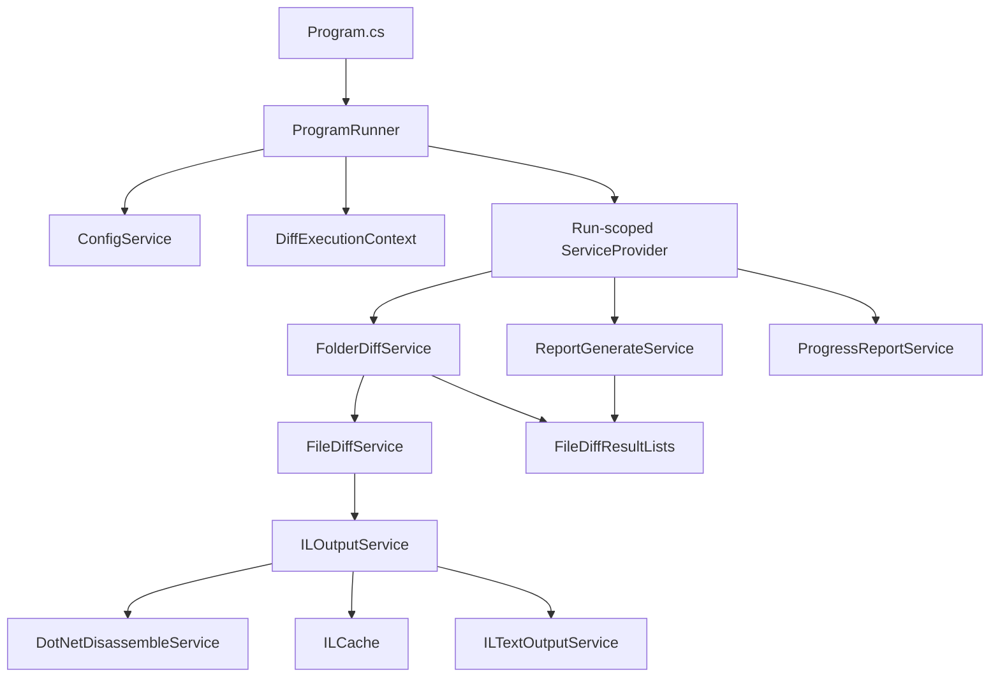
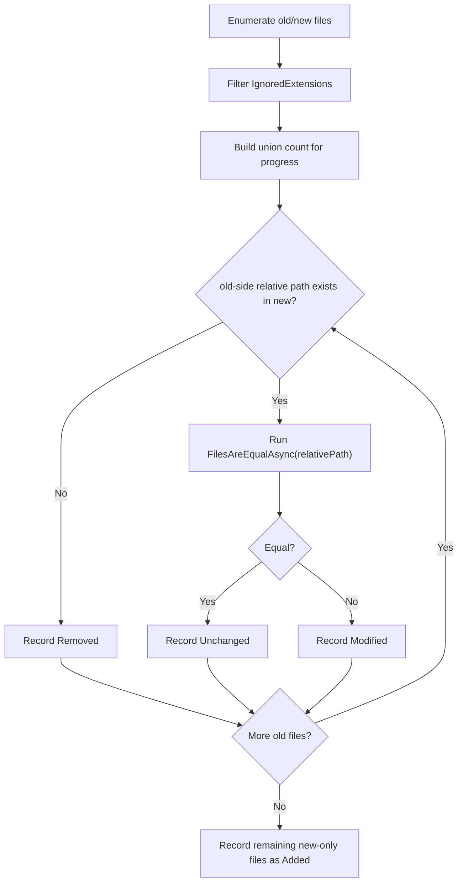
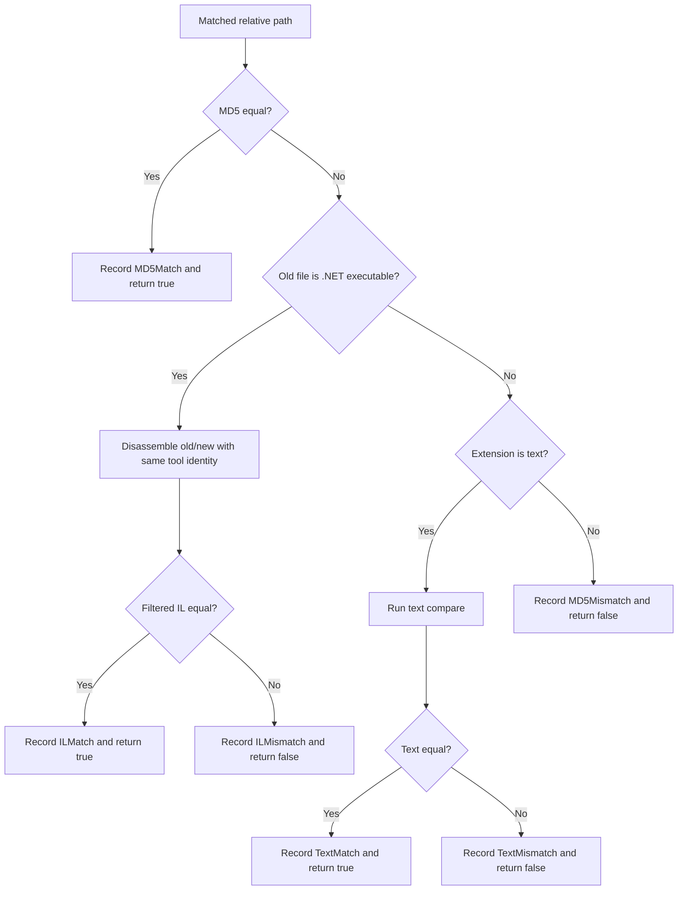
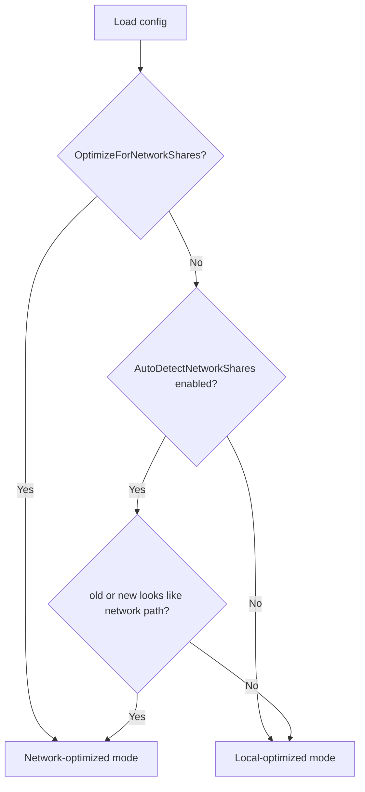
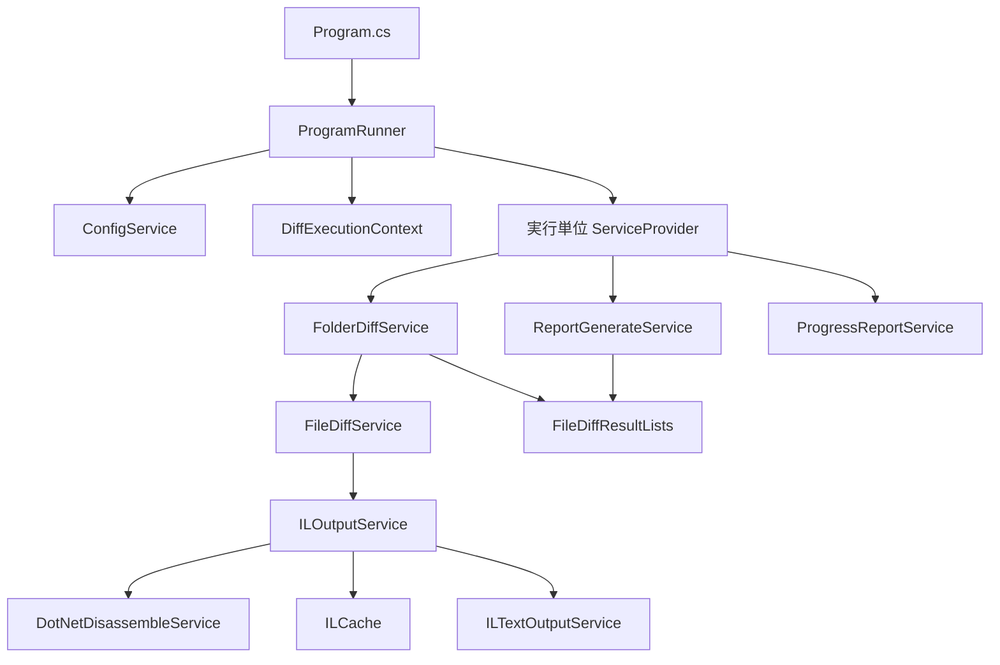
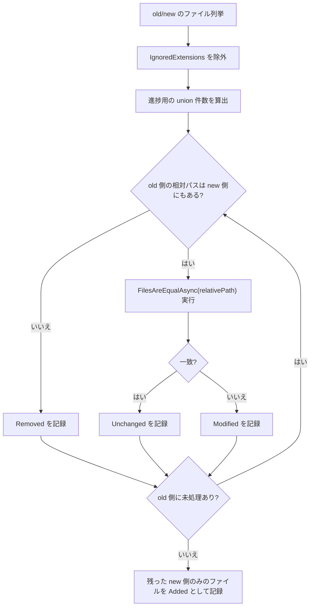
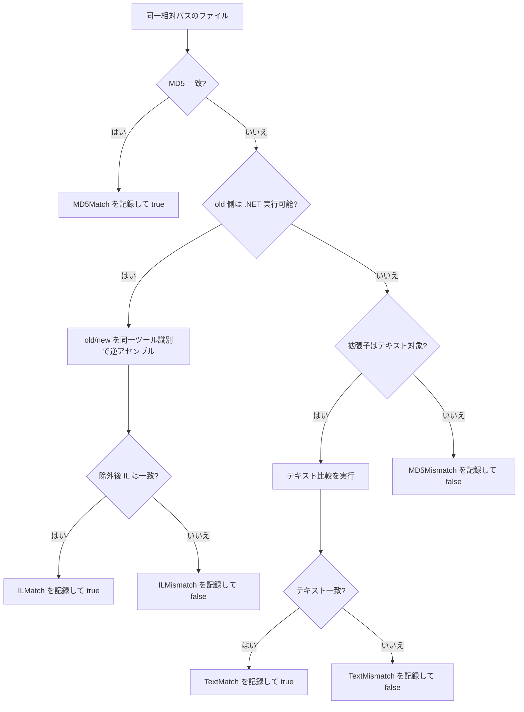
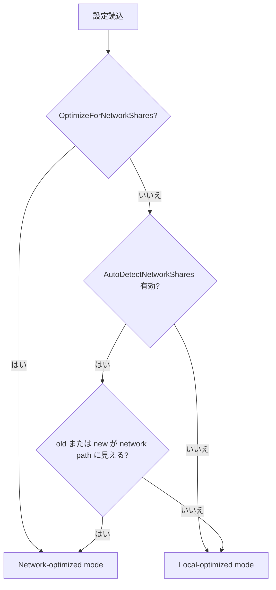

# Developer Guide

This guide is for maintainers who need to change runtime behavior, extend the diff pipeline, or keep CI and tests aligned with implementation changes.

Related documents:
- [README.md](../README.md): product overview, installation, usage, and configuration reference
- [doc/TESTING_GUIDE.md](TESTING_GUIDE.md): test strategy, local commands, and isolation rules
- [.github/workflows/dotnet.yml](../.github/workflows/dotnet.yml): CI pipeline definition

## Document Map

| If you need to... | Start here |
| --- | --- |
| Understand the end-to-end execution flow | [Execution Lifecycle](#execution-lifecycle) |
| Trace service boundaries and DI scopes | [Dependency Injection Layout](#dependency-injection-layout) |
| Change file classification behavior | [Comparison Pipeline](#comparison-pipeline) |
| Tune performance or network-share behavior | [Performance and Runtime Modes](#performance-and-runtime-modes) |
| Update build, test, or artifact behavior | [CI and Release Notes](#ci-and-release-notes) |
| Safely extend the codebase | [Change Checklist](#change-checklist) |

## Local Development

Prerequisites:
- .NET SDK `8.0.413` (`global.json`)
- One IL disassembler available on `PATH`
- `dotnet-ildasm` or `dotnet ildasm` preferred
- `ilspycmd` supported as fallback

Common commands:

```bash
dotnet restore FolderDiffIL4DotNet.sln
dotnet build FolderDiffIL4DotNet.sln --configuration Release
dotnet test FolderDiffIL4DotNet.Tests/FolderDiffIL4DotNet.Tests.csproj --nologo
```

Debugging a local run:

```bash
dotnet run -- "/absolute/path/to/old" "/absolute/path/to/new" "dev-run" --no-pause
```

Generated during a run:
- `Reports/<label>/diff_report.md`
- `Reports/<label>/IL/old/*.txt` and `Reports/<label>/IL/new/*.txt` when `ShouldOutputILText=true`
- `Logs/log_YYYYMMDD.log`
- `ILCache/` under the app base directory when disk cache is enabled and no custom cache directory is configured

## Source Style Notes

Keep internal formatting choices simple and local:
- Prefer interpolated strings for fixed-format messages that are only used once.
- Keep shared format templates only when the same message shape is intentionally reused in multiple places.
- Avoid adding new `#region` blocks unless they solve a concrete readability problem that file structure and naming do not already solve.

## Architecture Overview



Design intent:
- `Program.cs` stays minimal and owns only application-root service registration.
- `ProgramRunner` is the orchestration boundary for one console execution.
- `DiffExecutionContext` carries immutable run-specific paths and mode decisions.
- Core pipeline services use constructor injection and interfaces instead of static mutable state or ad hoc object creation.
- `FileDiffResultLists` is the run-scoped aggregation hub shared by diffing and reporting.

## Execution Lifecycle

### Startup Sequence


### What happens inside `RunAsync`

1. Initialize logging and print application version.
2. Validate `old`, `new`, and `reportLabel` arguments.
3. Create `Reports/<label>` early and fail if the label already exists.
4. Load `config.json` from `AppContext.BaseDirectory`.
5. Clear transient shared helpers such as `TimestampCache`.
6. Compute `DiffExecutionContext`, including network-share decisions.
7. Build the run-scoped DI container.
8. Run the folder diff and dispose the progress reporter.
9. Generate `diff_report.md` from aggregated results.
10. Emit aggregated completion warnings such as `MD5Mismatch` and timestamp regression.
11. Return success or log the exception and return error.

Failure behavior:
- Any unhandled exception in diffing or report generation becomes exit code `1`.
- `InvalidOperationException` from IL comparison is intentionally fatal for the whole run.
- Read-only protection on output files remains best-effort and warning-only.

## Dependency Injection Layout

### Root container

Registered in [`Program.cs`](../Program.cs):
- `ILoggerService` -> `LoggerService`
- `ConfigService`
- `ProgramRunner`

This root container is intentionally small. It should not accumulate run-specific services.

### Run-scoped container

Registered in `ProgramRunner.BuildRunServiceProvider(...)`:
- Singletons inside the run scope
- `ConfigSettings`
- `DiffExecutionContext`
- `ILoggerService` (shared logger instance)
- Scoped services
- `FileDiffResultLists`
- `DotNetDisassemblerCache`
- `ILCache` (nullable when disabled)
- `ProgressReportService`
- `ReportGenerateService`
- `IILTextOutputService` / `ILTextOutputService`
- `IDotNetDisassembleService` / `DotNetDisassembleService`
- `IILOutputService` / `ILOutputService`
- `IFileDiffService` / `FileDiffService`
- `IFolderDiffService` / `FolderDiffService`

Why this matters:
- Each execution gets a fresh result store and fresh disassembler/cache coordination state.
- Tests can replace interfaces without mutating static fields.
- Runtime path decisions are explicit and immutable once the run starts.

## Core Responsibilities

| File | Responsibility | Notes |
| --- | --- | --- |
| `Program.cs` | Application entry point | Must remain thin |
| `ProgramRunner.cs` | Argument validation, config loading, run DI creation, orchestration | Main control plane |
| `Services/DiffExecutionContext.cs` | Immutable run paths and network-mode decisions | No mutable state |
| `Services/FolderDiffService.cs` | File discovery, scheduling, classification orchestration | Owns progress and added/removed routing |
| `Services/FileDiffService.cs` | Per-file decision tree | MD5 -> IL -> text -> fallback |
| `Services/ILOutputService.cs` | IL compare flow, line filtering, optional IL dump writing | Enforces same disassembler identity |
| `Services/DotNetDisassembleService.cs` | Tool probing, reverse engineering, cache prefetch, blacklist handling | Central tool boundary |
| `Services/Caching/ILCache.cs` | Memory and optional disk cache for IL artifacts | Key stability matters |
| `Services/ReportGenerateService.cs` | Markdown report generation | Reads `FileDiffResultLists` only |
| `Models/FileDiffResultLists.cs` | Thread-safe run results and metadata | Shared aggregation object |

## Comparison Pipeline

### Folder-level routing



### Per-file decision tree



Rules that are easy to break:
- The first successful classification for a file is the final classification for that file.
- IL comparison is only attempted after MD5 mismatch and only for files detected as .NET executables.
- IL comparison ignores `// MVID:` lines unconditionally.
- Additional IL ignore rules are substring-based and case-sensitive (`StringComparison.Ordinal`).
- IL comparison must use the same disassembler identity and version label for old/new.
- Text comparison can fall back from chunk-parallel mode to sequential mode on error.

## Result Model and Reporting Contract

`FileDiffResultLists` stores:
- Discovery lists for old/new files
- Final buckets for `Unchanged`, `Added`, `Removed`, and `Modified`
- Per-file detail results: `MD5Match`, `ILMatch`, `TextMatch`, `MD5Mismatch`, `ILMismatch`, `TextMismatch`
- Ignored file locations
- Timestamp-regression warnings for files whose `new` last-modified time is older than `old`
- Disassembler labels used during IL comparison

`ReportGenerateService` depends on these contracts:
- `ResetAll()` must happen before any new run populates the instance.
- Modified and unchanged file detail dictionaries must not contain stale entries from a previous run.
- IL tool labels are only present for IL-based comparisons.
- Report generation is a pure read of run state plus method arguments; it should not trigger new comparisons.
- `ProgramRunner` owns end-of-run yellow console warnings derived from this aggregated state; `ReportGenerateService` should stay report-only.

## Configuration and Runtime Modes

### Configuration groups

| Group | Keys | Purpose |
| --- | --- | --- |
| Inclusion and report shape | `IgnoredExtensions`, `TextFileExtensions`, `ShouldIncludeUnchangedFiles`, `ShouldIncludeIgnoredFiles`, `ShouldOutputFileTimestamps`, `ShouldWarnWhenNewFileTimestampIsOlderThanOldFileTimestamp` | Controls scope, report verbosity, and timestamp-regression warnings |
| IL behavior | `ShouldOutputILText`, `ShouldIgnoreILLinesContainingConfiguredStrings`, `ILIgnoreLineContainingStrings` | Controls IL normalization and artifact output |
| Parallelism | `MaxParallelism`, `TextDiffParallelThresholdKilobytes`, `TextDiffChunkSizeKilobytes` | Controls CPU and text-diff strategy |
| Cache | `EnableILCache`, `ILCacheDirectoryAbsolutePath`, `ILCacheStatsLogIntervalSeconds`, `ILCacheMaxDiskFileCount`, `ILCacheMaxDiskMegabytes` | Controls IL cache lifetime and storage |
| Network-share mode | `OptimizeForNetworkShares`, `AutoDetectNetworkShares` | Prevents high-I/O behavior on slower remote storage |

### Runtime mode resolution



Practical effect of network-optimized mode:
- Skip IL cache precompute and prefetch.
- Cap auto-selected parallelism at `min(logicalProcessorCount, 8)`.
- Avoid parallel text chunk reads and prefer sequential text comparison.
- Preserve behavior correctness while reducing remote I/O amplification.

## Performance and Runtime Modes

Key performance features:
- Parallel file comparison in `FolderDiffService`
- Optional IL cache warmup and disk persistence
- Chunk-parallel text comparison for large local text files
- Tool failure blacklist inside disassembler flow
- Progress keep-alive while long-running precompute is in flight

When to be careful:
- Changing default parallelism changes both throughput and I/O pressure.
- Cache key shape must remain stable across tool-version changes.
- Over-eager prefetching can regress NAS/SMB scenarios.
- Large text-file behavior depends on both threshold and chunk size; they should be tuned together.

## CI and Release Notes

Workflow file:
- [.github/workflows/dotnet.yml](../.github/workflows/dotnet.yml)

Current CI behavior:
- Runs on `push` and `pull_request` targeting `main`, plus `workflow_dispatch`
- Uses `global.json` through `actions/setup-dotnet`
- Restores and builds `FolderDiffIL4DotNet.sln`
- Runs tests and coverage only when the test project exists
- Generates coverage summary with `reportgenerator`
- Publishes build output and uploads it as `FolderDiffIL4DotNet`
- Uploads TRX and coverage files as `TestAndCoverage`

Versioning:
- `version.json` uses Nerdbank.GitVersioning
- Informational version is embedded and later included in the generated report

## Extension Points

Typical safe extension points:
- Add new text extensions in `config.json`
- Introduce new report metadata in `ReportGenerateService`
- Add logging around orchestration boundaries
- Add new tests by substituting `IFileDiffService`, `IILOutputService`, or `IDotNetDisassembleService`

Higher-risk changes:
- Altering the order `MD5 -> IL -> text`
- Reusing run-scoped state across executions
- Moving path decisions out of `DiffExecutionContext`
- Mixing tool identities during IL comparison
- Introducing static mutable caches without isolation

## Change Checklist

Before merging behavior changes, check:
1. Does `Program.cs` remain thin, with orchestration still in `ProgramRunner` or lower services?
2. Does each run still get a fresh `DiffExecutionContext` and `FileDiffResultLists`?
3. Are new collaborators injected rather than created ad hoc inside core services?
4. Does `FolderDiffService` still call `ResetAll()` before enumeration and classification?
5. Is the report contract still consistent with the contents of `FileDiffResultLists`?
6. If IL behavior changed, are same-tool enforcement and ignore-line semantics still explicit?
7. If performance behavior changed, have local and network-share modes both been considered?
8. Did `README.md`, this guide, and `doc/TESTING_GUIDE.md` stay in sync with user-visible behavior?
9. Were tests added or updated for the changed execution path?
10. If CI assumptions changed, was `.github/workflows/dotnet.yml` updated too?

## Debugging Tips

- Start with `Logs/log_YYYYMMDD.log` for the exact failure point.
- If the run stops during IL comparison, inspect the chosen disassembler label in logs and report output.
- For unexpected network-mode behavior, verify both config flags and detected path classification.
- When a result bucket looks wrong, inspect `FileDiffResultLists` population order before touching report formatting.
- If a test becomes order-dependent, suspect leaked run-scoped state first.

---

# 開発者ガイド

このガイドは、実行時挙動の変更、差分パイプラインの拡張、CI とテストの整合維持を行うメンテナ向けの資料です。

関連ドキュメント:
- [README.md](../README.md): 製品概要、導入、使い方、設定リファレンス
- [doc/TESTING_GUIDE.md](TESTING_GUIDE.md): テスト戦略、ローカル実行コマンド、分離ルール
- [.github/workflows/dotnet.yml](../.github/workflows/dotnet.yml): CI パイプライン定義

## ドキュメントの見取り図

| やりたいこと | 最初に見る場所 |
| --- | --- |
| 実行全体の流れを把握したい | [実行ライフサイクル](#実行ライフサイクル) |
| サービス境界や DI スコープを追いたい | [Dependency Injection 構成](#dependency-injection-構成) |
| ファイル判定ロジックを変更したい | [比較パイプライン](#比較パイプライン) |
| 性能やネットワーク共有向け挙動を調整したい | [性能と実行モード](#性能と実行モード) |
| ビルド・テスト・成果物の流れを変えたい | [CI とリリースまわり](#ci-とリリースまわり) |
| 安全に機能追加したい | [変更時チェックリスト](#変更時チェックリスト) |

## ローカル開発

前提:
- .NET SDK `8.0.413`（`global.json`）
- `PATH` 上で利用可能な IL 逆アセンブラ
- 優先は `dotnet-ildasm` または `dotnet ildasm`
- フォールバックとして `ilspycmd` をサポート

よく使うコマンド:

```bash
dotnet restore FolderDiffIL4DotNet.sln
dotnet build FolderDiffIL4DotNet.sln --configuration Release
dotnet test FolderDiffIL4DotNet.Tests/FolderDiffIL4DotNet.Tests.csproj --nologo
```

ローカル実行例:

```bash
dotnet run -- "/absolute/path/to/old" "/absolute/path/to/new" "dev-run" --no-pause
```

実行時に生成される主な成果物:
- `Reports/<label>/diff_report.md`
- `ShouldOutputILText=true` のとき `Reports/<label>/IL/old/*.txt` と `Reports/<label>/IL/new/*.txt`
- `Logs/log_YYYYMMDD.log`
- ディスクキャッシュ有効かつカスタム保存先未指定時はアプリ基準ディレクトリ配下の `ILCache/`

## ソースコードのスタイル方針

文字列整形や構造化は、まず局所性と読みやすさを優先します。
- 固定書式で単発利用のメッセージは、`string.Format(...)` より補間文字列を優先します。
- 同じ文言テンプレートを複数箇所で意図的に共有する場合のみ、共通の書式定数やヘルパーを残します。
- `#region` は、ファイル構成や命名だけでは読みづらい具体的な事情がある場合に限って追加してください。

## アーキテクチャ概要



設計意図:
- `Program.cs` は最小限に保ち、アプリ全体の起点だけを担います。
- `ProgramRunner` は 1 回のコンソール実行を調停する境界です。
- `DiffExecutionContext` は実行固有のパスとモード判定を不変オブジェクトとして保持します。
- コアサービスは、静的可変状態や場当たり的な `new` ではなく、コンストラクタ注入とインターフェースで接続されます。
- `FileDiffResultLists` は、差分処理とレポート生成が共有する実行単位の集約ハブです。

## 実行ライフサイクル

### 起動シーケンス


### `RunAsync` の中で起きること

1. ログを初期化し、アプリのバージョンを表示します。
2. `old`、`new`、`reportLabel` 引数を検証します。
3. `Reports/<label>` を早い段階で作成し、同名が既にある場合は失敗させます。
4. `AppContext.BaseDirectory` から `config.json` を読み込みます。
5. `TimestampCache` などの一時共有ヘルパーをクリアします。
6. ネットワーク共有判定を含む `DiffExecutionContext` を組み立てます。
7. 実行単位の DI コンテナを構築します。
8. フォルダ比較を実行し、進捗レポータを破棄します。
9. 集約結果から `diff_report.md` を生成します。
10. 成功なら `0`、例外ならログ化して `1` を返します。

失敗時の扱い:
- 差分処理やレポート生成で未処理例外が出ると終了コードは `1` です。
- IL 比較由来の `InvalidOperationException` は実行全体を止める意図的な致命扱いです。
- 出力ファイルの読み取り専用化はベストエフォートで、失敗しても警告止まりです。

## Dependency Injection 構成

### ルートコンテナ

[`Program.cs`](../Program.cs) で登録:
- `ILoggerService` -> `LoggerService`
- `ConfigService`
- `ProgramRunner`

このルートコンテナは意図的に小さく保ち、実行固有のサービスを溜め込まないようにしています。

### 実行単位コンテナ

`ProgramRunner.BuildRunServiceProvider(...)` で登録:
- 実行スコープ内シングルトン
- `ConfigSettings`
- `DiffExecutionContext`
- `ILoggerService`（共有ロガー）
- スコープサービス
- `FileDiffResultLists`
- `DotNetDisassemblerCache`
- `ILCache`（無効時は `null`）
- `ProgressReportService`
- `ReportGenerateService`
- `IILTextOutputService` / `ILTextOutputService`
- `IDotNetDisassembleService` / `DotNetDisassembleService`
- `IILOutputService` / `ILOutputService`
- `IFileDiffService` / `FileDiffService`
- `IFolderDiffService` / `FolderDiffService`

この構成が重要な理由:
- 実行ごとに結果ストアと逆アセンブラ協調状態が初期化されます。
- テストでインターフェース差し替えがしやすくなります。
- 実行時パスやモード判定が明示的で不変になります。

## 主要ファイルの責務

| ファイル | 主な責務 | 補足 |
| --- | --- | --- |
| `Program.cs` | アプリ起動点 | 薄いまま維持する |
| `ProgramRunner.cs` | 引数検証、設定読込、実行 DI 作成、全体調停 | 制御プレーンの中心 |
| `Services/DiffExecutionContext.cs` | 実行固有パスとネットワークモードの保持 | 可変状態を持たない |
| `Services/FolderDiffService.cs` | ファイル列挙、スケジューリング、分類の調停 | 進捗と Added/Removed もここ |
| `Services/FileDiffService.cs` | ファイル単位の判定木 | `MD5 -> IL -> text -> fallback` |
| `Services/ILOutputService.cs` | IL 比較、行除外、任意 IL 出力 | 同一逆アセンブラ制約を保証 |
| `Services/DotNetDisassembleService.cs` | ツール探索、逆アセンブル、キャッシュ先読み、ブラックリスト | 外部ツール境界 |
| `Services/Caching/ILCache.cs` | IL 結果のメモリ/ディスクキャッシュ | キー安定性が重要 |
| `Services/ReportGenerateService.cs` | Markdown レポート生成 | `FileDiffResultLists` を読むだけ |
| `Models/FileDiffResultLists.cs` | スレッドセーフな結果集約 | 実行単位の共有状態 |

## 比較パイプライン

### フォルダ単位のルーティング



### ファイル単位の判定木



壊しやすい前提:
- 1 ファイルで最初に確定した分類がそのファイルの最終分類です。
- IL 比較は MD5 不一致の後、かつ .NET 実行可能ファイルにのみ進みます。
- IL 比較では `// MVID:` 行を常に無視します。
- 追加の IL 行無視は部分一致で、大文字小文字を区別します（`StringComparison.Ordinal`）。
- old/new の IL 比較は、同じ逆アセンブラ識別子とバージョン表記でなければなりません。
- テキスト比較は、並列チャンク経路で例外が出た場合に逐次比較へフォールバックします。

## 結果モデルとレポート契約

`FileDiffResultLists` が保持するもの:
- old/new の発見済みファイル一覧
- `Unchanged`、`Added`、`Removed`、`Modified` の最終バケット
- `MD5Match`、`ILMatch`、`TextMatch`、`MD5Mismatch`、`ILMismatch`、`TextMismatch` の詳細判定
- 無視対象ファイルの所在情報
- `new` 側の更新日時が `old` 側より古いファイルの警告情報
- IL 比較で使用した逆アセンブラ表示ラベル

`ReportGenerateService` が前提としている契約:
- 新しい実行前に `ResetAll()` が必ず呼ばれていること
- 変更前の実行から詳細辞書にゴミが残っていないこと
- IL のラベルは IL 比較時だけ存在すること
- レポート生成は、実行結果の読み取りであり、新しい比較を開始しないこと

## 設定と実行モード

### 設定のまとまり

| グループ | 主なキー | 目的 |
| --- | --- | --- |
| 対象範囲とレポート形状 | `IgnoredExtensions`, `TextFileExtensions`, `ShouldIncludeUnchangedFiles`, `ShouldIncludeIgnoredFiles`, `ShouldOutputFileTimestamps`, `ShouldWarnWhenNewFileTimestampIsOlderThanOldFileTimestamp` | 比較対象、レポート粒度、更新日時逆転警告の制御 |
| IL 関連 | `ShouldOutputILText`, `ShouldIgnoreILLinesContainingConfiguredStrings`, `ILIgnoreLineContainingStrings` | IL 正規化と成果物出力の制御 |
| 並列度 | `MaxParallelism`, `TextDiffParallelThresholdKilobytes`, `TextDiffChunkSizeKilobytes` | CPU 利用とテキスト比較戦略の制御 |
| キャッシュ | `EnableILCache`, `ILCacheDirectoryAbsolutePath`, `ILCacheStatsLogIntervalSeconds`, `ILCacheMaxDiskFileCount`, `ILCacheMaxDiskMegabytes` | IL キャッシュの寿命と保存先制御 |
| ネットワーク共有向け | `OptimizeForNetworkShares`, `AutoDetectNetworkShares` | 遅いストレージでの高 I/O 挙動抑制 |

### 実行モードの決定



ネットワーク最適化モードの実際の影響:
- IL キャッシュの事前計算と先読みをスキップします。
- 自動決定時の並列度を `min(論理 CPU 数, 8)` に抑えます。
- テキスト比較は並列チャンク読みを避け、逐次比較を優先します。
- 正しさを保ったまま、リモート I/O の増幅を抑えます。

## 性能と実行モード

主な性能機能:
- `FolderDiffService` によるファイル比較の並列実行
- 任意の IL キャッシュウォームアップとディスク永続化
- ローカルの大きいテキスト向けチャンク並列比較
- 逆アセンブラ失敗時のブラックリスト
- 長い事前計算中でも進捗が止まって見えないようにするキープアライブ

注意が必要な変更:
- 既定並列度の変更はスループットと I/O 圧力の両方に効きます。
- キャッシュキー形状を変えると、ツール更新時の整合性を壊しやすくなります。
- 先読みを増やしすぎると NAS/SMB で退行しやすいです。
- 大きいテキストファイルの挙動は、閾値とチャンクサイズの組み合わせで決まります。

## CI とリリースまわり

ワークフロー:
- [.github/workflows/dotnet.yml](../.github/workflows/dotnet.yml)

現在の CI 挙動:
- `main` 向け `push` / `pull_request` と `workflow_dispatch` で実行
- `actions/setup-dotnet` で `global.json` を利用
- `FolderDiffIL4DotNet.sln` を restore / build
- テストプロジェクトが存在するときだけテストとカバレッジを実行
- `reportgenerator` でカバレッジ要約を生成
- publish 出力を `FolderDiffIL4DotNet` としてアップロード
- TRX とカバレッジ関連を `TestAndCoverage` としてアップロード

バージョニング:
- `version.json` で Nerdbank.GitVersioning を利用
- Informational Version が埋め込まれ、生成レポートにも出力されます

## 拡張ポイント

比較的安全に触りやすい場所:
- `config.json` のテキスト拡張子追加
- `ReportGenerateService` へのレポートメタデータ追加
- オーケストレーション境界でのログ追加
- `IFileDiffService`、`IILOutputService`、`IDotNetDisassembleService` を差し替えるテスト追加

高リスクな変更:
- `MD5 -> IL -> text` の順番変更
- 実行スコープ状態の再利用
- パス判定を `DiffExecutionContext` から外す変更
- IL 比較で old/new のツール識別を混在させる変更
- 分離されていない静的可変キャッシュの導入

## 変更時チェックリスト

振る舞い変更をマージする前に確認:
1. `Program.cs` は薄いままで、調停ロジックが `ProgramRunner` か下位サービスに留まっているか。
2. 実行ごとに新しい `DiffExecutionContext` と `FileDiffResultLists` が作られているか。
3. 新しい協調オブジェクトは、場当たり的に生成せず注入されているか。
4. `FolderDiffService` が列挙や分類の前に `ResetAll()` を呼んでいるか。
5. レポート契約が `FileDiffResultLists` の内容とずれていないか。
6. IL 挙動を変えた場合、同一ツール強制と行除外仕様が明示されたままか。
7. 性能挙動を変えた場合、ローカルモードとネットワーク共有モードの両方を検討したか。
8. `README.md`、このガイド、`doc/TESTING_GUIDE.md` がユーザー向け挙動と同期しているか。
9. 変更した実行経路に対するテストを追加・更新したか。
10. CI 前提が変わったなら `.github/workflows/dotnet.yml` も更新したか。

## デバッグのコツ

- まず `Logs/log_YYYYMMDD.log` を見て失敗箇所を特定してください。
- IL 比較で停止した場合は、ログやレポートに出る逆アセンブラ表示ラベルを確認してください。
- ネットワーク共有モードが想定外なら、設定フラグと自動判定結果の両方を確認してください。
- バケット分類がおかしい場合は、レポート整形より前に `FileDiffResultLists` の投入順を追ってください。
- テストが順序依存になったら、まず実行スコープ状態のリークを疑ってください。
