# Developer Guide

This guide is for maintainers who need to change runtime behavior, extend the diff pipeline, or keep CI and tests aligned with implementation changes.

Related documents:
- [README.md](../README.md#readme-en-doc-map): product overview, installation, usage, and configuration reference
- [doc/TESTING_GUIDE.md](TESTING_GUIDE.md#testing-en-run-tests): test strategy, local commands, and isolation rules
- [api/index.md](../api/index.md): generated API reference landing page
- [docfx.json](../docfx.json): DocFX metadata/build configuration
- [.github/workflows/dotnet.yml](../.github/workflows/dotnet.yml): CI pipeline definition
- [SECURITY.md](../SECURITY.md): threat model, STRIDE analysis, and security mitigations
- [doc/PERFORMANCE_GUIDE.md](PERFORMANCE_GUIDE.md#perf-en-memory): memory management, benchmark baselines, and tuning recommendations

<a id="guide-en-map"></a>
## Document Map

| If you need to... | Start here |
| --- | --- |
| Understand the end-to-end execution flow | [Execution Lifecycle](#guide-en-execution-lifecycle) |
| Trace service boundaries and DI scopes | [Dependency Injection Layout](#guide-en-di-layout) |
| Change file classification behavior | [Comparison Pipeline](#guide-en-comparison-pipeline) |
| Understand or adjust configuration keys and runtime mode | [Configuration and Runtime Modes](#guide-en-config-runtime) |
| Tune performance or network-share behavior | [Performance and Runtime Modes](#guide-en-performance-runtime) |
| Refresh the generated API reference site | [Documentation Site and API Reference](#guide-en-doc-site) |
| Update build, test, or artifact behavior | [CI and Release Notes](#guide-en-ci-release) |
| Safely extend the codebase | [Change Checklist](#guide-en-change-checklist) |

## Local Development

Prerequisites:
- [`.NET SDK 8.x`](https://dotnet.microsoft.com/en-us/download/dotnet/8.0) pinned via [`global.json`](../global.json)
- One IL disassembler available on `PATH`
  - [`dotnet-ildasm`](https://www.nuget.org/packages/dotnet-ildasm/) or [`dotnet ildasm`](https://www.nuget.org/packages/dotnet-ildasm/) preferred
  - [`ilspycmd`](https://www.nuget.org/packages/ilspycmd/) supported as fallback

Common commands:

```bash
dotnet restore FolderDiffIL4DotNet.sln
dotnet build FolderDiffIL4DotNet.sln --configuration Release
dotnet test FolderDiffIL4DotNet.Tests/FolderDiffIL4DotNet.Tests.csproj --configuration Release --nologo -p:UseAppHost=false
npm run test:js   # Jest unit tests for HTML report JS modules / HTML レポート JS モジュールの Jest ユニットテスト
```

Refresh the documentation site locally:

```bash
dotnet tool update --global docfx --version '2.*'
export PATH="$PATH:$HOME/.dotnet/tools"
docfx metadata docfx.json
docfx build docfx.json
```

Debugging a local run:

```bash
dotnet run -- "/absolute/path/to/old" "/absolute/path/to/new" "dev-run" --no-pause

# Quick help / version check
dotnet run -- --help
dotnet run -- --version

# Print effective config (including env var overrides)
dotnet run -- --print-config
dotnet run -- --print-config --config /etc/cfg.json

# Override threads, skip IL, use custom config
dotnet run -- "/path/old" "/path/new" "label" --threads 4 --skip-il --config /etc/cfg.json --no-pause
```

Generated during a run — see [README § Generated Artifacts](../README.md#readme-en-generated-artifacts) for the full list. By default, reports, logs, and the user-local `config.json` all live under the OS-standard user-local data directory resolved from `Environment.SpecialFolder.LocalApplicationData` (`%LOCALAPPDATA%\FolderDiffIL4DotNet\...` on Windows, `~/Library/Application Support/FolderDiffIL4DotNet/...` on macOS, `~/.local/share/FolderDiffIL4DotNet/...` on Linux). In the same root, an `ILCache/` directory is created when [`EnableILCache`](../Models/ConfigSettings.cs) is `true` and [`ILCacheDirectoryAbsolutePath`](../Models/ConfigSettings.cs) is not configured.

## Partial Class File Layout

Large service classes are split into partial class files to keep each file focused. The class name and namespace are unchanged — only the file layout differs:

| Class | Main file | Partial files |
| --- | --- | --- |
| `ProgramRunner` | [`ProgramRunner.cs`](../ProgramRunner.cs) | [`Runner/ProgramRunner.Core.cs`](../Runner/ProgramRunner.Core.cs) (shared constants, injected services, constructors), [`Runner/ProgramRunner.Types.cs`](../Runner/ProgramRunner.Types.cs) (nested types: `RunArguments`, `RunCompletionState`, `ProgramExitCode`, `ProgramRunResult`, `StepResult<T>`), [`Runner/ProgramRunner.HelpText.cs`](../Runner/ProgramRunner.HelpText.cs) (CLI help message), [`Runner/ProgramRunner.Config.cs`](../Runner/ProgramRunner.Config.cs) (config loading, validation, CLI overrides), [`Runner/ProgramRunner.Wizard.cs`](../Runner/ProgramRunner.Wizard.cs) (interactive wizard mode), [`Runner/ProgramRunner.OpenFolder.cs`](../Runner/ProgramRunner.OpenFolder.cs) (folder-open early-exit commands) |
| `ConfigSettings` | [`Models/ConfigSettings.cs`](../Models/ConfigSettings.cs) | [`Models/ConfigSettings.ReportSettings.cs`](../Models/ConfigSettings.ReportSettings.cs) (report output control), [`Models/ConfigSettings.ILSettings.cs`](../Models/ConfigSettings.ILSettings.cs) (IL comparison, cache, disassembler), [`Models/ConfigSettings.DiffSettings.cs`](../Models/ConfigSettings.DiffSettings.cs) (parallelism, network, inline diff), [`Models/ConfigSettings.PluginSettings.cs`](../Models/ConfigSettings.PluginSettings.cs) (plugin configuration) |
| `ConfigSettingsBuilder` | [`Models/ConfigSettingsBuilder.cs`](../Models/ConfigSettingsBuilder.cs) | [`Models/ConfigSettingsBuilder.ReportSettings.cs`](../Models/ConfigSettingsBuilder.ReportSettings.cs) (report output control), [`Models/ConfigSettingsBuilder.ILSettings.cs`](../Models/ConfigSettingsBuilder.ILSettings.cs) (IL comparison, cache, disassembler), [`Models/ConfigSettingsBuilder.DiffSettings.cs`](../Models/ConfigSettingsBuilder.DiffSettings.cs) (parallelism, network, inline diff), [`Models/ConfigSettingsBuilder.PluginSettings.cs`](../Models/ConfigSettingsBuilder.PluginSettings.cs) (plugin configuration) |
| `HtmlReportGenerateService` | [`Services/HtmlReportGenerateService.cs`](../Services/HtmlReportGenerateService.cs) | [`Services/HtmlReport/HtmlReportGenerateService.Sections.cs`](../Services/HtmlReport/HtmlReportGenerateService.Sections.cs) (report section builders), [`…DetailRows.cs`](../Services/HtmlReport/HtmlReportGenerateService.DetailRows.cs) (inline diff and dependency-change detail rows plus shared `<details>` rendering helper), [`…SemanticChanges.cs`](../Services/HtmlReport/HtmlReportGenerateService.SemanticChanges.cs) (assembly semantic change detail rows), [`…Helpers.cs`](../Services/HtmlReport/HtmlReportGenerateService.Helpers.cs), [`…Css.cs`](../Services/HtmlReport/HtmlReportGenerateService.Css.cs) (loads [`diff_report.css`](../Services/HtmlReport/diff_report.css) embedded resource), [`…Js.cs`](../Services/HtmlReport/HtmlReportGenerateService.Js.cs) (loads and concatenates 13 JS modules from [`Services/HtmlReport/js/`](../Services/HtmlReport/js/) with `{{STORAGE_KEY}}`/`{{REPORT_DATE}}` placeholders) |
| `FolderDiffService` | [`Services/FolderDiffService.cs`](../Services/FolderDiffService.cs) | [`Services/FolderDiffService.ILPrecompute.cs`](../Services/FolderDiffService.ILPrecompute.cs), [`…DiffClassification.cs`](../Services/FolderDiffService.DiffClassification.cs) |
| `ReportGenerateService` | [`Services/ReportGenerateService.cs`](../Services/ReportGenerateService.cs) | [`Services/ReportGenerateService.Helpers.cs`](../Services/ReportGenerateService.Helpers.cs) (report file output helpers, Markdown display helpers, disassembler warning rendering), [`Services/SectionWriters/HeaderSectionWriter.cs`](../Services/SectionWriters/HeaderSectionWriter.cs), [`…LegendSectionWriter.cs`](../Services/SectionWriters/LegendSectionWriter.cs), [`…IgnoredFilesSectionWriter.cs`](../Services/SectionWriters/IgnoredFilesSectionWriter.cs), [`…UnchangedFilesSectionWriter.cs`](../Services/SectionWriters/UnchangedFilesSectionWriter.cs), [`…AddedFilesSectionWriter.cs`](../Services/SectionWriters/AddedFilesSectionWriter.cs), [`…RemovedFilesSectionWriter.cs`](../Services/SectionWriters/RemovedFilesSectionWriter.cs), [`…ModifiedFilesSectionWriter.cs`](../Services/SectionWriters/ModifiedFilesSectionWriter.cs), [`…SummarySectionWriter.cs`](../Services/SectionWriters/SummarySectionWriter.cs), [`…ILCacheStatsSectionWriter.cs`](../Services/SectionWriters/ILCacheStatsSectionWriter.cs), [`…WarningsSectionWriter.cs`](../Services/SectionWriters/WarningsSectionWriter.cs) |
| `AssemblyMethodAnalyzer` | [`Services/AssemblyMethodAnalyzer.cs`](../Services/AssemblyMethodAnalyzer.cs) | [`Services/AssemblyMethodAnalyzer.Comparers.cs`](../Services/AssemblyMethodAnalyzer.Comparers.cs) (type/method/property/field comparison), [`…MetadataHelpers.cs`](../Services/AssemblyMethodAnalyzer.MetadataHelpers.cs) (snapshot construction, signature building), [`…AccessHelpers.cs`](../Services/AssemblyMethodAnalyzer.AccessHelpers.cs) (access/modifier extraction, type kind detection, IL byte reading, `DecodeTypeSpecification` for generic base types/interfaces), [`…SignatureProvider.cs`](../Services/AssemblyMethodAnalyzer.SignatureProvider.cs) (generic context, signature type provider, `StripGenericArity` for arity suffix removal, nested type reference resolution) |
| `DepsJsonAnalyzer` | [`Services/DepsJsonAnalyzer.cs`](../Services/DepsJsonAnalyzer.cs) | (single file) Structured dependency change analysis for `.deps.json` files |
| `NuGetVulnerabilityService` | [`Services/NuGetVulnerabilityService.cs`](../Services/NuGetVulnerabilityService.cs) | (single file) Fetches NuGet V3 vulnerability data, skips empty dependency sets, deduplicates repeated page URLs/advisories, and checks package versions against known advisories |
| `NuGetVersionRange` | [`Services/NuGetVersionRange.cs`](../Services/NuGetVersionRange.cs) | (single file) NuGet version range interval notation parser |
| `AssemblySdkVersionReader` | [`Services/AssemblySdkVersionReader.cs`](../Services/AssemblySdkVersionReader.cs) | (single file) Extracts TargetFrameworkAttribute from .NET assemblies via System.Reflection.Metadata and formats display strings (e.g. `.NET 8.0`, `.NET 6.0` → `.NET 8.0`) |
| `ILOutputService` | [`Services/ILOutputService.cs`](../Services/ILOutputService.cs) | [`Services/ILOutputService.Comparison.cs`](../Services/ILOutputService.Comparison.cs) (IL filtering, block-aware comparison, and disassembler label helpers) |
| `FileDiffService` | [`Services/FileDiffService.cs`](../Services/FileDiffService.cs) | [`Services/FileDiffService.TextComparison.cs`](../Services/FileDiffService.TextComparison.cs) (sequential/chunk-parallel text comparison, memory-budget-aware parallelism) |
| `ReviewChecklistLoader` | [`Services/ReviewChecklistLoader.cs`](../Services/ReviewChecklistLoader.cs) | (single file) Loads and normalizes the optional user-local `HtmlReport/checklist.json` snapshot once per run so Markdown and HTML report generation share the same checklist items |
| `DotNetDisassembleService` | [`Services/DotNetDisassembleService.cs`](../Services/DotNetDisassembleService.cs) | [`Services/DotNetDisassembleService.VersionLabel.cs`](../Services/DotNetDisassembleService.VersionLabel.cs) (version/label management, tool fingerprinting, process execution, usage recording, best-effort temp cleanup warnings), [`Services/DotNetDisassembleService.Streaming.cs`](../Services/DotNetDisassembleService.Streaming.cs) (line-based streaming disassembly, avoids LOH string allocations) |
| `DotNetDisassemblerProvider` | [`Services/DotNetDisassemblerProvider.cs`](../Services/DotNetDisassemblerProvider.cs) | (single file) Built-in `IDisassemblerProvider` implementation wrapping `IDotNetDisassembleService`. Logs recoverable detection/disassembly failures with provider display name and file extension before falling back so plugin authors can provide alternative disassemblers for non-.NET file types |

## Nullable Reference Types

Both [`FolderDiffIL4DotNet.csproj`](../FolderDiffIL4DotNet.csproj) and [`FolderDiffIL4DotNet.Core.csproj`](../FolderDiffIL4DotNet.Core/FolderDiffIL4DotNet.Core.csproj) enable `<Nullable>enable</Nullable>` with `<TreatWarningsAsErrors>true</TreatWarningsAsErrors>`. All nullable warnings (CS8600–8604, CS8618, CS8625) are enforced — there are no suppressions.

### Annotation conventions

| Pattern | When to use | Example |
| --- | --- | --- |
| `string?` return type | Method can return `null` on miss/failure | `string? TryGetPathRoot(...)` |
| `string? param = null` | Optional parameter that callers may omit | `ValidateFolderNameOrThrow(string folderName, string? paramName = null)` |
| `out string? param` | `out` parameter assigned `null` on failure path | `TryGetFileSystemInfoOnMac(string path, out string? fsType, out uint flags)` |
| `TValue?` property on generic type | Value may be `default` when `IsSuccess` is false | `StepResult<TValue>.Value` |
| `= null!` on `init` properties | Required-at-init properties on context/DTO classes where the compiler cannot verify initialization | `ReportWriteContext.OldFolderAbsolutePath { get; init; } = null!;` |
| `ILCache?` field / parameter | Nullable service injected via DI (null when feature is disabled) | `private readonly ILCache? _ilCache;` |

### Guidelines for new code

- **Always annotate** — do not add new `<NoWarn>` entries for nullable codes. If the compiler warns, fix the annotation or add a null check.
- **Prefer `?` over `null!`** — use `null!` only for `init`-only properties that are guaranteed to be set by the caller's object initializer. For all other cases, use `?` to express nullability honestly.
- **Use `ArgumentNullException.ThrowIfNull()`** for required non-null parameters at public/internal API boundaries.
- **Guard before dereference** — when calling a `Try*` method that returns `T?`, check for `null` before using the result.
- **Test project is excluded** — [`FolderDiffIL4DotNet.Tests.csproj`](../FolderDiffIL4DotNet.Tests/FolderDiffIL4DotNet.Tests.csproj) does not enable `<Nullable>` because test doubles and mock setups would require excessive annotation for little safety benefit.

## Railway-Oriented Execution Pipeline

`ProgramRunner.RunWithResultAsync` uses a railway-oriented pipeline built on the [`StepResult<T>`](../Runner/ProgramRunner.Types.cs) type. Each execution phase returns a `StepResult`, and the pipeline chains them via `Bind` (synchronous) and `BindAsync` (asynchronous). On failure, subsequent steps are short-circuited automatically — no explicit `if (!IsSuccess) return Failure` checks are needed.

```
TryValidateAndBuildRunArguments
  .Bind → TryPrepareReportsDirectory
  .BindAsync → TryLoadConfigBuilderAsync
    .Bind → ApplyCliOverrides + TryBuildConfig
  .BindAsync → TryExecuteRunAsync
```

When adding a new execution phase, wrap the result in `StepResult<T>.FromValue(value)` on success or return `StepResult<T>.FromFailure(ProgramRunResult.Failure(exitCode))` on failure, then chain it with `.Bind()`/`.BindAsync()`.

## XML Documentation Enforcement

Both [`FolderDiffIL4DotNet.csproj`](../FolderDiffIL4DotNet.csproj) and [`FolderDiffIL4DotNet.Core.csproj`](../FolderDiffIL4DotNet.Core/FolderDiffIL4DotNet.Core.csproj) enable `<GenerateDocumentationFile>true</GenerateDocumentationFile>` with `<TreatWarningsAsErrors>true</TreatWarningsAsErrors>`. The CS1591 (missing XML comment) and CS1573 (mismatched param tag) suppressions have been removed, so any new public type, method, property, or parameter without a `<summary>` / `<param>` / `<returns>` tag will fail the build. Bilingual XML doc comments (English first, then Japanese) are the project convention.

## HTML Report Security

The generated `diff_report.html` applies two layers of XSS mitigation:

1. **HTML encoding** — All user-supplied data (file paths, timestamps, version strings, disassembler output) is encoded via `System.Net.WebUtility.HtmlEncode` in [`HtmlReportGenerateService.Helpers.cs`](../Services/HtmlReport/HtmlReportGenerateService.Helpers.cs), followed by explicit backtick replacement (`` ` `` → `&#96;`). `WebUtility.HtmlEncode` does not encode backtick characters, so the extra `.Replace()` step prevents template-literal injection in embedded JavaScript contexts.

2. **Content-Security-Policy** — A `<meta http-equiv="Content-Security-Policy">` tag in the `<head>` restricts the execution environment: `default-src 'none'` blocks everything by default; `style-src 'unsafe-inline'` and `script-src 'unsafe-inline'` allow only the report's own inline styles/scripts; `img-src 'self'` allows only same-origin images. This prevents loading of external scripts, stylesheets, fonts, frames, and form targets.

When modifying the HTML report output, ensure that any new dynamic data is passed through `HtmlEncode()` and that the CSP meta tag remains in [`HtmlReportGenerateService.cs`](../Services/HtmlReportGenerateService.cs) `AppendHtmlHead()`. The sample report at [`doc/samples/diff_report.html`](samples/diff_report.html) must also be kept in sync.

## HTML Report Filtering

The HTML report includes a client-side filter zone that allows users to narrow down file rows by multiple criteria. The filter zone is preserved in reviewed HTML so reviewers can also filter.

### Server-side (C#)

- [`AppendFileRow()`](../Services/HtmlReport/HtmlReportGenerateService.Helpers.cs) emits `data-section`, `data-diff`, and (when applicable) `data-importance` attributes on each `<tr>`.
- The **button row** (Free up review storage, Download as reviewed, Fold all details, Reset filters, Reset review progress, Theme toggle) is inside `<!--CTRL-->...<!--/CTRL-->` markers in [`HtmlReportGenerateService.cs`](../Services/HtmlReportGenerateService.cs) and is replaced with a reviewed banner by `downloadReviewed()`. The reviewed banner includes Verify integrity, Download as Excel-compatible HTML, Download as PDF, Fold all details, Reset filters, and Theme toggle buttons.
- The **filter zone** (Diff Detail, Change Importance, Unchecked only, Search) is **outside** the CTRL markers so it persists in reviewed HTML.

### CSS ([`diff_report.css`](../Services/HtmlReport/diff_report.css))

- **CSS custom properties (`:root` variables)** — 60+ colour/surface/border tokens defined in `:root`. All colour references throughout the stylesheet use `var(--color-*)` instead of hardcoded hex values. This enables theming and keeps the palette in a single location.
- **Dark mode** — `@media (prefers-color-scheme: dark)` overrides the `:root` variables with a GitHub-dark-inspired palette (`#0d1117` background, `#e6edf3` text, etc.). The report switches automatically based on the browser/OS colour scheme. A manual toggle button (Light / Dark / System) in the controls bar applies `html[data-theme="light"]` or `html[data-theme="dark"]` attribute selectors that take precedence over `@media`. The preference is stored in localStorage with a per-report key (`{storageKey}-theme`).
- **Utility classes** — Theme-aware classes used by the C# generator instead of inline `style` attributes: `.imp-high`, `.imp-medium` (importance labels), `.status-available`, `.status-unavailable` (disassembler status), `.vuln-new`, `.vuln-resolved` (vulnerability badges), `.vuln-new-count`, `.vuln-resolved-count` (vulnerability counts), `.warn-danger`, `.warn-caution` (warning banners).
- `tr.filter-hidden` / `tr.diff-row.filter-hidden-parent` — hide rows with `display: none !important`.
- `.filter-table-dbl` — Change Importance table class; its `tbody td` height is set to `calc(var(--ft-row-h) * 2)` for row alignment with Diff Detail.
- `.filter-search-wrap` — wrapper for the search input with visible border and clear button.

### JavaScript ([`Services/HtmlReport/js/`](../Services/HtmlReport/js/))

The JavaScript is split into 13 module files under `Services/HtmlReport/js/`, concatenated with comment/blank-line stripping at generation time by `HtmlReportGenerateService.Js.cs` using [`JsMinifier`](../Services/HtmlReport/JsMinifier.cs). CSS block comments are similarly stripped. Full minification is intentionally avoided because `downloadReviewed()` relies on exact whitespace patterns in `string.replace()` calls. Stripped output is cached per-process so the cost is paid only once:

| Module | Responsibility |
| --- | --- |
| `diff_report_state.js` | Constants, template placeholders, `formatTs`, `readSavedStateFromStorage`, `collectState`, `autoSave`, `updateProgress`, `updateStorageUsage`, `clearOldReviewStates`, `toggleAllInSection`, `toggleAllInDetailTable`, `syncHeaderCheckboxes` |
| `diff_report_export.js` | `downloadReviewed`, `verifyIntegrity`, `collapseAll`, `clearAll` |
| `diff_report_diffview.js` | `decodeDiffHtml`, `toggleDiffView` (side-by-side diff) |
| `diff_report_lazy.js` | `setupLazyDiff`, `setupLazySection`, `setupLazyIntersectionObserver`, `forceDecodeLazySections` |
| `diff_report_layout.js` | `syncTableWidths`, `syncScTableWidths`, `initColResizeSingle`, `syncFilterRowHeight`, `wrapInputWithClear`, `initClearButtons`, `initColResize` |
| `diff_report_filter.js` | `applyFilters`, `resetFilters`, `copyPath` |
| `diff_report_excel.js` | `downloadAsPdf`, `downloadExcelCompatibleHtml`, `downloadExcelChunked`, `downloadExcelImmediate`, `finalizeExcelDownload`, `buildExcelFramework`, `buildExcelRow`, `esc` |
| `diff_report_theme.js` | `initTheme`, `cycleTheme`, `applyTheme`, `getStoredTheme` (Light/Dark/System toggle) |
| `diff_report_celebrate.js` | `celebrateCompletion` (particle animation on 100% review completion) |
| `diff_report_highlight.js` | `highlightILCell`, `highlightILDiff`, `highlightAllILDiffs` (IL syntax highlighting) |
| `diff_report_virtualscroll.js` | `initVirtualScroll`, `vsRender`, `vsRefreshVisibility`, `vsMaterializeAll` (virtual scroll for large semantic changes tables) |
| `diff_report_keyboard.js` | `moveBy`, `toggleCheck`, `toggleHelp`, `isTyping` (keyboard shortcuts `j`/`k`/`x`/`?`/`Esc`) |
| `diff_report_init.js` | `DOMContentLoaded` handler, Escape key details close |

- `applyFilters()` — reads all filter controls and applies `filter-hidden` / `filter-hidden-parent` CSS classes to rows.
- `resetFilters()` — restores all checkboxes and clears the search box.
- `__filterIds__` — array of filter input IDs excluded from `collectState()` / localStorage auto-save.
- `syncFilterRowHeight()` — measures a Diff Detail row height and sets `--ft-row-h` CSS variable so Change Importance rows are exactly 2× height.
- `wrapInputWithClear(inp)` — wraps the search input with a clear button (⊗) that dispatches both `input` and `change` events.
- `celebrateCompletion()` — spawns a subtle particle animation from the progress bar when all reviewable files are checked. Fires once per session; suppressed in reviewed copies and when `prefers-reduced-motion` is active.
- `downloadReviewed()` — clears all `filter-hidden` / `filter-hidden-parent` classes and inline table widths before capturing `outerHTML`, then restores live page state via `syncTableWidths()`.
- `downloadExcelCompatibleHtml()` — generates a simplified HTML `<table>` with Excel XML namespace declarations and downloads it as `diff_report_YYYYMMDD_reviewed_Excel-compatible.html`. The table includes header metadata, all file sections with color-coded titles, per-file review state, legend, and summary. Available only in reviewed HTML.
- `buildExcelRow(tr)` — extracts cell data from a file `<tr>` row and builds an 11-column Excel-compatible table row.

### Design decisions

1. Filter state is intentionally excluded from `collectState()` and localStorage. This means filters reset on page reload and are never saved to the reviewed HTML state.
2. The filter zone is **outside** `<!--CTRL-->...<!--/CTRL-->` markers so that reviewed HTML retains full filter functionality. Filter checkboxes and the search input are excluded from the reviewed-mode read-only enforcement (`__filterIds__` check).
3. Importance filtering only applies to rows that have a `data-importance` attribute. Rows without importance (e.g. "No structural changes detected") pass through the filter.
4. The `btn-input-clear` CSS class is used for the search input clear button. Do **not** use `btn-clear` — that class is already used for toolbar buttons (Fold all details, Reset filters, Reset review progress) and caused a collision that hid the toolbar buttons entirely.
5. `downloadReviewed()` must clear inline `style="width:..."` from tables before `outerHTML` capture. Otherwise, stale pixel widths from `syncTableWidths()` are baked into the reviewed HTML and cause column width mismatch on reviewed load.
6. Header toggle-all checkboxes (`.cb-all`, `.cb-all-detail`) intentionally have **no `id` attribute** so they are automatically excluded from `collectState()`. Their state is derived from child checkboxes via `syncHeaderCheckboxes()`. For the Modified section, `toggleAllInSection()` only targets `tbody > tr[data-section] > td.col-cb > input` to avoid toggling inline detail table checkboxes (semantic changes, dependency changes). Header checkboxes must also be excluded from `autoSave` event listeners (`input`/`change`) to prevent the `input` event (which fires before `change`) from resetting the header via `syncHeaderCheckboxes()` before `toggleAllInSection`/`toggleAllInDetailTable` can read the intended state. For virtual-scrolled detail tables (100+ rows), `toggleAllInDetailTable()` updates `rowData[i].cbChecked` directly, `syncHeaderCheckboxes()` reads from `rowData` instead of DOM, and `collectState()` merges virtual scroll entries not present in the DOM.

## Performance Benchmarks

The [`FolderDiffIL4DotNet.Benchmarks`](../FolderDiffIL4DotNet.Benchmarks/) project uses [BenchmarkDotNet](https://www.nuget.org/packages/BenchmarkDotNet/) to measure performance:

```bash
dotnet run -c Release --project FolderDiffIL4DotNet.Benchmarks
dotnet run -c Release --project FolderDiffIL4DotNet.Benchmarks -- --filter *TextDiffer*
```

Benchmark classes:
- [`TextDifferBenchmarks`](../FolderDiffIL4DotNet.Benchmarks/TextDifferBenchmarks.cs): Myers diff on small (100 lines), medium (10K), and large (1M) IL-like files.
- [`FolderDiffBenchmarks`](../FolderDiffIL4DotNet.Benchmarks/FolderDiffBenchmarks.cs): file enumeration (100 / 1K / 10K files) and SHA256 hash comparison.

**CI integration:** The `benchmark` job in [`.github/workflows/dotnet.yml`](../.github/workflows/dotnet.yml) runs all benchmarks on `workflow_dispatch` and uploads `BenchmarkDotNet.Artifacts/` as a CI artifact with JSON and GitHub exporters.

**Regression detection:** The [`.github/workflows/benchmark-regression.yml`](../.github/workflows/benchmark-regression.yml) workflow runs automatically on every PR to `main` and on `push` to `main`. It combines JSON results from all benchmark classes into a single report and uses [`benchmark-action/github-action-benchmark@v1`](https://github.com/benchmark-action/github-action-benchmark) to compare against the stored baseline in the `gh-benchmarks` branch. If any benchmark degrades by more than 50% (alert threshold `150%`), the job fails and a PR comment is posted. On push to `main`, the results are stored as the new baseline.

### Hash-Based Caching in FileDiffService

`FileDiffService` reuses SHA256 hashes computed during Step 1 (hash comparison) at two later points in the per-file flow to avoid redundant I/O and computation.

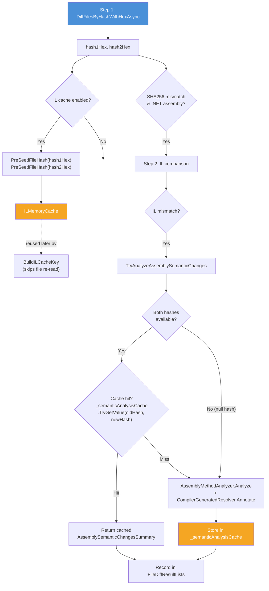

#### IL Cache Pre-Seeding

When IL cache is enabled, the hex-encoded SHA256 values (`hash1Hex`, `hash2Hex`) are seeded into `ILMemoryCache` via `PreSeedFileHash` immediately after `DiffFilesByHashWithHexAsync`. This avoids recomputing SHA256 during IL cache key construction (`BuildILCacheKey`), which would otherwise re-read the file from disk.

#### Semantic Analysis Cache

`TryAnalyzeAssemblySemanticChanges` uses a `ConcurrentDictionary<(string OldHash, string NewHash), AssemblySemanticChangesSummary?>` keyed by the same SHA256 pair. When the same old/new hash pair appears at multiple relative paths (e.g. the same DLL copied into several subdirectories), `AssemblyMethodAnalyzer.Analyze` runs only once and subsequent lookups return the cached instance.

Cache safety:
- `AssemblySemanticChangesSummary` is effectively immutable after construction: `Entries` is an `init`-only `IReadOnlyList<MemberChangeEntry>`, and all other properties (`TotalChanges`, `MaxImportance`) are computed from `Entries`.
- `CompilerGeneratedResolver.Annotate` runs inside `Analyze()` before the result enters the cache, so cached entries are fully annotated.
- When either hash is unavailable (`null`), the cache is bypassed and `Analyze` runs unconditionally.

### IL Line Split-and-Filter Optimization

`ILOutputService.SplitAndFilterIlLines` combines the `Split('\n')` and `Where(filter)` steps into a single pass, producing one `List<string>` directly instead of creating four intermediate lists.

## Source Style Notes

Keep internal formatting choices simple and local:
- Prefer interpolated strings for fixed-format messages that are only used once.
- Keep shared format templates only when the same message shape is intentionally reused in multiple places.
- Place domain-independent helpers under [`FolderDiffIL4DotNet.Core/`](../FolderDiffIL4DotNet.Core/) and keep [`FolderDiffIL4DotNet/Services`](../Services/) focused on folder-diff behavior.
- Promote cross-project byte-size and timestamp literals into [`FolderDiffIL4DotNet.Core/Common/CoreConstants.cs`](../FolderDiffIL4DotNet.Core/Common/CoreConstants.cs), while keeping app-specific literals in [`Common/Constants.cs`](../Common/Constants.cs). IL-domain string constants such as [`Constants.IL_MVID_LINE_PREFIX`](../Common/Constants.cs) belong in [`Common/Constants.cs`](../Common/Constants.cs) and must not be duplicated across service files.
- Avoid adding new `#region` blocks unless they solve a concrete readability problem that file structure and naming do not already solve.

## Architecture Overview

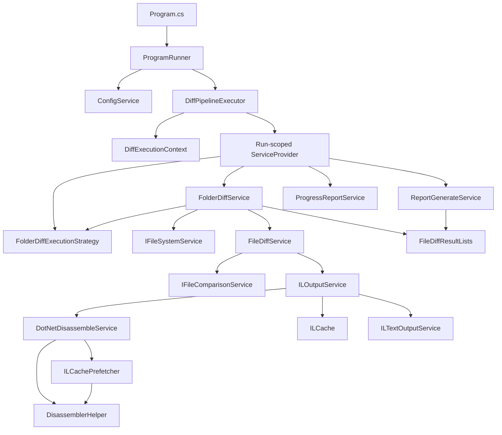

Design intent:
- [`Program.cs`](../Program.cs) stays minimal and owns only application-root service registration.
- [`ProgramRunner`](../ProgramRunner.cs) is the orchestration boundary for one console execution: CLI dispatch, argument validation, config loading, and exit-code mapping.
- [`DiffPipelineExecutor`](../Runner/DiffPipelineExecutor.cs) owns the diff execution pipeline: builds the scoped DI container, runs the folder diff, and generates all reports.
- [`DryRunExecutor`](../Runner/DryRunExecutor.cs) handles the `--dry-run` preview: enumerates files and displays statistics without running comparisons or generating reports.
- [`DiffExecutionContext`](../Services/DiffExecutionContext.cs) carries immutable run-specific paths and mode decisions.
- [`FolderDiffIL4DotNet.Core`](../FolderDiffIL4DotNet.Core/) is the reusable helper-library boundary for console rendering, diagnostics, filesystem helpers, and text sanitization with no folder-diff domain policy.
- Core pipeline services use constructor injection and interfaces instead of static mutable state or ad hoc object creation.
- [`IFileSystemService`](../Services/IFileSystemService.cs) and [`IFileComparisonService`](../Services/IFileComparisonService.cs) are the low-level seams that keep discovery/compare I/O unit-testable without changing the production decision tree. [`IFileSystemService.EnumerateFiles(...)`](../Services/IFileSystemService.cs) specifically preserves lazy discovery so large trees do not require an eager `string[]` snapshot before filtering.
- [`FolderDiffExecutionStrategy`](../Services/FolderDiffExecutionStrategy.cs) centralizes inclusion filtering, ignored-file recording, and auto-parallelism policy so those rules are no longer embedded directly inside [`FolderDiffService`](../Services/FolderDiffService.cs).
- [`FileDiffResultLists`](../Models/FileDiffResultLists.cs) is the run-scoped aggregation hub shared by diffing and reporting.
- [`DotNetDisassembleService`](../Services/DotNetDisassembleService.cs) is responsible for disassembly execution and cache hit/store tracking. IL-cache prefetch is delegated to [`ILCachePrefetcher`](../Services/ILCachePrefetcher.cs), which encapsulates the prefetch-only responsibility. Shared static helpers (command identification, candidate enumeration, executable path resolution) live in [`DisassemblerHelper`](../Services/DisassemblerHelper.cs) to avoid duplication between the two classes.
- [`FolderDiffService`](../Services/FolderDiffService.cs) keeps the pre-compute keep-alive spinner as a dedicated `CreateKeepAliveTask()` method so `PrecomputeIlCachesAsync()` focuses on orchestration rather than background-task lifecycle.

<a id="guide-en-execution-lifecycle"></a>
## Execution Lifecycle

### Startup Sequence

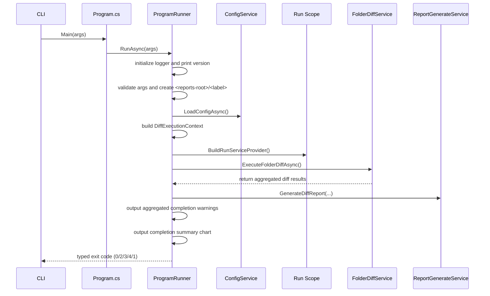

The diff phase returns [`FileDiffResultLists`](../Models/FileDiffResultLists.cs), which is then consumed by report generation and completion-warning output.

### What happens inside `RunAsync`

1. Parse CLI options (`--help`, `--version`, `--banner`, `--credits`, `--print-config`, `--validate-config`, `--clear-cache`, `--open-reports`, `--open-config`, `--open-logs`, `--no-pause`, `--config`, `--output`, `--threads`, `--no-il-cache`, `--skip-il`, `--no-timestamp-warnings`, `--creator`, `--creator-il-ignore-profile`, spinner options, `--bell`).
2. If `--help`, `--version`, `--banner`, or `--credits` is present, print and exit immediately with code `0` — no logger initialization occurs.
2a. If any of `--open-reports`, `--open-config`, or `--open-logs` is present, resolve the requested targets in declaration order (reports, config, logs), create missing directories, launch the platform file manager, and exit. The default roots are the user-local app-data `Reports/`, config, and `Logs/` locations unless `--output` or `--config` overrides apply. Path-resolution / directory-creation / launcher failures are converted to exit code `4` with stderr that includes the resolved target path (or unresolved placeholder) plus the exception type.
2b. If `--clear-cache` is present, run the interactive cache-deletion wizard. Read-only `.ilcache` files have their read-only attribute cleared before deletion so the clear operation uses the same semantics as the disk-cache layer.
2c. If `--print-config` is present (optionally combined with `--config <path>`), first reject CLI syntax errors such as unknown flags, invalid `--threads` values, or unknown `--creator-il-ignore-profile` names with exit code `2`. Otherwise load the effective configuration — resolved from the explicit path or, by default, from the user-local app-data `config.json` with bundled `config.json` fallback — apply all `FOLDERDIFF_*` environment variable overrides plus supported runtime CLI overrides, serialize the resulting builder as indented JSON to standard output without semantic validation, and exit with code `0`. Config-load errors, including malformed `--config` paths, exit with code `3`.
2d. If `--validate-config` is present, first reject CLI syntax errors such as unknown flags, invalid `--threads` values, or unknown `--creator-il-ignore-profile` names with exit code `2`. Otherwise load and semantically validate the configuration using that same resolution order after `FOLDERDIFF_*` environment-variable overrides but before runtime CLI overrides are applied, print `Configuration is valid.` on success, and exit with code `0`. Invalid JSON, semantic validation failures, missing files, and malformed `--config` paths all exit with code `3`.
3. Initialize logging and print application version.
4. Validate `old`, `new`, and `reportLabel` arguments. Unknown CLI flags surface here as exit code `2`.
5. Create `<reports-root>/<label>` early and fail if the label already exists. The default reports root is the user-local app-data `Reports/` directory unless `--output` overrides it.
6. Load the config file — from the path given to `--config` if supplied, otherwise by first checking the user-local app-data `config.json` and then falling back to [`AppContext.BaseDirectory`](https://learn.microsoft.com/en-us/dotnet/api/system.appcontext.basedirectory?view=net-8.0) / bundled `config.json` — and deserialize it into a mutable [`ConfigSettingsBuilder`](../Models/ConfigSettingsBuilder.cs). Immediately after deserialization, [`ConfigService.ApplyEnvironmentVariableOverrides`](../Services/ConfigService.cs) applies any `FOLDERDIFF_<PROPERTYNAME>` environment variable overrides (e.g. `FOLDERDIFF_MAXPARALLELISM=4`) to the builder.
7. Apply CLI overrides on top of the builder: `--threads` sets [`MaxParallelism`](../Models/ConfigSettingsBuilder.cs); `--no-il-cache` sets [`EnableILCache`](../Models/ConfigSettingsBuilder.cs) `= false`; `--skip-il` sets [`SkipIL`](../Models/ConfigSettingsBuilder.cs) `= true`; `--no-timestamp-warnings` sets [`ShouldWarnWhenNewFileTimestampIsOlderThanOldFileTimestamp`](../Models/ConfigSettingsBuilder.cs) `= false`. Then [`ConfigSettingsBuilder.Validate()`](../Models/ConfigSettingsBuilder.cs) is called; if any value is out of range, the run fails with exit code `3`. Finally, [`ConfigSettingsBuilder.Build()`](../Models/ConfigSettingsBuilder.cs) produces an immutable [`ConfigSettings`](../Models/ConfigSettings.cs) instance used for the remainder of the run.
8. Clear transient shared helpers such as [`TimestampCache`](../Services/Caching/TimestampCache.cs).
9. Compute [`DiffExecutionContext`](../Services/DiffExecutionContext.cs), including network-share decisions.
10. Build the run-scoped DI container.
11. Run the folder diff and finish progress display.
12. Generate [`diff_report.md`](samples/diff_report.md) from aggregated results.
13. Generate [`diff_report.html`](samples/diff_report.html) from aggregated results when [`ShouldGenerateHtmlReport`](../Models/ConfigSettings.cs) is `true` (default). The HTML file is a self-contained interactive review document with localStorage auto-save and a download function that bakes the current review state into a portable snapshot.
14. Convert the phase result into a process exit code: `0` on success, `2` for invalid CLI/input paths, `3` for configuration load/parse/validation failures, `4` for diff/report execution failures, and `1` only for unexpected internal errors.

The implementation keeps `RunAsync()` short by treating those steps as explicit phases and delegating each phase to focused private helpers.

Failure behavior:
- [`ProgramRunner`](../ProgramRunner.cs) now uses small typed step results at the application boundary instead of flattening every failure into one catch-all exit code.
- Argument validation, unknown flags, and missing input paths map to exit code `2`.
- [`ConfigService`](../Services/ConfigService.cs) failures such as a missing explicit config path, both default config candidates being absent, parse failures, config-read I/O errors, or settings that fail [`ConfigSettingsBuilder.Validate()`](../Models/ConfigSettingsBuilder.cs) map to exit code `3`.
- Diff execution and report-generation failures, including fatal IL comparison failures surfaced as [`InvalidOperationException`](https://learn.microsoft.com/en-us/dotnet/api/system.invalidoperationexception?view=net-8.0), map to exit code `4`.
- Exit code `1` is reserved for unexpected internal errors that escape the explicit phase classification.
- [`InvalidOperationException`](https://learn.microsoft.com/en-us/dotnet/api/system.invalidoperationexception?view=net-8.0) originating from IL comparison is treated as a fatal exception and stops the whole run.
- [`FolderDiffService.ExecuteFolderDiffAsync()`](../Services/FolderDiffService.cs) logs and rethrows expected runtime exceptions such as path-validation errors, [`DirectoryNotFoundException`](https://learn.microsoft.com/en-us/dotnet/api/system.io.directorynotfoundexception?view=net-8.0), [`IOException`](https://learn.microsoft.com/en-us/dotnet/api/system.io.ioexception?view=net-8.0), [`UnauthorizedAccessException`](https://learn.microsoft.com/en-us/dotnet/api/system.unauthorizedaccessexception?view=net-8.0), and [`NotSupportedException`](https://learn.microsoft.com/en-us/dotnet/api/system.notsupportedexception?view=net-8.0); only truly unexpected exceptions use the separate "unexpected error" log wording.
- The preflight write-permission check ([`CheckReportsParentWritableOrThrow`](../Runner/RunPreflightValidator.cs)) logs and re-throws both [`UnauthorizedAccessException`](https://learn.microsoft.com/en-us/dotnet/api/system.unauthorizedaccessexception?view=net-8.0) and [`IOException`](https://learn.microsoft.com/en-us/dotnet/api/system.io.ioexception?view=net-8.0) with cause-specific messages. No I/O error is silently swallowed.
- Read-only protection on output files remains best-effort and warning-only.

<a id="guide-en-di-layout"></a>
## Dependency Injection Layout

### Root container

Registered in [`Program.cs`](../Program.cs):
- [`ILoggerService`](../Services/ILoggerService.cs) -> [`LoggerService`](../Services/LoggerService.cs)
- [`ConfigService`](../Services/ConfigService.cs)
- [`ProgramRunner`](../ProgramRunner.cs)

This root container is intentionally small. It should not accumulate run-specific services.

### Run-scoped container

Registered in [`RunScopeBuilder.Build(...)`](../Runner/RunScopeBuilder.cs):
- Singletons inside the run scope
- [`IReadOnlyConfigSettings`](../Models/IReadOnlyConfigSettings.cs) (immutable [`ConfigSettings`](../Models/ConfigSettings.cs) built from [`ConfigSettingsBuilder`](../Models/ConfigSettingsBuilder.cs))
- [`DiffExecutionContext`](../Services/DiffExecutionContext.cs)
- [`ILoggerService`](../Services/ILoggerService.cs) (shared logger instance)
- Scoped services
- [`FileDiffResultLists`](../Models/FileDiffResultLists.cs)
- [`DotNetDisassemblerCache`](../Services/Caching/DotNetDisassemblerCache.cs)
- [`ILCache`](../Services/Caching/ILCache.cs) (nullable when disabled)
- [`ProgressReportService`](../Services/ProgressReportService.cs)
- [`ReportGenerateService`](../Services/ReportGenerateService.cs)
- [`HtmlReportGenerateService`](../Services/HtmlReportGenerateService.cs)
- [`AuditLogGenerateService`](../Services/AuditLogGenerateService.cs)
- [`SbomGenerateService`](../Services/SbomGenerateService.cs)
- [`IReportFormatter`](../Services/IReportFormatter.cs) / [`MarkdownReportFormatter`](../Services/ReportFormatters/MarkdownReportFormatter.cs), [`HtmlReportFormatter`](../Services/ReportFormatters/HtmlReportFormatter.cs), [`AuditLogReportFormatter`](../Services/ReportFormatters/AuditLogReportFormatter.cs), [`SbomReportFormatter`](../Services/ReportFormatters/SbomReportFormatter.cs)
- [`IFileSystemService`](../Services/IFileSystemService.cs) / [`FileSystemService`](../Services/FileSystemService.cs)
- [`IFolderDiffExecutionStrategy`](../Services/IFolderDiffExecutionStrategy.cs) / [`FolderDiffExecutionStrategy`](../Services/FolderDiffExecutionStrategy.cs)
- [`IFileComparisonService`](../Services/IFileComparisonService.cs) / [`FileComparisonService`](../Services/FileComparisonService.cs)
- [`IILTextOutputService`](../Services/ILOutput/IILTextOutputService.cs) / [`ILTextOutputService`](../Services/ILOutput/ILTextOutputService.cs)
- [`IDotNetDisassembleService`](../Services/IDotNetDisassembleService.cs) / [`DotNetDisassembleService`](../Services/DotNetDisassembleService.cs)
- [`IILOutputService`](../Services/IILOutputService.cs) / [`ILOutputService`](../Services/ILOutputService.cs)
- [`IFileDiffService`](../Services/IFileDiffService.cs) / [`FileDiffService`](../Services/FileDiffService.cs)
- [`IFolderDiffService`](../Services/IFolderDiffService.cs) / [`FolderDiffService`](../Services/FolderDiffService.cs)
- [`IDisassemblerProvider`](../FolderDiffIL4DotNet.Plugin.Abstractions/IDisassemblerProvider.cs) / [`DotNetDisassemblerProvider`](../Services/DotNetDisassemblerProvider.cs)

Why this matters:
- Each execution gets a newly created [`FileDiffResultLists`](../Models/FileDiffResultLists.cs) for diff results plus newly created disassembler-related state and caches for keeping old/new on the same disassembler, so nothing is carried over from the previous run.
- Tests can replace interfaces without mutating static fields.
- Runtime path decisions are explicit and immutable once the run starts.

## Core Responsibilities

| File | Responsibility | Notes |
| --- | --- | --- |
| [`Program.cs`](../Program.cs) | Application entry point | Must remain thin |
| [`ProgramRunner.cs`](../ProgramRunner.cs) | CLI dispatch, argument validation, config loading, exit-code mapping | Help text in [`ProgramRunner.HelpText.cs`](../Runner/ProgramRunner.HelpText.cs), config loading/validation in [`ProgramRunner.Config.cs`](../Runner/ProgramRunner.Config.cs), interactive wizard with drag-and-drop path normalization (`NormalizeDragDropPath`) in [`ProgramRunner.Wizard.cs`](../Runner/ProgramRunner.Wizard.cs), folder-open commands in [`ProgramRunner.OpenFolder.cs`](../Runner/ProgramRunner.OpenFolder.cs) |
| [`Runner/CliOverrideApplier.cs`](../Runner/CliOverrideApplier.cs) | CLI option → config builder override application | Delegates spinner theme logic to `SpinnerThemes` |
| [`Runner/SpinnerThemes.cs`](../Runner/SpinnerThemes.cs) | Spinner animation theme definitions and application | 7 themes (coffee, beer, matcha, whisky, wine, ramen, sushi) + random selection |
| [`Runner/DiffPipelineExecutor.cs`](../Runner/DiffPipelineExecutor.cs) | Diff execution pipeline and report generation | Builds scoped DI container, runs diff, resolves the optional review-checklist snapshot once per run, then generates Markdown/HTML/audit-log reports |
| [`Runner/DryRunExecutor.cs`](../Runner/DryRunExecutor.cs) | `--dry-run` pre-execution preview | Enumerates files, counts union/assembly candidates, shows extension breakdown without running comparison |
| [`FolderDiffIL4DotNet.Core/`](../FolderDiffIL4DotNet.Core/) | Reusable console/diagnostics/IO/text helpers | No folder-diff domain logic |
| [`FolderDiffIL4DotNet.Core/Text/EncodingDetector.cs`](../FolderDiffIL4DotNet.Core/Text/EncodingDetector.cs) | File encoding auto-detection (BOM, UTF-8 validation, ANSI fallback) | Used by inline diff to correctly read non-UTF-8 files (e.g. Shift_JIS); requires `System.Text.Encoding.CodePages` |
| [`Services/DiffExecutionContext.cs`](../Services/DiffExecutionContext.cs) | Immutable run paths and network-mode decisions | No mutable state |
| [`Services/FolderDiffService.cs`](../Services/FolderDiffService.cs) | Folder-diff orchestration and result routing | Owns progress and added/removed routing |
| [`Services/FolderDiffExecutionStrategy.cs`](../Services/FolderDiffExecutionStrategy.cs) | Discovery filtering and auto-parallelism policy | Applies ignored extensions and network-aware auto parallelism |
| [`Services/IFileSystemService.cs`](../Services/IFileSystemService.cs) + [`Services/FileSystemService.cs`](../Services/FileSystemService.cs) | Discovery/output filesystem abstraction | Enables folder-level unit tests and lazy file discovery |
| [`Services/FileDiffService.cs`](../Services/FileDiffService.cs) | Per-file decision tree | SHA256 -> IL -> text -> fallback |
| [`Services/IFileComparisonService.cs`](../Services/IFileComparisonService.cs) + [`Services/FileComparisonService.cs`](../Services/FileComparisonService.cs) | Per-file compare/detect I/O abstraction | Enables file-level unit tests |
| [`Services/ILOutputService.cs`](../Services/ILOutputService.cs) | IL compare flow, line filtering, block-aware order-independent comparison, optional IL dump writing, IL filter string safety validation | Enforces same disassembler identity; falls back to block-level multiset comparison when line order differs; `ValidateILFilterStrings` warns on overly short filter strings (< 4 chars) |
| [`Services/ILOutput/ILBlockParser.cs`](../Services/ILOutput/ILBlockParser.cs) | Parses IL disassembly output into logical blocks (methods, classes, properties) | Used by `ILOutputService.BlockAwareSequenceEqual` for order-independent comparison |
| [`Services/AssemblyMethodAnalyzer.cs`](../Services/AssemblyMethodAnalyzer.cs) | Method-level change detection via `System.Reflection.Metadata` | Best-effort; returns `null` on failure (optional `onError` callback reports exception details). Generic signatures are fully resolved with arity suffix stripping, nested type reference resolution, and `TypeSpecification` decoding for generic base types/interfaces. Detects type/method/property/field additions, removals, and modifications (access modifier changes, modifier changes, type changes, IL body changes). Each entry is auto-classified by [`ChangeImportanceClassifier`](../Services/ChangeImportanceClassifier.cs) |
| [`Services/CompilerGeneratedResolver.cs`](../Services/CompilerGeneratedResolver.cs) | Annotates compiler-generated types/members with user-authored origins | Resolves async state machines, display classes, lambda methods, backing fields, local functions, record clone/synthesized members to human-readable descriptions; called as a post-processing step in `AssemblyMethodAnalyzer.Analyze` |
| [`Services/ChangeImportanceClassifier.cs`](../Services/ChangeImportanceClassifier.cs) | Rule-based importance classifier for `MemberChangeEntry` | Assigns `High` / `Medium` / `Low` [`ChangeImportance`](../Models/ChangeImportance.cs) based on change type, access modifiers, and arrow-notation field changes |
| [`Models/ChangeImportance.cs`](../Models/ChangeImportance.cs) | Change importance enum | `Low=0`, `Medium=1`, `High=2`; used by `MemberChangeEntry.Importance` and report display |
| [`Services/ChangeTagClassifier.cs`](../Services/ChangeTagClassifier.cs) | Heuristic change-pattern classifier | Infers [`ChangeTag`](../Models/ChangeTag.cs) labels (Extract, Inline, Move, Rename, Signature, Access, BodyEdit, DepUpdate, +Method, -Method, +Type, -Type) from semantic analysis and dependency data; called by [`FileDiffService`](../Services/FileDiffService.cs) after semantic/dependency analysis |
| [`Models/ChangeTag.cs`](../Models/ChangeTag.cs) | Change tag enum | 12 values representing estimated change patterns; displayed in "Estimated Change" report column |
| [`Services/DotNetDisassembleService.cs`](../Services/DotNetDisassembleService.cs) | Tool probing, disassembly execution, cache hit/store tracking, blacklist handling | Central tool boundary; delegates prefetch to [`ILCachePrefetcher`](../Services/ILCachePrefetcher.cs) |
| [`Services/ILCachePrefetcher.cs`](../Services/ILCachePrefetcher.cs) | IL-cache prefetch (pre-hit verification for all candidate command/arg patterns) | Extracted from [`DotNetDisassembleService`](../Services/DotNetDisassembleService.cs); owns its own hit counter |
| [`Services/DisassemblerHelper.cs`](../Services/DisassemblerHelper.cs) | Shared static helpers: command identification, candidate enumeration, executable path resolution, availability probing | Used by both [`DotNetDisassembleService`](../Services/DotNetDisassembleService.cs) and [`ILCachePrefetcher`](../Services/ILCachePrefetcher.cs); `ProbeAllCandidates()` returns [`DisassemblerProbeResult`](../Models/DisassemblerProbeResult.cs) list for report header; no instance state |
| [`Models/DisassemblerProbeResult.cs`](../Models/DisassemblerProbeResult.cs) | Disassembler availability probe result record | `ToolName`, `Available`, `Version`, `Path`; stored in [`FileDiffResultLists.DisassemblerAvailability`](../Models/FileDiffResultLists.cs) |
| [`Services/DisassemblerBlacklist.cs`](../Services/DisassemblerBlacklist.cs) | Per-tool fail-count tracking and configurable TTL blacklist | Thread-safe [`ConcurrentDictionary`](https://learn.microsoft.com/en-us/dotnet/api/system.collections.concurrent.concurrentdictionary-2?view=net-8.0); TTL defaults to [`DisassemblerBlacklistTtlMinutes`](../Models/ConfigSettings.cs) from config |
| [`Services/Caching/ILCache.cs`](../Services/Caching/ILCache.cs) | Public cache facade and coordinator for IL artifacts | Delegates memory/disk details to focused cache components |
| [`Services/Caching/ILMemoryCache.cs`](../Services/Caching/ILMemoryCache.cs) | In-memory IL/SHA256 cache with LRU and TTL | Owns transient retention policy |
| [`Services/Caching/ILDiskCache.cs`](../Services/Caching/ILDiskCache.cs) | Disk persistence and quota enforcement for IL cache files | Owns cache-file I/O and trimming; recoverable warnings retain cache directory and cache-key length context |
| [`Services/Caching/DotNetDisassemblerCache.cs`](../Services/Caching/DotNetDisassemblerCache.cs) | Disassembler version string cache | Avoids repeated process-launch overhead for version queries |
| [`Services/Caching/TimestampCache.cs`](../Services/Caching/TimestampCache.cs) | In-memory file last-write timestamp cache | Static; cleared per run cycle to reduce I/O |
| [`Services/ReviewChecklistLoader.cs`](../Services/ReviewChecklistLoader.cs) | Optional review checklist snapshot loader | Resolves user-local `HtmlReport/checklist.json` once per run, normalizes multiline items, and shares the resulting snapshot between Markdown/HTML report generation |
| [`Services/ReportGenerationContext.cs`](../Services/ReportGenerationContext.cs) | Immutable parameter bag for report generation services | Eliminates parameter duplication at `ProgramRunner` boundary |
| [`Services/ReportGenerateService.cs`](../Services/ReportGenerateService.cs) | Markdown report generation | Reads [`FileDiffResultLists`](../Models/FileDiffResultLists.cs) only; iterates `_sectionWriters` via [`IReportSectionWriter`](../Services/IReportSectionWriter.cs) |
| [`Services/IReportSectionWriter.cs`](../Services/IReportSectionWriter.cs) + [`Services/ReportWriteContext.cs`](../Services/ReportWriteContext.cs) | Per-section report writing interface and context bag | 10 private nested implementations inside [`ReportGenerateService`](../Services/ReportGenerateService.cs) |
| [`Services/HtmlReportGenerateService.cs`](../Services/HtmlReportGenerateService.cs) | Interactive HTML review report generation | Reads [`FileDiffResultLists`](../Models/FileDiffResultLists.cs) only; produces a self-contained [`diff_report.html`](samples/diff_report.html) with checkboxes, text inputs, localStorage auto-save, and download function; uses CSS custom properties (`var(--color-*)`) and utility classes instead of inline styles for theme-aware rendering; supports automatic dark mode via `prefers-color-scheme`; "Download as reviewed" computes SHA256 of the reviewed HTML via Web Crypto API, embeds the hash for self-verification, downloads a companion `.sha256` verification file, and adds a "Verify integrity" button to the reviewed banner; recoverable inline-diff warnings retain whether the skipped source was `TextMismatch` or `ILMismatch`; skipped when [`ShouldGenerateHtmlReport`](../Models/ConfigSettings.cs) is `false` |
| [`Services/AuditLogGenerateService.cs`](../Services/AuditLogGenerateService.cs) | Structured JSON audit log generation | Reads [`FileDiffResultLists`](../Models/FileDiffResultLists.cs) and computes SHA256 integrity hashes of `diff_report.md` / `diff_report.html`; produces [`audit_log.json`](samples/audit_log.json); recoverable warnings retain the reports folder and skipped-entry root path for triage; skipped when [`ShouldGenerateAuditLog`](../Models/ConfigSettings.cs) is `false` |
| [`Services/SbomGenerateService.cs`](../Services/SbomGenerateService.cs) | SBOM (Software Bill of Materials) generation | Extracts component list from [`FileDiffResultLists`](../Models/FileDiffResultLists.cs) with SHA256 hashes and diff status; outputs CycloneDX 1.5 JSON (`sbom.cdx.json`) or SPDX 2.3 JSON (`sbom.spdx.json`); recoverable warnings retain output format plus old/new folder context for skipped components; skipped when [`ShouldGenerateSbom`](../Models/ConfigSettings.cs) is `false` |
| [`Models/AuditLogEntry.cs`](../Models/AuditLogEntry.cs) | Audit log data models | [`AuditLogRecord`](../Models/AuditLogEntry.cs) (top-level), [`AuditLogFileEntry`](../Models/AuditLogEntry.cs) (per-file), [`AuditLogSummary`](../Models/AuditLogEntry.cs) (counts) |
| [`Models/SbomModels.cs`](../Models/SbomModels.cs) | SBOM data models | CycloneDX 1.5 models ([`CycloneDxBom`](../Models/SbomModels.cs), [`CycloneDxComponent`](../Models/SbomModels.cs)), SPDX 2.3 models ([`SpdxDocument`](../Models/SbomModels.cs), [`SpdxPackage`](../Models/SbomModels.cs)), [`SbomFormat`](../Models/SbomModels.cs) enum |
| [`Services/ProgressReportService.cs`](../Services/ProgressReportService.cs) | Console progress display, phase tracking, elapsed time logging | Phase-based progress numbering (`[current/total]`), keep-alive spinner throttling, fixed-width ETA rendering (`ETA HH:mm (+00 h 12 m)`), dispose-time final phase logging |
| [`Services/LoggerService.cs`](../Services/LoggerService.cs) | File and console logging with text/JSON format support | W3C Trace Context (`traceId`/`spanId`), old log file cleanup with retention-context warnings, read-only log file handling, concurrent call safety |
| [`Services/NuGetVulnerabilityService.cs`](../Services/NuGetVulnerabilityService.cs) | NuGet V3 vulnerability API integration | Per-session cached index/page download, per-package old/new version vulnerability checking, advisory deduplication, and warning logs that retain the index URL plus entry/package-count context on best-effort failures |
| [`Models/FileDiffResultLists.cs`](../Models/FileDiffResultLists.cs) | Thread-safe run results and metadata | Shared aggregation object; split into partial files: [`FileDiffResultLists.ComparisonResults.cs`](../Models/FileDiffResultLists.ComparisonResults.cs) (diff details, disassembler labels, ignored files), [`FileDiffResultLists.Metadata.cs`](../Models/FileDiffResultLists.Metadata.cs) (semantic changes, dependency changes, warnings, disassembler info) |

<a id="guide-en-comparison-pipeline"></a>
## Comparison Pipeline

### Folder-level routing

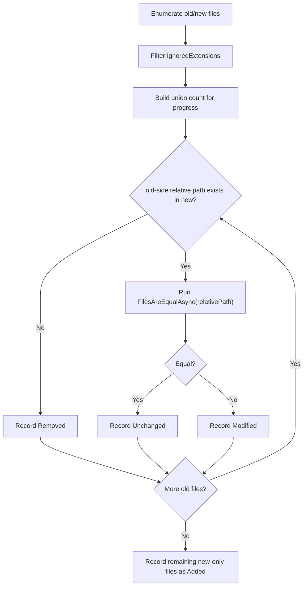

Implementation notes:
- [`FolderDiffService.ExecuteFolderDiffAsync()`](../Services/FolderDiffService.cs) clears run-scoped aggregates, then asks [`FolderDiffExecutionStrategy`](../Services/FolderDiffExecutionStrategy.cs) to enumerate old/new files with [`IgnoredExtensions`](../Models/ConfigSettings.cs) already applied and to compute progress from the union of relative paths.
- Discovery now flows through [`IFileSystemService.EnumerateFiles(...)`](../Services/IFileSystemService.cs), so ignored extensions are filtered while entries are streamed instead of first materializing the entire directory tree into an array.
- `PrecomputeIlCachesAsync()` runs before per-file classification so disassembler/cache warm-up does not distort the later decision path. It now streams distinct old/new absolute paths in configurable batches instead of building one extra all-files list first, which reduces peak memory pressure on very large trees.
- The old side is the driving set. Missing matches in `new` become `Removed`, while leftovers in `remainingNewFilesAbsolutePathHashSet` become `Added` after old-side traversal completes.
- Parallel mode only changes processing order. Because each relative path is removed from the remaining-new set before the expensive compare starts, the final classification rules are the same as in sequential execution.
- `Unchanged` versus `Modified` is decided only from the boolean returned by `FilesAreEqualAsync(relativePath, maxParallel)`. The detail reason is recorded separately in [`FileDiffResultLists`](../Models/FileDiffResultLists.cs).

### Per-file decision tree

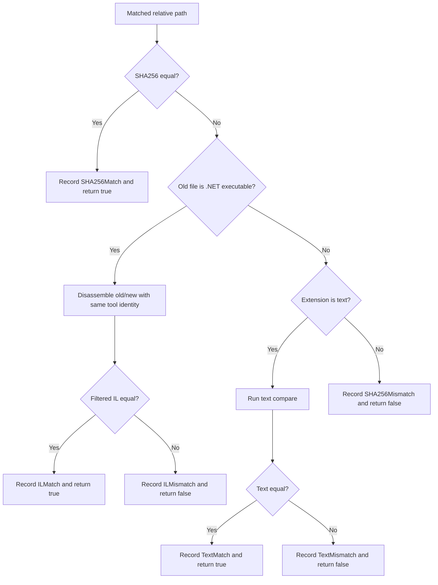

Rules that are easy to break:
- The first successful classification for a file is the final classification for that file.
- IL comparison is only attempted after SHA256 mismatch and only for files detected as .NET executables.
- IL comparison ignores lines starting with [`Constants.IL_MVID_LINE_PREFIX`](../Common/Constants.cs) (`// MVID:`) unconditionally because they are disassembler-emitted Module Version ID metadata and can change on rebuild without reflecting an executable IL change.
- Additional IL ignore rules are substring-based and case-sensitive (`StringComparison.Ordinal`).
- IL comparison must use the same disassembler identity and version label for old/new.
- Text comparison can fall back from chunk-parallel mode to sequential mode on error, but only because chunk-parallel exceptions are allowed to bubble to `FilesAreEqualAsync(...)`.

Per-file mechanics:
- [`FileDiffService.FilesAreEqualAsync(...)`](../Services/FileDiffService.cs) uses the old-side absolute path for `.NET executable` detection, file extension lookup, and threshold decisions.
- In normal execution, `.NET executable` detection, SHA256/text comparison, file length lookup, and chunk reads all go through [`IFileComparisonService`](../Services/IFileComparisonService.cs). This keeps [`FileDiffService`](../Services/FileDiffService.cs) from depending directly on the concrete comparison implementation and lets tests replace [`IFileComparisonService`](../Services/IFileComparisonService.cs) with a mock or stub. The default implementation, [`FileComparisonService`](../Services/FileComparisonService.cs), delegates those operations to [`DotNetDetector`](../FolderDiffIL4DotNet.Core/Diagnostics/DotNetDetector.cs) and [`FileComparer`](../FolderDiffIL4DotNet.Core/IO/FileComparer.cs).
- Expected vs. unexpected `FileDiffService` failures are both rethrown, but the error log also preserves the relative path, the last comparison stage (`BeforeCompare` hooks / SHA256 / IL / text / `AfterCompare` hooks), `SkipIL`, and `MaxParallel`. This is diagnostic context only; the classification flow is unchanged.
- [`DotNetDetector.DetectDotNetExecutable(...)`](../FolderDiffIL4DotNet.Core/Diagnostics/DotNetDetector.cs) distinguishes `NotDotNetExecutable` from `Failed`; [`FileDiffService`](../Services/FileDiffService.cs) logs a warning on `Failed` before skipping the IL path.
- [`DotNetDisassemblerProvider`](../Services/DotNetDisassemblerProvider.cs) also treats recoverable managed-assembly detection failures and delegated disassembly failures as warning-level diagnostics, including provider display name plus file extension, then returns `false` / a failed `DisassemblyResult` so other providers or non-IL paths can continue.
- Once SHA256 matches, the code records `SHA256Match` and returns immediately; no IL comparison or text comparison runs after that.
- The IL path delegates to [`ILOutputService.DiffDotNetAssembliesAsync(...)`](../Services/ILOutputService.cs), which disassembles old/new via `DisassemblePairWithSameDisassemblerAsync(...)`, normalizes the comparison label, filters lines, optionally writes filtered IL text, and returns both equality and the disassembler label.
- [`RealDisassemblerE2ETests`](../FolderDiffIL4DotNet.Tests/Services/RealDisassemblerE2ETests.cs) covers this boundary with the preferred tool path: it builds the same tiny class library twice with `Deterministic=false`, confirms the DLL bytes differ, and then verifies that [`dotnet-ildasm`](https://www.nuget.org/packages/dotnet-ildasm/) still returns `ILMatch` after filtering.
- `BuildComparisonDisassemblerLabel(...)` is part of correctness. If old/new produce different tool identities or version labels, the code rejects that comparison and raises [`InvalidOperationException`](https://learn.microsoft.com/en-us/dotnet/api/system.invalidoperationexception?view=net-8.0).
- `ShouldExcludeIlLine(...)` always strips lines starting with [`Constants.IL_MVID_LINE_PREFIX`](../Common/Constants.cs) (`// MVID:`). If [`ShouldIgnoreILLinesContainingConfiguredStrings`](../Models/ConfigSettings.cs) is `true`, it also strips any substring from [`ILIgnoreLineContainingStrings`](../Models/ConfigSettings.cs) after trimming and deduplicating the configured values, using `StringComparison.Ordinal`.
- Files that are not handled by IL comparison and whose extension is included in [`TextFileExtensions`](../Models/ConfigSettings.cs) are compared as text files. At that point, the code converts [`TextDiffParallelThresholdKilobytes`](../Models/ConfigSettings.cs) and [`TextDiffChunkSizeKilobytes`](../Models/ConfigSettings.cs) into effective byte counts and uses those values to choose the comparison method.
- If [`OptimizeForNetworkShares`](../Models/ConfigSettings.cs) is enabled, the code avoids chunk-parallel reads on remote storage and always uses sequential `DiffTextFilesAsync(...)`, regardless of file size. In local-optimized mode, it uses the old-side file size: below [`TextDiffParallelThresholdKilobytes`](../Models/ConfigSettings.cs) it stays sequential, and at or above the threshold it splits the file into fixed-size chunks based on [`TextDiffChunkSizeKilobytes`](../Models/ConfigSettings.cs) and runs `DiffTextFilesParallelAsync(...)`.
- If [`TextDiffParallelMemoryLimitMegabytes`](../Models/ConfigSettings.cs) is greater than `0`, [`FileDiffService`](../Services/FileDiffService.cs) treats it as an additional buffer budget for chunk-parallel text diff, logs the current managed-heap size, and reduces the effective worker count or falls back to sequential comparison when that budget cannot cover the requested parallelism.
- If chunk-parallel text comparison throws [`ArgumentOutOfRangeException`](https://learn.microsoft.com/en-us/dotnet/api/system.argumentoutofrangeexception?view=net-8.0), [`IOException`](https://learn.microsoft.com/en-us/dotnet/api/system.io.ioexception?view=net-8.0), [`UnauthorizedAccessException`](https://learn.microsoft.com/en-us/dotnet/api/system.unauthorizedaccessexception?view=net-8.0), or [`NotSupportedException`](https://learn.microsoft.com/en-us/dotnet/api/system.notsupportedexception?view=net-8.0), the code logs a warning and falls back to sequential `DiffTextFilesAsync(...)`. Because of that fallback, `DiffTextFilesParallelAsync(...)` must not swallow those exceptions and replace them with `false`.
- Files that are neither IL-comparison targets nor text-comparison targets end at `SHA256Mismatch` when SHA256 differs. `SHA256Mismatch` is also part of the aggregated end-of-run warnings, and the report writes that warning in the final `Warnings` section, with its detail table (`[ ! ] Modified Files — SHA256Mismatch (Manual Review Recommended)`) placed immediately below the warning message. Each warning message in the `Warnings` section is immediately followed by its corresponding detail table (interleaved layout). There is no deeper generic binary diff step today.
- For files classified as **modified**, if [`ShouldWarnWhenNewFileTimestampIsOlderThanOldFileTimestamp`](../Models/ConfigSettings.cs) is `true` and the new-side last-modified time is older than the old-side last-modified time, the code records a timestamp-regression warning. The check is performed only after `FilesAreEqualAsync` returns `false`; unchanged files are never evaluated. That warning is emitted in the aggregated console output at the end of the run and also written after the `SHA256Mismatch` warning in the report's final `Warnings` section as a list of files with regressed timestamps.

Failure handling:
- [`InvalidOperationException`](https://learn.microsoft.com/en-us/dotnet/api/system.invalidoperationexception?view=net-8.0) thrown during IL comparison is logged and intentionally rethrown. This treats IL tool mismatches or setup problems as fatal exceptions and stops the whole run.
- Failures from [`DotNetDetector.DetectDotNetExecutable(...)`](../FolderDiffIL4DotNet.Core/Diagnostics/DotNetDetector.cs) are not treated as fatal exceptions. The code logs a warning, skips IL comparison only, and then continues into text comparison or `SHA256Mismatch` handling.
- [`FileNotFoundException`](https://learn.microsoft.com/en-us/dotnet/api/system.io.filenotfoundexception?view=net-8.0) thrown by `FilesAreEqualAsync(...)` is caught in [`FolderDiffService`](../Services/FolderDiffService.cs) when a new-side file is deleted after enumeration but before comparison. The file is classified as `Removed`, a warning is logged, and traversal continues. This is distinct from [`IOException`](https://learn.microsoft.com/en-us/dotnet/api/system.io.ioexception?view=net-8.0) thrown during enumeration (for example a symlink loop), which is rethrown and stops the entire run.
- `FilesAreEqualAsync(...)` also treats [`DirectoryNotFoundException`](https://learn.microsoft.com/en-us/dotnet/api/system.io.directorynotfoundexception?view=net-8.0), [`IOException`](https://learn.microsoft.com/en-us/dotnet/api/system.io.ioexception?view=net-8.0), [`UnauthorizedAccessException`](https://learn.microsoft.com/en-us/dotnet/api/system.unauthorizedaccessexception?view=net-8.0), and [`NotSupportedException`](https://learn.microsoft.com/en-us/dotnet/api/system.notsupportedexception?view=net-8.0) as expected runtime failures: it logs them with both old/new absolute paths and rethrows without changing the exception type.
- Other unexpected exceptions are logged from inside `FilesAreEqualAsync(...)` with separate "unexpected error" wording and then rethrown to the caller.
- `PrecomputeIlCachesAsync()`, disk-cache eviction cleanup, and post-write read-only protection are best-effort operations. They log warnings and continue because the main comparison result or already-written report remains usable.
- Temporary ASCII copies and ilspy temp-output files created by [`DotNetDisassembleService`](../Services/DotNetDisassembleService.cs) are also cleaned up on a best-effort basis. If deletion leaves the path behind or even the existence probe fails recoverably, the service logs a warning rather than changing the comparison result.
- **Use exception filters to consolidate identical catch blocks** — When multiple `catch` blocks perform the same action (e.g. all call `CreateFailureResult` or all log the same warning), merge them with an exception filter (`catch (Exception ex) when (ex is X or Y or Z)`). This reduces code duplication without changing runtime semantics.

- Even when you need to add more context, do not wrap the original exception in a new generic [`Exception`](https://learn.microsoft.com/en-us/dotnet/api/system.exception?view=net-8.0). Log the original exception and use `throw;` so the original exception type and stack trace are preserved.

Avoid:

```csharp
catch (Exception ex)
{
    throw new Exception($"Failed while diffing '{fileRelativePath}'.", ex);
}
```

Prefer:

```csharp
catch (Exception ex)
{
    _logger.LogMessage(
        AppLogLevel.Error,
        $"An error occurred while diffing '{file1AbsolutePath}' and '{file2AbsolutePath}'.",
        shouldOutputMessageToConsole: true,
        ex);
    throw;
}
```

- The per-file detail recorded in [`FileDiffResultLists`](../Models/FileDiffResultLists.cs) and the bool returned from `FilesAreEqualAsync(...)` must describe the same outcome. [`FolderDiffService`](../Services/FolderDiffService.cs) uses the bool return value to classify the file as `Unchanged` or `Modified`, while the report uses the detail result to show whether the reason was `SHA256Match`, `ILMismatch`, `TextMatch`, and so on. If code records `ILMismatch` but returns `true`, for example, the file would be listed under `Unchanged` while the detailed reason says mismatch, which makes the result internally inconsistent.

## Result Model and Reporting Specification

[`FileDiffResultLists`](../Models/FileDiffResultLists.cs) stores:
- Discovery lists for old/new files
- Final buckets for `Unchanged`, `Added`, `Removed`, and `Modified`
- Per-file detail results: `SHA256Match`, `ILMatch`, `TextMatch`, `SHA256Mismatch`, `ILMismatch`, `TextMismatch`
- Ignored file locations
- Timestamp-regression warnings for files whose `new` last-modified time is older than `old`
- Disassembler labels used during IL comparison
- Disassembler availability probe results (`DisassemblerAvailability`) for the report header

**Disassembler Availability table — edge cases:**
`DisassemblerHelper.ProbeAllCandidates()` is called **unconditionally** in [`DiffPipelineExecutor.ExecuteScopedRunAsync()`](../Runner/DiffPipelineExecutor.cs) before any file comparison begins, regardless of file types or the `SkipIL` setting. The probed results are stored in `FileDiffResultLists.DisassemblerAvailability` and used by both report generators.

| Scenario | Probe runs? | Table shown? | Content |
| --- | --- | --- | --- |
| Normal run with .NET assemblies | Yes | Yes | Each tool shows Yes/No + version |
| All files are text (no .dll/.exe) | Yes | Yes | Table still appears; IL comparison is simply not attempted for any file |
| `SkipIL = true` | Yes | Yes | Table still appears; IL comparison is bypassed during diff |
| No disassembler tools available | Yes | Yes | All tools show "No" (red) and "N/A" for version |
| `DisassemblerAvailability` is null or empty | N/A | No | Guard check `if (probeResults == null \|\| probeResults.Count == 0) return;` suppresses output |

In practice, `ProbeAllCandidates()` always returns a non-empty list because the candidate set is hard-coded. The null/empty guard exists for defensive safety and is covered by tests (`GenerateDiffReport_HeaderOmitsAvailabilityTable_WhenProbeResultsAreNull` / `GenerateDiffReportHtml_HeaderOmitsAvailabilityTable_WhenProbeResultsAreNull`).

The nested [`DiffSummaryStatistics`](../Models/FileDiffResultLists.cs) sealed record (`AddedCount`, `RemovedCount`, `ModifiedCount`, `UnchangedCount`, `IgnoredCount`) and the `SummaryStatistics` computed property provide a single consistent snapshot of the five bucket counts. [`ReportGenerateService`](../Services/ReportGenerateService.cs) reads `SummaryStatistics` once per report to write the summary section, so callers do not need to access each collection individually.

[`ReportGenerateService`](../Services/ReportGenerateService.cs) depends on these assumptions:
- `ResetAll()` must happen before any new run populates the instance.
- The detail-result [`Dictionary`](https://learn.microsoft.com/en-us/dotnet/api/system.collections.generic.dictionary-2?view=net-8.0) must not contain stale entries left over from a previous run.
- IL tool labels are only present for IL-based comparisons.
- Report generation reads execution results only and must not start new comparisons.
- **Table sort order**: Unchanged Files rows are sorted by diff-detail result (`SHA256Match` → `ILMatch` → `TextMatch`), then by File Path ascending. Modified Files rows (and the Timestamps Regressed warning table) are sorted by diff-detail result (`TextMismatch` → `ILMismatch` → `SHA256Mismatch`), then by Change Importance (`High` → `Medium` → `Low`), then by File Path ascending. The SHA256Mismatch warning table lists files alphabetically by path. This applies to both Markdown and HTML reports.
- **Per-section column visibility (Markdown vs HTML)**: In the Markdown report, unnecessary columns are removed outright (e.g. Added/Removed tables have 3 columns: Status, File Path, Timestamp; Ignored/SHA256Mismatch/Timestamps Regressed tables have 4 columns without Disassembler). In the HTML report, all tables retain all 8 columns in the DOM to keep cross-table column-width synchronization stable — [`syncTableWidths()`](../Services/HtmlReport/js/diff_report_layout.js) calculates each table's total width from its `<colgroup>` `<col>` elements, and the resize-handle drag logic updates CSS custom properties shared across tables. Columns that should be visually hidden are marked via CSS classes on the `<table>` element (`hide-disasm`, `hide-col6`), which set `width: 0`, `visibility: hidden`, and `border-color: transparent` on the corresponding `<col>`, `<th>` (`.col-diff-hd` / `.col-disasm-hd`), and `<td>` (`.col-diff` / `.col-disasm`) elements. `syncTableWidths()` skips hidden columns when summing widths so that hidden-column tables are correctly narrower. This approach avoids the instability caused by different tables having different numbers of `<col>` elements, different `colspan` values for inline-diff rows, and conditional rendering logic in the helper methods.

<a id="guide-en-config-runtime"></a>
## Configuration and Runtime Modes

[`ConfigSettings`](../Models/ConfigSettings.cs) is the single source of truth for defaults. [`config.json`](../config.json) is an override file, so omitted keys keep the defaults defined in code, and `null` collection/path values are normalized back to those defaults. When `--config` is omitted, [`ConfigService`](../Services/ConfigService.cs) resolves the effective file by checking the user-local app-data `config.json` first and the bundled `config.json` next to the executable second. After loading, the mutable [`ConfigSettingsBuilder`](../Models/ConfigSettingsBuilder.cs) already includes `FOLDERDIFF_*` environment-variable overrides. Normal diff runs then apply runtime CLI overrides and call [`ConfigSettingsBuilder.Validate()`](../Models/ConfigSettingsBuilder.cs) before [`ConfigSettingsBuilder.Build()`](../Models/ConfigSettingsBuilder.cs) produces the immutable runtime settings object. `--validate-config` validates that same builder before runtime CLI overrides are applied, while `--print-config` prints the builder after supported CLI overrides without semantic validation so diagnostically invalid effective configs can still be inspected. If semantic validation fails, the ProgramRunner config-build / validation step surfaces [`InvalidDataException`](https://learn.microsoft.com/en-us/dotnet/api/system.io.invaliddataexception?view=net-8.0) with a message that lists each invalid setting, and the run exits with code `3`. Validated constraints: [`MaxLogGenerations`](../Models/ConfigSettings.cs) >= `1`; [`TextDiffParallelThresholdKilobytes`](../Models/ConfigSettings.cs) >= `1`; [`TextDiffChunkSizeKilobytes`](../Models/ConfigSettings.cs) >= `1`; [`InlineDiffContextLines`](../Models/ConfigSettings.cs) >= `0`; [`ILCacheMaxMemoryMegabytes`](../Models/ConfigSettings.cs) >= `0`; [`TextDiffChunkSizeKilobytes`](../Models/ConfigSettings.cs) < [`TextDiffParallelThresholdKilobytes`](../Models/ConfigSettings.cs); and [`SpinnerFrames`](../Models/ConfigSettings.cs) must contain at least one element. For key-by-key descriptions, use the [README configuration table](../README.md#readme-en-config).

**JSON syntax errors** (e.g. a trailing comma after the last property or array element — a common mistake) are caught by [`ConfigService`](../Services/ConfigService.cs) before validation runs. The error is logged to the run log file and printed to the console in red, including the line number and byte position from the underlying [`JsonException`](https://learn.microsoft.com/en-us/dotnet/api/system.text.json.jsonexception?view=net-8.0) and a trailing-comma hint. Standard JSON does not allow trailing commas: `"Key": "value",}` is invalid — remove the final comma. The run exits with code `3`.

### Configuration groups

| Group | Keys | Purpose |
| --- | --- | --- |
| Inclusion and report shape | [`IgnoredExtensions`](../Models/ConfigSettings.cs), [`TextFileExtensions`](../Models/ConfigSettings.cs), [`ShouldIncludeUnchangedFiles`](../Models/ConfigSettings.cs), [`ShouldIncludeIgnoredFiles`](../Models/ConfigSettings.cs), [`ShouldIncludeILCacheStatsInReport`](../Models/ConfigSettings.cs), [`ShouldOutputFileTimestamps`](../Models/ConfigSettings.cs), [`ShouldWarnWhenNewFileTimestampIsOlderThanOldFileTimestamp`](../Models/ConfigSettings.cs) | Controls scope, report verbosity, and timestamp-regression warnings. Note: [`ShouldOutputFileTimestamps`](../Models/ConfigSettings.cs) is purely supplementary — timestamps are never used in comparison logic; results (Unchanged / Modified / etc.) are determined solely by file content. |
| IL behavior | [`ShouldOutputILText`](../Models/ConfigSettings.cs), [`ShouldIgnoreILLinesContainingConfiguredStrings`](../Models/ConfigSettings.cs), [`ILIgnoreLineContainingStrings`](../Models/ConfigSettings.cs), [`SkipIL`](../Models/ConfigSettings.cs), [`DisassemblerBlacklistTtlMinutes`](../Models/ConfigSettings.cs) | Controls IL normalization, artifact output, and disassembler reliability (blacklist TTL) |
| Inline diff | [`EnableInlineDiff`](../Models/ConfigSettings.cs), [`InlineDiffContextLines`](../Models/ConfigSettings.cs), [`InlineDiffMaxDiffLines`](../Models/ConfigSettings.cs), [`InlineDiffMaxOutputLines`](../Models/ConfigSettings.cs), [`InlineDiffMaxEditDistance`](../Models/ConfigSettings.cs), [`InlineDiffLazyRender`](../Models/ConfigSettings.cs) | Controls inline diff rendering in the HTML report |
| Parallelism | [`MaxParallelism`](../Models/ConfigSettings.cs), [`TextDiffParallelThresholdKilobytes`](../Models/ConfigSettings.cs), [`TextDiffChunkSizeKilobytes`](../Models/ConfigSettings.cs), [`TextDiffParallelMemoryLimitMegabytes`](../Models/ConfigSettings.cs) | Controls CPU usage, chunk sizing, and optional memory budget for large-text comparison |
| Cache | [`EnableILCache`](../Models/ConfigSettings.cs), [`ILCacheDirectoryAbsolutePath`](../Models/ConfigSettings.cs), [`ILCacheStatsLogIntervalSeconds`](../Models/ConfigSettings.cs), [`ILCacheMaxDiskFileCount`](../Models/ConfigSettings.cs), [`ILCacheMaxDiskMegabytes`](../Models/ConfigSettings.cs), [`ILCacheMaxMemoryMegabytes`](../Models/ConfigSettings.cs), [`ILPrecomputeBatchSize`](../Models/ConfigSettings.cs) | Controls IL cache lifetime, storage, in-memory budget, and large-tree precompute batching |
| Network-share mode | [`OptimizeForNetworkShares`](../Models/ConfigSettings.cs), [`AutoDetectNetworkShares`](../Models/ConfigSettings.cs) | Prevents high-I/O behavior on slower remote storage |
| Report output | [`ShouldGenerateHtmlReport`](../Models/ConfigSettings.cs) | Controls whether the interactive HTML review report is generated alongside the Markdown report |
| Audit log | [`ShouldGenerateAuditLog`](../Models/ConfigSettings.cs) | Controls whether a structured JSON audit log with integrity hashes is generated for tamper detection |
| Logging / UX | [`MaxLogGenerations`](../Models/ConfigSettings.cs), [`SpinnerFrames`](../Models/ConfigSettings.cs) | Controls log file retention and the console spinner animation |

Additional internal defaults:
- [`ProgramRunner`](../ProgramRunner.cs) currently applies non-configurable IL cache defaults from [`Common/Constants.cs`](../Common/Constants.cs): [`Constants.IL_CACHE_MAX_MEMORY_ENTRIES_DEFAULT`](../Common/Constants.cs) (`2000` memory entries), [`Constants.IL_CACHE_TIME_TO_LIVE_DEFAULT_HOURS`](../Common/Constants.cs) (`12` hours TTL), and [`Constants.IL_CACHE_STATS_LOG_INTERVAL_DEFAULT_SECONDS`](../Common/Constants.cs) (`60` seconds for internal stats logs). Separately, [`ConfigSettings.DefaultILCacheMaxMemoryMegabytes`](../Models/ConfigSettings.ILSettings.cs) now defaults the in-memory cache budget to `256` MB, while explicit `0` still restores unlimited mode. Cross-project byte/timestamp literals reused by both projects live in [`FolderDiffIL4DotNet.Core/Common/CoreConstants.cs`](../FolderDiffIL4DotNet.Core/Common/CoreConstants.cs).
- Those values are intentionally documented in code because they trade off same-day rerun reuse against bounded memory and log growth in a short-lived console process.

### Myers diff algorithm

[`TextDiffer`](../FolderDiffIL4DotNet.Core/Text/TextDiffer.cs) implements the Myers diff algorithm (O(D² + N + M) time, O(D²) space) instead of the classical O(N×M) LCS approach. For a comprehensive explanation — including edit-graph diagrams, worked examples, complexity analysis, and implementation details — see **[Myers Diff Algorithm Guide](MYERS_DIFF_ALGORITHM.md)**.

### Inline diff skip behaviour

The inline diff can be suppressed in three ways, each producing a visible `diff-skipped` notice in the HTML report (no expand arrow):

| Trigger | Setting | Condition | Message shown |
| --- | --- | --- | --- |
| Edit distance too large | [`InlineDiffMaxEditDistance`](../Models/ConfigSettings.cs) (default `4000`) | `D` > [`InlineDiffMaxEditDistance`](../Models/ConfigSettings.cs) — too many insertions/deletions | `#N Inline diff skipped: edit distance too large (>M insertions/deletions in X vs Y lines). Increase InlineDiffMaxEditDistance in config to raise the limit.` |
| Output lines capped mid-compute | [`InlineDiffMaxOutputLines`](../Models/ConfigSettings.cs) (default `10000`) | [`TextDiffer.Compute`](../FolderDiffIL4DotNet.Core/Text/TextDiffer.cs) reached the output-line budget; a `Truncated` row is appended and the partial diff is shown | `... (diff output truncated — increase InlineDiffMaxOutputLines to see more)` |
| Diff result too large | [`InlineDiffMaxDiffLines`](../Models/ConfigSettings.cs) (default `10000`) | Total diff output (including hunk headers) exceeds the threshold *after* compute | `#N Inline diff skipped: diff too large (N diff lines; limit is M). Increase InlineDiffMaxDiffLines in config to enable.` |

The edit-distance-exceeded and single-Truncated cases both render as a plain row (no `<details>` element), so the notice is visible without any click. The [`InlineDiffMaxOutputLines`](../Models/ConfigSettings.cs) truncation renders *inside* the `<details>` block after a partial diff.

> **ILMismatch entries** also require `ShouldOutputILText: true` (the default). [`HtmlReportGenerateService`](../Services/HtmlReportGenerateService.cs) reads IL text directly from the `*_IL.txt` files produced by [`ILTextOutputService`](../Services/ILOutput/ILTextOutputService.cs) (under `<reports-root>/<label>/IL/old` and `<reports-root>/<label>/IL/new`; by default the reports root is the user-local app-data `Reports/` directory). If [`ShouldOutputILText`](../Models/ConfigSettings.cs) is `false`, those files are not written and the inline diff is silently omitted — no `diff-skipped` notice is shown.

### Runtime mode resolution

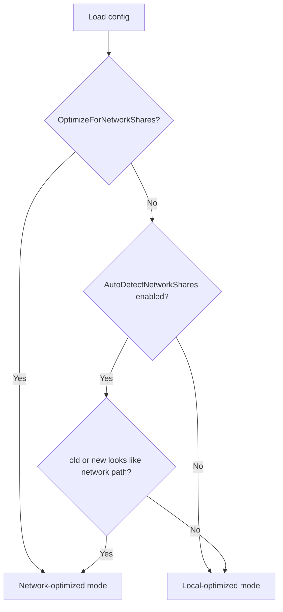

Network path detection is implemented in [`NetworkPathDetector`](../FolderDiffIL4DotNet.Core/IO/NetworkPathDetector.cs) (extracted from `FileSystemUtility`). It recognizes `\\`-prefixed UNC paths, `\\?\UNC\`-prefixed device paths, and `//`-prefixed forward-slash UNC paths (including IP-based forms such as `//192.168.1.1/share`). `FileSystemUtility.IsLikelyNetworkPath` delegates to `NetworkPathDetector.IsLikelyNetworkPath`.

Practical effect of network-optimized mode:
- Skip IL cache precompute and prefetch.
- Cap auto-selected parallelism at `min(logicalProcessorCount, 8)`.
- Avoid parallel text chunk reads and prefer sequential text comparison.
- Preserve behavior correctness while reducing remote I/O amplification.

<a id="guide-en-performance-runtime"></a>
## Performance and Runtime Modes

Key performance features:
- Parallel file comparison in [`FolderDiffService`](../Services/FolderDiffService.cs)
- Optional IL cache warmup and disk persistence
- Chunk-parallel text comparison for large local text files
- Optional memory-budget-aware throttling for chunk-parallel text comparison
- Batched IL precompute target enumeration for very large folder trees
- Tool failure blacklist inside disassembler flow
- Progress keep-alive while long-running precompute is in flight

When to be careful:
- Changing default parallelism changes both throughput and I/O pressure.
- Cache key shape must remain stable across tool-version changes.
- Over-eager prefetching can regress NAS/SMB scenarios.
- Large text-file behavior depends on threshold, chunk size, and optional memory budget; they should be tuned together.

<a id="guide-en-doc-site"></a>
## Documentation Site and API Reference

DocFX is used as the API-reference generator and site builder.

Inputs:
- XML documentation comments emitted during `dotnet build`
- [`README.md`](../README.md), this guide, and [`doc/TESTING_GUIDE.md`](TESTING_GUIDE.md)
- [`docfx.json`](../docfx.json), [`index.md`](../index.md), [`toc.yml`](../toc.yml), and [`api/index.md`](../api/index.md)

Outputs:
- `_site/`: generated documentation site
- `api/*.yml` and [`api/toc.yml`](../api/toc.yml): generated API metadata consumed by the site build

Expected refresh sequence:
1. Build the solution so the latest XML documentation file exists.
2. Run `docfx metadata docfx.json`.
3. Run `docfx build docfx.json`.
4. Inspect `_site/index.html` or the CI artifact before merging larger API changes.

Guardrails:
- If you rename public namespaces or move public types, regenerate DocFX output in the same change.
- If you add public surface area, keep XML comments current so the generated API reference stays useful.
- `_site/` and generated `api/*.yml` files are build outputs and should not be committed.

<a id="guide-en-ci-release"></a>
## CI and Release Notes

### Workflow Overview

```
On pull_request:
  ├─ dotnet.yml (build)             → Build + Test + Coverage enforcement
  ├─ dotnet.yml (mutation-testing)  → Stryker mutation testing
  ├─ dotnet.yml (test-windows)     → Windows cross-platform verification
  ├─ benchmark-regression.yml       → Performance regression detection
  └─ codeql.yml                     → Security static analysis (C# + Actions)

On push to main:
  ├─ dotnet.yml (build)             → Build + Test + Coverage enforcement
  ├─ dotnet.yml (test-windows)     → Windows cross-platform verification
  ├─ benchmark-regression.yml       → Performance regression detection + baseline update
  └─ codeql.yml                     → Security static analysis

On v* tag push:
  └─ release.yml                    → Build + Test + Publish + GitHub Release creation
```

Quality is guarded across six axes: **correctness** (tests), **coverage** (line/branch thresholds), **detection strength** (mutation testing), **performance** (benchmark regression), **security** (CodeQL), and **compatibility** (Windows).

Workflow/config files:
- [.github/workflows/dotnet.yml](../.github/workflows/dotnet.yml)
- [.github/workflows/release.yml](../.github/workflows/release.yml)
- [.github/workflows/codeql.yml](../.github/workflows/codeql.yml)
- [.github/workflows/benchmark-regression.yml](../.github/workflows/benchmark-regression.yml)
- [.github/dependabot.yml](../.github/dependabot.yml)

Current CI behavior (`build` job — Ubuntu):
- Runs on `push` and `pull_request` targeting `main`, plus `workflow_dispatch`
- Uses [`global.json`](../global.json) through `actions/setup-dotnet`
- Restores and builds [`FolderDiffIL4DotNet.sln`](../FolderDiffIL4DotNet.sln)
- Installs DocFX, generates the documentation site, and uploads it as `DocumentationSite`
- Installs a real [`dotnet-ildasm`](https://www.nuget.org/packages/dotnet-ildasm/) tool, adds the global tool directory to `PATH`, and runs tests with `DOTNET_ROLL_FORWARD=Major` plus `FOLDERDIFF_RUN_E2E=true` so the preferred disassembler path and the real-disassembler E2E gate are exercised in CI as well
- Runs tests and coverage only when the test project exists
- Generates coverage summary with `reportgenerator`
- Enforces total coverage thresholds of `80%` line and `75%` branch from the generated Cobertura XML, plus per-class thresholds of `90%` line and `85%` branch for core diff classes (`FileDiffService`, `FolderDiffService`, `FileComparisonService`)
- Publishes build output and uploads it as `FolderDiffIL4DotNet`
- Uploads TRX and coverage files as `TestAndCoverage`

`test-windows` job — Windows:
- Runs in parallel with `build` on `windows-latest`
- Restores, builds, installs [`dotnet-ildasm`](https://www.nuget.org/packages/dotnet-ildasm/), adds the global tool directory to `PATH`, and runs the full test suite with `DOTNET_ROLL_FORWARD=Major` plus `FOLDERDIFF_RUN_E2E=true`
- Ensures Windows-specific code paths are exercised under CI as well

`mutation-testing` job — Stryker:
- Runs on `pull_request` and `workflow_dispatch` only (not on push to `main`)
- Uses [Stryker.NET](https://stryker-mutator.io/docs/stryker-net/introduction/) to inject mutations into production code and verify tests detect them
- Configuration is in [`stryker-config.json`](../stryker-config.json) with `80/60/40` high/low/break thresholds, and [`scripts/generate-mutation-summary.py`](../scripts/generate-mutation-summary.py) reads that file directly so reviewer-visible score bands stay in sync with the actual mutation gate
- Calls [`scripts/generate-mutation-summary.py`](../scripts/generate-mutation-summary.py) to write `StrykerOutput/mutation-summary.md` and `mutation-summary.json` after each run so score, survivor count, and status counts are preserved alongside the raw report
- Appends the markdown summary to the GitHub Actions job summary and mirrors the same content into a sticky bot comment on same-repository pull requests through [`scripts/update-mutation-pr-comment.js`](../scripts/update-mutation-pr-comment.js); that helper updates only marker-bearing comments owned by `github-actions[bot]`, and the PR comment step remains best-effort (`continue-on-error: true`) so visibility failures do not hide a passing mutation gate
- Uploads per-run `StrykerSummary-*` and `StrykerReport-*` artifacts so the Actions run history doubles as the mutation-trend record
- Break threshold is `40%` — the job fails if the mutation score falls below this

`benchmark` job (manual only):
- Runs only on `workflow_dispatch`
- Executes [BenchmarkDotNet](https://benchmarkdotnet.org/) benchmarks from `FolderDiffIL4DotNet.Benchmarks` and uploads results as `BenchmarkResults`
- Exports JSON and GitHub-flavored results for manual comparison

Release automation:
- [`.github/workflows/release.yml`](../.github/workflows/release.yml) runs for pushed `v*` tags and manual dispatch with an explicit existing tag input
- Rebuilds, reruns coverage-gated tests, regenerates DocFX output, publishes the app, and removes `*.pdb`
- Creates zipped publish/docs artifacts plus SHA-256 checksum files
- Creates a GitHub Release from the existing tag with generated release notes
- After the primary `nuget.org` publications complete, the `nuget-publish` job registers an authenticated `github` NuGet source as a best-effort step and then mirrors to GitHub Packages with `continue-on-error: true`, so a mirror outage or auth failure does not block restore, pack, or the primary registry
- The package-diff checks resolve the previous `v*` tag on the checked-out tag's first-parent release line, so manual `workflow_dispatch` runs against an older existing tag or maintenance release still compare against the correct previous release
- `nildiff` is mirrored on every tagged release, while `FolderDiffIL4DotNet.Core` and `FolderDiffIL4DotNet.Plugin.Abstractions` mirror only when those package directories changed, matching the nuget.org gate so normal releases do not create GitHub-only library versions

Security automation:
- [`.github/workflows/codeql.yml`](../.github/workflows/codeql.yml) analyzes both `csharp` and `actions` on `push`, `pull_request`, weekly schedule, and `workflow_dispatch`
- The Checkout step uses `fetch-depth: 0` so [Nerdbank.GitVersioning](https://github.com/dotnet/Nerdbank.GitVersioning) can compute version height from the full commit graph during the `csharp` autobuild
- The Analyze step uses `continue-on-error: true` to tolerate the SARIF upload rejection that occurs when the repository's GitHub Default Setup code scanning is also active for the `actions` language
- [`.github/dependabot.yml`](../.github/dependabot.yml) opens weekly update PRs for both `nuget` dependencies and GitHub Actions
- [`CiAutomationConfigurationTests`](../FolderDiffIL4DotNet.Tests/Architecture/CiAutomationConfigurationTests.cs) protects the expected CI/release/security file presence and key settings from accidental removal

Performance regression detection:
- [`.github/workflows/benchmark-regression.yml`](../.github/workflows/benchmark-regression.yml) runs BenchmarkDotNet on every `pull_request` and `push` to `main`, plus `workflow_dispatch`
- Combines JSON results from all benchmark classes into a single report and compares against the stored baseline in the `gh-benchmarks` branch using [`benchmark-action/github-action-benchmark@v1`](https://github.com/benchmark-action/github-action-benchmark)
- Alert threshold is `150%` (50% degradation causes failure); PR comments are posted on regression
- On push to `main`, results are auto-pushed to `gh-benchmarks` as the new baseline
- Benchmark artifacts are always uploaded as `BenchmarkResults`

Versioning:
- [`version.json`](../version.json) uses [Nerdbank.GitVersioning](https://github.com/dotnet/Nerdbank.GitVersioning)
- Informational version is embedded and later included in the generated report

<a id="guide-en-skipped-tests"></a>
## Skipped Tests in Local Runs

Some tests report as **Skipped** when run locally. This is intentional and does not indicate a bug.

Which tests skip and why:
- **[`DotNetDisassembleServiceTests`](../FolderDiffIL4DotNet.Tests/Services/DotNetDisassembleServiceTests.cs)** (six tests) — these exercise fallback and blacklist logic using fake `#!/bin/sh` shell scripts created by [`WriteExecutable`](../FolderDiffIL4DotNet.Tests/Services/DotNetDisassembleServiceTests.cs). [`File.SetUnixFileMode`](https://learn.microsoft.com/en-us/dotnet/api/system.io.file.setunixfilemode?view=net-8.0) and shell script execution are not available on Windows, so the tests call `Skip.If(OperatingSystem.IsWindows(), ...)` and report Skipped there.
- **[`RealDisassemblerE2ETests`](../FolderDiffIL4DotNet.Tests/Services/RealDisassemblerE2ETests.cs)** (one test) — this builds the same tiny class library twice with `Deterministic=false` and verifies that [`dotnet-ildasm`](https://www.nuget.org/packages/dotnet-ildasm/) produces `ILMatch` after MVID filtering. It still calls `Skip.IfNot(IsE2EEnabled(), ...)` for local opt-in behavior, but once `FOLDERDIFF_RUN_E2E=true` is set it asserts that a working [`dotnet-ildasm`](https://www.nuget.org/packages/dotnet-ildasm/) (or [`dotnet ildasm`](https://www.nuget.org/packages/dotnet-ildasm/)) is actually runnable, so missing tooling becomes a failure rather than a skip.

Why this is safe:
- CI runs on both Linux (`build` job) and Windows (`test-windows` job), and both install a real [`dotnet-ildasm`](https://www.nuget.org/packages/dotnet-ildasm/), add the global tool directory to `PATH`, and set `FOLDERDIFF_RUN_E2E=true` before the test step. That ensures the preferred disassembler path, the real-disassembler E2E assertion, and Windows-specific code paths are all exercised in CI. A local Skipped result now means the explicit opt-in was not enabled; with the opt-in enabled, missing tooling fails the test.
- The skippable tests use [`[SkippableFact]`](https://github.com/AArnott/Xunit.SkippableFact) from [`Xunit.SkippableFact`](https://www.nuget.org/packages/Xunit.SkippableFact/), so the runner counts them as Skipped rather than Passed, making the distinction visible.
- If a previously Skipped test appears as **Failed**, that is a real issue and should be investigated. Skipped and Failed are distinct outcomes.

For the complete list of affected tests and the `Skip.If` pattern, see [doc/TESTING_GUIDE.md](TESTING_GUIDE.md#testing-en-isolation).

## Extension Points

### Plugin System

The application supports a plugin architecture via the [`FolderDiffIL4DotNet.Plugin.Abstractions`](../FolderDiffIL4DotNet.Plugin.Abstractions/) NuGet package. Plugins are loaded from directories specified in `PluginSearchPaths` configuration using isolated `AssemblyLoadContext` instances.

Plugin extension interfaces:
- [`IPlugin`](../FolderDiffIL4DotNet.Plugin.Abstractions/IPlugin.cs) — Entry point. Provides metadata and registers services via `ConfigureServices`.
- [`IFileComparisonHook`](../FolderDiffIL4DotNet.Plugin.Abstractions/IFileComparisonHook.cs) — Intercepts file comparison (before/after). Can override built-in comparison results. Best-effort hook failures are logged with phase (`BeforeCompare` / `AfterCompare`) plus hook order for triage.
- [`IPostProcessAction`](../FolderDiffIL4DotNet.Plugin.Abstractions/IPostProcessAction.cs) — Executes after all reports are generated (notifications, uploads, etc.). Best-effort failures are logged with action type, execution position, and `Order` so plugin triage stays readable from text/JSON logs.
- [`IDisassemblerProvider`](../FolderDiffIL4DotNet.Plugin.Abstractions/IDisassemblerProvider.cs) — Provides disassembly for custom file types (Java .class via javap, etc.).
- [`IReportSectionWriter`](../Services/IReportSectionWriter.cs) — Adds custom sections to the Markdown report.
- [`IReportFormatter`](../Services/IReportFormatter.cs) — Adds custom report output formats.

Plugin loading flow: [`PluginLoader`](../Runner/PluginLoader.cs) → [`PluginAssemblyLoadContext`](../Runner/PluginAssemblyLoadContext.cs) → `IPlugin.ConfigureServices` → DI resolution.

### Built-in Extension Points

Typical safe extension points:
- Add new text extensions in [`TextFileExtensions`](../Models/ConfigSettings.cs)
- Introduce new report metadata in [`ReportGenerateService`](../Services/ReportGenerateService.cs)
- Add logging around orchestration boundaries
- Add new tests by substituting [`IFileSystemService`](../Services/IFileSystemService.cs), [`IFolderDiffExecutionStrategy`](../Services/IFolderDiffExecutionStrategy.cs), [`IFileComparisonService`](../Services/IFileComparisonService.cs), [`IFileDiffService`](../Services/IFileDiffService.cs), [`IILOutputService`](../Services/IILOutputService.cs), or [`IDotNetDisassembleService`](../Services/IDotNetDisassembleService.cs)

Higher-risk changes:
- Altering the order `SHA256 -> IL -> text`
- Reusing run-scoped state across executions
- Moving path decisions out of [`DiffExecutionContext`](../Services/DiffExecutionContext.cs)
- Mixing tool identities during IL comparison
- Introducing static mutable caches without isolation

<a id="guide-en-change-checklist"></a>
## Change Checklist

Before merging behavior changes, check:
1. Does [`Program.cs`](../Program.cs) remain thin, with orchestration still in [`ProgramRunner`](../ProgramRunner.cs) or lower services?
2. Does each run still get a fresh [`DiffExecutionContext`](../Services/DiffExecutionContext.cs) and [`FileDiffResultLists`](../Models/FileDiffResultLists.cs)?
3. Are new collaborators injected rather than created ad hoc inside core services?
4. Does [`FolderDiffService`](../Services/FolderDiffService.cs) still call `ResetAll()` before enumeration and classification?
5. Is the reporting specification still consistent with the contents of [`FileDiffResultLists`](../Models/FileDiffResultLists.cs)?
6. If IL behavior changed, are same-tool enforcement and ignore-line semantics still explicit?
7. If performance behavior changed, have local and network-share modes both been considered?
8. Did [`README.md`](../README.md), this guide, and [`doc/TESTING_GUIDE.md`](TESTING_GUIDE.md) stay in sync with user-visible behavior?
9. Were tests added or updated for the changed execution path?
10. If CI, release, or security assumptions changed, were [`.github/workflows/dotnet.yml`](../.github/workflows/dotnet.yml), [`.github/workflows/release.yml`](../.github/workflows/release.yml), [`.github/workflows/codeql.yml`](../.github/workflows/codeql.yml), [`.github/dependabot.yml`](../.github/dependabot.yml), and [`CiAutomationConfigurationTests`](../FolderDiffIL4DotNet.Tests/Architecture/CiAutomationConfigurationTests.cs) updated together?

## Cross-Platform Pitfalls

This project runs CI on both Linux and Windows. The following patterns have caused real CI failures and should be kept in mind when writing production code or tests.

### Path separator consistency

On Windows, `Path.GetRelativePath` normalizes output to `\`, but `Path.Combine` does **not** normalize the second argument's separators. This means a round-trip like:

```csharp
var rel = Path.GetRelativePath(baseDir, absolutePath);   // "sub\file.txt" on Windows
var rebuilt = Path.Combine(otherBase, rel);               // "/other\sub\file.txt"
```

produces a different string from the original `Path.Combine(otherBase, "sub/file.txt")` → `"/other\sub/file.txt"` (mixed separators). `OrdinalIgnoreCase` string comparison treats `\` and `/` as different characters, so `HashSet<string>` lookups fail silently.

**Rule**: When constructing relative paths that contain subdirectory separators, always use `Path.Combine("sub", "file.txt")` instead of `"sub/file.txt"`. In production code, avoid comparing raw `Path.Combine` output against `Path.GetRelativePath` output without normalization.

### Timer resolution and timing-sensitive tests

On Windows, `DateTime.UtcNow` and `Thread.Sleep` interact with the OS timer resolution (~15.6ms by default). A test that sets a TTL of 1ms and sleeps 20ms can fail because:

1. `RegisterFailure()` records `DateTime.UtcNow` at time T.
2. The test calls `Assert.True(IsBlacklisted(...))` — but if the code path from `RegisterFailure` to `IsBlacklisted` takes > 1ms (easily possible on a loaded CI runner), the TTL has already expired and the assertion fails.

**Rule**: Use TTL values of at least 500ms and sleep durations of at least 1.4× the TTL in timing-sensitive tests. Avoid sub-millisecond TTLs entirely.

### `WebUtility.HtmlEncode` does not encode backticks

`System.Net.WebUtility.HtmlEncode` encodes `&`, `<`, `>`, `"`, `'` but does **not** encode backtick (`` ` ``). Since the HTML report embeds file paths in JavaScript contexts, backticks must be explicitly encoded to prevent template-literal injection. The `HtmlEncode()` helper in `HtmlReportGenerateService.Helpers.cs` adds `.Replace("`", "&#96;")` as a post-processing step.

### Local tool versions (`dotnet-stryker`, etc.)

The CI workflow runs `dotnet tool restore` using [`.config/dotnet-tools.json`](../.config/dotnet-tools.json). If a pinned version is removed from NuGet, CI fails at the restore step. Always verify that tool versions exist on NuGet before updating the manifest.

### Thread safety in test fakes

When a test fake (mock service) records method calls in a collection (e.g. `ReadChunkCalls.Add(...)`), use `ConcurrentBag<T>` or `ConcurrentQueue<T>` instead of `List<T>` if the fake is invoked from `Parallel.ForEachAsync` or other parallel contexts. A non-thread-safe `List.Add` under concurrency can throw exceptions that are silently caught by production error-handling code, causing the test to follow an unexpected fallback path and fail intermittently.

### `coverlet.collector` and [`coverlet.runsettings`](../coverlet.runsettings) compatibility

- `coverlet.collector` 6.0.3+ has a [regression](https://github.com/coverlet-coverage/coverlet/issues/1726) where `<Exclude>` / `<Include>` filters in [`coverlet.runsettings`](../coverlet.runsettings) cause the `coverage.cobertura.xml` file to not be generated. Use version 6.0.2 until a fix is released.
- The `opencover` format does not support `<DeterministicReport>true</DeterministicReport>`. If deterministic reports are needed, use `cobertura` only.

## Debugging Tips

- Start with `<app-data-root>/Logs/log_YYYYMMDD.log` for the exact failure point (for example `%LOCALAPPDATA%\FolderDiffIL4DotNet\Logs\log_YYYYMMDD.log` on Windows, `~/Library/Application Support/FolderDiffIL4DotNet/Logs/log_YYYYMMDD.log` on macOS, or `~/.local/share/FolderDiffIL4DotNet/Logs/log_YYYYMMDD.log` on Linux).
- If the run stops during IL comparison, inspect the chosen disassembler label in logs and report output.
- For unexpected network-mode behavior, verify both config flags and detected path classification.
- When a result bucket looks wrong, inspect [`FileDiffResultLists`](../Models/FileDiffResultLists.cs) population order before touching report formatting.
- If a test becomes order-dependent, suspect leaked run-scoped state first.
- If the banner or any console output shows `?` characters on Windows, the process is using the OEM code page. [`Program.cs`](../Program.cs) sets [`Console.OutputEncoding`](https://learn.microsoft.com/en-us/DOTNET/api/system.console.outputencoding?view=net-8.0) = `Encoding.UTF8` at the very start of `Main()` — before any output — to override this. On Linux and macOS the console is already UTF-8, so the assignment is effectively a no-op on those platforms.

## HTML Report: Integrity Verification Technical Notes

### Dual-hash placeholder approach

The "Download as reviewed" workflow embeds **two** SHA256 hashes inside the reviewed HTML file using a placeholder technique. This solves a circular dependency: the hash of the file cannot be known until the file is complete, but the hash must be embedded inside the file.

| Constant | Placeholder | Purpose |
| --- | --- | --- |
| `__reviewedSha256__` | 64 zeros (`000...0`) | Intermediate hash — hash of the HTML with this field set to the placeholder. Used internally during the hashing process. |
| `__finalSha256__` | 64 f's (`fff...f`) | Final hash — hash of the HTML with `__reviewedSha256__` already embedded and this field set to the placeholder. Matches the companion `.sha256` file exactly. |

The two-step process in `downloadReviewed()`:
1. Replace `__reviewedSha256__` placeholder with zeros → compute SHA256 → replace zeros with actual hash (first hash embedded).
2. Replace `__finalSha256__` placeholder with f's → compute SHA256 → replace f's with actual hash (second hash embedded). This final hash is also written to the companion `.sha256` file.

### Verify integrity: `.sha256`-only verification

`verifyIntegrity()` only accepts `.sha256` files. The reviewed HTML is "self" — it already has its own final hash embedded in `__finalSha256__`, so no HTML file selection is needed. The function reads the `.sha256` file, extracts the hash, and compares it directly against the embedded `__finalSha256__` constant.

### Browser quirk: `input.accept` on dynamically created elements

Some browsers (notably macOS Safari) ignore the `accept` attribute on `<input type="file">` elements that are created dynamically and clicked immediately. The file picker opens with no filter, allowing all files to be selected.

**Workaround**: Pre-create the hidden `<input type="file" accept=".sha256">` element during `DOMContentLoaded` initialization and reuse it in `verifyIntegrity()`. By the time the user clicks "Verify integrity", the input element has been in the DOM long enough for the browser to recognize and apply the `accept` filter. An `onchange` guard (`file.name.endsWith('.sha256')`) is also present as a fallback for browsers that still bypass the filter.

### Type name format in semantic changes

[`SimpleSignatureTypeProvider`](../Services/AssemblyMethodAnalyzer.cs) always outputs **fully qualified .NET type names** (e.g. `System.String`, `System.Int32`, `System.Void`), never C# aliases (`string`, `int`, `void`). Generic type parameters are resolved to their declared names (e.g. `T`, `TKey`, `TValue`) via [`GenericContext`](../Services/AssemblyMethodAnalyzer.MetadataHelpers.cs), which reads parameter names from `TypeDefinition.GetGenericParameters()` and `MethodDefinition.GetGenericParameters()`. Function pointer signatures are expanded as `delegate*<ParamTypes, ReturnType>`, and custom modifiers are preserved as `modreq()`/`modopt()` annotations. The `MemberType`, `ReturnType`, and `Parameters` fields in [`MemberChangeEntry`](../Models/MemberChangeEntry.cs) follow this convention. Sample HTML base64 blocks must use fully qualified names to match.

---

# 開発者ガイド

このガイドは、実行時挙動の変更、差分パイプラインの拡張、CI とテストの整合維持を行うメンテナ向けの資料です。

関連ドキュメント:
- [README.md](../README.md#readme-ja-doc-map): 製品概要、導入、使い方、設定リファレンス
- [doc/TESTING_GUIDE.md](TESTING_GUIDE.md#testing-ja-run-tests): テスト戦略、ローカル実行コマンド、分離ルール
- [api/index.md](../api/index.md): 自動生成 API リファレンスの入口
- [docfx.json](../docfx.json): DocFX のメタデータ/ビルド設定
- [.github/workflows/dotnet.yml](../.github/workflows/dotnet.yml): CI パイプライン定義
- [SECURITY.md](../SECURITY.md): 脅威モデル、STRIDE 分析、セキュリティ対策
- [doc/PERFORMANCE_GUIDE.md](PERFORMANCE_GUIDE.md#perf-ja-memory): メモリ管理、ベンチマークベースライン、チューニング推奨

<a id="guide-ja-map"></a>
## ドキュメントの見取り図

| やりたいこと | 最初に見る場所 |
| --- | --- |
| 実行全体の流れを把握したい | [実行ライフサイクル](#guide-ja-execution-lifecycle) |
| サービス境界や DI スコープを追いたい | [Dependency Injection 構成](#guide-ja-di-layout) |
| ファイル判定ロジックを変更したい | [比較パイプライン](#guide-ja-comparison-pipeline) |
| 設定キーや実行モード判定を理解したい | [設定と実行モード](#guide-ja-config-runtime) |
| 性能やネットワーク共有向け挙動を調整したい | [性能と実行モード](#guide-ja-performance-runtime) |
| 自動生成 API リファレンスを更新したい | [ドキュメントサイトと API リファレンス](#guide-ja-doc-site) |
| ビルド・テスト・成果物の流れを変えたい | [CI とリリースまわり](#guide-ja-ci-release) |
| 安全に機能追加したい | [変更時チェックリスト](#guide-ja-change-checklist) |

## ローカル開発

前提:
- [`.NET SDK 8.x`](https://dotnet.microsoft.com/ja-jp/download/dotnet/8.0)（使用バージョンは [`global.json`](../global.json) で固定）
- `PATH` 上で利用可能な IL 逆アセンブラ
  - 優先は [`dotnet-ildasm`](https://www.nuget.org/packages/dotnet-ildasm/) または [`dotnet ildasm`](https://www.nuget.org/packages/dotnet-ildasm/)
  - フォールバックとして [`ilspycmd`](https://www.nuget.org/packages/ilspycmd/) をサポート

よく使うコマンド:

```bash
dotnet restore FolderDiffIL4DotNet.sln
dotnet build FolderDiffIL4DotNet.sln --configuration Release
dotnet test FolderDiffIL4DotNet.Tests/FolderDiffIL4DotNet.Tests.csproj --configuration Release --nologo -p:UseAppHost=false
npm run test:js   # HTML レポート JS モジュールの Jest ユニットテスト / Jest unit tests for HTML report JS modules
```

ドキュメントサイトのローカル更新:

```bash
dotnet tool update --global docfx --version '2.*'
export PATH="$PATH:$HOME/.dotnet/tools"
docfx metadata docfx.json
docfx build docfx.json
```

ローカル実行例:

```bash
dotnet run -- "/absolute/path/to/old" "/absolute/path/to/new" "dev-run" --no-pause

# ヘルプ / バージョン確認
dotnet run -- --help
dotnet run -- --version

# 有効な設定を JSON で確認（環境変数オーバーライド適用済み）
dotnet run -- --print-config
dotnet run -- --print-config --config /etc/cfg.json

# スレッド数指定・IL スキップ・カスタム設定ファイル
dotnet run -- "/path/old" "/path/new" "label" --threads 4 --skip-il --config /etc/cfg.json --no-pause
```

実行時に生成される主な成果物は [README § 生成物](../README.md#readme-ja-generated-artifacts) を参照してください。既定では、レポート、ログ、およびユーザーローカル `config.json` は `Environment.SpecialFolder.LocalApplicationData` から解決される OS 標準のユーザーローカルデータディレクトリ配下（Windows: `%LOCALAPPDATA%\FolderDiffIL4DotNet\...`、macOS: `~/Library/Application Support/FolderDiffIL4DotNet/...`、Linux: `~/.local/share/FolderDiffIL4DotNet/...`）に集約されます。同じルート配下で、[`EnableILCache`](../Models/ConfigSettings.cs) が `true` かつ [`ILCacheDirectoryAbsolutePath`](../Models/ConfigSettings.cs) 未指定時は `ILCache/` ディレクトリも作成されます。

## Partial Class ファイル構成

大規模なサービスクラスを partial class ファイルに分割し、各ファイルを単一責務にまとめています。クラス名・名前空間は変更なし — ファイル配置のみが異なります。

| クラス | メインファイル | Partial ファイル |
| --- | --- | --- |
| `ProgramRunner` | [`ProgramRunner.cs`](../ProgramRunner.cs) | [`Runner/ProgramRunner.Core.cs`](../Runner/ProgramRunner.Core.cs)（共有定数、注入サービス、コンストラクター）、[`Runner/ProgramRunner.Types.cs`](../Runner/ProgramRunner.Types.cs)（ネスト型: `RunArguments`, `RunCompletionState`, `ProgramExitCode`, `ProgramRunResult`, `StepResult<T>`）、[`Runner/ProgramRunner.HelpText.cs`](../Runner/ProgramRunner.HelpText.cs)（CLI ヘルプメッセージ）、[`Runner/ProgramRunner.Config.cs`](../Runner/ProgramRunner.Config.cs)（設定読込・バリデーション・CLI オーバーライド）、[`Runner/ProgramRunner.Wizard.cs`](../Runner/ProgramRunner.Wizard.cs)（対話ウィザードモード）、[`Runner/ProgramRunner.OpenFolder.cs`](../Runner/ProgramRunner.OpenFolder.cs)（フォルダ開放の早期終了コマンド） |
| `ConfigSettings` | [`Models/ConfigSettings.cs`](../Models/ConfigSettings.cs) | [`Models/ConfigSettings.ReportSettings.cs`](../Models/ConfigSettings.ReportSettings.cs)（レポート出力制御）、[`Models/ConfigSettings.ILSettings.cs`](../Models/ConfigSettings.ILSettings.cs)（IL 比較・キャッシュ・逆アセンブラ）、[`Models/ConfigSettings.DiffSettings.cs`](../Models/ConfigSettings.DiffSettings.cs)（並列処理・ネットワーク・インライン差分）、[`Models/ConfigSettings.PluginSettings.cs`](../Models/ConfigSettings.PluginSettings.cs)（プラグイン設定） |
| `ConfigSettingsBuilder` | [`Models/ConfigSettingsBuilder.cs`](../Models/ConfigSettingsBuilder.cs) | [`Models/ConfigSettingsBuilder.ReportSettings.cs`](../Models/ConfigSettingsBuilder.ReportSettings.cs)（レポート出力制御）、[`Models/ConfigSettingsBuilder.ILSettings.cs`](../Models/ConfigSettingsBuilder.ILSettings.cs)（IL 比較・キャッシュ・逆アセンブラ）、[`Models/ConfigSettingsBuilder.DiffSettings.cs`](../Models/ConfigSettingsBuilder.DiffSettings.cs)（並列処理・ネットワーク・インライン差分）、[`Models/ConfigSettingsBuilder.PluginSettings.cs`](../Models/ConfigSettingsBuilder.PluginSettings.cs)（プラグイン設定） |
| `HtmlReportGenerateService` | [`Services/HtmlReportGenerateService.cs`](../Services/HtmlReportGenerateService.cs) | [`Services/HtmlReport/HtmlReportGenerateService.Sections.cs`](../Services/HtmlReport/HtmlReportGenerateService.Sections.cs)（レポートセクション生成）、[`…DetailRows.cs`](../Services/HtmlReport/HtmlReportGenerateService.DetailRows.cs)（インライン差分、依存関係変更の詳細行、および共有 `<details>` 描画ヘルパー）、[`…SemanticChanges.cs`](../Services/HtmlReport/HtmlReportGenerateService.SemanticChanges.cs)（アセンブリセマンティック変更の詳細行）、[`…Helpers.cs`](../Services/HtmlReport/HtmlReportGenerateService.Helpers.cs), [`…Css.cs`](../Services/HtmlReport/HtmlReportGenerateService.Css.cs) ([`diff_report.css`](../Services/HtmlReport/diff_report.css) 埋め込みリソースを読み込み), [`…Js.cs`](../Services/HtmlReport/HtmlReportGenerateService.Js.cs) ([`Services/HtmlReport/js/`](../Services/HtmlReport/js/) の13 個の JS モジュールを結合し、`{{STORAGE_KEY}}`/`{{REPORT_DATE}}` プレースホルダー置換して読み込み) |
| `FolderDiffService` | [`Services/FolderDiffService.cs`](../Services/FolderDiffService.cs) | [`Services/FolderDiffService.ILPrecompute.cs`](../Services/FolderDiffService.ILPrecompute.cs), [`…DiffClassification.cs`](../Services/FolderDiffService.DiffClassification.cs) |
| `ReportGenerateService` | [`Services/ReportGenerateService.cs`](../Services/ReportGenerateService.cs) | [`Services/ReportGenerateService.Helpers.cs`](../Services/ReportGenerateService.Helpers.cs)（レポート出力補助、Markdown 表示補助、逆アセンブラ警告描画）、[`Services/SectionWriters/HeaderSectionWriter.cs`](../Services/SectionWriters/HeaderSectionWriter.cs), [`…LegendSectionWriter.cs`](../Services/SectionWriters/LegendSectionWriter.cs), [`…IgnoredFilesSectionWriter.cs`](../Services/SectionWriters/IgnoredFilesSectionWriter.cs), [`…UnchangedFilesSectionWriter.cs`](../Services/SectionWriters/UnchangedFilesSectionWriter.cs), [`…AddedFilesSectionWriter.cs`](../Services/SectionWriters/AddedFilesSectionWriter.cs), [`…RemovedFilesSectionWriter.cs`](../Services/SectionWriters/RemovedFilesSectionWriter.cs), [`…ModifiedFilesSectionWriter.cs`](../Services/SectionWriters/ModifiedFilesSectionWriter.cs), [`…SummarySectionWriter.cs`](../Services/SectionWriters/SummarySectionWriter.cs), [`…ILCacheStatsSectionWriter.cs`](../Services/SectionWriters/ILCacheStatsSectionWriter.cs), [`…WarningsSectionWriter.cs`](../Services/SectionWriters/WarningsSectionWriter.cs) |
| `AssemblyMethodAnalyzer` | [`Services/AssemblyMethodAnalyzer.cs`](../Services/AssemblyMethodAnalyzer.cs) | [`Services/AssemblyMethodAnalyzer.Comparers.cs`](../Services/AssemblyMethodAnalyzer.Comparers.cs)（型/メソッド/プロパティ/フィールド比較）、[`…MetadataHelpers.cs`](../Services/AssemblyMethodAnalyzer.MetadataHelpers.cs)（スナップショット構築、シグネチャ構築）、[`…AccessHelpers.cs`](../Services/AssemblyMethodAnalyzer.AccessHelpers.cs)（アクセス修飾子抽出、型種別判定、IL バイト読み取り、ジェネリック基底型/インターフェースの `DecodeTypeSpecification`）、[`…SignatureProvider.cs`](../Services/AssemblyMethodAnalyzer.SignatureProvider.cs)（ジェネリックコンテキスト、シグネチャ型プロバイダ、アリティ接尾辞除去の `StripGenericArity`、ネスト型参照解決） |
| `DepsJsonAnalyzer` | [`Services/DepsJsonAnalyzer.cs`](../Services/DepsJsonAnalyzer.cs) | （単一ファイル）`.deps.json` ファイルの構造化された依存関係変更分析 |
| `NuGetVulnerabilityService` | [`Services/NuGetVulnerabilityService.cs`](../Services/NuGetVulnerabilityService.cs) | （単一ファイル）NuGet V3 脆弱性データの取得、空の依存関係集合の短絡 return、重複ページ URL / advisory の排除、およびパッケージバージョンの既知アドバイザリ突合 |
| `NuGetVersionRange` | [`Services/NuGetVersionRange.cs`](../Services/NuGetVersionRange.cs) | （単一ファイル）NuGet バージョン範囲の区間記法パーサ |
| `AssemblySdkVersionReader` | [`Services/AssemblySdkVersionReader.cs`](../Services/AssemblySdkVersionReader.cs) | （単一ファイル）System.Reflection.Metadata 経由で .NET アセンブリから TargetFrameworkAttribute を抽出し、表示文字列をフォーマット（例: `.NET 8.0`、`.NET 6.0` → `.NET 8.0`） |
| `ILOutputService` | [`Services/ILOutputService.cs`](../Services/ILOutputService.cs) | [`Services/ILOutputService.Comparison.cs`](../Services/ILOutputService.Comparison.cs)（IL フィルタリング、ブロック単位比較、逆アセンブラ表示ラベル補助） |
| `FileDiffService` | [`Services/FileDiffService.cs`](../Services/FileDiffService.cs) | [`Services/FileDiffService.TextComparison.cs`](../Services/FileDiffService.TextComparison.cs)（逐次/チャンク並列テキスト比較、メモリ予算考慮の並列度制御） |
| `ReviewChecklistLoader` | [`Services/ReviewChecklistLoader.cs`](../Services/ReviewChecklistLoader.cs) | （単一ファイル）任意のユーザーローカル `HtmlReport/checklist.json` を run ごとに 1 回だけ読み込み・正規化し、Markdown / HTML レポート生成で同じチェックリスト項目を共有させる |
| `DotNetDisassembleService` | [`Services/DotNetDisassembleService.cs`](../Services/DotNetDisassembleService.cs) | [`Services/DotNetDisassembleService.VersionLabel.cs`](../Services/DotNetDisassembleService.VersionLabel.cs)（バージョン/ラベル管理、ツールフィンガープリント、プロセス実行、使用記録、一時ファイル cleanup warning）, [`Services/DotNetDisassembleService.Streaming.cs`](../Services/DotNetDisassembleService.Streaming.cs)（行単位ストリーミング逆アセンブル、LOH 文字列割り当て回避） |
| `DotNetDisassemblerProvider` | [`Services/DotNetDisassemblerProvider.cs`](../Services/DotNetDisassemblerProvider.cs) | （単一ファイル）`IDotNetDisassembleService` をラップする組み込み `IDisassemblerProvider` 実装。recoverable な検出失敗・逆アセンブル失敗を provider 表示名と拡張子付き warning に残しつつフォールバックし、プラグイン開発者が非 .NET ファイル用の代替逆アセンブラを提供可能にする |

## Nullable 参照型

[`FolderDiffIL4DotNet.csproj`](../FolderDiffIL4DotNet.csproj) と [`FolderDiffIL4DotNet.Core.csproj`](../FolderDiffIL4DotNet.Core/FolderDiffIL4DotNet.Core.csproj) の両方で `<Nullable>enable</Nullable>` と `<TreatWarningsAsErrors>true</TreatWarningsAsErrors>` を有効にしています。nullable 警告（CS8600–8604, CS8618, CS8625）はすべて強制されており、`<NoWarn>` による抑制はありません。

### アノテーション規約

| パターン | 使用場面 | 例 |
| --- | --- | --- |
| `string?` 戻り値型 | ミス/失敗時に `null` を返すメソッド | `string? TryGetPathRoot(...)` |
| `string? param = null` | 省略可能なパラメータ | `ValidateFolderNameOrThrow(string folderName, string? paramName = null)` |
| `out string? param` | 失敗パスで `null` が代入される `out` パラメータ | `TryGetFileSystemInfoOnMac(string path, out string? fsType, out uint flags)` |
| `TValue?` ジェネリック型のプロパティ | `IsSuccess` が false のとき `default` になる値 | `StepResult<TValue>.Value` |
| `= null!`（`init` プロパティ） | コンパイラが初期化を検証できないコンテキスト/DTO の必須 init プロパティ | `ReportWriteContext.OldFolderAbsolutePath { get; init; } = null!;` |
| `ILCache?` フィールド / パラメータ | DI 経由で注入される nullable サービス（機能無効時に null） | `private readonly ILCache? _ilCache;` |

### 新規コードのガイドライン

- **必ずアノテーションすること** — nullable コード向けの新しい `<NoWarn>` を追加しないでください。コンパイラが警告を出す場合は、アノテーションを修正するか null チェックを追加してください。
- **`null!` より `?` を優先** — `null!` はオブジェクト初期化子で必ず設定される `init` 専用プロパティにのみ使用します。それ以外は `?` で null 可能性を正直に表現してください。
- **`ArgumentNullException.ThrowIfNull()`** を使用 — public/internal API 境界で非 null 必須のパラメータに適用します。
- **参照前にガード** — `T?` を返す `Try*` メソッドの呼び出し後は、結果を使用する前に `null` チェックしてください。
- **テストプロジェクトは対象外** — [`FolderDiffIL4DotNet.Tests.csproj`](../FolderDiffIL4DotNet.Tests/FolderDiffIL4DotNet.Tests.csproj) では `<Nullable>` を有効にしていません。テストダブルやモックセットアップに過度なアノテーションが必要になり、安全性の利点が小さいためです。

## Railway 指向実行パイプライン

`ProgramRunner.RunWithResultAsync` は [`StepResult<T>`](../Runner/ProgramRunner.Types.cs) 型を基盤とした Railway 指向パイプラインを使用しています。各実行フェーズは `StepResult` を返し、`Bind`（同期）と `BindAsync`（非同期）でチェーンされます。失敗時は後続のステップが自動的にショートサーキットされ、明示的な `if (!IsSuccess) return Failure` チェックは不要です。

```
TryValidateAndBuildRunArguments
  .Bind → TryPrepareReportsDirectory
  .BindAsync → TryLoadConfigBuilderAsync
    .Bind → ApplyCliOverrides + TryBuildConfig
  .BindAsync → TryExecuteRunAsync
```

新しい実行フェーズを追加する場合は、成功時に `StepResult<T>.FromValue(value)` でラップし、失敗時は `StepResult<T>.FromFailure(ProgramRunResult.Failure(exitCode))` を返してから `.Bind()`/`.BindAsync()` でチェーンしてください。

## XML ドキュメント強制

[`FolderDiffIL4DotNet.csproj`](../FolderDiffIL4DotNet.csproj) と [`FolderDiffIL4DotNet.Core.csproj`](../FolderDiffIL4DotNet.Core/FolderDiffIL4DotNet.Core.csproj) の両方で `<GenerateDocumentationFile>true</GenerateDocumentationFile>` と `<TreatWarningsAsErrors>true</TreatWarningsAsErrors>` を有効にしています。CS1591（XML コメント欠落）と CS1573（param タグ不一致）の抑制は削除されたため、`<summary>` / `<param>` / `<returns>` タグのない新しい public 型・メソッド・プロパティ・パラメータはビルド失敗となります。バイリンガル XML ドキュメントコメント（英語が先、次に日本語）がプロジェクトの規約です。

## HTML レポートセキュリティ

生成される `diff_report.html` は 2 層の XSS 緩和策を適用しています:

1. **HTML エンコーディング** — すべてのユーザー提供データ（ファイルパス、タイムスタンプ、バージョン文字列、逆アセンブラ出力）は [`HtmlReportGenerateService.Helpers.cs`](../Services/HtmlReport/HtmlReportGenerateService.Helpers.cs) の `System.Net.WebUtility.HtmlEncode` でエンコードされ、さらにバッククォートの明示的な置換（`` ` `` → `&#96;`）が行われます。`WebUtility.HtmlEncode` はバッククォートをエンコードしないため、埋め込み JavaScript コンテキストでのテンプレートリテラル注入を防ぐ追加ステップです。

2. **Content-Security-Policy** — `<head>` 内の `<meta http-equiv="Content-Security-Policy">` タグが実行環境を制限: `default-src 'none'` ですべてをブロックし、`style-src 'unsafe-inline'` と `script-src 'unsafe-inline'` でレポート自身のインラインスタイル/スクリプトのみを許可、`img-src 'self'` で同一オリジン画像のみを許可。外部スクリプト・スタイルシート・フォント・フレーム・フォームターゲットの読み込みを防止。

HTML レポート出力を変更する際は、新しい動的データを必ず `HtmlEncode()` で処理し、[`HtmlReportGenerateService.cs`](../Services/HtmlReportGenerateService.cs) の `AppendHtmlHead()` に CSP メタタグが残っていることを確認してください。[`doc/samples/diff_report.html`](samples/diff_report.html) のサンプルレポートも同期を維持する必要があります。

## HTML レポートフィルタリング

HTML レポートには、複数の条件でファイル行を絞り込めるクライアントサイドフィルターゾーンが含まれています。フィルターゾーンは reviewed HTML にも引き継がれ、レビュアーもフィルタ可能です。

### サーバーサイド（C#）

- [`AppendFileRow()`](../Services/HtmlReport/HtmlReportGenerateService.Helpers.cs) が各 `<tr>` に `data-section`、`data-diff`、（該当する場合）`data-importance` 属性を出力。
- **ボタン行**（Free up review storage、Download as reviewed、Fold all details、Reset filters、Reset review progress、Theme toggle）は [`HtmlReportGenerateService.cs`](../Services/HtmlReportGenerateService.cs) の `<!--CTRL-->...<!--/CTRL-->` マーカー内にあり、`downloadReviewed()` で reviewed バナーに置換される。reviewed バナーには Verify integrity、Download as Excel-compatible HTML、Download as PDF、Fold all details、Reset filters、Theme toggle ボタンが含まれる。
- **フィルターゾーン**（Diff Detail、Change Importance、Unchecked only、Search）は CTRL マーカーの**外**に配置され reviewed HTML にも残る。

### CSS（[`diff_report.css`](../Services/HtmlReport/diff_report.css)）

- **CSS カスタムプロパティ（`:root` 変数）** — 60 以上のカラー/サーフェス/ボーダートークンを `:root` に定義。スタイルシート全体でハードコード hex 値の代わりに `var(--color-*)` を使用。テーマ切替を可能にし、パレットを一箇所に集約。
- **ダークモード** — `@media (prefers-color-scheme: dark)` で `:root` 変数を GitHub ダークテーマ風パレット（`#0d1117` 背景、`#e6edf3` テキスト等）に上書き。ブラウザ/OS のカラースキームに応じて自動で切り替わる。コントロールバーの手動トグルボタン（Light / Dark / System）で `html[data-theme="light"]` または `html[data-theme="dark"]` 属性セレクタを適用し `@media` より優先させることも可能。設定はレポートごとの localStorage キー（`{storageKey}-theme`）に保存される。
- **ユーティリティクラス** — C# ジェネレータがインライン `style` 属性の代わりに使うテーマ対応クラス: `.imp-high`、`.imp-medium`（重要度ラベル）、`.status-available`、`.status-unavailable`（逆アセンブラ状態）、`.vuln-new`、`.vuln-resolved`（脆弱性バッジ）、`.vuln-new-count`、`.vuln-resolved-count`（脆弱性カウント）、`.warn-danger`、`.warn-caution`（警告バナー）。
- `tr.filter-hidden` / `tr.diff-row.filter-hidden-parent` — `display: none !important` で行を非表示。
- `.filter-table-dbl` — Change Importance テーブルクラス。`tbody td` の高さを `calc(var(--ft-row-h) * 2)` で Diff Detail と行揃え。
- `.filter-search-wrap` — 検索入力のラッパー。ボーダーとクリアボタンを含む。

### JavaScript（[`Services/HtmlReport/js/`](../Services/HtmlReport/js/)）

JavaScript は `Services/HtmlReport/js/` 配下の13個のモジュールファイルに分割され、`HtmlReportGenerateService.Js.cs` が生成時に結合・コメント/空行除去します（[`JsMinifier`](../Services/HtmlReport/JsMinifier.cs)）。CSS のブロックコメントも同様に除去されます。`downloadReviewed()` が `string.replace()` で正確な空白パターンに依存するため、完全ミニファイは意図的に回避しています。除去結果はプロセスごとにキャッシュされ、コストは1回のみです：

| モジュール | 責務 |
| --- | --- |
| `diff_report_state.js` | 定数、テンプレートプレースホルダー、`formatTs`、`readSavedStateFromStorage`、`collectState`、`autoSave`、`updateProgress`、`updateStorageUsage`、`clearOldReviewStates`、`toggleAllInSection`、`toggleAllInDetailTable`、`syncHeaderCheckboxes` |
| `diff_report_export.js` | `downloadReviewed`、`verifyIntegrity`、`collapseAll`、`clearAll` |
| `diff_report_diffview.js` | `decodeDiffHtml`、`toggleDiffView`（サイドバイサイド差分） |
| `diff_report_lazy.js` | `setupLazyDiff`、`setupLazySection`、`setupLazyIntersectionObserver`、`forceDecodeLazySections` |
| `diff_report_layout.js` | `syncTableWidths`、`syncScTableWidths`、`initColResizeSingle`、`syncFilterRowHeight`、`wrapInputWithClear`、`initClearButtons`、`initColResize` |
| `diff_report_filter.js` | `applyFilters`、`resetFilters`、`copyPath` |
| `diff_report_excel.js` | `downloadAsPdf`、`downloadExcelCompatibleHtml`、`downloadExcelChunked`、`downloadExcelImmediate`、`finalizeExcelDownload`、`buildExcelFramework`、`buildExcelRow`、`esc` |
| `diff_report_theme.js` | `initTheme`、`cycleTheme`、`applyTheme`、`getStoredTheme`（Light/Dark/System トグル） |
| `diff_report_celebrate.js` | `celebrateCompletion`（レビュー完了100%時のパーティクルアニメーション） |
| `diff_report_highlight.js` | `highlightILCell`、`highlightILDiff`、`highlightAllILDiffs`（IL シンタックスハイライト） |
| `diff_report_virtualscroll.js` | `initVirtualScroll`、`vsRender`、`vsRefreshVisibility`、`vsMaterializeAll`（大規模セマンティック変更テーブルの仮想スクロール） |
| `diff_report_keyboard.js` | `moveBy`、`toggleCheck`、`toggleHelp`、`isTyping`（キーボードショートカット `j`/`k`/`x`/`?`/`Esc`） |
| `diff_report_init.js` | `DOMContentLoaded` ハンドラー、Escape キー details 閉じ |

- `applyFilters()` — すべてのフィルタコントロールを読み取り、行に `filter-hidden` / `filter-hidden-parent` CSS クラスを適用。
- `resetFilters()` — すべてのチェックボックスを復元し、検索ボックスをクリア。
- `__filterIds__` — `collectState()` / localStorage 自動保存から除外されるフィルタ入力 ID の配列。
- `syncFilterRowHeight()` — Diff Detail 行の高さを測定し `--ft-row-h` CSS 変数を設定。Change Importance 行が正確に 2 倍の高さになる。
- `wrapInputWithClear(inp)` — 検索入力をクリアボタン（⊗）付きラッパーで囲む。`input` と `change` の両イベントを発火。
- `downloadReviewed()` — `filter-hidden` / `filter-hidden-parent` クラスとテーブルの inline width をクリアしてから `outerHTML` をキャプチャし、その後 `syncTableWidths()` でライブページの状態を復元。
- `downloadExcelCompatibleHtml()` — Excel XML 名前空間宣言を含む簡素な HTML `<table>` を生成し、`diff_report_YYYYMMDD_reviewed_Excel-compatible.html` としてダウンロード。テーブルにはヘッダーメタデータ、色分けされたセクションタイトル付きの全ファイルセクション、ファイルごとのレビュー状態、凡例、サマリーが含まれる。reviewed HTML のみで利用可能。
- `buildExcelRow(tr)` — ファイル `<tr>` 行からセルデータを抽出し、11列の Excel 互換テーブル行を構築。

### 設計判断

1. フィルタ状態は `collectState()` と localStorage から意図的に除外。ページリロード時にリセットされ、reviewed HTML の状態には保存されない。
2. フィルターゾーンは `<!--CTRL-->` マーカーの**外**に配置し、reviewed HTML でもフィルタ機能を完全に維持。フィルタチェックボックスと検索入力は reviewed モードの読み取り専用化から除外（`__filterIds__` チェック）。
3. importance フィルタは `data-importance` 属性を持つ行にのみ適用。importance なしの行（例: "No structural changes detected"）はフィルタを通過。
4. 検索入力のクリアボタンには `btn-input-clear` CSS クラスを使用。`btn-clear` は**使わないこと** — このクラスはツールバーボタン（Fold all details、Reset filters、Reset review progress）で既に使用されており、衝突するとツールバーボタンが完全に非表示になる。
5. `downloadReviewed()` は `outerHTML` キャプチャ前にテーブルの inline `style="width:..."` をクリアすること。そうしないと `syncTableWidths()` が設定した古いピクセル幅が reviewed HTML に焼き込まれ、reviewed ロード時に列幅の不一致が発生する。
6. ヘッダー一括チェックボックス（`.cb-all`、`.cb-all-detail`）は意図的に **`id` 属性を持たない**ため `collectState()` から自動的に除外される。状態は `syncHeaderCheckboxes()` により子チェックボックスから導出。Modified セクションでは `toggleAllInSection()` が `tbody > tr[data-section] > td.col-cb > input` のみを対象とし、インライン詳細テーブル（セマンティック変更、依存関係変更）のチェックボックスは切り替えない。ヘッダーチェックボックスは `autoSave` イベントリスナー（`input`/`change`）からも除外すること — `input` イベントが `change` より先に発火し、`syncHeaderCheckboxes()` が `toggleAllInSection`/`toggleAllInDetailTable` の読み取り前にヘッダーをリセットするのを防ぐため。仮想スクロール対応の詳細テーブル（100行超）では、`toggleAllInDetailTable()` が `rowData[i].cbChecked` を直接更新し、`syncHeaderCheckboxes()` が DOM ではなく `rowData` から読み取り、`collectState()` が DOM に存在しない仮想スクロールエントリをマージする。

## パフォーマンスベンチマーク

[`FolderDiffIL4DotNet.Benchmarks`](../FolderDiffIL4DotNet.Benchmarks/) プロジェクトで [BenchmarkDotNet](https://www.nuget.org/packages/BenchmarkDotNet/) を使用してパフォーマンスを計測します。

```bash
dotnet run -c Release --project FolderDiffIL4DotNet.Benchmarks
dotnet run -c Release --project FolderDiffIL4DotNet.Benchmarks -- --filter *TextDiffer*
```

ベンチマーククラス:
- [`TextDifferBenchmarks`](../FolderDiffIL4DotNet.Benchmarks/TextDifferBenchmarks.cs): 小規模（100 行）・中規模（10K 行）・大規模（1M 行）の IL 風テキスト差分。
- [`FolderDiffBenchmarks`](../FolderDiffIL4DotNet.Benchmarks/FolderDiffBenchmarks.cs): ファイル列挙（100 / 1K / 10K ファイル）と SHA256 ハッシュ比較。

**CI 統合:** [`.github/workflows/dotnet.yml`](../.github/workflows/dotnet.yml) の `benchmark` ジョブは `workflow_dispatch` 時にすべてのベンチマークを実行し、JSON および GitHub エクスポーター付きの `BenchmarkDotNet.Artifacts/` を CI アーティファクトとしてアップロードします。

**リグレッション検知:** [`.github/workflows/benchmark-regression.yml`](../.github/workflows/benchmark-regression.yml) ワークフローは `main` への PR および `push` のたびに自動実行されます。全ベンチマーククラスの JSON 結果を単一レポートに統合し、[`benchmark-action/github-action-benchmark@v1`](https://github.com/benchmark-action/github-action-benchmark) を使用して `gh-benchmarks` ブランチに保存されたベースラインと比較します。いずれかのベンチマークが 50% 以上劣化した場合（閾値 `150%`）、ジョブが失敗し PR コメントが投稿されます。`main` への push 時には結果が新しいベースラインとして保存されます。

### FileDiffService におけるハッシュベースキャッシュ

`FileDiffService` はステップ 1（ハッシュ比較）で計算した SHA256 ハッシュを、ファイル単位フローの後続 2 箇所で再利用し、冗長な I/O と計算を回避します。

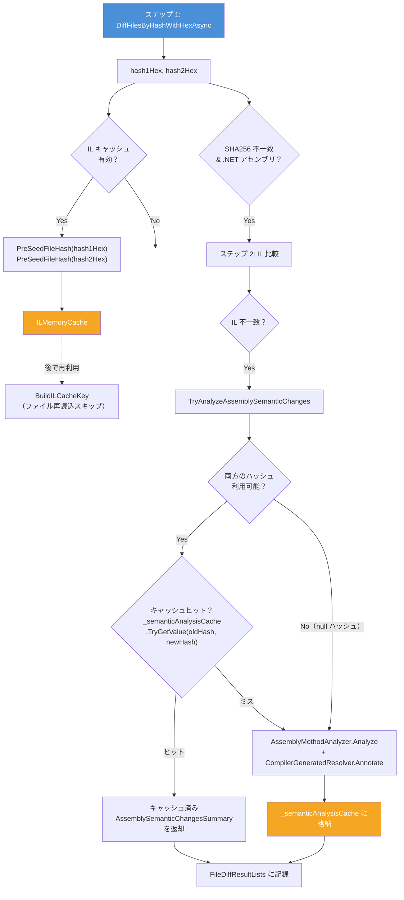

#### IL キャッシュのプリシード

IL キャッシュが有効な場合、`DiffFilesByHashWithHexAsync` 直後に 16 進エンコード済み SHA256 値（`hash1Hex`、`hash2Hex`）を `PreSeedFileHash` 経由で `ILMemoryCache` にシード登録します。これにより、IL キャッシュキー生成（`BuildILCacheKey`）時にファイルを再読み込みして SHA256 を再計算することを回避します。

#### セマンティック分析キャッシュ

`TryAnalyzeAssemblySemanticChanges` は同じ SHA256 ペアをキーとする `ConcurrentDictionary<(string OldHash, string NewHash), AssemblySemanticChangesSummary?>` を使用します。同一の old/new ハッシュペアが複数の相対パスに出現する場合（同じ DLL が複数サブディレクトリにコピーされている場合など）、`AssemblyMethodAnalyzer.Analyze` は 1 回のみ実行され、以降のルックアップではキャッシュ済みインスタンスが返されます。

キャッシュの安全性：
- `AssemblySemanticChangesSummary` は構築後に実質不変：`Entries` は `init` 専用の `IReadOnlyList<MemberChangeEntry>` であり、その他のプロパティ（`TotalChanges`、`MaxImportance`）はすべて `Entries` からの算出値。
- `CompilerGeneratedResolver.Annotate` は `Analyze()` 内でキャッシュに格納される前に実行されるため、キャッシュされたエントリはすべてアノテーション済み。
- いずれかのハッシュが利用不可（`null`）の場合はキャッシュをバイパスし、`Analyze` を無条件に実行。

### IL 行分割・フィルタの最適化

`ILOutputService.SplitAndFilterIlLines` は `Split('\n')` と `Where(filter)` の処理を 1 パスに統合し、4 つの中間リストの代わりに 1 つの `List<string>` を直接生成します。

## ソースコードのスタイル方針

文字列整形や構造化は、まず局所性と読みやすさを優先します。
- 固定書式で単発利用のメッセージは、[`string.Format(...)`](https://learn.microsoft.com/ja-jp/dotnet/api/system.string.format?view=net-8.0) より補間文字列を優先します。
- 同じ文言テンプレートを複数箇所で意図的に共有する場合のみ、共通の書式定数やヘルパーを残します。
- ドメイン非依存の helper は [`FolderDiffIL4DotNet.Core/`](../FolderDiffIL4DotNet.Core/) へ置き、[`FolderDiffIL4DotNet/Services`](../Services/) はフォルダ差分の振る舞いに集中させてください。
- プロジェクト横断で使うバイト換算値や日時フォーマットは [`FolderDiffIL4DotNet.Core/Common/CoreConstants.cs`](../FolderDiffIL4DotNet.Core/Common/CoreConstants.cs) に集約し、アプリ固有の定数は [`Common/Constants.cs`](../Common/Constants.cs) で管理してください。[`Constants.IL_MVID_LINE_PREFIX`](../Common/Constants.cs) のような IL ドメイン固有の文字列定数は [`Common/Constants.cs`](../Common/Constants.cs) に置き、複数のサービスファイルに重複定義しないようにしてください。
- `#region` は、ファイル構成や命名だけでは読みづらい具体的な事情がある場合に限って追加してください。

## アーキテクチャ概要

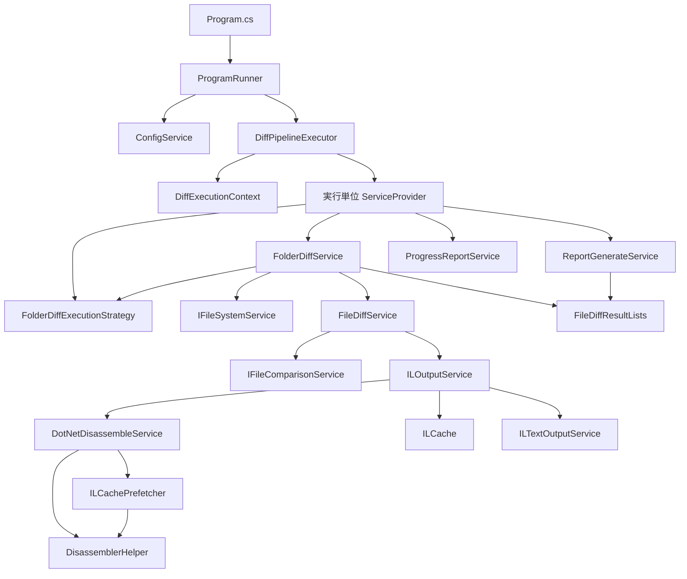

設計意図:
- [`Program.cs`](../Program.cs) は最小限に保ち、アプリ全体の起点だけを担います。
- [`ProgramRunner`](../ProgramRunner.cs) は 1 回のコンソール実行における CLI 分岐・引数検証・設定読込・終了コード写像の境界です。
- [`DiffPipelineExecutor`](../Runner/DiffPipelineExecutor.cs) は差分実行パイプラインを担当し、スコープ付き DI コンテナ構築・差分実行・全レポート生成を行います。
- [`DryRunExecutor`](../Runner/DryRunExecutor.cs) は `--dry-run` プレビューを担当し、ファイル列挙と統計表示のみを行い比較やレポート生成は行いません。
- [`DiffExecutionContext`](../Services/DiffExecutionContext.cs) は実行固有のパスとモード判定を不変オブジェクトとして保持します。
- [`FolderDiffIL4DotNet.Core`](../FolderDiffIL4DotNet.Core/) は、フォルダ差分ドメインに依存しない console / diagnostics / I/O / text helper を収める再利用境界です。
- コアサービスは、静的可変状態や場当たり的な `new` ではなく、コンストラクタ注入とインターフェースで接続されます。
- [`IFileSystemService`](../Services/IFileSystemService.cs) と [`IFileComparisonService`](../Services/IFileComparisonService.cs) が、列挙/比較 I/O を切り出す最下層の差し替えポイントです。特に [`IFileSystemService.EnumerateFiles(...)`](../Services/IFileSystemService.cs) は、巨大なフォルダでもフィルタ前に `string[]` を丸ごと確保しない遅延列挙を維持します。
- [`FolderDiffExecutionStrategy`](../Services/FolderDiffExecutionStrategy.cs) は、比較対象への取り込み条件、無視ファイル記録、自動並列度の決定を集約し、[`FolderDiffService`](../Services/FolderDiffService.cs) へポリシー知識が広がりすぎないようにします。
- [`FileDiffResultLists`](../Models/FileDiffResultLists.cs) は、差分処理とレポート生成が共有する実行単位の集約ハブです。
- [`DotNetDisassembleService`](../Services/DotNetDisassembleService.cs) は逆アセンブル実行とキャッシュヒット/ストア追跡を担い、IL キャッシュのプリフェッチは [`ILCachePrefetcher`](../Services/ILCachePrefetcher.cs) へ委譲します。コマンド判定・候補列挙・実行ファイルパス解決の共有静的ロジックは [`DisassemblerHelper`](../Services/DisassemblerHelper.cs) に集約し、両クラス間の重複を排除しています。
- [`FolderDiffService`](../Services/FolderDiffService.cs) はプリコンピュート中のキープアライブスピナーを専用の `CreateKeepAliveTask()` に分離し、`PrecomputeIlCachesAsync()` が調停ロジックに集中できるようにしています。

<a id="guide-ja-execution-lifecycle"></a>
## 実行ライフサイクル

### 起動シーケンス

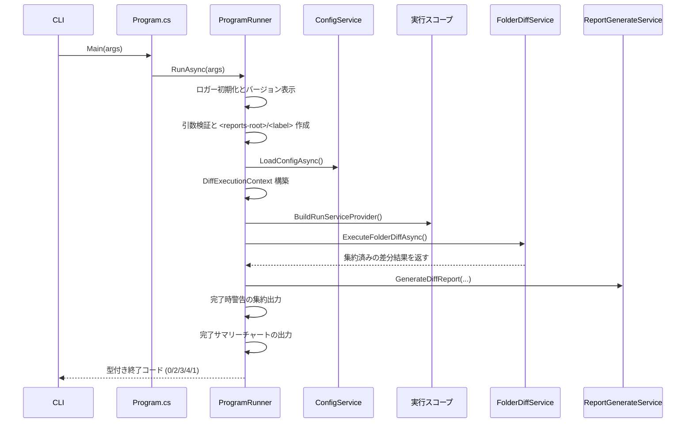

差分フェーズは [`FileDiffResultLists`](../Models/FileDiffResultLists.cs) を返し、その内容を使ってレポート生成と完了時の警告出力を行います。

### `RunAsync` の中で起きること

1. CLI オプション（`--help`、`--version`、`--banner`、`--credits`、`--print-config`、`--validate-config`、`--clear-cache`、`--open-reports`、`--open-config`、`--open-logs`、`--no-pause`、`--config`、`--output`、`--threads`、`--no-il-cache`、`--skip-il`、`--no-timestamp-warnings`、`--creator`、`--creator-il-ignore-profile`、各種スピナー、`--bell`）を解析します。
2. `--help`、`--version`、`--banner`、`--credits` のいずれかがある場合は、ロガー初期化を一切行わずに即座に出力してコード `0` で終了します。
2a. `--open-reports` / `--open-config` / `--open-logs` のいずれかがある場合は、要求されたターゲットを宣言順（reports → config → logs）で解決し、必要ならディレクトリを作成してからプラットフォームのファイルマネージャを起動し、そこで終了します。既定のルートは、`--output` / `--config` の上書きがない限り、ユーザーローカル app-data の `Reports/`・設定ディレクトリ・`Logs/` です。パス解決・ディレクトリ作成・ランチャー起動失敗は、解決済みターゲットパス（または未解決プレースホルダ）と例外種別付きの stderr を出して終了コード `4` に変換します。
2b. `--clear-cache` がある場合は、対話式キャッシュ削除ウィザードを実行します。read-only の `.ilcache` は削除前に属性を解除し、ディスクキャッシュ層と同じ削除セマンティクスで扱います。
2c. `--print-config` がある場合（`--config <path>` との併用可）、まず未知フラグ、不正な `--threads` 値、未知の `--creator-il-ignore-profile` 名のような CLI 構文エラーを終了コード `2` で拒否します。その後、有効な設定 — 明示パス、または既定ではユーザーローカル app-data `config.json` → 同梱 `config.json` の順で解決した設定に、すべての `FOLDERDIFF_*` 環境変数オーバーライドと対応する実行時 CLI オーバーライドを適用した builder 状態 — を、セマンティック検証なしでインデント付き JSON として標準出力へ書き出し、終了コード `0` で終了します。設定読込エラーと不正な `--config` パスは終了コード `3` です。
2d. `--validate-config` がある場合は、まず未知フラグ、不正な `--threads` 値、未知の `--creator-il-ignore-profile` 名のような CLI 構文エラーを終了コード `2` で拒否します。その後、その同じ解決順で設定を読み込み、`FOLDERDIFF_*` 環境変数オーバーライド適用後・実行時 CLI オーバーライド適用前の builder をセマンティック検証し、成功時は `Configuration is valid.` を出してコード `0` で終了します。不正 JSON、セマンティック検証失敗、設定ファイル不在、不正な `--config` パスはすべて終了コード `3` です。
3. ログを初期化し、アプリのバージョンを表示します。
4. `old`、`new`、`reportLabel` 引数を検証します。未知の CLI フラグはここで終了コード `2` として検出されます。
5. `<reports-root>/<label>` を早い段階で作成し、同名が既にある場合は失敗させます。既定のレポートルートは、`--output` で上書きしない限り、ユーザーローカル app-data の `Reports/` です。
6. `--config` で指定されたパス（未指定なら、まずユーザーローカル app-data `config.json` を探し、なければ [`AppContext.BaseDirectory`](https://learn.microsoft.com/ja-jp/dotNet/API/system.appcontext.basedirectory?view=net-8.0) の同梱 `config.json` にフォールバック）から設定ファイルを読み込み、ミュータブルな [`ConfigSettingsBuilder`](../Models/ConfigSettingsBuilder.cs) へデシリアライズします。デシリアライズ直後に [`ConfigService.ApplyEnvironmentVariableOverrides`](../Services/ConfigService.cs) が `FOLDERDIFF_<PROPERTYNAME>` 環境変数オーバーライド（例: `FOLDERDIFF_MAXPARALLELISM=4`）をビルダーに適用します。
7. CLI オプションをビルダーに上書き適用します。`--threads` → [`MaxParallelism`](../Models/ConfigSettingsBuilder.cs)、`--no-il-cache` → [`EnableILCache`](../Models/ConfigSettingsBuilder.cs) `= false`、`--skip-il` → [`SkipIL`](../Models/ConfigSettingsBuilder.cs) `= true`、`--no-timestamp-warnings` → [`ShouldWarnWhenNewFileTimestampIsOlderThanOldFileTimestamp`](../Models/ConfigSettingsBuilder.cs) `= false`。その後 [`ConfigSettingsBuilder.Validate()`](../Models/ConfigSettingsBuilder.cs) を呼び出し、範囲外の値がある場合は終了コード `3` で失敗させます。最後に [`ConfigSettingsBuilder.Build()`](../Models/ConfigSettingsBuilder.cs) がイミュータブルな [`ConfigSettings`](../Models/ConfigSettings.cs) インスタンスを生成し、以降の実行で使用します。
8. [`TimestampCache`](../Services/Caching/TimestampCache.cs) などの一時共有ヘルパーをクリアします。
9. ネットワーク共有判定を含む [`DiffExecutionContext`](../Services/DiffExecutionContext.cs) を組み立てます。
10. 実行単位の DI コンテナを構築します。
11. フォルダ比較を実行し、進捗表示を終了します。
12. 集約結果から [`diff_report.md`](samples/diff_report.md) を生成します。
13. [`ShouldGenerateHtmlReport`](../Models/ConfigSettings.cs) が `true`（既定）のとき、集約結果から [`diff_report.html`](samples/diff_report.html) を生成します。HTML ファイルは localStorage 自動保存およびダウンロード機能を持つ自己完結型インタラクティブレビュードキュメントです。
14. フェーズ結果をプロセス終了コードへ変換します。成功は `0`、CLI/入力パス不正は `2`、設定読込/解析/バリデーション失敗は `3`、差分実行/レポート生成失敗は `4`、分類外の想定外エラーだけを `1` にします。

実装上は、`RunAsync()` 自体を短く保つため、これらを明示的なフェーズとして private helper へ分割しています。

失敗時の扱い:
- [`ProgramRunner`](../ProgramRunner.cs) はアプリ境界で小さな型付き Result を使い、すべての失敗を 1 つの終了コードへ潰さないようにしています。
- 引数検証エラー、未知フラグ、入力パス不足/不正は終了コード `2` です。
- [`ConfigService`](../Services/ConfigService.cs) の明示設定パス不在、既定設定候補の両方不在、解析失敗、設定読込 I/O 失敗、または [`ConfigSettingsBuilder.Validate()`](../Models/ConfigSettingsBuilder.cs) を ProgramRunner 側で評価した結果の失敗は終了コード `3` です。
- 差分実行やレポート生成の失敗、さらに IL 比較由来の致命的な [`InvalidOperationException`](https://learn.microsoft.com/ja-jp/dotnet/api/system.invalidoperationexception?view=net-8.0) は終了コード `4` です。
- 明示分類から漏れた想定外の内部エラーだけを終了コード `1` として扱います。
- IL 比較由来の [`InvalidOperationException`](https://learn.microsoft.com/ja-jp/dotnet/api/system.invalidoperationexception?view=net-8.0) は致命的な例外扱いとし、実行全体を止めるものとします。
- [`FolderDiffService.ExecuteFolderDiffAsync()`](../Services/FolderDiffService.cs) は、パス検証エラーや [`DirectoryNotFoundException`](https://learn.microsoft.com/ja-jp/dotnet/api/system.io.directorynotfoundexception?view=net-8.0)、[`IOException`](https://learn.microsoft.com/ja-jp/dotnet/api/system.io.ioexception?view=net-8.0)、[`UnauthorizedAccessException`](https://learn.microsoft.com/ja-jp/dotnet/api/system.unauthorizedaccessexception?view=net-8.0)、[`NotSupportedException`](https://learn.microsoft.com/ja-jp/dotnet/api/system.notsupportedexception?view=net-8.0) などの想定される実行時例外を error として記録して再スローします。本当に想定外の例外だけを別文言の "unexpected error" として記録します。
- プリフライト書込権限チェック（[`CheckReportsParentWritableOrThrow`](../Runner/RunPreflightValidator.cs)）は、[`UnauthorizedAccessException`](https://learn.microsoft.com/ja-jp/dotnet/api/system.unauthorizedaccessexception?view=net-8.0) と [`IOException`](https://learn.microsoft.com/ja-jp/dotnet/api/system.io.ioexception?view=net-8.0) の両方を原因別メッセージとともにログ出力して再スローします。I/O エラーは一切握りつぶしません。
- 出力ファイルの読み取り専用化はベストエフォートで、失敗しても警告止まりです。

<a id="guide-ja-di-layout"></a>
## Dependency Injection 構成

### ルートコンテナ

[`Program.cs`](../Program.cs) で登録:
- [`ILoggerService`](../Services/ILoggerService.cs) -> [`LoggerService`](../Services/LoggerService.cs)
- [`ConfigService`](../Services/ConfigService.cs)
- [`ProgramRunner`](../ProgramRunner.cs)

このルートコンテナは意図的に小さく保ち、実行固有のサービスを溜め込まないようにしています。

### 実行単位コンテナ

[`RunScopeBuilder.Build(...)`](../Runner/RunScopeBuilder.cs) で登録:
- 実行スコープ内シングルトン
- [`IReadOnlyConfigSettings`](../Models/IReadOnlyConfigSettings.cs)（[`ConfigSettingsBuilder`](../Models/ConfigSettingsBuilder.cs) から構築されたイミュータブルな [`ConfigSettings`](../Models/ConfigSettings.cs)）
- [`DiffExecutionContext`](../Services/DiffExecutionContext.cs)
- [`ILoggerService`](../Services/ILoggerService.cs)（共有ロガー）
- スコープサービス
- [`FileDiffResultLists`](../Models/FileDiffResultLists.cs)
- [`DotNetDisassemblerCache`](../Services/Caching/DotNetDisassemblerCache.cs)
- [`ILCache`](../Services/Caching/ILCache.cs)（無効時は `null`）
- [`ProgressReportService`](../Services/ProgressReportService.cs)
- [`ReportGenerateService`](../Services/ReportGenerateService.cs)
- [`HtmlReportGenerateService`](../Services/HtmlReportGenerateService.cs)
- [`AuditLogGenerateService`](../Services/AuditLogGenerateService.cs)
- [`SbomGenerateService`](../Services/SbomGenerateService.cs)
- [`IReportFormatter`](../Services/IReportFormatter.cs) / [`MarkdownReportFormatter`](../Services/ReportFormatters/MarkdownReportFormatter.cs)、[`HtmlReportFormatter`](../Services/ReportFormatters/HtmlReportFormatter.cs)、[`AuditLogReportFormatter`](../Services/ReportFormatters/AuditLogReportFormatter.cs)、[`SbomReportFormatter`](../Services/ReportFormatters/SbomReportFormatter.cs)
- [`IFileSystemService`](../Services/IFileSystemService.cs) / [`FileSystemService`](../Services/FileSystemService.cs)
- [`IFolderDiffExecutionStrategy`](../Services/IFolderDiffExecutionStrategy.cs) / [`FolderDiffExecutionStrategy`](../Services/FolderDiffExecutionStrategy.cs)
- [`IFileComparisonService`](../Services/IFileComparisonService.cs) / [`FileComparisonService`](../Services/FileComparisonService.cs)
- [`IILTextOutputService`](../Services/ILOutput/IILTextOutputService.cs) / [`ILTextOutputService`](../Services/ILOutput/ILTextOutputService.cs)
- [`IDotNetDisassembleService`](../Services/IDotNetDisassembleService.cs) / [`DotNetDisassembleService`](../Services/DotNetDisassembleService.cs)
- [`IILOutputService`](../Services/IILOutputService.cs) / [`ILOutputService`](../Services/ILOutputService.cs)
- [`IFileDiffService`](../Services/IFileDiffService.cs) / [`FileDiffService`](../Services/FileDiffService.cs)
- [`IFolderDiffService`](../Services/IFolderDiffService.cs) / [`FolderDiffService`](../Services/FolderDiffService.cs)
- [`IDisassemblerProvider`](../FolderDiffIL4DotNet.Plugin.Abstractions/IDisassemblerProvider.cs) / [`DotNetDisassemblerProvider`](../Services/DotNetDisassemblerProvider.cs)

この構成が重要な理由:
- 実行ごとに、差分結果を保持する [`FileDiffResultLists`](../Models/FileDiffResultLists.cs) と、old/new で同じ逆アセンブラを使うための内部状態やキャッシュは新しく作られ、前回の実行内容を引き継ぎません。
- テストでインターフェース差し替えがしやすくなります。
- 実行時パスやモード判定が明示的で不変になります。

## 主要ファイルの責務

| ファイル | 主な責務 | 補足 |
| --- | --- | --- |
| [`Program.cs`](../Program.cs) | アプリ起動点 | 薄いまま維持する |
| [`ProgramRunner.cs`](../ProgramRunner.cs) | CLI 分岐、引数検証、設定読込、終了コード写像 | ヘルプテキストは [`ProgramRunner.HelpText.cs`](../Runner/ProgramRunner.HelpText.cs)、設定読込/バリデーションは [`ProgramRunner.Config.cs`](../Runner/ProgramRunner.Config.cs)、ドラッグ＆ドロップパス正規化（`NormalizeDragDropPath`）付き対話ウィザードは [`ProgramRunner.Wizard.cs`](../Runner/ProgramRunner.Wizard.cs)、フォルダ開放コマンドは [`ProgramRunner.OpenFolder.cs`](../Runner/ProgramRunner.OpenFolder.cs) |
| [`Runner/CliOverrideApplier.cs`](../Runner/CliOverrideApplier.cs) | CLI オプション → 設定ビルダーへのオーバーライド適用 | スピナーテーマロジックを `SpinnerThemes` に委譲 |
| [`Runner/SpinnerThemes.cs`](../Runner/SpinnerThemes.cs) | スピナーアニメーションテーマの定義と適用 | 7テーマ（coffee, beer, matcha, whisky, wine, ramen, sushi）+ ランダム選択 |
| [`Runner/DiffPipelineExecutor.cs`](../Runner/DiffPipelineExecutor.cs) | 差分実行パイプラインとレポート生成 | スコープ付き DI コンテナ構築・差分実行・任意の review checklist snapshot の run ごと 1 回解決・Markdown/HTML/監査ログの全レポート生成 |
| [`Runner/DryRunExecutor.cs`](../Runner/DryRunExecutor.cs) | `--dry-run` 事前プレビュー | ファイル列挙・ユニオン数/アセンブリ候補数算出・拡張子内訳表示を比較実行なしで行う |
| [`FolderDiffIL4DotNet.Core/`](../FolderDiffIL4DotNet.Core/) | 再利用可能な console / diagnostics / I/O / text helper | フォルダ差分ドメインのポリシーを持たない |
| [`FolderDiffIL4DotNet.Core/Text/EncodingDetector.cs`](../FolderDiffIL4DotNet.Core/Text/EncodingDetector.cs) | ファイルエンコーディング自動検出（BOM・UTF-8 検証・ANSI フォールバック） | インライン差分で非 UTF-8 ファイル（Shift_JIS 等）を正しく読むために使用；`System.Text.Encoding.CodePages` が必要 |
| [`Services/DiffExecutionContext.cs`](../Services/DiffExecutionContext.cs) | 実行固有パスとネットワークモードの保持 | 可変状態を持たない |
| [`Services/FolderDiffService.cs`](../Services/FolderDiffService.cs) | フォルダ差分全体の調停と結果振り分け | 進捗と Added/Removed もここ |
| [`Services/FolderDiffExecutionStrategy.cs`](../Services/FolderDiffExecutionStrategy.cs) | 列挙フィルタと自動並列度ポリシー | 無視拡張子適用とネットワーク考慮の並列度決定を担当 |
| [`Services/IFileSystemService.cs`](../Services/IFileSystemService.cs) + [`Services/FileSystemService.cs`](../Services/FileSystemService.cs) | 列挙/出力系ファイルシステム抽象 | フォルダ単位ユニットテスト向け。遅延列挙もここで扱う |
| [`Services/FileDiffService.cs`](../Services/FileDiffService.cs) | ファイル単位の判定木 | `SHA256 -> IL -> text -> fallback` |
| [`Services/IFileComparisonService.cs`](../Services/IFileComparisonService.cs) + [`Services/FileComparisonService.cs`](../Services/FileComparisonService.cs) | ファイル単位の比較/判定 I/O 抽象 | ファイル単位ユニットテスト向け |
| [`Services/ILOutputService.cs`](../Services/ILOutputService.cs) | IL 比較、行除外、ブロック単位順序非依存比較、任意 IL 出力、IL フィルタ文字列安全性検証 | 同一逆アセンブラ制約を保証；行順序が異なる場合はブロック単位マルチセット比較にフォールバック；`ValidateILFilterStrings` が短すぎるフィルタ文字列（4 文字未満）を警告 |
| [`Services/ILOutput/ILBlockParser.cs`](../Services/ILOutput/ILBlockParser.cs) | IL 逆アセンブリ出力を論理ブロック（メソッド、クラス、プロパティ）に分割 | `ILOutputService.BlockAwareSequenceEqual` で順序非依存比較に使用 |
| [`Services/AssemblyMethodAnalyzer.cs`](../Services/AssemblyMethodAnalyzer.cs) | `System.Reflection.Metadata` によるメソッドレベル変更検出 | ベストエフォート；失敗時は `null` を返す（オプショナル `onError` コールバックで例外詳細を報告）。ジェネリクスシグネチャはアリティ接尾辞除去、ネスト型参照解決、ジェネリック基底型/インターフェースの `TypeSpecification` デコードにより完全解決。型・メソッド・プロパティ・フィールドの追加・削除・変更（アクセス修飾子変更、修飾子変更、型変更、IL ボディ変更）を検出。各エントリは [`ChangeImportanceClassifier`](../Services/ChangeImportanceClassifier.cs) により自動分類 |
| [`Services/CompilerGeneratedResolver.cs`](../Services/CompilerGeneratedResolver.cs) | コンパイラ生成型/メンバーにユーザー記述元を注釈 | async ステートマシン、ディスプレイクラス、ラムダメソッド、バッキングフィールド、ローカル関数、record クローン/合成メンバーを人間可読な説明に解決。`AssemblyMethodAnalyzer.Analyze` の後処理ステップとして呼び出される |
| [`Services/ChangeImportanceClassifier.cs`](../Services/ChangeImportanceClassifier.cs) | `MemberChangeEntry` のルールベース重要度分類器 | 変更種別・アクセス修飾子・アロー表記フィールド変更に基づき `High` / `Medium` / `Low` の [`ChangeImportance`](../Models/ChangeImportance.cs) を付与 |
| [`Models/ChangeImportance.cs`](../Models/ChangeImportance.cs) | 変更の重要度列挙型 | `Low=0`, `Medium=1`, `High=2`；`MemberChangeEntry.Importance` およびレポート表示に使用 |
| [`Services/ChangeTagClassifier.cs`](../Services/ChangeTagClassifier.cs) | ヒューリスティック変更パターン分類器 | セマンティック解析と依存関係データから [`ChangeTag`](../Models/ChangeTag.cs) ラベル（Extract、Inline、Move、Rename、Signature、Access、BodyEdit、DepUpdate、+Method、-Method、+Type、-Type）を推定；[`FileDiffService`](../Services/FileDiffService.cs) がセマンティック/依存関係解析後に呼び出す |
| [`Models/ChangeTag.cs`](../Models/ChangeTag.cs) | 変更タグ列挙型 | 推定変更パターンを表す12値；レポートの「Estimated Change」列に表示 |
| [`Services/DotNetDisassembleService.cs`](../Services/DotNetDisassembleService.cs) | ツール探索、逆アセンブル実行、キャッシュヒット/ストア追跡、ブラックリスト | 外部ツール境界；プリフェッチは [`ILCachePrefetcher`](../Services/ILCachePrefetcher.cs) へ委譲 |
| [`Services/ILCachePrefetcher.cs`](../Services/ILCachePrefetcher.cs) | IL キャッシュのプリフェッチ（全候補コマンド×引数パターンの事前ヒット確認） | [`DotNetDisassembleService`](../Services/DotNetDisassembleService.cs) から分離；独自のヒットカウンタを保持 |
| [`Services/DisassemblerHelper.cs`](../Services/DisassemblerHelper.cs) | 共有静的ヘルパー：コマンド判定・候補列挙・実行ファイルパス解決・利用可否プローブ | [`DotNetDisassembleService`](../Services/DotNetDisassembleService.cs) と [`ILCachePrefetcher`](../Services/ILCachePrefetcher.cs) の両方が使用；`ProbeAllCandidates()` はレポートヘッダ用に [`DisassemblerProbeResult`](../Models/DisassemblerProbeResult.cs) リストを返す；インスタンス状態なし |
| [`Models/DisassemblerProbeResult.cs`](../Models/DisassemblerProbeResult.cs) | 逆アセンブラ利用可否プローブ結果レコード | `ToolName`, `Available`, `Version`, `Path`；[`FileDiffResultLists.DisassemblerAvailability`](../Models/FileDiffResultLists.cs) に格納 |
| [`Services/DisassemblerBlacklist.cs`](../Services/DisassemblerBlacklist.cs) | ツール別失敗数管理・設定可能な TTL ブラックリスト | スレッドセーフな [`ConcurrentDictionary`](https://learn.microsoft.com/ja-jp/dotnet/api/system.collections.concurrent.concurrentdictionary-2?view=net-8.0)；TTL は設定値 [`DisassemblerBlacklistTtlMinutes`](../Models/ConfigSettings.cs) を使用 |
| [`Services/Caching/ILCache.cs`](../Services/Caching/ILCache.cs) | IL キャッシュの公開 API と調停 | メモリ/ディスクの詳細は専用コンポーネントへ委譲 |
| [`Services/Caching/ILMemoryCache.cs`](../Services/Caching/ILMemoryCache.cs) | メモリ上の IL / SHA256 キャッシュ | LRU と TTL を担当 |
| [`Services/Caching/ILDiskCache.cs`](../Services/Caching/ILDiskCache.cs) | IL キャッシュのディスク永続化とクォータ制御 | キャッシュファイル I/O とトリミングを担当。recoverable warning にはキャッシュディレクトリと cache key 長も残す |
| [`Services/Caching/DotNetDisassemblerCache.cs`](../Services/Caching/DotNetDisassemblerCache.cs) | 逆アセンブラ バージョン文字列キャッシュ | バージョン取得のプロセス起動コストを回避 |
| [`Services/Caching/TimestampCache.cs`](../Services/Caching/TimestampCache.cs) | メモリ内ファイル最終更新日時キャッシュ | 静的；実行サイクルごとにクリアし I/O を削減 |
| [`Services/ReviewChecklistLoader.cs`](../Services/ReviewChecklistLoader.cs) | 任意の review checklist snapshot ローダー | ユーザーローカル `HtmlReport/checklist.json` を run ごとに 1 回だけ解決し、複数行項目を正規化した snapshot を Markdown / HTML レポート生成の両方で共有する |
| [`Services/ReportGenerationContext.cs`](../Services/ReportGenerationContext.cs) | レポート生成サービス用の不変パラメータバッグ | `ProgramRunner` 境界での引数重複を排除 |
| [`Services/ReportGenerateService.cs`](../Services/ReportGenerateService.cs) | Markdown レポート生成 | [`FileDiffResultLists`](../Models/FileDiffResultLists.cs) を読むだけ；`_sectionWriters` を [`IReportSectionWriter`](../Services/IReportSectionWriter.cs) 経由で反復 |
| [`Services/IReportSectionWriter.cs`](../Services/IReportSectionWriter.cs) + [`Services/ReportWriteContext.cs`](../Services/ReportWriteContext.cs) | セクション単位のレポート書き込みインターフェイスとコンテキスト | [`ReportGenerateService`](../Services/ReportGenerateService.cs) 内に 10 個のプライベートネストクラスで実装 |
| [`Services/HtmlReportGenerateService.cs`](../Services/HtmlReportGenerateService.cs) | インタラクティブ HTML レビューレポート生成 | [`FileDiffResultLists`](../Models/FileDiffResultLists.cs) を読むだけ；チェックボックス・テキスト入力・localStorage 自動保存・ダウンロード機能を持つ自己完結型 [`diff_report.html`](samples/diff_report.html) を生成；インラインスタイルの代わりに CSS カスタムプロパティ（`var(--color-*)`）とユーティリティクラスを使用しテーマ対応レンダリングを実現；`prefers-color-scheme` による自動ダークモード対応；「Download as reviewed」は Web Crypto API でレビュー済み HTML の SHA256 を計算・埋め込み（自己検証用）、コンパニオン `.sha256` 検証ファイルもダウンロードし、レビュー済みバナーに「Verify integrity」ボタンを追加；回復可能な inline-diff warning には skip 元が `TextMismatch` か `ILMismatch` かも残す；[`ShouldGenerateHtmlReport`](../Models/ConfigSettings.cs) が `false` のときはスキップ |
| [`Services/AuditLogGenerateService.cs`](../Services/AuditLogGenerateService.cs) | 構造化 JSON 監査ログ生成 | [`FileDiffResultLists`](../Models/FileDiffResultLists.cs) を読み、`diff_report.md` / `diff_report.html` の SHA256 インテグリティハッシュを計算；[`audit_log.json`](samples/audit_log.json) を生成；回復可能 warning には reports folder と skip された entry の root path も残す；[`ShouldGenerateAuditLog`](../Models/ConfigSettings.cs) が `false` のときはスキップ |
| [`Services/SbomGenerateService.cs`](../Services/SbomGenerateService.cs) | SBOM（ソフトウェア部品表）生成 | [`FileDiffResultLists`](../Models/FileDiffResultLists.cs) からコンポーネント一覧を SHA256 ハッシュと差分ステータス付きで抽出；CycloneDX 1.5 JSON（`sbom.cdx.json`）または SPDX 2.3 JSON（`sbom.spdx.json`）を出力；回復可能 warning には出力形式と skip されたコンポーネントの old/new 由来も残す；[`ShouldGenerateSbom`](../Models/ConfigSettings.cs) が `false` のときはスキップ |
| [`Models/AuditLogEntry.cs`](../Models/AuditLogEntry.cs) | 監査ログデータモデル | [`AuditLogRecord`](../Models/AuditLogEntry.cs)（トップレベル）、[`AuditLogFileEntry`](../Models/AuditLogEntry.cs)（ファイル単位）、[`AuditLogSummary`](../Models/AuditLogEntry.cs)（件数集計） |
| [`Models/SbomModels.cs`](../Models/SbomModels.cs) | SBOM データモデル | CycloneDX 1.5 モデル（[`CycloneDxBom`](../Models/SbomModels.cs)、[`CycloneDxComponent`](../Models/SbomModels.cs)）、SPDX 2.3 モデル（[`SpdxDocument`](../Models/SbomModels.cs)、[`SpdxPackage`](../Models/SbomModels.cs)）、[`SbomFormat`](../Models/SbomModels.cs) 列挙型 |
| [`Services/ProgressReportService.cs`](../Services/ProgressReportService.cs) | コンソール進捗表示、フェーズ追跡、経過時間ログ | フェーズ番号付き進捗（`[current/total]`）、キープアライブスピナースロットリング、固定長 ETA 表示（`ETA HH:mm (+00 h 12 m)`）、Dispose 時の最終フェーズログ |
| [`Services/LoggerService.cs`](../Services/LoggerService.cs) | テキスト/JSON 形式のファイル/コンソールログ | W3C Trace Context（`traceId`/`spanId`）、保持設定文脈付きの古いログファイルクリーンアップ warning、読み取り専用ログファイル対応、並行呼び出し安全性 |
| [`Services/NuGetVulnerabilityService.cs`](../Services/NuGetVulnerabilityService.cs) | NuGet V3 脆弱性 API 統合 | セッション単位キャッシュのインデックス/ページダウンロード、パッケージ別旧/新バージョン脆弱性チェック、アドバイザリ重複排除、best-effort 失敗時に index URL と entry/package 件数も残す warning ログ |
| [`Models/FileDiffResultLists.cs`](../Models/FileDiffResultLists.cs) | スレッドセーフな結果集約 | 実行単位の共有状態；partial ファイル分割: [`FileDiffResultLists.ComparisonResults.cs`](../Models/FileDiffResultLists.ComparisonResults.cs)（差分詳細、逆アセンブララベル、除外ファイル）、[`FileDiffResultLists.Metadata.cs`](../Models/FileDiffResultLists.Metadata.cs)（セマンティック変更、依存関係変更、警告、逆アセンブラ情報） |

<a id="guide-ja-comparison-pipeline"></a>
## 比較パイプライン

### フォルダ単位のルーティング

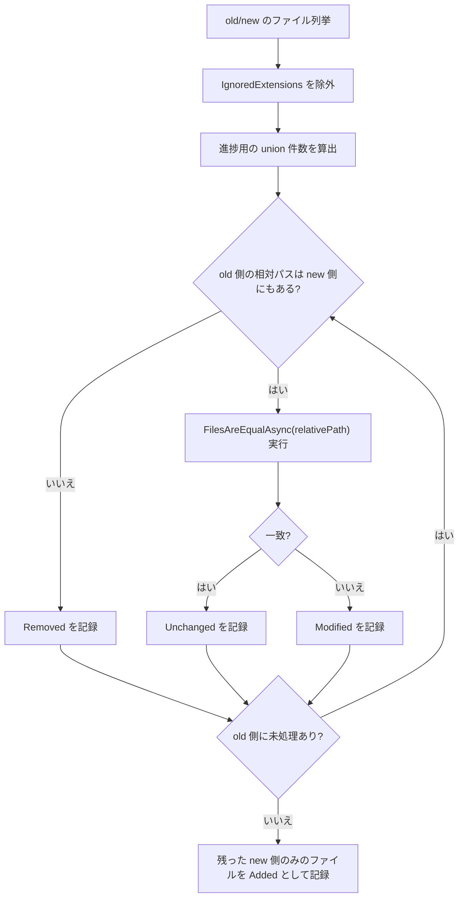

実装上の補足:
- [`FolderDiffService.ExecuteFolderDiffAsync()`](../Services/FolderDiffService.cs) は実行単位の集計を初期化し、その後 [`FolderDiffExecutionStrategy`](../Services/FolderDiffExecutionStrategy.cs) へ [`IgnoredExtensions`](../Models/ConfigSettings.cs) 適用済み old/new 一覧の列挙と相対パス和集合件数の算出を委譲します。
- 列挙は [`IFileSystemService.EnumerateFiles(...)`](../Services/IFileSystemService.cs) 経由の遅延列挙で進むため、巨大フォルダでも全件配列化してからフィルタする構造を避けています。
- `PrecomputeIlCachesAsync()` はファイルごとの本判定より前に走り、逆アセンブラや IL キャッシュのウォームアップを先に済ませます。あわせて、大規模ツリーでも old/new 全件の追加リストをもう 1 本作らないよう、重複排除済みパスを設定可能なバッチ単位で流します。
- 走査の主導権は old 側にあります。new 側に対応がなければ `Removed`、最後まで `remainingNewFilesAbsolutePathHashSet` に残ったものが `Added` です。
- 並列実行で変わるのは処理順序だけです。高コストな比較に入る前に new 側の集合から対象の相対パスを外すため、最終的な分類結果のルール自体は逐次実行時と変わりません。
- `Unchanged` と `Modified` は `FilesAreEqualAsync(relativePath, maxParallel)` の bool 戻り値だけで決まり、詳細理由は別途 [`FileDiffResultLists`](../Models/FileDiffResultLists.cs) に記録されます。

### ファイル単位の判定木

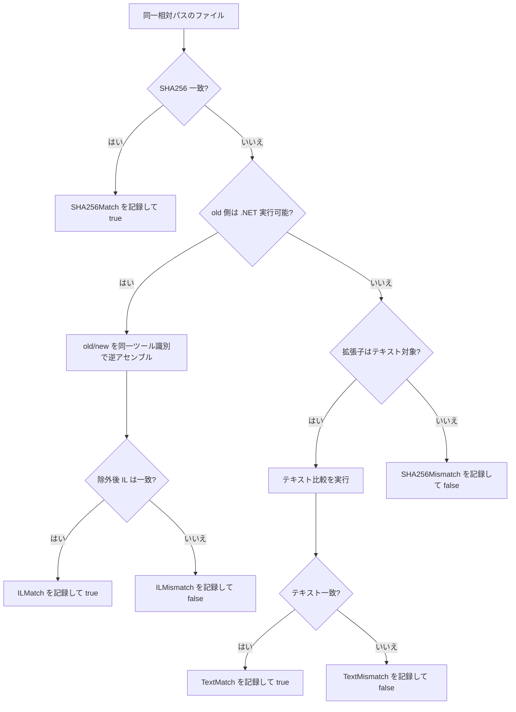

壊しやすい前提:
- 1 ファイルで最初に確定した分類がそのファイルの最終分類です。
- IL 比較は SHA256 不一致の後、かつ .NET 実行可能ファイルにのみ進みます。
- IL 比較では [`Constants.IL_MVID_LINE_PREFIX`](../Common/Constants.cs)（`// MVID:`）で始まる行を常に無視します。これは逆アセンブラが出力する Module Version ID メタデータで、再ビルドのたびに変わり得るため、アセンブリの中身が実質的に同じでも、この行だけで差分ありと判定されてしまうことがあるためです。
- 追加の IL 行無視は部分一致で、大文字小文字を区別します（`StringComparison.Ordinal`）。
- old/new の IL 比較は、同じ逆アセンブラ識別子とバージョン表記でなければなりません。
- テキスト比較は、並列チャンク経路で例外が出た場合に逐次比較へフォールバックします。この挙動は、並列比較側で例外を握りつぶさず `FilesAreEqualAsync(...)` まで伝播させる前提で成り立っています。

ファイル単位の実装メモ:
- [`FileDiffService.FilesAreEqualAsync(...)`](../Services/FileDiffService.cs) は、`.NET 実行可能か` の判定、拡張子判定、サイズ閾値判定の基準として old 側絶対パスを使います。
- 通常実行時の `.NET 実行可能判定`、SHA256/テキスト比較、サイズ取得、チャンク読み出しは [`IFileComparisonService`](../Services/IFileComparisonService.cs) を通して行われます。これは、[`FileDiffService`](../Services/FileDiffService.cs) が比較処理の具体実装に直接依存せず、テストでは [`IFileComparisonService`](../Services/IFileComparisonService.cs) をモックやスタブに差し替えられるようにするためです。既定実装の [`FileComparisonService`](../Services/FileComparisonService.cs) は、これらの処理を [`DotNetDetector`](../FolderDiffIL4DotNet.Core/Diagnostics/DotNetDetector.cs) と [`FileComparer`](../FolderDiffIL4DotNet.Core/IO/FileComparer.cs) に委譲します。
- `FileDiffService` の想定内/想定外エラーはどちらも再スローされますが、error ログには相対パス、最後に進んでいた比較段階（`BeforeCompare` フック / SHA256 / IL / text / `AfterCompare` フック）、`SkipIL`、`MaxParallel` も残します。用途は診断のみで、分類フロー自体は変更しません。
- [`DotNetDetector.DetectDotNetExecutable(...)`](../FolderDiffIL4DotNet.Core/Diagnostics/DotNetDetector.cs) は `NotDotNetExecutable` と `Failed` を区別します。[`FileDiffService`](../Services/FileDiffService.cs) は `Failed` の場合に warning を出して IL 経路をスキップします。
- [`DotNetDisassemblerProvider`](../Services/DotNetDisassemblerProvider.cs) も、recoverable な managed-assembly 判定失敗や委譲先逆アセンブル失敗を provider 表示名とファイル拡張子付き warning として記録したうえで、`false` / 失敗 `DisassemblyResult` を返して他 provider や非 IL 経路へ処理を渡します。
- SHA256 が一致した時点で `SHA256Match` を記録して即終了し、その後に IL やテキスト比較へは進みません。
- IL 経路は [`ILOutputService.DiffDotNetAssembliesAsync(...)`](../Services/ILOutputService.cs) に委譲され、内部で `DisassemblePairWithSameDisassemblerAsync(...)`、比較用ラベル正規化、行除外、任意の IL テキスト出力までをまとめて担当します。
- [`RealDisassemblerE2ETests`](../FolderDiffIL4DotNet.Tests/Services/RealDisassemblerE2ETests.cs) では、この境界を推奨ツール経路付きで確認します。`Deterministic=false` の小さなクラスライブラリを 2 回ビルドして DLL バイト列が異なることを確認したうえで、[`dotnet-ildasm`](https://www.nuget.org/packages/dotnet-ildasm/) のフィルタ後 IL では `ILMatch` になることを検証します。
- `BuildComparisonDisassemblerLabel(...)` は正しさの一部です。old/new でツール識別やバージョン表記がずれた場合は、その比較を認めず [`InvalidOperationException`](https://learn.microsoft.com/ja-jp/dotnet/api/system.invalidoperationexception?view=net-8.0) にします。
- `ShouldExcludeIlLine(...)` は [`Constants.IL_MVID_LINE_PREFIX`](../Common/Constants.cs)（`// MVID:`）で始まる行を必ず除外します。さらに [`ShouldIgnoreILLinesContainingConfiguredStrings`](../Models/ConfigSettings.cs) が `true` の場合は、[`ILIgnoreLineContainingStrings`](../Models/ConfigSettings.cs) に設定された文字列を trim・重複排除したうえで、`StringComparison.Ordinal` の部分一致で除外します。
- `.NET` 実行可能として IL 比較の対象にならず、かつ拡張子が [`TextFileExtensions`](../Models/ConfigSettings.cs) に含まれるファイルは、テキストファイルとして比較します。このとき [`TextDiffParallelThresholdKilobytes`](../Models/ConfigSettings.cs) と [`TextDiffChunkSizeKilobytes`](../Models/ConfigSettings.cs) を実効バイト数に変換し、比較方法を決めます。
- [`OptimizeForNetworkShares`](../Models/ConfigSettings.cs) が有効な場合は、ネットワーク共有上でチャンクごとに何度もファイルを開閉するコストを避けるため、ファイルサイズにかかわらず `DiffTextFilesAsync(...)` による逐次比較を使います。ローカル最適化時は old 側ファイルのサイズを基準にし、[`TextDiffParallelThresholdKilobytes`](../Models/ConfigSettings.cs) 未満なら逐次比較、以上なら [`TextDiffChunkSizeKilobytes`](../Models/ConfigSettings.cs) ごとの固定長チャンクに分割して `DiffTextFilesParallelAsync(...)` で並列比較します。
- [`TextDiffParallelMemoryLimitMegabytes`](../Models/ConfigSettings.cs) が `0` より大きい場合、[`FileDiffService`](../Services/FileDiffService.cs) はそれを並列テキスト比較で追加確保してよいバッファ予算として扱い、その時点の managed heap 使用量をログへ残しつつ、実効ワーカー数を下げるか逐次比較へフォールバックします。
- 並列チャンク比較の途中で [`ArgumentOutOfRangeException`](https://learn.microsoft.com/ja-jp/dotnet/api/system.argumentoutofrangeexception?view=net-8.0)、[`IOException`](https://learn.microsoft.com/ja-jp/dotnet/api/system.io.ioexception?view=net-8.0)、[`UnauthorizedAccessException`](https://learn.microsoft.com/ja-jp/dotnet/api/system.unauthorizedaccessexception?view=net-8.0)、[`NotSupportedException`](https://learn.microsoft.com/ja-jp/dotnet/api/system.notsupportedexception?view=net-8.0) のいずれかが出た場合は、warning を記録したうえで `DiffTextFilesAsync(...)` による逐次比較へフォールバックします。したがって `DiffTextFilesParallelAsync(...)` 側でこれらの例外を `false` に置き換えて握りつぶすと、呼び出し元はフォールバックできません。
- IL 比較対象でもテキスト比較対象でもないファイルは、SHA256 不一致の時点で `SHA256Mismatch` が最終結果です。`SHA256Mismatch` は実行完了時の集約警告の対象でもあり、レポートでは末尾の `Warnings` セクションに出力されます。詳細テーブル（`[ ! ] Modified Files — SHA256Mismatch (Manual Review Recommended)`）は警告メッセージの直下に配置されます。`Warnings` セクションの各警告メッセージは、対応する詳細テーブルの直上に配置されます（インターリーブレイアウト）。現状はその先の汎用バイナリ差分はありません。
- **Modified と判定されたファイル**について、[`ShouldWarnWhenNewFileTimestampIsOlderThanOldFileTimestamp`](../Models/ConfigSettings.cs) が `true` かつ new 側の更新日時が old 側より古い場合は、比較結果とは別に更新日時逆転の警告が記録されます。このチェックは `FilesAreEqualAsync` が `false` を返した後にのみ実行されます。Unchanged ファイルは評価されません。この警告は実行完了時にコンソールへ集約出力され、レポートでは `SHA256Mismatch` 警告の後に更新日時が逆転したファイルの一覧として `Warnings` セクションへ出力されます。

失敗時の扱い:
- IL 比較で発生した [`InvalidOperationException`](https://learn.microsoft.com/ja-jp/dotnet/api/system.invalidoperationexception?view=net-8.0) は、ログを出力したうえで意図的に再送出されます。これは IL ツールの不整合やセットアップ不備を致命的な例外として扱い、実行全体を停止させるためです。
- [`DotNetDetector.DetectDotNetExecutable(...)`](../FolderDiffIL4DotNet.Core/Diagnostics/DotNetDetector.cs) の失敗は致命的な例外とは扱いません。警告ログを出力して IL 比較だけをスキップし、その後のテキスト比較または `SHA256Mismatch` 判定へ進みます。
- `FilesAreEqualAsync(...)` が [`FileNotFoundException`](https://learn.microsoft.com/ja-jp/dotnet/api/system.io.filenotfoundexception?view=net-8.0) をスローした場合は、[`FolderDiffService`](../Services/FolderDiffService.cs) 内でキャッチされます。これは列挙後・比較前に new 側ファイルが削除された場合に発生し、該当ファイルを `Removed` として分類し、警告を記録して走査を継続します。列挙時に発生する [`IOException`](https://learn.microsoft.com/ja-jp/dotnet/api/system.io.ioexception?view=net-8.0)（シンボリックリンクのループなど）とは異なり、実行全体を停止させません。
- `FilesAreEqualAsync(...)` では、[`DirectoryNotFoundException`](https://learn.microsoft.com/ja-jp/dotnet/api/system.io.directorynotfoundexception?view=net-8.0)、[`IOException`](https://learn.microsoft.com/ja-jp/dotnet/api/system.io.ioexception?view=net-8.0)、[`UnauthorizedAccessException`](https://learn.microsoft.com/ja-jp/dotnet/api/system.unauthorizedaccessexception?view=net-8.0)、[`NotSupportedException`](https://learn.microsoft.com/ja-jp/dotnet/api/system.notsupportedexception?view=net-8.0) も想定される実行時失敗として扱い、old/new 両方の絶対パスを含む error ログを出したうえで例外型を変えずに再送出します。
- それ以外の予期しない例外は、`FilesAreEqualAsync(...)` の中で old/new 両方の絶対パスを含む "unexpected error" ログを出力したうえで、呼び出し元へ再送出されます。
- `PrecomputeIlCachesAsync()`、ディスクキャッシュ退避時の削除、書き込み後の読み取り専用化は best-effort です。比較結果や生成済みレポートは利用できるため、warning を記録して継続します。
- [`DotNetDisassembleService`](../Services/DotNetDisassembleService.cs) が生成する一時 ASCII コピーや ilspy 用 temp 出力も best-effort で cleanup されます。削除後もパスが残る場合や、存在確認自体が recoverable に失敗した場合は、比較結果を変えず warning のみを残します。
- 例外に補足情報を付けたい場合も、汎用 [`Exception`](https://learn.microsoft.com/ja-jp/dotnet/api/system.exception?view=net-8.0) へ包み直すのではなく、元の例外をログに出したうえで `throw;` してください。元の例外型とスタックトレースを保つためです。

避けたい例:

```csharp
catch (Exception ex)
{
    throw new Exception($"Failed while diffing '{fileRelativePath}'.", ex);
}
```

推奨例:

```csharp
catch (Exception ex)
{
    _logger.LogMessage(
        AppLogLevel.Error,
        $"An error occurred while diffing '{file1AbsolutePath}' and '{file2AbsolutePath}'.",
        shouldOutputMessageToConsole: true,
        ex);
    throw;
}
```

- [`FileDiffResultLists`](../Models/FileDiffResultLists.cs) に記録する詳細結果と `FilesAreEqualAsync(...)` の戻り値は、同じ判定を表していなければなりません。[`FolderDiffService`](../Services/FolderDiffService.cs) は bool 戻り値で `Unchanged` / `Modified` を決める一方、レポートは詳細結果として `SHA256Match`、`ILMismatch`、`TextMatch` などを表示します。たとえば `ILMismatch` を記録したのに `true` を返すと、一覧では `Unchanged` に入るのに詳細理由は mismatch になり、結果が矛盾します。

## 結果モデルとレポート仕様

[`FileDiffResultLists`](../Models/FileDiffResultLists.cs) が保持するもの:
- old/new の発見済みファイル一覧
- `Unchanged`、`Added`、`Removed`、`Modified` の最終バケット
- `SHA256Match`、`ILMatch`、`TextMatch`、`SHA256Mismatch`、`ILMismatch`、`TextMismatch` の詳細判定
- 無視対象ファイルの所在情報
- Modified と判定されたファイルのうち、`new` 側の更新日時が `old` 側より古いものの警告情報
- IL 比較で使用した逆アセンブラ表示ラベル
- レポートヘッダ用の逆アセンブラ利用可否プローブ結果（`DisassemblerAvailability`）

**Disassembler Availability テーブル — エッジケース:**
`DisassemblerHelper.ProbeAllCandidates()` は [`DiffPipelineExecutor.ExecuteScopedRunAsync()`](../Runner/DiffPipelineExecutor.cs) にてファイル比較の開始前に**無条件で**呼ばれます。ファイル種別や `SkipIL` 設定には依存しません。プローブ結果は `FileDiffResultLists.DisassemblerAvailability` に格納され、両レポート生成で参照されます。

| シナリオ | プローブ実行 | テーブル表示 | 内容 |
| --- | --- | --- | --- |
| .NET アセンブリを含む通常の実行 | はい | はい | 各ツールに Yes/No ＋ バージョンを表示 |
| 全ファイルがテキスト（.dll/.exe なし） | はい | はい | テーブルは表示される。IL 比較はどのファイルにも実行されない |
| `SkipIL = true` | はい | はい | テーブルは表示される。差分処理中の IL 比較はスキップされる |
| 逆アセンブラツールが一切見つからない | はい | はい | 全ツールが "No"（赤）と "N/A" で表示される |
| `DisassemblerAvailability` が null または空 | — | いいえ | ガードチェック `if (probeResults == null \|\| probeResults.Count == 0) return;` により出力を抑制 |

実際には `ProbeAllCandidates()` は候補セットがハードコードされているため常に非空のリストを返します。null/空のガードは防御的安全策として存在し、テスト（`GenerateDiffReport_HeaderOmitsAvailabilityTable_WhenProbeResultsAreNull` / `GenerateDiffReportHtml_HeaderOmitsAvailabilityTable_WhenProbeResultsAreNull`）でカバーされています。

ネストされた [`DiffSummaryStatistics`](../Models/FileDiffResultLists.cs) sealed レコード（`AddedCount`、`RemovedCount`、`ModifiedCount`、`UnchangedCount`、`IgnoredCount`）と `SummaryStatistics` 計算プロパティが、5 つのバケット数を一度に取得できる一貫したスナップショットを提供します。[`ReportGenerateService`](../Services/ReportGenerateService.cs) はレポートのサマリーセクションを書く際に `SummaryStatistics` を一度参照するため、各コレクションを個別に参照する必要はありません。

[`ReportGenerateService`](../Services/ReportGenerateService.cs) が前提としている仕様:
- 新しい実行前に `ResetAll()` が必ず呼ばれていること
- 前回の実行に由来する不要なエントリが詳細結果の [`Dictionary`](https://learn.microsoft.com/ja-jp/dotnet/api/system.collections.generic.dictionary-2?view=net-8.0) に残っていないこと
- IL のラベルは IL 比較時だけ存在すること
- レポート生成は、実行結果の読み取りであり、新しい比較を開始しないこと
- **テーブルのソート順**: Unchanged Files の行は diff-detail 結果（`SHA256Match` → `ILMatch` → `TextMatch`）でソートし、次にファイルパス昇順。Modified Files の行（および Timestamps Regressed 警告テーブル）は diff-detail 結果（`TextMismatch` → `ILMismatch` → `SHA256Mismatch`）でソートし、次に変更の重要度（`High` → `Medium` → `Low`）でソートし、次にファイルパス昇順。SHA256Mismatch 警告テーブルはファイルパスのアルファベット順でソート。Markdown および HTML レポートの両方に適用。
- **セクション別の列表示（Markdown vs HTML）**: Markdown レポートでは不要な列を直接削除する（例: Added/Removed テーブルは Status, File Path, Timestamp の 3 列。Ignored/SHA256Mismatch/Timestamps Regressed テーブルは Disassembler なしの 4 列）。HTML レポートでは、テーブル間の列幅同期の安定性を維持するため、すべてのテーブルが DOM 上に 8 列すべてを保持する。[`syncTableWidths()`](../Services/HtmlReport/js/diff_report_layout.js) は各テーブルの `<colgroup>` 内 `<col>` 要素から合計幅を計算し、リサイズハンドルのドラッグ操作はテーブル間で共有される CSS カスタムプロパティを更新する。視覚的に非表示にする列は `<table>` 要素の CSS クラス（`hide-disasm`、`hide-col6`）で指定し、対応する `<col>`、`<th>`（`.col-diff-hd` / `.col-disasm-hd`）、`<td>`（`.col-diff` / `.col-disasm`）に `width: 0`、`visibility: hidden`、`border-color: transparent` を適用する。`syncTableWidths()` は非表示列の幅をスキップするため、非表示列を持つテーブルは正しく狭くなる。このアプローチにより、テーブル間で `<col>` 要素数が異なる問題、インライン差分行の `colspan` 値の不整合、ヘルパーメソッドの条件分岐ロジックに起因する不安定性を回避する。

<a id="guide-ja-config-runtime"></a>
## 設定と実行モード

既定値の正本は [`ConfigSettings`](../Models/ConfigSettings.cs) です。[`config.json`](../config.json) は override 用のファイルであり、省略したキーはコード既定値を維持します。`null` を与えたコレクションやキャッシュパスも既定値へ正規化されます。`--config` 未指定時、[`ConfigService`](../Services/ConfigService.cs) はまずユーザーローカル app-data の `config.json` を解決し、存在しない場合のみ実行ファイル横の同梱 `config.json` を使います。読み込み後のミュータブルな [`ConfigSettingsBuilder`](../Models/ConfigSettingsBuilder.cs) には、すでに `FOLDERDIFF_*` 環境変数オーバーライドが反映されています。通常の diff 実行では、その後に runtime CLI オーバーライドを適用し、[`ConfigSettingsBuilder.Validate()`](../Models/ConfigSettingsBuilder.cs) を通してから [`ConfigSettingsBuilder.Build()`](../Models/ConfigSettingsBuilder.cs) でイミュータブルな実行時設定を生成します。`--validate-config` はその同じビルダーを runtime CLI オーバーライド適用前に検証し、`--print-config` は対応 CLI オーバーライド適用後の builder 状態をセマンティック検証なしでそのまま表示します。制約違反があれば、ProgramRunner の設定 build / validation ステップが全エラーを列挙した [`InvalidDataException`](https://learn.microsoft.com/ja-jp/dotnet/api/system.io.invaliddataexception?view=net-8.0) を表面化させ、終了コード `3` で失敗します。検証対象の制約: [`MaxLogGenerations`](../Models/ConfigSettings.cs) >= `1`、[`TextDiffParallelThresholdKilobytes`](../Models/ConfigSettings.cs) >= `1`、[`TextDiffChunkSizeKilobytes`](../Models/ConfigSettings.cs) >= `1`、[`InlineDiffContextLines`](../Models/ConfigSettings.cs) >= `0`、[`ILCacheMaxMemoryMegabytes`](../Models/ConfigSettings.cs) >= `0`、[`TextDiffChunkSizeKilobytes`](../Models/ConfigSettings.cs) < [`TextDiffParallelThresholdKilobytes`](../Models/ConfigSettings.cs)、[`SpinnerFrames`](../Models/ConfigSettings.cs) は 1 件以上の要素を含むこと。キーごとの説明は [README の設定表](../README.md#readme-ja-config) を参照してください。

**JSON 書式エラー**（最後のプロパティや配列要素の後のトレイリングカンマなど、よくあるミス）はバリデーション実行前に [`ConfigService`](../Services/ConfigService.cs) が検出します。エラーは実行ログへ書き込まれ、コンソールには赤字で行番号・バイト位置（内部の [`JsonException`](https://learn.microsoft.com/ja-jp/dotnet/api/system.text.json.jsonexception?view=net-8.0) から取得）とトレイリングカンマへのヒントを表示します。標準 JSON はトレイリングカンマを許容しないため、`"Key": "value",}` のように末尾にカンマがある場合は削除してください。終了コードは `3` です。

### 設定のまとまり

| グループ | 主なキー | 目的 |
| --- | --- | --- |
| 対象範囲とレポート形状 | [`IgnoredExtensions`](../Models/ConfigSettings.cs), [`TextFileExtensions`](../Models/ConfigSettings.cs), [`ShouldIncludeUnchangedFiles`](../Models/ConfigSettings.cs), [`ShouldIncludeIgnoredFiles`](../Models/ConfigSettings.cs), [`ShouldIncludeILCacheStatsInReport`](../Models/ConfigSettings.cs), [`ShouldOutputFileTimestamps`](../Models/ConfigSettings.cs), [`ShouldWarnWhenNewFileTimestampIsOlderThanOldFileTimestamp`](../Models/ConfigSettings.cs) | 比較対象、レポート粒度、更新日時逆転警告の制御。[`ShouldOutputFileTimestamps`](../Models/ConfigSettings.cs) は純粋な補助情報であり、更新日時は比較ロジックには一切使用しない。Unchanged / Modified 等の判定はファイル内容のみで行われる。 |
| IL 関連 | [`ShouldOutputILText`](../Models/ConfigSettings.cs), [`ShouldIgnoreILLinesContainingConfiguredStrings`](../Models/ConfigSettings.cs), [`ILIgnoreLineContainingStrings`](../Models/ConfigSettings.cs), [`SkipIL`](../Models/ConfigSettings.cs), [`DisassemblerBlacklistTtlMinutes`](../Models/ConfigSettings.cs) | IL 正規化・成果物出力・逆アセンブラ信頼性（ブラックリスト TTL）の制御 |
| インライン差分 | [`EnableInlineDiff`](../Models/ConfigSettings.cs), [`InlineDiffContextLines`](../Models/ConfigSettings.cs), [`InlineDiffMaxDiffLines`](../Models/ConfigSettings.cs), [`InlineDiffMaxOutputLines`](../Models/ConfigSettings.cs), [`InlineDiffMaxEditDistance`](../Models/ConfigSettings.cs), [`InlineDiffLazyRender`](../Models/ConfigSettings.cs) | HTML レポートでのインライン差分表示を制御 |
| 並列度 | [`MaxParallelism`](../Models/ConfigSettings.cs), [`TextDiffParallelThresholdKilobytes`](../Models/ConfigSettings.cs), [`TextDiffChunkSizeKilobytes`](../Models/ConfigSettings.cs), [`TextDiffParallelMemoryLimitMegabytes`](../Models/ConfigSettings.cs) | CPU 利用、チャンク粒度、大きいテキスト比較時の任意メモリ予算を制御 |
| キャッシュ | [`EnableILCache`](../Models/ConfigSettings.cs), [`ILCacheDirectoryAbsolutePath`](../Models/ConfigSettings.cs), [`ILCacheStatsLogIntervalSeconds`](../Models/ConfigSettings.cs), [`ILCacheMaxDiskFileCount`](../Models/ConfigSettings.cs), [`ILCacheMaxDiskMegabytes`](../Models/ConfigSettings.cs), [`ILCacheMaxMemoryMegabytes`](../Models/ConfigSettings.cs), [`ILPrecomputeBatchSize`](../Models/ConfigSettings.cs) | IL キャッシュの寿命、保存先、メモリ予算、大規模ツリー向け事前計算バッチを制御 |
| ネットワーク共有向け | [`OptimizeForNetworkShares`](../Models/ConfigSettings.cs), [`AutoDetectNetworkShares`](../Models/ConfigSettings.cs) | 遅いストレージでの高 I/O 挙動抑制 |
| レポート出力 | [`ShouldGenerateHtmlReport`](../Models/ConfigSettings.cs) | Markdown レポートと並行してインタラクティブ HTML レビューレポートを生成するかを制御 |
| 監査ログ | [`ShouldGenerateAuditLog`](../Models/ConfigSettings.cs) | 改竄検知用のインテグリティハッシュを含む構造化 JSON 監査ログを生成するかを制御 |
| ログ / UX | [`MaxLogGenerations`](../Models/ConfigSettings.cs), [`SpinnerFrames`](../Models/ConfigSettings.cs) | ログファイルの保持世代数とコンソールスピナーアニメーションを制御 |

補足の内部既定値:
- [`ProgramRunner`](../ProgramRunner.cs) は、[`Common/Constants.cs`](../Common/Constants.cs) で定義した IL キャッシュ内部既定値として、[`Constants.IL_CACHE_MAX_MEMORY_ENTRIES_DEFAULT`](../Common/Constants.cs)（メモリ `2000` 件）、[`Constants.IL_CACHE_TIME_TO_LIVE_DEFAULT_HOURS`](../Common/Constants.cs)（TTL `12` 時間）、[`Constants.IL_CACHE_STATS_LOG_INTERVAL_DEFAULT_SECONDS`](../Common/Constants.cs)（内部統計ログ `60` 秒）を使います。これとは別に、[`ConfigSettings.DefaultILCacheMaxMemoryMegabytes`](../Models/ConfigSettings.ILSettings.cs) はメモリ内キャッシュ予算の既定値を `256` MB とし、明示的な `0` 指定では従来どおり無制限へ戻せます。両プロジェクトで共通利用するバイト換算値と日時フォーマットは [`FolderDiffIL4DotNet.Core/Common/CoreConstants.cs`](../FolderDiffIL4DotNet.Core/Common/CoreConstants.cs) にあります。
- これらは同日中の再実行で再利用を効かせつつ、短命なコンソールプロセスとしてメモリ消費とログ肥大を抑えるため、コード側で理由付きの既定値として維持しています。

### Myers diff algorithm

[`TextDiffer`](../FolderDiffIL4DotNet.Core/Text/TextDiffer.cs) は古典的な O(N×M) の LCS アプローチの代わりに Myers diff algorithm（O(D² + N + M) 時間・O(D²) 空間）を実装しています。編集グラフの図解・具体例・計算量分析・実装の詳細については **[Myers Diff Algorithm Guide](MYERS_DIFF_ALGORITHM.md)** を参照してください。

### インライン差分スキップの挙動

インライン差分は 3 通りの条件で抑制されます。いずれの場合も HTML レポートに `diff-skipped` スタイルの通知が直接表示されます（展開矢印なし）。

| トリガー | 設定 | 条件 | 表示メッセージ |
| --- | --- | --- | --- |
| 編集距離が大きすぎる | [`InlineDiffMaxEditDistance`](../Models/ConfigSettings.cs)（既定 `4000`） | `D` > [`InlineDiffMaxEditDistance`](../Models/ConfigSettings.cs) — 挿入・削除行数が多すぎる | `#N Inline diff skipped: edit distance too large (>M insertions/deletions in X vs Y lines). Increase InlineDiffMaxEditDistance in config to raise the limit.` |
| 出力行数が計算途中で上限に達した | [`InlineDiffMaxOutputLines`](../Models/ConfigSettings.cs)（既定 `10000`） | [`TextDiffer.Compute`](../FolderDiffIL4DotNet.Core/Text/TextDiffer.cs) が出力行数予算に達し、`Truncated` 行を末尾に追加して部分差分を返す | `... (diff output truncated — increase InlineDiffMaxOutputLines to see more)` |
| 差分結果が大きすぎる | [`InlineDiffMaxDiffLines`](../Models/ConfigSettings.cs)（既定 `10000`） | 計算後の差分出力行数合計（ハンクヘッダ含む）が閾値を超えた | `#N Inline diff skipped: diff too large (N diff lines; limit is M). Increase InlineDiffMaxDiffLines in config to enable.` |

編集距離超過と単一 Truncated 行のケースはいずれも `<details>` ラッパーなしのプレーン行としてレンダリングされるため、クリック不要でメッセージが見えます。[`InlineDiffMaxOutputLines`](../Models/ConfigSettings.cs) による打ち切りは `<details>` ブロック内に部分差分の末尾として表示されます。

> **ILMismatch エントリ**はさらに `ShouldOutputILText: true`（既定値）が必要です。[`HtmlReportGenerateService`](../Services/HtmlReportGenerateService.cs) は [`ILTextOutputService`](../Services/ILOutput/ILTextOutputService.cs) が `<reports-root>/<label>/IL/old` と `<reports-root>/<label>/IL/new`（既定のレポートルートはユーザーローカル app-data の `Reports/`）に書き出した `*_IL.txt` ファイルを直接読み込んでインライン差分を生成します。[`ShouldOutputILText`](../Models/ConfigSettings.cs) が `false` の場合、これらのファイルは生成されずインライン差分はサイレントに省略されます（`diff-skipped` 通知は表示されません）。

### 実行モードの決定

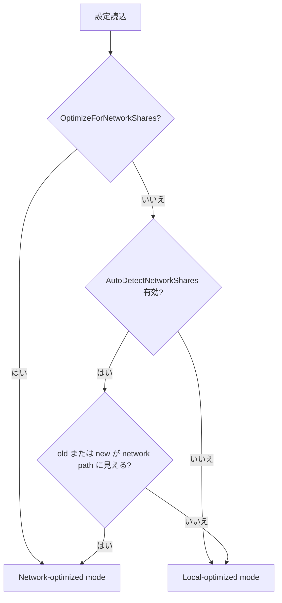

ネットワークパスの判定は [`NetworkPathDetector`](../FolderDiffIL4DotNet.Core/IO/NetworkPathDetector.cs)（`FileSystemUtility` から抽出）で行います。`\\` プレフィックスの UNC パス、`\\?\UNC\` プレフィックスのデバイスパス、および `//` プレフィックスのスラッシュ形式 UNC パス（`//192.168.1.1/share` のような IP ベースの形式を含む）を検出します。`FileSystemUtility.IsLikelyNetworkPath` は `NetworkPathDetector.IsLikelyNetworkPath` に委譲します。

ネットワーク最適化モードの実際の影響:
- IL キャッシュの事前計算と先読みをスキップします。
- 自動決定時の並列度を `min(論理 CPU 数, 8)` に抑えます。
- テキスト比較は並列チャンク読みを避け、逐次比較を優先します。
- 正しさを保ったまま、リモート I/O の増幅を抑えます。

<a id="guide-ja-performance-runtime"></a>
## 性能と実行モード

主な性能機能:
- [`FolderDiffService`](../Services/FolderDiffService.cs) によるファイル比較の並列実行
- 任意の IL キャッシュウォームアップとディスク永続化
- ローカルの大きいテキスト向けチャンク並列比較
- 並列テキスト比較に対する任意のメモリ予算ベース抑制
- 大規模ツリー向けの IL 事前計算バッチ化
- 逆アセンブラ失敗時のブラックリスト
- 長い事前計算中でも進捗が止まって見えないようにスピナーを回す

注意が必要な変更:
- 既定並列度の変更はスループットと I/O 圧力の両方に効きます。
- キャッシュキー形状を変えると、ツール更新時の整合性を壊しやすくなります。
- 先読みを増やしすぎると NAS/SMB で退行しやすくなります。
- 大きいテキストファイルの挙動は、閾値・チャンクサイズ・任意メモリ予算の組み合わせで決まります。

<a id="guide-ja-doc-site"></a>
## ドキュメントサイトと API リファレンス

API リファレンス生成とサイト構築には DocFX を使います。

入力:
- `dotnet build` で出力される XML ドキュメントコメント
- [`README.md`](../README.md)、このガイド、[`doc/TESTING_GUIDE.md`](TESTING_GUIDE.md)
- [`docfx.json`](../docfx.json)、[`index.md`](../index.md)、[`toc.yml`](../toc.yml)、[`api/index.md`](../api/index.md)

出力:
- `_site/`: 生成済みドキュメントサイト
- `api/*.yml` と [`api/toc.yml`](../api/toc.yml): サイト構築に使う API メタデータ

更新手順の基本:
1. まずソリューションをビルドして最新の XML ドキュメントを出力します。
2. `docfx metadata docfx.json` を実行します。
3. `docfx build docfx.json` を実行します。
4. 大きめの API 変更では、マージ前に `_site/index.html` または CI artifact を確認します。

運用上の注意:
- 公開 namespace や public 型を移動・改名したら、同じ変更で DocFX 出力も更新してください。
- 公開 API を追加したら、生成結果が読める状態を維持するため XML コメントも必ず更新してください。
- `_site/` と `api/*.yml` はビルド生成物なのでコミットしません。

<a id="guide-ja-ci-release"></a>
## CI とリリースまわり

### ワークフロー概観

```
PR 作成時:
  ├─ dotnet.yml (build)             → ビルド + テスト + カバレッジ検証
  ├─ dotnet.yml (mutation-testing)  → Stryker ミューテーションテスト
  ├─ dotnet.yml (test-windows)     → Windows クロスプラットフォーム検証
  ├─ benchmark-regression.yml       → パフォーマンス回帰検知
  └─ codeql.yml                     → セキュリティ静的解析（C# + Actions）

main push 時:
  ├─ dotnet.yml (build)             → ビルド + テスト + カバレッジ検証
  ├─ dotnet.yml (test-windows)     → Windows クロスプラットフォーム検証
  ├─ benchmark-regression.yml       → パフォーマンス回帰検知 + ベースライン更新
  └─ codeql.yml                     → セキュリティ静的解析

v* タグ push 時:
  └─ release.yml                    → ビルド + テスト + 発行 + GitHub Release 作成
```

品質は6軸で守られています: **正しさ**（テスト）、**網羅性**（行/ブランチカバレッジ閾値）、**検出力**（ミューテーションテスト）、**速度**（ベンチマーク回帰検知）、**安全性**（CodeQL）、**互換性**（Windows）。

ワークフロー/設定:
- [.github/workflows/dotnet.yml](../.github/workflows/dotnet.yml)
- [.github/workflows/release.yml](../.github/workflows/release.yml)
- [.github/workflows/codeql.yml](../.github/workflows/codeql.yml)
- [.github/workflows/benchmark-regression.yml](../.github/workflows/benchmark-regression.yml)
- [.github/dependabot.yml](../.github/dependabot.yml)

現在の CI 挙動（`build` ジョブ — Ubuntu）:
- `main` 向け `push` / `pull_request` と `workflow_dispatch` で実行
- `actions/setup-dotnet` で [`global.json`](../global.json) を利用
- [`FolderDiffIL4DotNet.sln`](../FolderDiffIL4DotNet.sln) を restore / build
- DocFX を導入し、ドキュメントサイトを生成して `DocumentationSite` artifact としてアップロード
- 実 [`dotnet-ildasm`](https://www.nuget.org/packages/dotnet-ildasm/) を入れ、グローバルツールディレクトリを `PATH` に追加し、`DOTNET_ROLL_FORWARD=Major` と `FOLDERDIFF_RUN_E2E=true` 付きで優先逆アセンブラ経路と実逆アセンブラ E2E ゲートを CI 上でも検証する
- テストプロジェクトが存在するときだけテストとカバレッジを実行
- `reportgenerator` でカバレッジ要約を生成
- 生成された Cobertura XML から total 行 `80%` / 分岐 `75%` のしきい値を強制する。同時にコア差分クラス（`FileDiffService`、`FolderDiffService`、`FileComparisonService`）のクラス単位しきい値（行 `90%` / 分岐 `85%`）も適用する
- publish 出力を `FolderDiffIL4DotNet` としてアップロード
- TRX とカバレッジ関連を `TestAndCoverage` としてアップロード

`test-windows` ジョブ — Windows:
- `build` ジョブと並行して `windows-latest` 上で実行
- restore / build / [`dotnet-ildasm`](https://www.nuget.org/packages/dotnet-ildasm/) インストールとグローバルツールディレクトリの `PATH` 追加後、`DOTNET_ROLL_FORWARD=Major` と `FOLDERDIFF_RUN_E2E=true` 付きでフルテストスイートを実行
- Windows 固有のコードパスを CI 上でも検証する

`mutation-testing` ジョブ — Stryker:
- `pull_request` と `workflow_dispatch` でのみ実行（`main` への push では実行されない）
- [Stryker.NET](https://stryker-mutator.io/docs/stryker-net/introduction/) でプロダクションコードにミューテーションを注入し、テストが検出できるか検証する
- 設定は [`stryker-config.json`](../stryker-config.json) に定義され、high/low/break 閾値は `80/60/40`。[`scripts/generate-mutation-summary.py`](../scripts/generate-mutation-summary.py) も同じファイルを直接読むので、reviewer 向け score band 表示が実際の mutation gate とずれない
- [`scripts/generate-mutation-summary.py`](../scripts/generate-mutation-summary.py) を呼び出して各 run 後に `StrykerOutput/mutation-summary.md` と `mutation-summary.json` を生成し、スコア・survivor 件数・status 件数を生レポートと並べて保存する
- markdown 要約を GitHub Actions ジョブサマリに追記し、同一リポジトリ由来の pull request には [`scripts/update-mutation-pr-comment.js`](../scripts/update-mutation-pr-comment.js) 経由で同じ内容を sticky bot コメントとして反映する。この helper は `github-actions[bot]` 自身の marker 付きコメントだけを更新対象にする。PR コメント step は best-effort（`continue-on-error: true`）なので、可視化側の失敗で mutation gate 自体は落とさない
- run ごとの `StrykerSummary-*` / `StrykerReport-*` artifact をアップロードし、Actions の run 履歴をそのままミューテーション推移の記録として使えるようにする
- break 閾値は `40%` — ミューテーションスコアがこれを下回るとジョブ失敗

`benchmark` ジョブ（手動のみ）:
- `workflow_dispatch` でのみ実行
- `FolderDiffIL4DotNet.Benchmarks` の [BenchmarkDotNet](https://benchmarkdotnet.org/) ベンチマークを実行し、結果を `BenchmarkResults` としてアップロード
- JSON と GitHub 形式で結果をエクスポートし、手動比較に使用

リリース自動化:
- [`.github/workflows/release.yml`](../.github/workflows/release.yml) は `v*` タグ push と、既存タグを明示指定する `workflow_dispatch` で実行します
- 再ビルド、カバレッジゲート付き再テスト、DocFX 再生成、アプリ publish、`*.pdb` 除去まで行います
- publish 出力 ZIP、ドキュメント ZIP、SHA-256 チェックサムを生成します
- 既存タグから GitHub Release を作成し、自動生成リリースノートを付けます
- `nuget-publish` ジョブは本流の `nuget.org` 公開が完了した後で、認証済みの `github` NuGet source を best-effort step として登録し、その後に `continue-on-error: true` 付きで GitHub Packages へ mirror します。これにより、mirror 側の障害や認証失敗で restore / pack / 本命のレジストリ公開を止めません
- パッケージ差分判定は checkout 済みタグの first-parent リリース系列上にある直前の `v*` タグを解決するため、古い既存タグや保守リリースを指定した `workflow_dispatch` でも正しい前回リリースとの差分で判定されます
- `nildiff` はタグごとに mirror し、`FolderDiffIL4DotNet.Core` と `FolderDiffIL4DotNet.Plugin.Abstractions` はそのディレクトリに実変更があるときだけ mirror します。これにより、通常 release で GitHub Packages 側だけのライブラリ版が増えることを避けつつ、nuget.org と同じ公開条件を維持します

セキュリティ自動化:
- [`.github/workflows/codeql.yml`](../.github/workflows/codeql.yml) は `csharp` と `actions` を対象に、`push` / `pull_request` / 週次スケジュール / `workflow_dispatch` で解析します
- Checkout ステップでは `fetch-depth: 0` を指定し、`csharp` の autobuild 時に [Nerdbank.GitVersioning](https://github.com/dotnet/Nerdbank.GitVersioning) がフルコミット履歴からバージョン計算できるようにします
- Analyze ステップは `continue-on-error: true` を設定し、リポジトリの GitHub Default Setup コードスキャンが有効なとき `actions` 言語の SARIF アップロードが拒否されてもジョブが失敗しないようにします
- [`.github/dependabot.yml`](../.github/dependabot.yml) は `nuget` 依存関係と GitHub Actions の更新 PR を週次で作成します
- [`CiAutomationConfigurationTests`](../FolderDiffIL4DotNet.Tests/Architecture/CiAutomationConfigurationTests.cs) で CI / リリース / セキュリティ設定ファイルの存在と主要設定の剥がれを検知します

パフォーマンスリグレッション検知:
- [`.github/workflows/benchmark-regression.yml`](../.github/workflows/benchmark-regression.yml) は `main` 向け `pull_request` と `push`、および `workflow_dispatch` で BenchmarkDotNet を実行します
- 全ベンチマーククラスの JSON 結果を単一レポートに統合し、[`benchmark-action/github-action-benchmark@v1`](https://github.com/benchmark-action/github-action-benchmark) を使用して `gh-benchmarks` ブランチに保存されたベースラインと比較します
- 閾値は `150%`（50% の劣化でジョブ失敗）。リグレッション時に PR コメントを投稿します
- `main` への push 時には結果が `gh-benchmarks` に新しいベースラインとして自動 push されます
- ベンチマーク成果物は常に `BenchmarkResults` としてアップロードされます

バージョニング:
- [`version.json`](../version.json) で [Nerdbank.GitVersioning](https://github.com/dotnet/Nerdbank.GitVersioning) を利用
- Informational Version が埋め込まれ、生成レポートにも出力されます

<a id="guide-ja-skipped-tests"></a>
## ローカル実行でのスキップ（Skipped）テスト

ローカルで実行すると一部テストが **Skipped** と表示されることがあります。これは意図した挙動であり、バグではありません。

スキップされるテストとその理由:
- **[`DotNetDisassembleServiceTests`](../FolderDiffIL4DotNet.Tests/Services/DotNetDisassembleServiceTests.cs)**（6 件）— 偽の `#!/bin/sh` シェルスクリプトを [`WriteExecutable`](../FolderDiffIL4DotNet.Tests/Services/DotNetDisassembleServiceTests.cs) で生成し、フォールバック・ブラックリスト挙動を決定的に検証します。[`File.SetUnixFileMode`](https://learn.microsoft.com/ja-jp/dotnet/api/system.io.file.setunixfilemode?view=net-8.0) およびシェルスクリプトの実行は Windows では使えないため、`Skip.If(OperatingSystem.IsWindows(), ...)` を呼び出して Skipped を報告します。
- **[`RealDisassemblerE2ETests`](../FolderDiffIL4DotNet.Tests/Services/RealDisassemblerE2ETests.cs)**（1 件）— `Deterministic=false` で 2 回ビルドした同一クラスライブラリを [`dotnet-ildasm`](https://www.nuget.org/packages/dotnet-ildasm/) が MVID 除外後に `ILMatch` と判定することを確認します。ローカルでは `Skip.IfNot(IsE2EEnabled(), ...)` による opt-in のままですが、`FOLDERDIFF_RUN_E2E=true` が設定されたら、利用可能な [`dotnet-ildasm`](https://www.nuget.org/packages/dotnet-ildasm/)（または [`dotnet ildasm`](https://www.nuget.org/packages/dotnet-ildasm/)）が実際に実行できることを assert するため、ツール不足はスキップではなく失敗になります。

なぜ安全か:
- CI は Linux（`build` ジョブ）と Windows（`test-windows` ジョブ）の両方で動き、どちらもテストステップの前に実 [`dotnet-ildasm`](https://www.nuget.org/packages/dotnet-ildasm/) をインストールし、グローバルツールディレクトリを `PATH` に追加し、`FOLDERDIFF_RUN_E2E=true` を設定します。これにより、優先逆アセンブラ経路、実逆アセンブラ E2E アサーション、Windows 固有コードパスが CI 上で検証されます。ローカルの Skipped は明示的な opt-in が無効なことを示し、opt-in 済みでのツール不足は失敗として扱われます。
- スキップ対象のテストは [`Xunit.SkippableFact`](https://www.nuget.org/packages/Xunit.SkippableFact/) の [`[SkippableFact]`](https://github.com/AArnott/Xunit.SkippableFact) を使うため、ランナーは Passed ではなく Skipped として別カウントで表示し、区別が明確になっています。
- これまで Skipped だったテストが **Failed** になった場合は実際の問題であり、調査が必要です。Skipped と Failed は異なる結果です。

スキップ対象テストの一覧と `Skip.If` パターンの詳細は [doc/TESTING_GUIDE.md](TESTING_GUIDE.md#testing-ja-isolation) を参照してください。

## 拡張ポイント

### プラグインシステム

アプリケーションは [`FolderDiffIL4DotNet.Plugin.Abstractions`](../FolderDiffIL4DotNet.Plugin.Abstractions/) NuGet パッケージによるプラグインアーキテクチャをサポートしています。プラグインは `PluginSearchPaths` 設定で指定されたディレクトリから、分離された `AssemblyLoadContext` インスタンスを使用して読み込まれます。

プラグイン拡張インターフェース:
- [`IPlugin`](../FolderDiffIL4DotNet.Plugin.Abstractions/IPlugin.cs) — エントリポイント。メタデータ提供と `ConfigureServices` によるサービス登録。
- [`IFileComparisonHook`](../FolderDiffIL4DotNet.Plugin.Abstractions/IFileComparisonHook.cs) — ファイル比較のインターセプト（前後）。組み込み比較結果をオーバーライドできます。ベストエフォートなフック失敗は、切り分けしやすいようフェーズ（`BeforeCompare` / `AfterCompare`）と hook order 付きで warning ログに残します。
- [`IPostProcessAction`](../FolderDiffIL4DotNet.Plugin.Abstractions/IPostProcessAction.cs) — 全レポート生成後に実行（通知、アップロード等）。ベストエフォート失敗は、プラグイン切り分けしやすいようアクション型・実行位置・`Order` 付きで warning ログに残します。
- [`IDisassemblerProvider`](../FolderDiffIL4DotNet.Plugin.Abstractions/IDisassemblerProvider.cs) — カスタムファイル種別の逆アセンブリ提供（javap による Java .class 等）。
- [`IReportSectionWriter`](../Services/IReportSectionWriter.cs) — Markdown レポートへのカスタムセクション追加。
- [`IReportFormatter`](../Services/IReportFormatter.cs) — カスタムレポート出力形式の追加。

プラグイン読み込みフロー: [`PluginLoader`](../Runner/PluginLoader.cs) → [`PluginAssemblyLoadContext`](../Runner/PluginAssemblyLoadContext.cs) → `IPlugin.ConfigureServices` → DI 解決。

### 組み込み拡張ポイント

比較的安全に触りやすい場所:
- [`TextFileExtensions`](../Models/ConfigSettings.cs) の値追加
- [`ReportGenerateService`](../Services/ReportGenerateService.cs) へのレポートメタデータ追加
- オーケストレーション境界でのログ追加
- [`IFileSystemService`](../Services/IFileSystemService.cs)、[`IFolderDiffExecutionStrategy`](../Services/IFolderDiffExecutionStrategy.cs)、[`IFileComparisonService`](../Services/IFileComparisonService.cs)、[`IFileDiffService`](../Services/IFileDiffService.cs)、[`IILOutputService`](../Services/IILOutputService.cs)、[`IDotNetDisassembleService`](../Services/IDotNetDisassembleService.cs) を差し替えるテスト追加

高リスクな変更:
- `SHA256 -> IL -> text` の順番変更
- 実行スコープ状態の再利用
- パス判定を [`DiffExecutionContext`](../Services/DiffExecutionContext.cs) から外す変更
- IL 比較で old/new のツール識別を混在させる変更
- 分離されていない静的可変キャッシュの導入

<a id="guide-ja-change-checklist"></a>
## 変更時チェックリスト

振る舞い変更をマージする前に確認:
1. [`Program.cs`](../Program.cs) は薄いままで、調停ロジックが [`ProgramRunner`](../ProgramRunner.cs) か下位サービスに留まっているか。
2. 実行ごとに新しい [`DiffExecutionContext`](../Services/DiffExecutionContext.cs) と [`FileDiffResultLists`](../Models/FileDiffResultLists.cs) が作られているか。
3. 新しい協調オブジェクトは、場当たり的に生成せず注入されているか。
4. [`FolderDiffService`](../Services/FolderDiffService.cs) が列挙や分類の前に `ResetAll()` を呼んでいるか。
5. レポート仕様が [`FileDiffResultLists`](../Models/FileDiffResultLists.cs) の内容と乖離していないか。
6. IL 挙動を変えた場合、同一ツール強制と行除外仕様が明示されたままか。
7. 性能挙動を変えた場合、ローカルモードとネットワーク共有モードの両方を検討したか。
8. [`README.md`](../README.md)、このガイド、[`doc/TESTING_GUIDE.md`](TESTING_GUIDE.md) がユーザー向け挙動と同期しているか。
9. 変更した実行経路に対するテストを追加・更新したか。
10. CI / リリース / セキュリティ前提が変わったなら、[`.github/workflows/dotnet.yml`](../.github/workflows/dotnet.yml)、[`.github/workflows/release.yml`](../.github/workflows/release.yml)、[`.github/workflows/codeql.yml`](../.github/workflows/codeql.yml)、[`.github/dependabot.yml`](../.github/dependabot.yml)、[`CiAutomationConfigurationTests`](../FolderDiffIL4DotNet.Tests/Architecture/CiAutomationConfigurationTests.cs) をまとめて更新したか。

## クロスプラットフォームの注意点

このプロジェクトは CI を Linux と Windows の両方で実行しています。以下のパターンは実際に CI 失敗を引き起こしたものであり、プロダクションコードやテストを書く際に注意が必要です。

### パスセパレータの一貫性

Windows では `Path.GetRelativePath` が出力を `\` に正規化しますが、`Path.Combine` は第二引数のセパレータを正規化**しません**。そのため、次のようなラウンドトリップ：

```csharp
var rel = Path.GetRelativePath(baseDir, absolutePath);   // Windows では "sub\file.txt"
var rebuilt = Path.Combine(otherBase, rel);               // "/other\sub\file.txt"
```

は、元の `Path.Combine(otherBase, "sub/file.txt")` → `"/other\sub/file.txt"`（混在セパレータ）とは異なる文字列を生成します。`OrdinalIgnoreCase` 文字列比較は `\` と `/` を異なる文字として扱うため、`HashSet<string>` のルックアップがサイレントに失敗します。

**ルール**: サブディレクトリセパレータを含む相対パスを構成する場合は、`"sub/file.txt"` ではなく常に `Path.Combine("sub", "file.txt")` を使用すること。プロダクションコードでは、正規化なしに `Path.Combine` の出力と `Path.GetRelativePath` の出力を直接比較しないこと。

### タイマー解像度とタイミング依存テスト

Windows では `DateTime.UtcNow` と `Thread.Sleep` は OS のタイマー解像度（デフォルトで約 15.6ms）の影響を受けます。TTL を 1ms に設定し 20ms スリープするテストは、以下の理由で失敗する可能性があります：

1. `RegisterFailure()` が時刻 T で `DateTime.UtcNow` を記録する。
2. テストが `Assert.True(IsBlacklisted(...))` を呼ぶ — しかし `RegisterFailure` から `IsBlacklisted` までのコードパスが 1ms 以上かかった場合（負荷のかかった CI ランナーでは容易に起こり得る）、TTL はすでに期限切れとなりアサーションが失敗する。

**ルール**: タイミング依存テストでは TTL を最低 500ms、スリープ時間を TTL の最低 1.4 倍に設定すること。サブミリ秒の TTL は完全に避けること。

### `WebUtility.HtmlEncode` はバッククォートをエンコードしない

`System.Net.WebUtility.HtmlEncode` は `&`、`<`、`>`、`"`、`'` をエンコードしますが、バッククォート（`` ` ``）はエンコード**しません**。HTML レポートはファイルパスを JavaScript コンテキストに埋め込むため、テンプレートリテラル注入を防ぐためにバッククォートを明示的にエンコードする必要があります。`HtmlReportGenerateService.Helpers.cs` の `HtmlEncode()` ヘルパーは後処理ステップとして `.Replace("`", "&#96;")` を追加しています。

### ローカルツールのバージョン（`dotnet-stryker` 等）

CI ワークフローは [`.config/dotnet-tools.json`](../.config/dotnet-tools.json) を使用して `dotnet tool restore` を実行します。固定されたバージョンが NuGet から削除された場合、CI はリストアステップで失敗します。マニフェストを更新する前に、ツールバージョンが NuGet に存在することを必ず確認してください。

### テストフェイクのスレッドセーフティ

テストフェイク（モックサービス）がメソッド呼び出しをコレクションに記録する場合（例: `ReadChunkCalls.Add(...)`）、そのフェイクが `Parallel.ForEachAsync` などの並列コンテキストから呼ばれるなら `List<T>` ではなく `ConcurrentBag<T>` や `ConcurrentQueue<T>` を使用すること。スレッドセーフでない `List.Add` を並列実行すると例外がプロダクションコードのエラーハンドリングに黙殺的に捕捉され、テストが意図しないフォールバックパスに入り断続的に失敗する原因となります。

### `coverlet.collector` と [`coverlet.runsettings`](../coverlet.runsettings) の互換性

- `coverlet.collector` 6.0.3 以降に[リグレッション](https://github.com/coverlet-coverage/coverlet/issues/1726)があり、[`coverlet.runsettings`](../coverlet.runsettings) の `<Exclude>` / `<Include>` フィルタ使用時に `coverage.cobertura.xml` が生成されません。修正リリースまでバージョン 6.0.2 を使用してください。
- `opencover` フォーマットは `<DeterministicReport>true</DeterministicReport>` をサポートしません。決定論的レポートが必要な場合は `cobertura` のみを使用してください。

## デバッグのコツ

- まず `<app-data-root>/Logs/log_YYYYMMDD.log` を見て失敗箇所を特定してください（例: Windows は `%LOCALAPPDATA%\FolderDiffIL4DotNet\Logs\log_YYYYMMDD.log`、macOS は `~/Library/Application Support/FolderDiffIL4DotNet/Logs/log_YYYYMMDD.log`、Linux は `~/.local/share/FolderDiffIL4DotNet/Logs/log_YYYYMMDD.log`）。
- IL 比較で停止した場合は、ログやレポートに出る逆アセンブラ表示ラベルを確認してください。
- ネットワーク共有モードが想定外なら、設定フラグと自動判定結果の両方を確認してください。
- バケット分類がおかしい場合は、レポート整形より前に [`FileDiffResultLists`](../Models/FileDiffResultLists.cs) の投入順を追ってください。
- テストが順序依存になったら、まず実行スコープ状態のリークを疑ってください。
- Windows でバナーやコンソール出力が `?` になる場合は、プロセスが OEM コードページ（CP932/CP437 等）を使用しています。[`Program.cs`](../Program.cs) の `Main()` 先頭で [`Console.OutputEncoding`](https://learn.microsoft.com/ja-jp/DOTNET/api/system.console.outputencoding?view=net-8.0) = `Encoding.UTF8` を設定することで回避しています。Linux / macOS ではコンソールがすでに UTF-8 のため、この設定は実質ノーオペレーションです。

## HTML レポート: 整合性検証の技術メモ

### デュアルハッシュ・プレースホルダ方式

「Download as reviewed」ワークフローでは、レビュー済み HTML ファイル内に **2 つ**の SHA256 ハッシュをプレースホルダ方式で埋め込みます。これはファイルのハッシュをファイル自体に埋め込むという循環依存を解決するためです。

| 定数 | プレースホルダ | 用途 |
| --- | --- | --- |
| `__reviewedSha256__` | 64 個のゼロ（`000...0`） | 中間ハッシュ — このフィールドをプレースホルダに置き換えた状態の HTML のハッシュ。ハッシュ処理の内部で使用。 |
| `__finalSha256__` | 64 個の f（`fff...f`） | 最終ハッシュ — `__reviewedSha256__` 埋め込み後、このフィールドをプレースホルダに置き換えた状態の HTML のハッシュ。コンパニオン `.sha256` ファイルと完全に一致。 |

`downloadReviewed()` の 2 段階処理:
1. `__reviewedSha256__` プレースホルダをゼロに置換 → SHA256 計算 → ゼロを実際のハッシュに置換（第 1 ハッシュ埋め込み）。
2. `__finalSha256__` プレースホルダを f に置換 → SHA256 計算 → f を実際のハッシュに置換（第 2 ハッシュ埋め込み）。この最終ハッシュがコンパニオン `.sha256` ファイルにも書き出されます。

### Verify integrity: `.sha256` 専用検証

`verifyIntegrity()` は `.sha256` ファイルのみを受け付けます。レビュー済み HTML は「自分自身」であり、最終ハッシュが `__finalSha256__` に埋め込み済みのため、HTML ファイルの選択は不要です。関数は `.sha256` ファイルを読み取り、ハッシュを抽出して、埋め込み済みの `__finalSha256__` 定数と直接比較します。

### ブラウザの注意点: 動的作成した input 要素の `accept` 属性

一部のブラウザ（特に macOS Safari）は、動的に作成して即座にクリックした `<input type="file">` 要素の `accept` 属性を無視します。ファイルピッカーがフィルタなしで開き、全ファイルが選択可能になります。

**回避策**: `DOMContentLoaded` の初期化時に隠し `<input type="file" accept=".sha256">` 要素を事前作成し、`verifyIntegrity()` ではそれを再利用します。ユーザーが「Verify integrity」をクリックする時点で、input 要素は十分な時間 DOM に存在しているため、ブラウザが `accept` フィルタを認識・適用できます。フィルタをバイパスするブラウザへのフォールバックとして、`onchange` ガード（`file.name.endsWith('.sha256')`）も設けています。

### セマンティック変更の型名フォーマット

[`SimpleSignatureTypeProvider`](../Services/AssemblyMethodAnalyzer.cs) は常に**完全修飾 .NET 型名**（例: `System.String`、`System.Int32`、`System.Void`）を出力し、C# エイリアス（`string`、`int`、`void`）は使用しません。ジェネリック型パラメータは [`GenericContext`](../Services/AssemblyMethodAnalyzer.MetadataHelpers.cs) 経由で宣言名（例: `T`、`TKey`、`TValue`）に解決されます。`GenericContext` は `TypeDefinition.GetGenericParameters()` と `MethodDefinition.GetGenericParameters()` からパラメータ名を読み取ります。関数ポインタシグネチャは `delegate*<ParamTypes, ReturnType>` として展開され、カスタム修飾子は `modreq()`/`modopt()` 注釈として保持されます。[`MemberChangeEntry`](../Models/MemberChangeEntry.cs) の `MemberType`、`ReturnType`、`Parameters` フィールドはこの規約に従います。サンプル HTML の base64 ブロックも一致させる必要があります。
