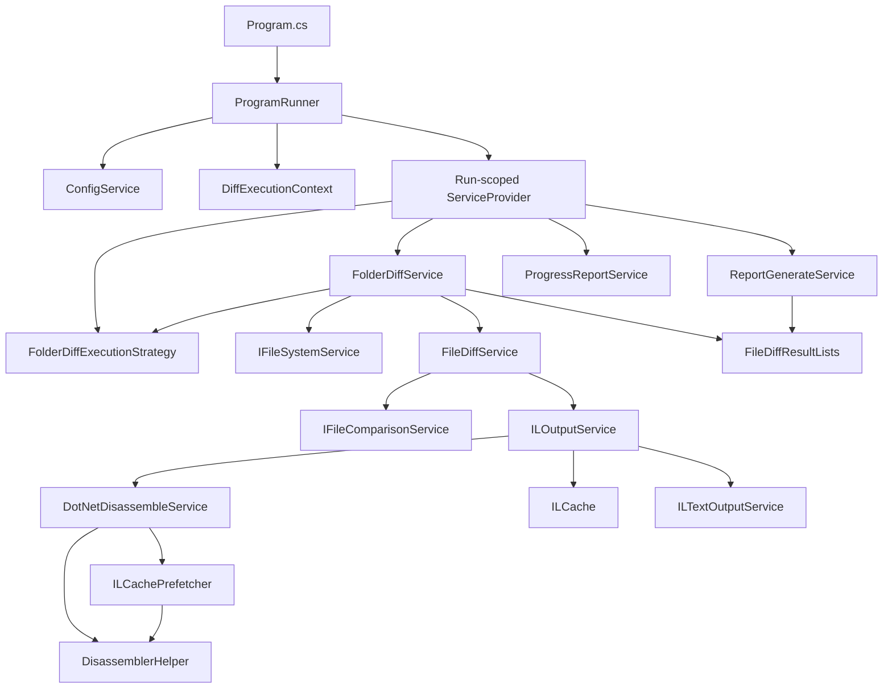
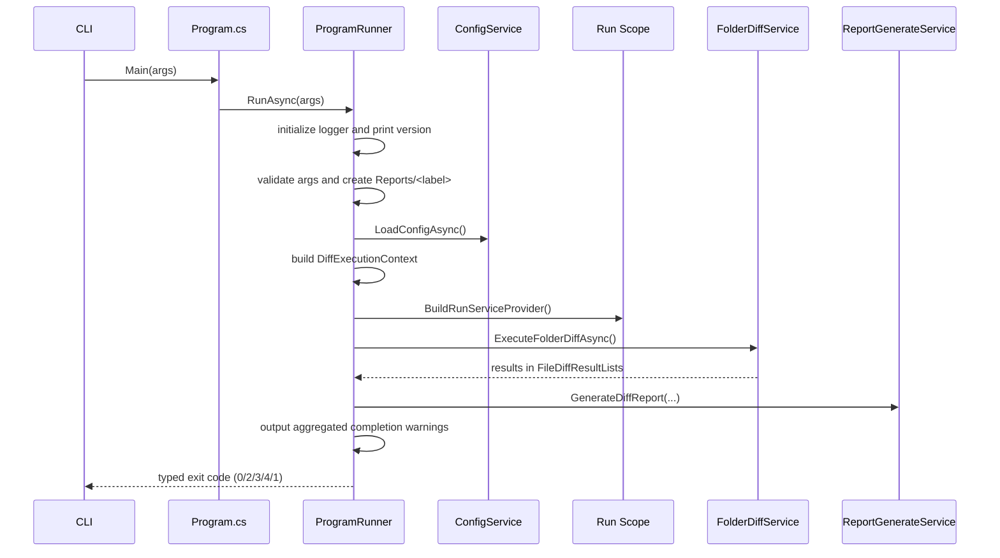
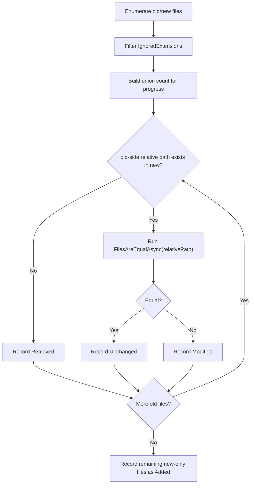
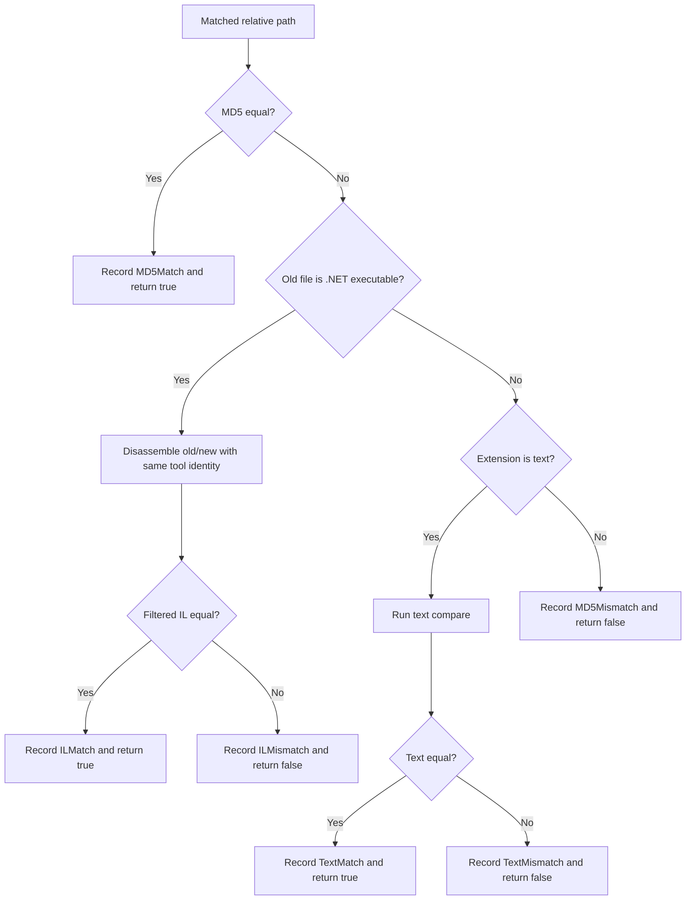
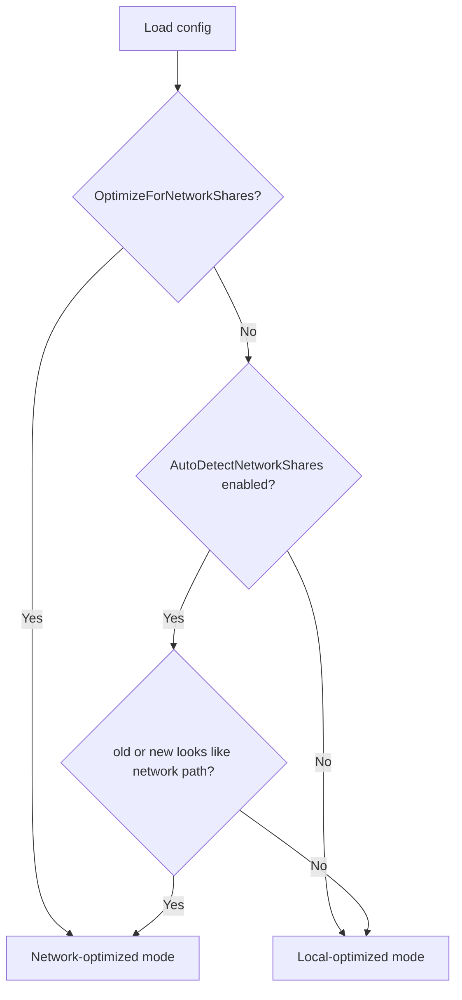
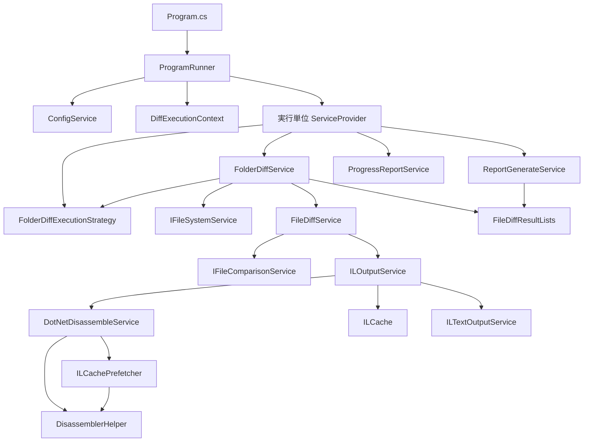
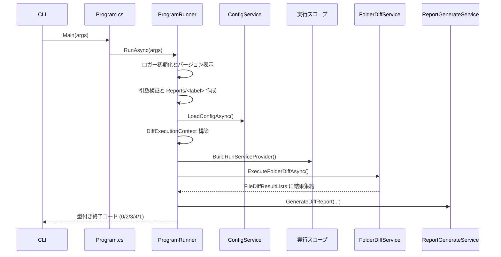
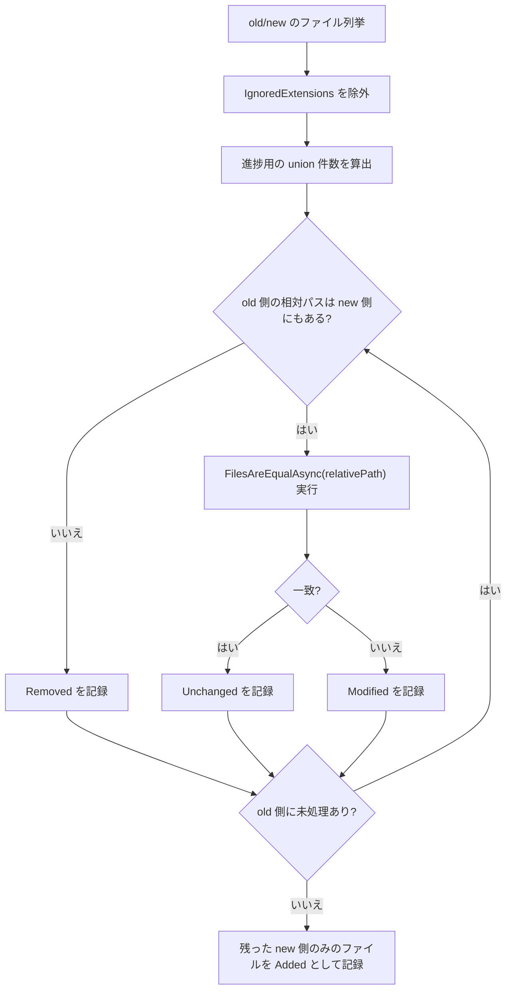
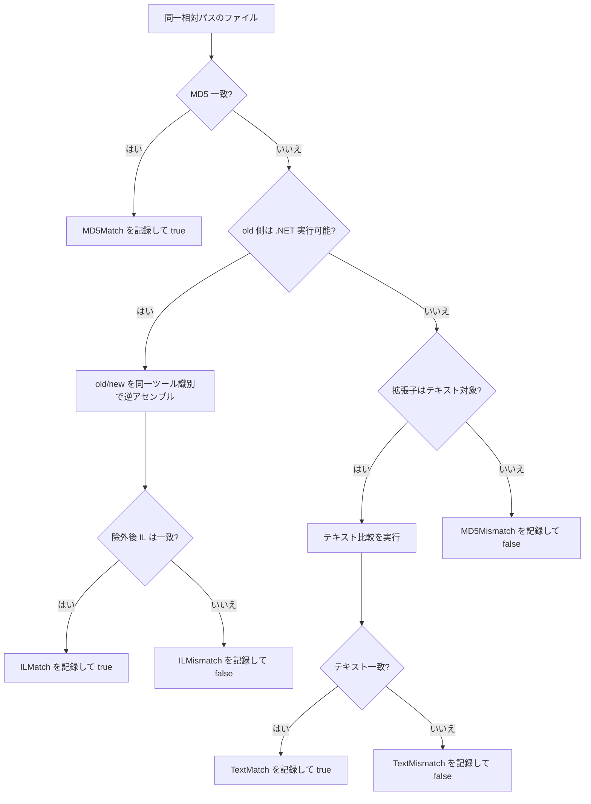
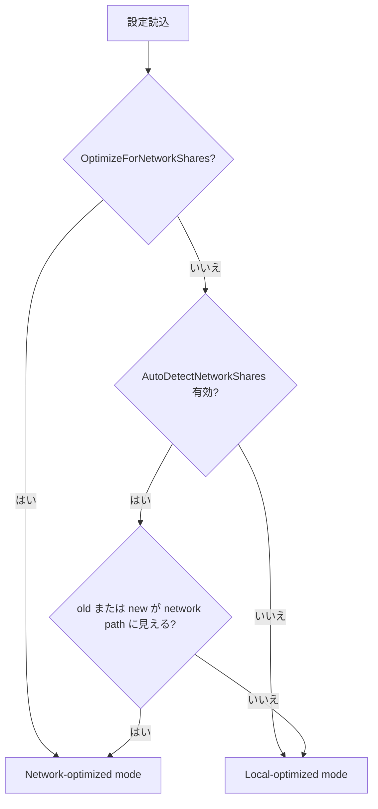

# Developer Guide

This guide is for maintainers who need to change runtime behavior, extend the diff pipeline, or keep CI and tests aligned with implementation changes.

Related documents:
- [README.md](../README.md#readme-en-doc-map): product overview, installation, usage, and configuration reference
- [doc/TESTING_GUIDE.md](TESTING_GUIDE.md#testing-en-run-tests): test strategy, local commands, and isolation rules
- [api/index.md](../api/index.md): generated API reference landing page
- [docfx.json](../docfx.json): DocFX metadata/build configuration
- [.github/workflows/dotnet.yml](../.github/workflows/dotnet.yml): CI pipeline definition

<a id="guide-en-map"></a>
## Document Map

| If you need to... | Start here |
| --- | --- |
| Understand the end-to-end execution flow | [Execution Lifecycle](#guide-en-execution-lifecycle) |
| Trace service boundaries and DI scopes | [Dependency Injection Layout](#guide-en-di-layout) |
| Change file classification behavior | [Comparison Pipeline](#guide-en-comparison-pipeline) |
| Understand or adjust configuration keys and runtime mode | [Configuration and Runtime Modes](#guide-en-config-runtime) |
| Tune performance or network-share behavior | [Performance and Runtime Modes](#guide-en-performance-runtime) |
| Refresh the generated API reference site | [Documentation Site and API Reference](#guide-en-doc-site) |
| Update build, test, or artifact behavior | [CI and Release Notes](#guide-en-ci-release) |
| Safely extend the codebase | [Change Checklist](#guide-en-change-checklist) |

## Local Development

Prerequisites:
- [`.NET SDK 8.0.413`](https://dotnet.microsoft.com/en-us/download/dotnet/8.0) ([`global.json`](../global.json))
- One IL disassembler available on `PATH`
  - [`dotnet-ildasm`](https://www.nuget.org/packages/dotnet-ildasm/) or [`dotnet ildasm`](https://www.nuget.org/packages/dotnet-ildasm/) preferred
  - [`ilspycmd`](https://www.nuget.org/packages/ilspycmd/) supported as fallback

Common commands:

```bash
dotnet restore FolderDiffIL4DotNet.sln
dotnet build FolderDiffIL4DotNet.sln --configuration Release
dotnet test FolderDiffIL4DotNet.Tests/FolderDiffIL4DotNet.Tests.csproj --nologo -p:UseAppHost=false
```

Refresh the documentation site locally:

```bash
dotnet tool update --global docfx --version '2.*'
export PATH="$PATH:$HOME/.dotnet/tools"
docfx metadata docfx.json
docfx build docfx.json
```

Debugging a local run:

```bash
dotnet run -- "/absolute/path/to/old" "/absolute/path/to/new" "dev-run" --no-pause

# Quick help / version check
dotnet run -- --help
dotnet run -- --version

# Override threads, skip IL, use custom config
dotnet run -- "/path/old" "/path/new" "label" --threads 4 --skip-il --config /etc/cfg.json --no-pause
```

Generated during a run:
- `Reports/<label>/diff_report.md`
- `Reports/<label>/diff_report.html` when [`ShouldGenerateHtmlReport`](../README.md#configuration-table-en) is `true` (default)
- `Reports/<label>/IL/old/*.txt` and `Reports/<label>/IL/new/*.txt` when [`ShouldOutputILText`](../README.md#configuration-table-en) is `true`
- `Logs/log_YYYYMMDD.log`
- `ILCache/` under the app base directory when disk cache is enabled and no custom cache directory is configured

## Source Style Notes

Keep internal formatting choices simple and local:
- Prefer interpolated strings for fixed-format messages that are only used once.
- Keep shared format templates only when the same message shape is intentionally reused in multiple places.
- Place domain-independent helpers under [`FolderDiffIL4DotNet.Core/`](../FolderDiffIL4DotNet.Core/) and keep [`FolderDiffIL4DotNet/Services`](../Services/) focused on folder-diff behavior.
- Promote cross-project byte-size and timestamp literals into [`FolderDiffIL4DotNet.Core/Common/CoreConstants.cs`](../FolderDiffIL4DotNet.Core/Common/CoreConstants.cs), while keeping app-specific literals in [`Common/Constants.cs`](../Common/Constants.cs). IL-domain string constants such as `Constants.IL_MVID_LINE_PREFIX` belong in `Common/Constants.cs` and must not be duplicated across service files.
- Avoid adding new `#region` blocks unless they solve a concrete readability problem that file structure and naming do not already solve.

## Architecture Overview



Design intent:
- [`Program.cs`](../Program.cs) stays minimal and owns only application-root service registration.
- [`ProgramRunner`](../ProgramRunner.cs) is the orchestration boundary for one console execution.
- [`DiffExecutionContext`](../Services/DiffExecutionContext.cs) carries immutable run-specific paths and mode decisions.
- [`FolderDiffIL4DotNet.Core`](../FolderDiffIL4DotNet.Core/) is the reusable helper-library boundary for console rendering, diagnostics, filesystem helpers, and text sanitization with no folder-diff domain policy.
- Core pipeline services use constructor injection and interfaces instead of static mutable state or ad hoc object creation.
- [`IFileSystemService`](../Services/IFileSystemService.cs) and [`IFileComparisonService`](../Services/IFileComparisonService.cs) are the low-level seams that keep discovery/compare I/O unit-testable without changing the production decision tree. `IFileSystemService.EnumerateFiles(...)` specifically preserves lazy discovery so large trees do not require an eager `string[]` snapshot before filtering.
- [`FolderDiffExecutionStrategy`](../Services/FolderDiffExecutionStrategy.cs) centralizes inclusion filtering, ignored-file recording, and auto-parallelism policy so those rules are no longer embedded directly inside [`FolderDiffService`](../Services/FolderDiffService.cs).
- [`FileDiffResultLists`](../Models/FileDiffResultLists.cs) is the run-scoped aggregation hub shared by diffing and reporting.
- [`DotNetDisassembleService`](../Services/DotNetDisassembleService.cs) is responsible for disassembly execution and cache hit/store tracking. IL-cache prefetch is delegated to [`ILCachePrefetcher`](../Services/ILCachePrefetcher.cs), which encapsulates the prefetch-only responsibility. Shared static helpers (command identification, candidate enumeration, executable path resolution) live in [`DisassemblerHelper`](../Services/DisassemblerHelper.cs) to avoid duplication between the two classes.
- [`FolderDiffService`](../Services/FolderDiffService.cs) keeps the pre-compute keep-alive spinner as a dedicated `CreateKeepAliveTask()` method so `PrecomputeIlCachesAsync()` focuses on orchestration rather than background-task lifecycle.

<a id="guide-en-execution-lifecycle"></a>
## Execution Lifecycle

### Startup Sequence



### What happens inside `RunAsync`

1. Parse CLI options (`--help`, `--version`, `--no-pause`, `--config`, `--threads`, `--no-il-cache`, `--skip-il`, `--no-timestamp-warnings`).
2. If `--help` or `--version` is present, print and exit immediately with code `0` — no logger initialization occurs.
3. Initialize logging and print application version.
4. Validate `old`, `new`, and `reportLabel` arguments. Unknown CLI flags surface here as exit code `2`.
5. Create `Reports/<label>` early and fail if the label already exists.
6. Load the config file — from the path given to `--config` if supplied, otherwise from [`AppContext.BaseDirectory`](https://learn.microsoft.com/ja-jp/dotNet/API/system.appcontext.basedirectory?view=net-8.0) — and overlay it onto the code-defined defaults in [`ConfigSettings`](../Models/ConfigSettings.cs). Immediately after deserialization, [`ConfigSettings.Validate()`](../Models/ConfigSettings.cs) is called; if any value is out of range, the run fails with exit code `3`.
7. Apply CLI overrides on top of the loaded config: `--threads` sets `MaxParallelism`; `--no-il-cache` sets `EnableILCache = false`; `--skip-il` sets `SkipIL = true`; `--no-timestamp-warnings` sets `ShouldWarnWhenNewFileTimestampIsOlderThanOldFileTimestamp = false`.
8. Clear transient shared helpers such as [`TimestampCache`](../Services/Caching/TimestampCache.cs).
9. Compute [`DiffExecutionContext`](../Services/DiffExecutionContext.cs), including network-share decisions.
10. Build the run-scoped DI container.
11. Run the folder diff and finish progress display.
12. Generate `diff_report.md` from aggregated results.
13. Generate `diff_report.html` from aggregated results when [`ShouldGenerateHtmlReport`](../README.md#configuration-table-en) is `true` (default). The HTML file is a self-contained interactive review document with localStorage auto-save and a download function that bakes the current review state into a portable snapshot.
14. Convert the phase result into a process exit code: `0` on success, `2` for invalid CLI/input paths, `3` for configuration load/parse/validation failures, `4` for diff/report execution failures, and `1` only for unexpected internal errors.

The implementation keeps `RunAsync()` short by treating those steps as explicit phases and delegating each phase to focused private helpers.

Failure behavior:
- [`ProgramRunner`](../ProgramRunner.cs) now uses small typed step results at the application boundary instead of flattening every failure into one catch-all exit code.
- Argument validation, unknown flags, and missing input paths map to exit code `2`.
- [`ConfigService`](../Services/ConfigService.cs) failures such as missing `config.json`, parse failures, config-read I/O errors, or settings that fail [`ConfigSettings.Validate()`](../Models/ConfigSettings.cs) map to exit code `3`.
- Diff execution and report-generation failures, including fatal IL comparison failures surfaced as [`InvalidOperationException`](https://learn.microsoft.com/en-us/dotnet/api/system.invalidoperationexception?view=net-8.0), map to exit code `4`.
- Exit code `1` is reserved for unexpected internal errors that escape the explicit phase classification.
- [`InvalidOperationException`](https://learn.microsoft.com/en-us/dotnet/api/system.invalidoperationexception?view=net-8.0) originating from IL comparison is treated as a fatal exception and stops the whole run.
- `FolderDiffService.ExecuteFolderDiffAsync()` logs and rethrows expected runtime exceptions such as path-validation errors, [`DirectoryNotFoundException`](https://learn.microsoft.com/en-us/dotnet/api/system.io.directorynotfoundexception?view=net-8.0), [`IOException`](https://learn.microsoft.com/en-us/dotnet/api/system.io.ioexception?view=net-8.0), [`UnauthorizedAccessException`](https://learn.microsoft.com/en-us/dotnet/api/system.unauthorizedaccessexception?view=net-8.0), and [`NotSupportedException`](https://learn.microsoft.com/en-us/dotnet/api/system.notsupportedexception?view=net-8.0); only truly unexpected exceptions use the separate "unexpected error" log wording.
- Read-only protection on output files remains best-effort and warning-only.

<a id="guide-en-di-layout"></a>
## Dependency Injection Layout

### Root container

Registered in [`Program.cs`](../Program.cs):
- [`ILoggerService`](../Services/ILoggerService.cs) -> [`LoggerService`](../Services/LoggerService.cs)
- [`ConfigService`](../Services/ConfigService.cs)
- [`ProgramRunner`](../ProgramRunner.cs)

This root container is intentionally small. It should not accumulate run-specific services.

### Run-scoped container

Registered in [`ProgramRunner.BuildRunServiceProvider(...)`](../ProgramRunner.cs):
- Singletons inside the run scope
- [`ConfigSettings`](../Models/ConfigSettings.cs)
- [`DiffExecutionContext`](../Services/DiffExecutionContext.cs)
- [`ILoggerService`](../Services/ILoggerService.cs) (shared logger instance)
- Scoped services
- [`FileDiffResultLists`](../Models/FileDiffResultLists.cs)
- [`DotNetDisassemblerCache`](../Services/Caching/DotNetDisassemblerCache.cs)
- [`ILCache`](../Services/Caching/ILCache.cs) (nullable when disabled)
- [`ProgressReportService`](../Services/ProgressReportService.cs)
- [`ReportGenerateService`](../Services/ReportGenerateService.cs)
- [`HtmlReportGenerateService`](../Services/HtmlReportGenerateService.cs)
- [`IFileSystemService`](../Services/IFileSystemService.cs) / [`FileSystemService`](../Services/FileSystemService.cs)
- [`IFolderDiffExecutionStrategy`](../Services/IFolderDiffExecutionStrategy.cs) / [`FolderDiffExecutionStrategy`](../Services/FolderDiffExecutionStrategy.cs)
- [`IFileComparisonService`](../Services/IFileComparisonService.cs) / [`FileComparisonService`](../Services/FileComparisonService.cs)
- [`IILTextOutputService`](../Services/ILOutput/IILTextOutputService.cs) / [`ILTextOutputService`](../Services/ILOutput/ILTextOutputService.cs)
- [`IDotNetDisassembleService`](../Services/IDotNetDisassembleService.cs) / [`DotNetDisassembleService`](../Services/DotNetDisassembleService.cs)
- [`IILOutputService`](../Services/IILOutputService.cs) / [`ILOutputService`](../Services/ILOutputService.cs)
- [`IFileDiffService`](../Services/IFileDiffService.cs) / [`FileDiffService`](../Services/FileDiffService.cs)
- [`IFolderDiffService`](../Services/IFolderDiffService.cs) / [`FolderDiffService`](../Services/FolderDiffService.cs)

Why this matters:
- Each execution gets a newly created [`FileDiffResultLists`](../Models/FileDiffResultLists.cs) for diff results plus newly created disassembler-related state and caches for keeping old/new on the same disassembler, so nothing is carried over from the previous run.
- Tests can replace interfaces without mutating static fields.
- Runtime path decisions are explicit and immutable once the run starts.

## Core Responsibilities

| File | Responsibility | Notes |
| --- | --- | --- |
| [`Program.cs`](../Program.cs) | Application entry point | Must remain thin |
| [`ProgramRunner.cs`](../ProgramRunner.cs) | Argument validation, config loading, run DI creation, orchestration | Main control plane |
| [`FolderDiffIL4DotNet.Core/`](../FolderDiffIL4DotNet.Core/) | Reusable console/diagnostics/IO/text helpers | No folder-diff domain logic |
| [`Services/DiffExecutionContext.cs`](../Services/DiffExecutionContext.cs) | Immutable run paths and network-mode decisions | No mutable state |
| [`Services/FolderDiffService.cs`](../Services/FolderDiffService.cs) | Folder-diff orchestration and result routing | Owns progress and added/removed routing |
| [`Services/FolderDiffExecutionStrategy.cs`](../Services/FolderDiffExecutionStrategy.cs) | Discovery filtering and auto-parallelism policy | Applies ignored extensions and network-aware auto parallelism |
| [`Services/IFileSystemService.cs`](../Services/IFileSystemService.cs) + [`Services/FileSystemService.cs`](../Services/FileSystemService.cs) | Discovery/output filesystem abstraction | Enables folder-level unit tests and lazy file discovery |
| [`Services/FileDiffService.cs`](../Services/FileDiffService.cs) | Per-file decision tree | MD5 -> IL -> text -> fallback |
| [`Services/IFileComparisonService.cs`](../Services/IFileComparisonService.cs) + [`Services/FileComparisonService.cs`](../Services/FileComparisonService.cs) | Per-file compare/detect I/O abstraction | Enables file-level unit tests |
| [`Services/ILOutputService.cs`](../Services/ILOutputService.cs) | IL compare flow, line filtering, optional IL dump writing | Enforces same disassembler identity |
| [`Services/DotNetDisassembleService.cs`](../Services/DotNetDisassembleService.cs) | Tool probing, disassembly execution, cache hit/store tracking, blacklist handling | Central tool boundary; delegates prefetch to `ILCachePrefetcher` |
| [`Services/ILCachePrefetcher.cs`](../Services/ILCachePrefetcher.cs) | IL-cache prefetch (pre-hit verification for all candidate command/arg patterns) | Extracted from `DotNetDisassembleService`; owns its own hit counter |
| [`Services/DisassemblerHelper.cs`](../Services/DisassemblerHelper.cs) | Shared static helpers: command identification, candidate enumeration, executable path resolution | Used by both `DotNetDisassembleService` and `ILCachePrefetcher`; no instance state |
| [`Services/DisassemblerBlacklist.cs`](../Services/DisassemblerBlacklist.cs) | Per-tool fail-count tracking and configurable TTL blacklist | Thread-safe `ConcurrentDictionary`; TTL defaults to `DisassemblerBlacklistTtlMinutes` from config |
| [`Services/Caching/ILCache.cs`](../Services/Caching/ILCache.cs) | Public cache facade and coordinator for IL artifacts | Delegates memory/disk details to focused cache components |
| [`Services/Caching/ILMemoryCache.cs`](../Services/Caching/ILMemoryCache.cs) | In-memory IL/MD5 cache with LRU and TTL | Owns transient retention policy |
| [`Services/Caching/ILDiskCache.cs`](../Services/Caching/ILDiskCache.cs) | Disk persistence and quota enforcement for IL cache files | Owns cache-file I/O and trimming |
| [`Services/ReportGenerateService.cs`](../Services/ReportGenerateService.cs) | Markdown report generation | Reads `FileDiffResultLists` only; iterates `_sectionWriters` via `IReportSectionWriter` |
| [`Services/IReportSectionWriter.cs`](../Services/IReportSectionWriter.cs) + [`Services/ReportWriteContext.cs`](../Services/ReportWriteContext.cs) | Per-section report writing interface and context bag | 10 private nested implementations inside `ReportGenerateService` |
| [`Services/HtmlReportGenerateService.cs`](../Services/HtmlReportGenerateService.cs) | Interactive HTML review report generation | Reads `FileDiffResultLists` only; produces a self-contained `diff_report.html` with checkboxes, text inputs, localStorage auto-save, and download function; skipped when `ShouldGenerateHtmlReport` is `false` |
| [`Models/FileDiffResultLists.cs`](../Models/FileDiffResultLists.cs) | Thread-safe run results and metadata | Shared aggregation object |

<a id="guide-en-comparison-pipeline"></a>
## Comparison Pipeline

### Folder-level routing



Implementation notes:
- [`FolderDiffService.ExecuteFolderDiffAsync()`](../Services/FolderDiffService.cs) clears run-scoped aggregates, then asks [`FolderDiffExecutionStrategy`](../Services/FolderDiffExecutionStrategy.cs) to enumerate old/new files with [`IgnoredExtensions`](../README.md#configuration-table-en) already applied and to compute progress from the union of relative paths.
- Discovery now flows through `IFileSystemService.EnumerateFiles(...)`, so ignored extensions are filtered while entries are streamed instead of first materializing the entire directory tree into an array.
- `PrecomputeIlCachesAsync()` runs before per-file classification so disassembler/cache warm-up does not distort the later decision path. It now streams distinct old/new absolute paths in configurable batches instead of building one extra all-files list first, which reduces peak memory pressure on very large trees.
- The old side is the driving set. Missing matches in `new` become `Removed`, while leftovers in `remainingNewFilesAbsolutePathHashSet` become `Added` after old-side traversal completes.
- Parallel mode only changes processing order. Because each relative path is removed from the remaining-new set before the expensive compare starts, the final classification rules are the same as in sequential execution.
- `Unchanged` versus `Modified` is decided only from the boolean returned by `FilesAreEqualAsync(relativePath, maxParallel)`. The detail reason is recorded separately in [`FileDiffResultLists`](../Models/FileDiffResultLists.cs).

### Per-file decision tree



Rules that are easy to break:
- The first successful classification for a file is the final classification for that file.
- IL comparison is only attempted after MD5 mismatch and only for files detected as .NET executables.
- IL comparison ignores lines starting with `Constants.IL_MVID_LINE_PREFIX` (`// MVID:`) unconditionally because they are disassembler-emitted Module Version ID metadata and can change on rebuild without reflecting an executable IL change.
- Additional IL ignore rules are substring-based and case-sensitive (`StringComparison.Ordinal`).
- IL comparison must use the same disassembler identity and version label for old/new.
- Text comparison can fall back from chunk-parallel mode to sequential mode on error, but only because chunk-parallel exceptions are allowed to bubble to `FilesAreEqualAsync(...)`.

Per-file mechanics:
- [`FileDiffService.FilesAreEqualAsync(...)`](../Services/FileDiffService.cs) uses the old-side absolute path for `.NET executable` detection, file extension lookup, and threshold decisions.
- In normal execution, `.NET executable` detection, MD5/text comparison, file length lookup, and chunk reads all go through [`IFileComparisonService`](../Services/IFileComparisonService.cs). This keeps [`FileDiffService`](../Services/FileDiffService.cs) from depending directly on the concrete comparison implementation and lets tests replace [`IFileComparisonService`](../Services/IFileComparisonService.cs) with a mock or stub. The default implementation, [`FileComparisonService`](../Services/FileComparisonService.cs), delegates those operations to [`DotNetDetector`](../FolderDiffIL4DotNet.Core/Diagnostics/DotNetDetector.cs) and [`FileComparer`](../FolderDiffIL4DotNet.Core/IO/FileComparer.cs).
- [`DotNetDetector.DetectDotNetExecutable(...)`](../FolderDiffIL4DotNet.Core/Diagnostics/DotNetDetector.cs) distinguishes `NotDotNetExecutable` from `Failed`; [`FileDiffService`](../Services/FileDiffService.cs) logs a warning on `Failed` before skipping the IL path.
- Once MD5 matches, the code records `MD5Match` and returns immediately; no IL comparison or text comparison runs after that.
- The IL path delegates to [`ILOutputService.DiffDotNetAssembliesAsync(...)`](../Services/ILOutputService.cs), which disassembles old/new via `DisassemblePairWithSameDisassemblerAsync(...)`, normalizes the comparison label, filters lines, optionally writes filtered IL text, and returns both equality and the disassembler label.
- [`RealDisassemblerE2ETests`](../FolderDiffIL4DotNet.Tests/Services/RealDisassemblerE2ETests.cs) covers this boundary with the preferred tool path: it builds the same tiny class library twice with `Deterministic=false`, confirms the DLL bytes differ, and then verifies that `dotnet-ildasm` still returns `ILMatch` after filtering.
- `BuildComparisonDisassemblerLabel(...)` is part of correctness. If old/new produce different tool identities or version labels, the code rejects that comparison and raises [`InvalidOperationException`](https://learn.microsoft.com/en-us/dotnet/api/system.invalidoperationexception?view=net-8.0).
- `ShouldExcludeIlLine(...)` always strips lines starting with `Constants.IL_MVID_LINE_PREFIX` (`// MVID:`). If [`ShouldIgnoreILLinesContainingConfiguredStrings`](../README.md#configuration-table-en) is `true`, it also strips any substring from [`ILIgnoreLineContainingStrings`](../README.md#configuration-table-en) after trimming and deduplicating the configured values, using `StringComparison.Ordinal`.
- Files that are not handled by IL comparison and whose extension is included in [`TextFileExtensions`](../README.md#configuration-table-en) are compared as text files. At that point, the code converts [`TextDiffParallelThresholdKilobytes`](../README.md#configuration-table-en) and [`TextDiffChunkSizeKilobytes`](../README.md#configuration-table-en) into effective byte counts and uses those values to choose the comparison method.
- If [`OptimizeForNetworkShares`](../README.md#configuration-table-en) is enabled, the code avoids chunk-parallel reads on remote storage and always uses sequential `DiffTextFilesAsync(...)`, regardless of file size. In local-optimized mode, it uses the old-side file size: below [`TextDiffParallelThresholdKilobytes`](../README.md#configuration-table-en) it stays sequential, and at or above the threshold it splits the file into fixed-size chunks based on [`TextDiffChunkSizeKilobytes`](../README.md#configuration-table-en) and runs `DiffTextFilesParallelAsync(...)`.
- If [`TextDiffParallelMemoryLimitMegabytes`](../README.md#configuration-table-en) is greater than `0`, [`FileDiffService`](../Services/FileDiffService.cs) treats it as an additional buffer budget for chunk-parallel text diff, logs the current managed-heap size, and reduces the effective worker count or falls back to sequential comparison when that budget cannot cover the requested parallelism.
- If chunk-parallel text comparison throws [`ArgumentOutOfRangeException`](https://learn.microsoft.com/en-us/dotnet/api/system.argumentoutofrangeexception?view=net-8.0), [`IOException`](https://learn.microsoft.com/en-us/dotnet/api/system.io.ioexception?view=net-8.0), [`UnauthorizedAccessException`](https://learn.microsoft.com/en-us/dotnet/api/system.unauthorizedaccessexception?view=net-8.0), or [`NotSupportedException`](https://learn.microsoft.com/en-us/dotnet/api/system.notsupportedexception?view=net-8.0), the code logs a warning and falls back to sequential `DiffTextFilesAsync(...)`. Because of that fallback, `DiffTextFilesParallelAsync(...)` must not swallow those exceptions and replace them with `false`.
- Files that are neither IL-comparison targets nor text-comparison targets end at `MD5Mismatch` when MD5 differs. `MD5Mismatch` is also part of the aggregated end-of-run warnings, and the report writes that warning in the final `Warnings` section before any timestamp-regression entries. There is no deeper generic binary diff step today.
- For files that exist on both sides, if [`ShouldWarnWhenNewFileTimestampIsOlderThanOldFileTimestamp`](../README.md#configuration-table-en) is `true` and the new-side last-modified time is older than the old-side last-modified time, the code records a timestamp-regression warning in addition to the comparison result. That warning is emitted in the aggregated console output at the end of the run and also written after the `MD5Mismatch` warning in the report's final `Warnings` section as a list of files with regressed timestamps.

Failure handling:
- [`InvalidOperationException`](https://learn.microsoft.com/en-us/dotnet/api/system.invalidoperationexception?view=net-8.0) thrown during IL comparison is logged and intentionally rethrown. This treats IL tool mismatches or setup problems as fatal exceptions and stops the whole run.
- Failures from [`DotNetDetector.DetectDotNetExecutable(...)`](../FolderDiffIL4DotNet.Core/Diagnostics/DotNetDetector.cs) are not treated as fatal exceptions. The code logs a warning, skips IL comparison only, and then continues into text comparison or `MD5Mismatch` handling.
- [`FileNotFoundException`](https://learn.microsoft.com/en-us/dotnet/api/system.io.filenotfoundexception?view=net-8.0) thrown by `FilesAreEqualAsync(...)` is caught in [`FolderDiffService`](../Services/FolderDiffService.cs) when a new-side file is deleted after enumeration but before comparison. The file is classified as `Removed`, a warning is logged, and traversal continues. This is distinct from [`IOException`](https://learn.microsoft.com/en-us/dotnet/api/system.io.ioexception?view=net-8.0) thrown during enumeration (for example a symlink loop), which is rethrown and stops the entire run.
- `FilesAreEqualAsync(...)` also treats [`DirectoryNotFoundException`](https://learn.microsoft.com/en-us/dotnet/api/system.io.directorynotfoundexception?view=net-8.0), [`IOException`](https://learn.microsoft.com/en-us/dotnet/api/system.io.ioexception?view=net-8.0), [`UnauthorizedAccessException`](https://learn.microsoft.com/en-us/dotnet/api/system.unauthorizedaccessexception?view=net-8.0), and [`NotSupportedException`](https://learn.microsoft.com/en-us/dotnet/api/system.notsupportedexception?view=net-8.0) as expected runtime failures: it logs them with both old/new absolute paths and rethrows without changing the exception type.
- Other unexpected exceptions are logged from inside `FilesAreEqualAsync(...)` with separate "unexpected error" wording and then rethrown to the caller.
- `PrecomputeIlCachesAsync()`, disk-cache eviction cleanup, and post-write read-only protection are best-effort operations. They log warnings and continue because the main comparison result or already-written report remains usable.
- Even when you need to add more context, do not wrap the original exception in a new generic [`Exception`](https://learn.microsoft.com/en-us/dotnet/api/system.exception?view=net-8.0). Log the original exception and use `throw;` so the original exception type and stack trace are preserved.

Avoid:

```csharp
catch (Exception ex)
{
    throw new Exception($"Failed while diffing '{fileRelativePath}'.", ex);
}
```

Prefer:

```csharp
catch (Exception ex)
{
    _logger.LogMessage(
        AppLogLevel.Error,
        $"An error occurred while diffing '{file1AbsolutePath}' and '{file2AbsolutePath}'.",
        shouldOutputMessageToConsole: true,
        ex);
    throw;
}
```

- The per-file detail recorded in [`FileDiffResultLists`](../Models/FileDiffResultLists.cs) and the bool returned from `FilesAreEqualAsync(...)` must describe the same outcome. [`FolderDiffService`](../Services/FolderDiffService.cs) uses the bool return value to classify the file as `Unchanged` or `Modified`, while the report uses the detail result to show whether the reason was `MD5Match`, `ILMismatch`, `TextMatch`, and so on. If code records `ILMismatch` but returns `true`, for example, the file would be listed under `Unchanged` while the detailed reason says mismatch, which makes the result internally inconsistent.

## Result Model and Reporting Specification

[`FileDiffResultLists`](../Models/FileDiffResultLists.cs) stores:
- Discovery lists for old/new files
- Final buckets for `Unchanged`, `Added`, `Removed`, and `Modified`
- Per-file detail results: `MD5Match`, `ILMatch`, `TextMatch`, `MD5Mismatch`, `ILMismatch`, `TextMismatch`
- Ignored file locations
- Timestamp-regression warnings for files whose `new` last-modified time is older than `old`
- Disassembler labels used during IL comparison

The nested `DiffSummaryStatistics` sealed record (`AddedCount`, `RemovedCount`, `ModifiedCount`, `UnchangedCount`, `IgnoredCount`) and the `SummaryStatistics` computed property provide a single consistent snapshot of the five bucket counts. [`ReportGenerateService`](../Services/ReportGenerateService.cs) reads `SummaryStatistics` once per report to write the summary section, so callers do not need to access each collection individually.

[`ReportGenerateService`](../Services/ReportGenerateService.cs) depends on these assumptions:
- `ResetAll()` must happen before any new run populates the instance.
- The detail-result `Dictionary` must not contain stale entries left over from a previous run.
- IL tool labels are only present for IL-based comparisons.
- Report generation reads execution results only and must not start new comparisons.

<a id="guide-en-config-runtime"></a>
## Configuration and Runtime Modes

[`ConfigSettings`](../Models/ConfigSettings.cs) is the single source of truth for defaults. [`config.json`](../config.json) is an override file, so omitted keys keep the defaults defined in code, and `null` collection/path values are normalized back to those defaults. After loading, [`ConfigSettings.Validate()`](../Models/ConfigSettings.cs) checks every setting for range constraints; if any fail, [`ConfigService`](../Services/ConfigService.cs) throws [`InvalidDataException`](https://learn.microsoft.com/en-us/dotnet/api/system.io.invaliddataexception?view=net-8.0) with a message that lists each invalid setting, and the run exits with code `3`. Validated constraints: `MaxLogGenerations >= 1`; `TextDiffParallelThresholdKilobytes >= 1`; `TextDiffChunkSizeKilobytes >= 1`; `TextDiffChunkSizeKilobytes < TextDiffParallelThresholdKilobytes`; and `SpinnerFrames` must contain at least one element. For key-by-key descriptions, use the [README configuration table](../README.md#configuration-table-en).

### Configuration groups

| Group | Keys | Purpose |
| --- | --- | --- |
| Inclusion and report shape | [`IgnoredExtensions`](../README.md#configuration-table-en), [`TextFileExtensions`](../README.md#configuration-table-en), [`ShouldIncludeUnchangedFiles`](../README.md#configuration-table-en), [`ShouldIncludeIgnoredFiles`](../README.md#configuration-table-en), [`ShouldOutputFileTimestamps`](../README.md#configuration-table-en), [`ShouldWarnWhenNewFileTimestampIsOlderThanOldFileTimestamp`](../README.md#configuration-table-en) | Controls scope, report verbosity, and timestamp-regression warnings. Note: `ShouldOutputFileTimestamps` is purely supplementary — timestamps are never used in comparison logic; results (Unchanged / Modified / etc.) are determined solely by file content. |
| IL behavior | [`ShouldOutputILText`](../README.md#configuration-table-en), [`ShouldIgnoreILLinesContainingConfiguredStrings`](../README.md#configuration-table-en), [`ILIgnoreLineContainingStrings`](../README.md#configuration-table-en) | Controls IL normalization and artifact output |
| Parallelism | [`MaxParallelism`](../README.md#configuration-table-en), [`TextDiffParallelThresholdKilobytes`](../README.md#configuration-table-en), [`TextDiffChunkSizeKilobytes`](../README.md#configuration-table-en), [`TextDiffParallelMemoryLimitMegabytes`](../README.md#configuration-table-en) | Controls CPU usage, chunk sizing, and optional memory budget for large-text comparison |
| Cache | [`EnableILCache`](../README.md#configuration-table-en), [`ILCacheDirectoryAbsolutePath`](../README.md#configuration-table-en), [`ILCacheStatsLogIntervalSeconds`](../README.md#configuration-table-en), [`ILCacheMaxDiskFileCount`](../README.md#configuration-table-en), [`ILCacheMaxDiskMegabytes`](../README.md#configuration-table-en), [`ILPrecomputeBatchSize`](../README.md#configuration-table-en) | Controls IL cache lifetime, storage, and large-tree precompute batching |
| Network-share mode | [`OptimizeForNetworkShares`](../README.md#configuration-table-en), [`AutoDetectNetworkShares`](../README.md#configuration-table-en) | Prevents high-I/O behavior on slower remote storage |

Additional internal defaults:
- [`ProgramRunner`](../ProgramRunner.cs) currently applies non-configurable IL cache defaults from [`Common/Constants.cs`](../Common/Constants.cs): `2000` memory entries, `12` hours TTL, and `60` seconds for internal stats logs. Cross-project byte/timestamp literals reused by both projects live in [`FolderDiffIL4DotNet.Core/Common/CoreConstants.cs`](../FolderDiffIL4DotNet.Core/Common/CoreConstants.cs).
- Those values are intentionally documented in code because they trade off same-day rerun reuse against unbounded memory or log growth in a short-lived console process.

### Runtime mode resolution



Network path detection is implemented in `FileSystemUtility.IsLikelyWindowsNetworkPath(...)`. It recognizes `\\`-prefixed UNC paths, `\\?\UNC\`-prefixed device paths, and `//`-prefixed forward-slash UNC paths (including IP-based forms such as `//192.168.1.1/share`).

Practical effect of network-optimized mode:
- Skip IL cache precompute and prefetch.
- Cap auto-selected parallelism at `min(logicalProcessorCount, 8)`.
- Avoid parallel text chunk reads and prefer sequential text comparison.
- Preserve behavior correctness while reducing remote I/O amplification.

<a id="guide-en-performance-runtime"></a>
## Performance and Runtime Modes

Key performance features:
- Parallel file comparison in [`FolderDiffService`](../Services/FolderDiffService.cs)
- Optional IL cache warmup and disk persistence
- Chunk-parallel text comparison for large local text files
- Optional memory-budget-aware throttling for chunk-parallel text comparison
- Batched IL precompute target enumeration for very large folder trees
- Tool failure blacklist inside disassembler flow
- Progress keep-alive while long-running precompute is in flight

When to be careful:
- Changing default parallelism changes both throughput and I/O pressure.
- Cache key shape must remain stable across tool-version changes.
- Over-eager prefetching can regress NAS/SMB scenarios.
- Large text-file behavior depends on threshold, chunk size, and optional memory budget; they should be tuned together.

<a id="guide-en-doc-site"></a>
## Documentation Site and API Reference

DocFX is used as the API-reference generator and site builder.

Inputs:
- XML documentation comments emitted during `dotnet build`
- [`README.md`](../README.md), this guide, and [`doc/TESTING_GUIDE.md`](TESTING_GUIDE.md)
- [`docfx.json`](../docfx.json), [`index.md`](../index.md), [`toc.yml`](../toc.yml), and [`api/index.md`](../api/index.md)

Outputs:
- `_site/`: generated documentation site
- `api/*.yml` and [`api/toc.yml`](../api/toc.yml): generated API metadata consumed by the site build

Expected refresh sequence:
1. Build the solution so the latest XML documentation file exists.
2. Run `docfx metadata docfx.json`.
3. Run `docfx build docfx.json`.
4. Inspect `_site/index.html` or the CI artifact before merging larger API changes.

Guardrails:
- If you rename public namespaces or move public types, regenerate DocFX output in the same change.
- If you add public surface area, keep XML comments current so the generated API reference stays useful.
- `_site/` and generated `api/*.yml` files are build outputs and should not be committed.

<a id="guide-en-ci-release"></a>
## CI and Release Notes

Workflow/config files:
- [.github/workflows/dotnet.yml](../.github/workflows/dotnet.yml)
- [.github/workflows/release.yml](../.github/workflows/release.yml)
- [.github/workflows/codeql.yml](../.github/workflows/codeql.yml)
- [.github/dependabot.yml](../.github/dependabot.yml)

Current CI behavior:
- Runs on `push` and `pull_request` targeting `main`, plus `workflow_dispatch`
- Uses [`global.json`](../global.json) through `actions/setup-dotnet`
- Restores and builds `FolderDiffIL4DotNet.sln`
- Installs DocFX, generates the documentation site, and uploads it as `DocumentationSite`
- Installs a real [`dotnet-ildasm`](https://www.nuget.org/packages/dotnet-ildasm/) tool and runs tests with `DOTNET_ROLL_FORWARD=Major` so the preferred disassembler path is exercised in CI as well
- Runs tests and coverage only when the test project exists
- Generates coverage summary with `reportgenerator`
- Enforces total coverage thresholds of `73%` line and `71%` branch from the generated Cobertura XML
- Publishes build output and uploads it as `FolderDiffIL4DotNet`
- Uploads TRX and coverage files as `TestAndCoverage`

Release automation:
- `release.yml` runs for pushed `v*` tags and manual dispatch with an explicit existing tag input
- Rebuilds, reruns coverage-gated tests, regenerates DocFX output, publishes the app, and removes `*.pdb`
- Creates zipped publish/docs artifacts plus SHA-256 checksum files
- Creates a GitHub Release from the existing tag with generated release notes

Security automation:
- `codeql.yml` analyzes both `csharp` and `actions` on `push`, `pull_request`, weekly schedule, and `workflow_dispatch`
- The Checkout step uses `fetch-depth: 0` so Nerdbank.GitVersioning can compute version height from the full commit graph during the `csharp` autobuild
- The Analyze step uses `continue-on-error: true` to tolerate the SARIF upload rejection that occurs when the repository's GitHub Default Setup code scanning is also active for the `actions` language
- `dependabot.yml` opens weekly update PRs for both `nuget` dependencies and GitHub Actions
- [`CiAutomationConfigurationTests`](../FolderDiffIL4DotNet.Tests/Architecture/CiAutomationConfigurationTests.cs) protects the expected CI/release/security file presence and key settings from accidental removal

Versioning:
- [`version.json`](../version.json) uses Nerdbank.GitVersioning
- Informational version is embedded and later included in the generated report

<a id="guide-en-skipped-tests"></a>
## Skipped Tests in Local Runs

Some tests report as **Skipped** when run locally. This is intentional and does not indicate a bug.

Which tests skip and why:
- **`DotNetDisassembleServiceTests`** (six tests) — these exercise fallback and blacklist logic using fake `#!/bin/sh` shell scripts created by [`WriteExecutable`](../FolderDiffIL4DotNet.Tests/Services/DotNetDisassembleServiceTests.cs). `File.SetUnixFileMode` and shell script execution are not available on Windows, so the tests call `Skip.If(OperatingSystem.IsWindows(), ...)` and report Skipped there.
- **`RealDisassemblerE2ETests`** (one test) — this builds the same tiny class library twice with `Deterministic=false` and verifies that `dotnet-ildasm` produces `ILMatch` after MVID filtering. It calls `Skip.If(!CanRunDotNetIldasm(), ...)` and reports Skipped whenever `dotnet-ildasm` (or `dotnet ildasm`) is absent from `PATH`.

Why this is safe:
- CI runs on Linux and installs a real [`dotnet-ildasm`](https://www.nuget.org/packages/dotnet-ildasm/) before the test step, so every test that skips locally runs in full on every push. A local Skipped result reflects a missing prerequisite in that environment, not a test failure.
- The skippable tests use [`[SkippableFact]`](https://github.com/AArnott/Xunit.SkippableFact) from `Xunit.SkippableFact`, so the runner counts them as Skipped rather than Passed, making the distinction visible.
- If a previously Skipped test appears as **Failed**, that is a real issue and should be investigated. Skipped and Failed are distinct outcomes.

For the complete list of affected tests and the `Skip.If` pattern, see [doc/TESTING_GUIDE.md](TESTING_GUIDE.md#testing-en-isolation).

## Extension Points

Typical safe extension points:
- Add new text extensions in [`TextFileExtensions`](../README.md#configuration-table-en)
- Introduce new report metadata in [`ReportGenerateService`](../Services/ReportGenerateService.cs)
- Add logging around orchestration boundaries
- Add new tests by substituting [`IFileSystemService`](../Services/IFileSystemService.cs), [`IFolderDiffExecutionStrategy`](../Services/IFolderDiffExecutionStrategy.cs), [`IFileComparisonService`](../Services/IFileComparisonService.cs), [`IFileDiffService`](../Services/IFileDiffService.cs), [`IILOutputService`](../Services/IILOutputService.cs), or [`IDotNetDisassembleService`](../Services/IDotNetDisassembleService.cs)

Higher-risk changes:
- Altering the order `MD5 -> IL -> text`
- Reusing run-scoped state across executions
- Moving path decisions out of [`DiffExecutionContext`](../Services/DiffExecutionContext.cs)
- Mixing tool identities during IL comparison
- Introducing static mutable caches without isolation

<a id="guide-en-change-checklist"></a>
## Change Checklist

Before merging behavior changes, check:
1. Does [`Program.cs`](../Program.cs) remain thin, with orchestration still in [`ProgramRunner`](../ProgramRunner.cs) or lower services?
2. Does each run still get a fresh [`DiffExecutionContext`](../Services/DiffExecutionContext.cs) and [`FileDiffResultLists`](../Models/FileDiffResultLists.cs)?
3. Are new collaborators injected rather than created ad hoc inside core services?
4. Does [`FolderDiffService`](../Services/FolderDiffService.cs) still call `ResetAll()` before enumeration and classification?
5. Is the reporting specification still consistent with the contents of [`FileDiffResultLists`](../Models/FileDiffResultLists.cs)?
6. If IL behavior changed, are same-tool enforcement and ignore-line semantics still explicit?
7. If performance behavior changed, have local and network-share modes both been considered?
8. Did [`README.md`](../README.md), this guide, and [`doc/TESTING_GUIDE.md`](TESTING_GUIDE.md) stay in sync with user-visible behavior?
9. Were tests added or updated for the changed execution path?
10. If CI, release, or security assumptions changed, were [`.github/workflows/dotnet.yml`](../.github/workflows/dotnet.yml), [`.github/workflows/release.yml`](../.github/workflows/release.yml), [`.github/workflows/codeql.yml`](../.github/workflows/codeql.yml), [`.github/dependabot.yml`](../.github/dependabot.yml), and [`CiAutomationConfigurationTests`](../FolderDiffIL4DotNet.Tests/Architecture/CiAutomationConfigurationTests.cs) updated together?

## Debugging Tips

- Start with `Logs/log_YYYYMMDD.log` for the exact failure point.
- If the run stops during IL comparison, inspect the chosen disassembler label in logs and report output.
- For unexpected network-mode behavior, verify both config flags and detected path classification.
- When a result bucket looks wrong, inspect [`FileDiffResultLists`](../Models/FileDiffResultLists.cs) population order before touching report formatting.
- If a test becomes order-dependent, suspect leaked run-scoped state first.
- If the banner or any console output shows `?` characters on Windows, the process is using the OEM code page. [`Program.cs`](../Program.cs) sets `Console.OutputEncoding = Encoding.UTF8` at the very start of `Main()` — before any output — to override this. On Linux and macOS the console is already UTF-8, so the assignment is effectively a no-op on those platforms.

---

# 開発者ガイド

このガイドは、実行時挙動の変更、差分パイプラインの拡張、CI とテストの整合維持を行うメンテナ向けの資料です。

関連ドキュメント:
- [README.md](../README.md#readme-ja-doc-map): 製品概要、導入、使い方、設定リファレンス
- [doc/TESTING_GUIDE.md](TESTING_GUIDE.md#testing-ja-run-tests): テスト戦略、ローカル実行コマンド、分離ルール
- [api/index.md](../api/index.md): 自動生成 API リファレンスの入口
- [docfx.json](../docfx.json): DocFX のメタデータ/ビルド設定
- [.github/workflows/dotnet.yml](../.github/workflows/dotnet.yml): CI パイプライン定義

<a id="guide-ja-map"></a>
## ドキュメントの見取り図

| やりたいこと | 最初に見る場所 |
| --- | --- |
| 実行全体の流れを把握したい | [実行ライフサイクル](#guide-ja-execution-lifecycle) |
| サービス境界や DI スコープを追いたい | [Dependency Injection 構成](#guide-ja-di-layout) |
| ファイル判定ロジックを変更したい | [比較パイプライン](#guide-ja-comparison-pipeline) |
| 設定キーや実行モード判定を理解したい | [設定と実行モード](#guide-ja-config-runtime) |
| 性能やネットワーク共有向け挙動を調整したい | [性能と実行モード](#guide-ja-performance-runtime) |
| 自動生成 API リファレンスを更新したい | [ドキュメントサイトと API リファレンス](#guide-ja-doc-site) |
| ビルド・テスト・成果物の流れを変えたい | [CI とリリースまわり](#guide-ja-ci-release) |
| 安全に機能追加したい | [変更時チェックリスト](#guide-ja-change-checklist) |

## ローカル開発

前提:
- [`.NET SDK 8.0.413`](https://dotnet.microsoft.com/ja-jp/download/dotnet/8.0)（[`global.json`](../global.json)）
- `PATH` 上で利用可能な IL 逆アセンブラ
  - 優先は [`dotnet-ildasm`](https://www.nuget.org/packages/dotnet-ildasm/) または [`dotnet ildasm`](https://www.nuget.org/packages/dotnet-ildasm/)
  - フォールバックとして [`ilspycmd`](https://www.nuget.org/packages/ilspycmd/) をサポート

よく使うコマンド:

```bash
dotnet restore FolderDiffIL4DotNet.sln
dotnet build FolderDiffIL4DotNet.sln --configuration Release
dotnet test FolderDiffIL4DotNet.Tests/FolderDiffIL4DotNet.Tests.csproj --nologo -p:UseAppHost=false
```

ドキュメントサイトのローカル更新:

```bash
dotnet tool update --global docfx --version '2.*'
export PATH="$PATH:$HOME/.dotnet/tools"
docfx metadata docfx.json
docfx build docfx.json
```

ローカル実行例:

```bash
dotnet run -- "/absolute/path/to/old" "/absolute/path/to/new" "dev-run" --no-pause

# ヘルプ / バージョン確認
dotnet run -- --help
dotnet run -- --version

# スレッド数指定・IL スキップ・カスタム設定ファイル
dotnet run -- "/path/old" "/path/new" "label" --threads 4 --skip-il --config /etc/cfg.json --no-pause
```

実行時に生成される主な成果物:
- `Reports/<label>/diff_report.md`
- [`ShouldGenerateHtmlReport`](../README.md#configuration-table-ja) が `true`（既定）のとき `Reports/<label>/diff_report.html`
- [`ShouldOutputILText`](../README.md#configuration-table-ja) が `true` のとき `Reports/<label>/IL/old/*.txt` と `Reports/<label>/IL/new/*.txt`
- `Logs/log_YYYYMMDD.log`
- ディスクキャッシュ有効かつカスタム保存先未指定時はアプリ基準ディレクトリ配下の `ILCache/`

## ソースコードのスタイル方針

文字列整形や構造化は、まず局所性と読みやすさを優先します。
- 固定書式で単発利用のメッセージは、`string.Format(...)` より補間文字列を優先します。
- 同じ文言テンプレートを複数箇所で意図的に共有する場合のみ、共通の書式定数やヘルパーを残します。
- ドメイン非依存の helper は [`FolderDiffIL4DotNet.Core/`](../FolderDiffIL4DotNet.Core/) へ置き、[`FolderDiffIL4DotNet/Services`](../Services/) はフォルダ差分の振る舞いに集中させてください。
- プロジェクト横断で使うバイト換算値や日時フォーマットは [`FolderDiffIL4DotNet.Core/Common/CoreConstants.cs`](../FolderDiffIL4DotNet.Core/Common/CoreConstants.cs) に集約し、アプリ固有の定数は [`Common/Constants.cs`](../Common/Constants.cs) で管理してください。`Constants.IL_MVID_LINE_PREFIX` のような IL ドメイン固有の文字列定数は `Common/Constants.cs` に置き、複数のサービスファイルに重複定義しないようにしてください。
- `#region` は、ファイル構成や命名だけでは読みづらい具体的な事情がある場合に限って追加してください。

## アーキテクチャ概要



設計意図:
- [`Program.cs`](../Program.cs) は最小限に保ち、アプリ全体の起点だけを担います。
- [`ProgramRunner`](../ProgramRunner.cs) は 1 回のコンソール実行を調停する境界です。
- [`DiffExecutionContext`](../Services/DiffExecutionContext.cs) は実行固有のパスとモード判定を不変オブジェクトとして保持します。
- [`FolderDiffIL4DotNet.Core`](../FolderDiffIL4DotNet.Core/) は、フォルダ差分ドメインに依存しない console / diagnostics / I/O / text helper を収める再利用境界です。
- コアサービスは、静的可変状態や場当たり的な `new` ではなく、コンストラクタ注入とインターフェースで接続されます。
- [`IFileSystemService`](../Services/IFileSystemService.cs) と [`IFileComparisonService`](../Services/IFileComparisonService.cs) が、列挙/比較 I/O を切り出す最下層の差し替えポイントです。特に `IFileSystemService.EnumerateFiles(...)` は、巨大なフォルダでもフィルタ前に `string[]` を丸ごと確保しない遅延列挙を維持します。
- [`FolderDiffExecutionStrategy`](../Services/FolderDiffExecutionStrategy.cs) は、比較対象への取り込み条件、無視ファイル記録、自動並列度の決定を集約し、[`FolderDiffService`](../Services/FolderDiffService.cs) へポリシー知識が広がりすぎないようにします。
- [`FileDiffResultLists`](../Models/FileDiffResultLists.cs) は、差分処理とレポート生成が共有する実行単位の集約ハブです。
- [`DotNetDisassembleService`](../Services/DotNetDisassembleService.cs) は逆アセンブル実行とキャッシュヒット/ストア追跡を担い、IL キャッシュのプリフェッチは [`ILCachePrefetcher`](../Services/ILCachePrefetcher.cs) へ委譲します。コマンド判定・候補列挙・実行ファイルパス解決の共有静的ロジックは [`DisassemblerHelper`](../Services/DisassemblerHelper.cs) に集約し、両クラス間の重複を排除しています。
- [`FolderDiffService`](../Services/FolderDiffService.cs) はプリコンピュート中のキープアライブスピナーを専用の `CreateKeepAliveTask()` に分離し、`PrecomputeIlCachesAsync()` が調停ロジックに集中できるようにしています。

<a id="guide-ja-execution-lifecycle"></a>
## 実行ライフサイクル

### 起動シーケンス



### `RunAsync` の中で起きること

1. CLI オプション（`--help`、`--version`、`--no-pause`、`--config`、`--threads`、`--no-il-cache`、`--skip-il`、`--no-timestamp-warnings`）を解析します。
2. `--help` または `--version` がある場合は、ロガー初期化を一切行わずに即座に出力してコード `0` で終了します。
3. ログを初期化し、アプリのバージョンを表示します。
4. `old`、`new`、`reportLabel` 引数を検証します。未知の CLI フラグはここで終了コード `2` として検出されます。
5. `Reports/<label>` を早い段階で作成し、同名が既にある場合は失敗させます。
6. `--config` で指定されたパス（未指定なら [`AppContext.BaseDirectory`](https://learn.microsoft.com/ja-jp/dotNet/API/system.appcontext.basedirectory?view=net-8.0)）から設定ファイルを読み込み、[`ConfigSettings`](../Models/ConfigSettings.cs) のコード既定値へ上書きします。デシリアライズ直後に [`ConfigSettings.Validate()`](../Models/ConfigSettings.cs) を呼び出し、範囲外の値がある場合は終了コード `3` で失敗させます。
7. CLI オプションをコンフィグに上書き適用します。`--threads` → `MaxParallelism`、`--no-il-cache` → `EnableILCache = false`、`--skip-il` → `SkipIL = true`、`--no-timestamp-warnings` → `ShouldWarnWhenNewFileTimestampIsOlderThanOldFileTimestamp = false`。
8. [`TimestampCache`](../Services/Caching/TimestampCache.cs) などの一時共有ヘルパーをクリアします。
9. ネットワーク共有判定を含む [`DiffExecutionContext`](../Services/DiffExecutionContext.cs) を組み立てます。
10. 実行単位の DI コンテナを構築します。
11. フォルダ比較を実行し、進捗表示を終了します。
12. 集約結果から `diff_report.md` を生成します。
13. [`ShouldGenerateHtmlReport`](../README.md#configuration-table-ja) が `true`（既定）のとき、集約結果から `diff_report.html` を生成します。HTML ファイルは localStorage 自動保存とダウンロード機能を持つ自己完結型インタラクティブレビュードキュメントです。
14. フェーズ結果をプロセス終了コードへ変換します。成功は `0`、CLI/入力パス不正は `2`、設定読込/解析/バリデーション失敗は `3`、差分実行/レポート生成失敗は `4`、分類外の想定外エラーだけを `1` にします。

実装上は、`RunAsync()` 自体を短く保つため、これらを明示的なフェーズとして private helper へ分割しています。

失敗時の扱い:
- [`ProgramRunner`](../ProgramRunner.cs) はアプリ境界で小さな型付き Result を使い、すべての失敗を 1 つの終了コードへ潰さないようにしています。
- 引数検証エラー、未知フラグ、入力パス不足/不正は終了コード `2` です。
- [`ConfigService`](../Services/ConfigService.cs) の `config.json` 未検出、解析失敗、設定読込 I/O 失敗、または [`ConfigSettings.Validate()`](../Models/ConfigSettings.cs) が失敗した場合は終了コード `3` です。
- 差分実行やレポート生成の失敗、さらに IL 比較由来の致命的な [`InvalidOperationException`](https://learn.microsoft.com/ja-jp/dotnet/api/system.invalidoperationexception?view=net-8.0) は終了コード `4` です。
- 明示分類から漏れた想定外の内部エラーだけを終了コード `1` として扱います。
- IL 比較由来の [`InvalidOperationException`](https://learn.microsoft.com/ja-jp/dotnet/api/system.invalidoperationexception?view=net-8.0) は致命的な例外扱いとし、実行全体を止めるものとします。
- `FolderDiffService.ExecuteFolderDiffAsync()` は、パス検証エラーや [`DirectoryNotFoundException`](https://learn.microsoft.com/ja-jp/dotnet/api/system.io.directorynotfoundexception?view=net-8.0)、[`IOException`](https://learn.microsoft.com/ja-jp/dotnet/api/system.io.ioexception?view=net-8.0)、[`UnauthorizedAccessException`](https://learn.microsoft.com/ja-jp/dotnet/api/system.unauthorizedaccessexception?view=net-8.0)、[`NotSupportedException`](https://learn.microsoft.com/ja-jp/dotnet/api/system.notsupportedexception?view=net-8.0) などの想定される実行時例外を error として記録して再スローします。本当に想定外の例外だけを別文言の "unexpected error" として記録します。
- 出力ファイルの読み取り専用化はベストエフォートで、失敗しても警告止まりです。

<a id="guide-ja-di-layout"></a>
## Dependency Injection 構成

### ルートコンテナ

[`Program.cs`](../Program.cs) で登録:
- [`ILoggerService`](../Services/ILoggerService.cs) -> [`LoggerService`](../Services/LoggerService.cs)
- [`ConfigService`](../Services/ConfigService.cs)
- [`ProgramRunner`](../ProgramRunner.cs)

このルートコンテナは意図的に小さく保ち、実行固有のサービスを溜め込まないようにしています。

### 実行単位コンテナ

[`ProgramRunner.BuildRunServiceProvider(...)`](../ProgramRunner.cs) で登録:
- 実行スコープ内シングルトン
- [`ConfigSettings`](../Models/ConfigSettings.cs)
- [`DiffExecutionContext`](../Services/DiffExecutionContext.cs)
- [`ILoggerService`](../Services/ILoggerService.cs)（共有ロガー）
- スコープサービス
- [`FileDiffResultLists`](../Models/FileDiffResultLists.cs)
- [`DotNetDisassemblerCache`](../Services/Caching/DotNetDisassemblerCache.cs)
- [`ILCache`](../Services/Caching/ILCache.cs)（無効時は `null`）
- [`ProgressReportService`](../Services/ProgressReportService.cs)
- [`ReportGenerateService`](../Services/ReportGenerateService.cs)
- [`HtmlReportGenerateService`](../Services/HtmlReportGenerateService.cs)
- [`IFileSystemService`](../Services/IFileSystemService.cs) / [`FileSystemService`](../Services/FileSystemService.cs)
- [`IFolderDiffExecutionStrategy`](../Services/IFolderDiffExecutionStrategy.cs) / [`FolderDiffExecutionStrategy`](../Services/FolderDiffExecutionStrategy.cs)
- [`IFileComparisonService`](../Services/IFileComparisonService.cs) / [`FileComparisonService`](../Services/FileComparisonService.cs)
- [`IILTextOutputService`](../Services/ILOutput/IILTextOutputService.cs) / [`ILTextOutputService`](../Services/ILOutput/ILTextOutputService.cs)
- [`IDotNetDisassembleService`](../Services/IDotNetDisassembleService.cs) / [`DotNetDisassembleService`](../Services/DotNetDisassembleService.cs)
- [`IILOutputService`](../Services/IILOutputService.cs) / [`ILOutputService`](../Services/ILOutputService.cs)
- [`IFileDiffService`](../Services/IFileDiffService.cs) / [`FileDiffService`](../Services/FileDiffService.cs)
- [`IFolderDiffService`](../Services/IFolderDiffService.cs) / [`FolderDiffService`](../Services/FolderDiffService.cs)

この構成が重要な理由:
- 実行ごとに、差分結果を保持する [`FileDiffResultLists`](../Models/FileDiffResultLists.cs) と、old/new で同じ逆アセンブラを使うための内部状態やキャッシュは新しく作られ、前回の実行内容を引き継ぎません。
- テストでインターフェース差し替えがしやすくなります。
- 実行時パスやモード判定が明示的で不変になります。

## 主要ファイルの責務

| ファイル | 主な責務 | 補足 |
| --- | --- | --- |
| [`Program.cs`](../Program.cs) | アプリ起動点 | 薄いまま維持する |
| [`ProgramRunner.cs`](../ProgramRunner.cs) | 引数検証、設定読込、実行 DI 作成、全体調停 | 制御プレーンの中心 |
| [`FolderDiffIL4DotNet.Core/`](../FolderDiffIL4DotNet.Core/) | 再利用可能な console / diagnostics / I/O / text helper | フォルダ差分ドメインのポリシーを持たない |
| [`Services/DiffExecutionContext.cs`](../Services/DiffExecutionContext.cs) | 実行固有パスとネットワークモードの保持 | 可変状態を持たない |
| [`Services/FolderDiffService.cs`](../Services/FolderDiffService.cs) | フォルダ差分全体の調停と結果振り分け | 進捗と Added/Removed もここ |
| [`Services/FolderDiffExecutionStrategy.cs`](../Services/FolderDiffExecutionStrategy.cs) | 列挙フィルタと自動並列度ポリシー | 無視拡張子適用とネットワーク考慮の並列度決定を担当 |
| [`Services/IFileSystemService.cs`](../Services/IFileSystemService.cs) + [`Services/FileSystemService.cs`](../Services/FileSystemService.cs) | 列挙/出力系ファイルシステム抽象 | フォルダ単位ユニットテスト向け。遅延列挙もここで扱う |
| [`Services/FileDiffService.cs`](../Services/FileDiffService.cs) | ファイル単位の判定木 | `MD5 -> IL -> text -> fallback` |
| [`Services/IFileComparisonService.cs`](../Services/IFileComparisonService.cs) + [`Services/FileComparisonService.cs`](../Services/FileComparisonService.cs) | ファイル単位の比較/判定 I/O 抽象 | ファイル単位ユニットテスト向け |
| [`Services/ILOutputService.cs`](../Services/ILOutputService.cs) | IL 比較、行除外、任意 IL 出力 | 同一逆アセンブラ制約を保証 |
| [`Services/DotNetDisassembleService.cs`](../Services/DotNetDisassembleService.cs) | ツール探索、逆アセンブル実行、キャッシュヒット/ストア追跡、ブラックリスト | 外部ツール境界；プリフェッチは `ILCachePrefetcher` へ委譲 |
| [`Services/ILCachePrefetcher.cs`](../Services/ILCachePrefetcher.cs) | IL キャッシュのプリフェッチ（全候補コマンド×引数パターンの事前ヒット確認） | `DotNetDisassembleService` から分離；独自のヒットカウンタを保持 |
| [`Services/DisassemblerHelper.cs`](../Services/DisassemblerHelper.cs) | 共有静的ヘルパー：コマンド判定・候補列挙・実行ファイルパス解決 | `DotNetDisassembleService` と `ILCachePrefetcher` の両方が使用；インスタンス状態なし |
| [`Services/DisassemblerBlacklist.cs`](../Services/DisassemblerBlacklist.cs) | ツール別失敗数管理・設定可能な TTL ブラックリスト | スレッドセーフな `ConcurrentDictionary`；TTL は設定値 `DisassemblerBlacklistTtlMinutes` を使用 |
| [`Services/Caching/ILCache.cs`](../Services/Caching/ILCache.cs) | IL キャッシュの公開 API と調停 | メモリ/ディスクの詳細は専用コンポーネントへ委譲 |
| [`Services/Caching/ILMemoryCache.cs`](../Services/Caching/ILMemoryCache.cs) | メモリ上の IL / MD5 キャッシュ | LRU と TTL を担当 |
| [`Services/Caching/ILDiskCache.cs`](../Services/Caching/ILDiskCache.cs) | IL キャッシュのディスク永続化とクォータ制御 | キャッシュファイル I/O とトリミングを担当 |
| [`Services/ReportGenerateService.cs`](../Services/ReportGenerateService.cs) | Markdown レポート生成 | `FileDiffResultLists` を読むだけ；`_sectionWriters` を `IReportSectionWriter` 経由で反復 |
| [`Services/IReportSectionWriter.cs`](../Services/IReportSectionWriter.cs) + [`Services/ReportWriteContext.cs`](../Services/ReportWriteContext.cs) | セクション単位のレポート書き込みインターフェイスとコンテキスト | `ReportGenerateService` 内に 10 個のプライベートネストクラスで実装 |
| [`Services/HtmlReportGenerateService.cs`](../Services/HtmlReportGenerateService.cs) | インタラクティブ HTML レビューレポート生成 | `FileDiffResultLists` を読むだけ；チェックボックス・テキスト入力・localStorage 自動保存・ダウンロード機能を持つ自己完結型 `diff_report.html` を生成；`ShouldGenerateHtmlReport` が `false` のときはスキップ |
| [`Models/FileDiffResultLists.cs`](../Models/FileDiffResultLists.cs) | スレッドセーフな結果集約 | 実行単位の共有状態 |

<a id="guide-ja-comparison-pipeline"></a>
## 比較パイプライン

### フォルダ単位のルーティング



実装上の補足:
- [`FolderDiffService.ExecuteFolderDiffAsync()`](../Services/FolderDiffService.cs) は実行単位の集計を初期化し、その後 [`FolderDiffExecutionStrategy`](../Services/FolderDiffExecutionStrategy.cs) へ [`IgnoredExtensions`](../README.md#configuration-table-ja) 適用済み old/new 一覧の列挙と相対パス和集合件数の算出を委譲します。
- 列挙は `IFileSystemService.EnumerateFiles(...)` 経由の遅延列挙で進むため、巨大フォルダでも全件配列化してからフィルタする構造を避けています。
- `PrecomputeIlCachesAsync()` はファイルごとの本判定より前に走り、逆アセンブラや IL キャッシュのウォームアップを先に済ませます。あわせて、大規模ツリーでも old/new 全件の追加リストをもう 1 本作らないよう、重複排除済みパスを設定可能なバッチ単位で流します。
- 走査の主導権は old 側にあります。new 側に対応がなければ `Removed`、最後まで `remainingNewFilesAbsolutePathHashSet` に残ったものが `Added` です。
- 並列実行で変わるのは処理順序だけです。高コストな比較に入る前に new 側の集合から対象の相対パスを外すため、最終的な分類結果のルール自体は逐次実行時と変わりません。
- `Unchanged` と `Modified` は `FilesAreEqualAsync(relativePath, maxParallel)` の bool 戻り値だけで決まり、詳細理由は別途 [`FileDiffResultLists`](../Models/FileDiffResultLists.cs) に記録されます。

### ファイル単位の判定木



壊しやすい前提:
- 1 ファイルで最初に確定した分類がそのファイルの最終分類です。
- IL 比較は MD5 不一致の後、かつ .NET 実行可能ファイルにのみ進みます。
- IL 比較では `Constants.IL_MVID_LINE_PREFIX`（`// MVID:`）で始まる行を常に無視します。これは逆アセンブラが出力する Module Version ID メタデータで、再ビルドのたびに変わり得るため、アセンブリの中身が実質的に同じでも、この行だけで差分ありと判定されてしまうことがあるためです。
- 追加の IL 行無視は部分一致で、大文字小文字を区別します（`StringComparison.Ordinal`）。
- old/new の IL 比較は、同じ逆アセンブラ識別子とバージョン表記でなければなりません。
- テキスト比較は、並列チャンク経路で例外が出た場合に逐次比較へフォールバックします。この挙動は、並列比較側で例外を握りつぶさず `FilesAreEqualAsync(...)` まで伝播させる前提で成り立っています。

ファイル単位の実装メモ:
- [`FileDiffService.FilesAreEqualAsync(...)`](../Services/FileDiffService.cs) は、`.NET 実行可能か` の判定、拡張子判定、サイズ閾値判定の基準として old 側絶対パスを使います。
- 通常実行時の `.NET 実行可能判定`、MD5/テキスト比較、サイズ取得、チャンク読み出しは [`IFileComparisonService`](../Services/IFileComparisonService.cs) を通して行われます。これは、[`FileDiffService`](../Services/FileDiffService.cs) が比較処理の具体実装に直接依存せず、テストでは [`IFileComparisonService`](../Services/IFileComparisonService.cs) をモックやスタブに差し替えられるようにするためです。既定実装の [`FileComparisonService`](../Services/FileComparisonService.cs) は、これらの処理を [`DotNetDetector`](../FolderDiffIL4DotNet.Core/Diagnostics/DotNetDetector.cs) と [`FileComparer`](../FolderDiffIL4DotNet.Core/IO/FileComparer.cs) に委譲します。
- [`DotNetDetector.DetectDotNetExecutable(...)`](../FolderDiffIL4DotNet.Core/Diagnostics/DotNetDetector.cs) は `NotDotNetExecutable` と `Failed` を区別します。[`FileDiffService`](../Services/FileDiffService.cs) は `Failed` の場合に warning を出して IL 経路をスキップします。
- MD5 が一致した時点で `MD5Match` を記録して即終了し、その後に IL やテキスト比較へは進みません。
- IL 経路は [`ILOutputService.DiffDotNetAssembliesAsync(...)`](../Services/ILOutputService.cs) に委譲され、内部で `DisassemblePairWithSameDisassemblerAsync(...)`、比較用ラベル正規化、行除外、任意の IL テキスト出力までをまとめて担当します。
- [`RealDisassemblerE2ETests`](../FolderDiffIL4DotNet.Tests/Services/RealDisassemblerE2ETests.cs) では、この境界を推奨ツール経路付きで確認します。`Deterministic=false` の小さなクラスライブラリを 2 回ビルドして DLL バイト列が異なることを確認したうえで、`dotnet-ildasm` のフィルタ後 IL では `ILMatch` になることを検証します。
- `BuildComparisonDisassemblerLabel(...)` は正しさの一部です。old/new でツール識別やバージョン表記がずれた場合は、その比較を認めず [`InvalidOperationException`](https://learn.microsoft.com/ja-jp/dotnet/api/system.invalidoperationexception?view=net-8.0) にします。
- `ShouldExcludeIlLine(...)` は `Constants.IL_MVID_LINE_PREFIX`（`// MVID:`）で始まる行を必ず除外します。さらに [`ShouldIgnoreILLinesContainingConfiguredStrings`](../README.md#configuration-table-ja) が `true` の場合は、[`ILIgnoreLineContainingStrings`](../README.md#configuration-table-ja) に設定された文字列を trim・重複排除したうえで、`StringComparison.Ordinal` の部分一致で除外します。
- `.NET` 実行可能として IL 比較の対象にならず、かつ拡張子が [`TextFileExtensions`](../README.md#configuration-table-ja) に含まれるファイルは、テキストファイルとして比較します。このとき [`TextDiffParallelThresholdKilobytes`](../README.md#configuration-table-ja) と [`TextDiffChunkSizeKilobytes`](../README.md#configuration-table-ja) を実効バイト数に変換し、比較方法を決めます。
- [`OptimizeForNetworkShares`](../README.md#configuration-table-ja) が有効な場合は、ネットワーク共有上でチャンクごとに何度もファイルを開閉するコストを避けるため、ファイルサイズにかかわらず `DiffTextFilesAsync(...)` による逐次比較を使います。ローカル最適化時は old 側ファイルのサイズを基準にし、[`TextDiffParallelThresholdKilobytes`](../README.md#configuration-table-ja) 未満なら逐次比較、以上なら [`TextDiffChunkSizeKilobytes`](../README.md#configuration-table-ja) ごとの固定長チャンクに分割して `DiffTextFilesParallelAsync(...)` で並列比較します。
- [`TextDiffParallelMemoryLimitMegabytes`](../README.md#configuration-table-ja) が `0` より大きい場合、[`FileDiffService`](../Services/FileDiffService.cs) はそれを並列テキスト比較で追加確保してよいバッファ予算として扱い、その時点の managed heap 使用量をログへ残しつつ、実効ワーカー数を下げるか逐次比較へフォールバックします。
- 並列チャンク比較の途中で [`ArgumentOutOfRangeException`](https://learn.microsoft.com/ja-jp/dotnet/api/system.argumentoutofrangeexception?view=net-8.0)、[`IOException`](https://learn.microsoft.com/ja-jp/dotnet/api/system.io.ioexception?view=net-8.0)、[`UnauthorizedAccessException`](https://learn.microsoft.com/ja-jp/dotnet/api/system.unauthorizedaccessexception?view=net-8.0)、[`NotSupportedException`](https://learn.microsoft.com/ja-jp/dotnet/api/system.notsupportedexception?view=net-8.0) のいずれかが出た場合は、warning を記録したうえで `DiffTextFilesAsync(...)` による逐次比較へフォールバックします。したがって `DiffTextFilesParallelAsync(...)` 側でこれらの例外を `false` に置き換えて握りつぶすと、呼び出し元はフォールバックできません。
- IL 比較対象でもテキスト比較対象でもないファイルは、MD5 不一致の時点で `MD5Mismatch` が最終結果です。`MD5Mismatch` は実行完了時の集約警告の対象でもあり、レポートでは末尾の `Warnings` セクションで更新日時逆転警告より先に出します。現状はその先の汎用バイナリ差分はありません。
- old/new の両方に存在するファイルについて、[`ShouldWarnWhenNewFileTimestampIsOlderThanOldFileTimestamp`](../README.md#configuration-table-ja) が `true` かつ new 側の更新日時が old 側より古い場合は、比較結果とは別に更新日時逆転の警告が記録されます。この警告は実行完了時にコンソールへ集約出力され、レポートでは `MD5Mismatch` 警告の後に更新日時が逆転したファイルの一覧として `Warnings` セクションへ出力されます。

失敗時の扱い:
- IL 比較で発生した [`InvalidOperationException`](https://learn.microsoft.com/ja-jp/dotnet/api/system.invalidoperationexception?view=net-8.0) は、ログを出力したうえで意図的に再送出されます。これは IL ツールの不整合やセットアップ不備を致命的な例外として扱い、実行全体を停止させるためです。
- [`DotNetDetector.DetectDotNetExecutable(...)`](../FolderDiffIL4DotNet.Core/Diagnostics/DotNetDetector.cs) の失敗は致命的な例外とは扱いません。警告ログを出力して IL 比較だけをスキップし、その後のテキスト比較または `MD5Mismatch` 判定へ進みます。
- `FilesAreEqualAsync(...)` が [`FileNotFoundException`](https://learn.microsoft.com/ja-jp/dotnet/api/system.io.filenotfoundexception?view=net-8.0) をスローした場合は、[`FolderDiffService`](../Services/FolderDiffService.cs) 内でキャッチされます。これは列挙後・比較前に new 側ファイルが削除された場合に発生し、該当ファイルを `Removed` として分類し、警告を記録して走査を継続します。列挙時に発生する [`IOException`](https://learn.microsoft.com/ja-jp/dotnet/api/system.io.ioexception?view=net-8.0)（シンボリックリンクのループなど）とは異なり、実行全体を停止させません。
- `FilesAreEqualAsync(...)` では、[`DirectoryNotFoundException`](https://learn.microsoft.com/ja-jp/dotnet/api/system.io.directorynotfoundexception?view=net-8.0)、[`IOException`](https://learn.microsoft.com/ja-jp/dotnet/api/system.io.ioexception?view=net-8.0)、[`UnauthorizedAccessException`](https://learn.microsoft.com/ja-jp/dotnet/api/system.unauthorizedaccessexception?view=net-8.0)、[`NotSupportedException`](https://learn.microsoft.com/ja-jp/dotnet/api/system.notsupportedexception?view=net-8.0) も想定される実行時失敗として扱い、old/new 両方の絶対パスを含む error ログを出したうえで例外型を変えずに再送出します。
- それ以外の予期しない例外は、`FilesAreEqualAsync(...)` の中で old/new 両方の絶対パスを含む "unexpected error" ログを出力したうえで、呼び出し元へ再送出されます。
- `PrecomputeIlCachesAsync()`、ディスクキャッシュ退避時の削除、書き込み後の読み取り専用化は best-effort です。比較結果や生成済みレポートは利用できるため、warning を記録して継続します。
- 例外に補足情報を付けたい場合も、汎用 [`Exception`](https://learn.microsoft.com/ja-jp/dotnet/api/system.exception?view=net-8.0) へ包み直すのではなく、元の例外をログに出したうえで `throw;` してください。元の例外型とスタックトレースを保つためです。

避けたい例:

```csharp
catch (Exception ex)
{
    throw new Exception($"Failed while diffing '{fileRelativePath}'.", ex);
}
```

推奨例:

```csharp
catch (Exception ex)
{
    _logger.LogMessage(
        AppLogLevel.Error,
        $"An error occurred while diffing '{file1AbsolutePath}' and '{file2AbsolutePath}'.",
        shouldOutputMessageToConsole: true,
        ex);
    throw;
}
```

- [`FileDiffResultLists`](../Models/FileDiffResultLists.cs) に記録する詳細結果と `FilesAreEqualAsync(...)` の戻り値は、同じ判定を表していなければなりません。[`FolderDiffService`](../Services/FolderDiffService.cs) は bool 戻り値で `Unchanged` / `Modified` を決める一方、レポートは詳細結果として `MD5Match`、`ILMismatch`、`TextMatch` などを表示します。たとえば `ILMismatch` を記録したのに `true` を返すと、一覧では `Unchanged` に入るのに詳細理由は mismatch になり、結果が矛盾します。

## 結果モデルとレポート仕様

[`FileDiffResultLists`](../Models/FileDiffResultLists.cs) が保持するもの:
- old/new の発見済みファイル一覧
- `Unchanged`、`Added`、`Removed`、`Modified` の最終バケット
- `MD5Match`、`ILMatch`、`TextMatch`、`MD5Mismatch`、`ILMismatch`、`TextMismatch` の詳細判定
- 無視対象ファイルの所在情報
- `new` 側の更新日時が `old` 側より古いファイルの警告情報
- IL 比較で使用した逆アセンブラ表示ラベル

ネストされた `DiffSummaryStatistics` sealed レコード（`AddedCount`、`RemovedCount`、`ModifiedCount`、`UnchangedCount`、`IgnoredCount`）と `SummaryStatistics` 計算プロパティが、5 つのバケット数を一度に取得できる一貫したスナップショットを提供します。[`ReportGenerateService`](../Services/ReportGenerateService.cs) はレポートのサマリーセクションを書く際に `SummaryStatistics` を一度参照するため、各コレクションを個別に参照する必要はありません。

[`ReportGenerateService`](../Services/ReportGenerateService.cs) が前提としている仕様:
- 新しい実行前に `ResetAll()` が必ず呼ばれていること
- 前回の実行に由来する不要なエントリが詳細結果の `Dictionary` に残っていないこと
- IL のラベルは IL 比較時だけ存在すること
- レポート生成は、実行結果の読み取りであり、新しい比較を開始しないこと

<a id="guide-ja-config-runtime"></a>
## 設定と実行モード

既定値の正本は [`ConfigSettings`](../Models/ConfigSettings.cs) です。[`config.json`](../config.json) は override 用のファイルであり、省略したキーはコード既定値を維持します。`null` を与えたコレクションやキャッシュパスも既定値へ正規化されます。読み込み後、[`ConfigSettings.Validate()`](../Models/ConfigSettings.cs) で各設定値の範囲を検証します。制約違反があれば [`ConfigService`](../Services/ConfigService.cs) が全エラーを列挙した [`InvalidDataException`](https://learn.microsoft.com/ja-jp/dotnet/api/system.io.invaliddataexception?view=net-8.0) をスローし、終了コード `3` で失敗します。検証対象の制約: `MaxLogGenerations >= 1`、`TextDiffParallelThresholdKilobytes >= 1`、`TextDiffChunkSizeKilobytes >= 1`、`TextDiffChunkSizeKilobytes < TextDiffParallelThresholdKilobytes`、`SpinnerFrames` は 1 件以上の要素を含むこと。キーごとの説明は [README の設定表](../README.md#configuration-table-ja) を参照してください。

### 設定のまとまり

| グループ | 主なキー | 目的 |
| --- | --- | --- |
| 対象範囲とレポート形状 | [`IgnoredExtensions`](../README.md#configuration-table-ja), [`TextFileExtensions`](../README.md#configuration-table-ja), [`ShouldIncludeUnchangedFiles`](../README.md#configuration-table-ja), [`ShouldIncludeIgnoredFiles`](../README.md#configuration-table-ja), [`ShouldOutputFileTimestamps`](../README.md#configuration-table-ja), [`ShouldWarnWhenNewFileTimestampIsOlderThanOldFileTimestamp`](../README.md#configuration-table-ja) | 比較対象、レポート粒度、更新日時逆転警告の制御。`ShouldOutputFileTimestamps` は純粋な補助情報であり、更新日時は比較ロジックには一切使用しない。Unchanged / Modified 等の判定はファイル内容のみで行われる。 |
| IL 関連 | [`ShouldOutputILText`](../README.md#configuration-table-ja), [`ShouldIgnoreILLinesContainingConfiguredStrings`](../README.md#configuration-table-ja), [`ILIgnoreLineContainingStrings`](../README.md#configuration-table-ja) | IL 正規化と成果物出力の制御 |
| 並列度 | [`MaxParallelism`](../README.md#configuration-table-ja), [`TextDiffParallelThresholdKilobytes`](../README.md#configuration-table-ja), [`TextDiffChunkSizeKilobytes`](../README.md#configuration-table-ja), [`TextDiffParallelMemoryLimitMegabytes`](../README.md#configuration-table-ja) | CPU 利用、チャンク粒度、大きいテキスト比較時の任意メモリ予算を制御 |
| キャッシュ | [`EnableILCache`](../README.md#configuration-table-ja), [`ILCacheDirectoryAbsolutePath`](../README.md#configuration-table-ja), [`ILCacheStatsLogIntervalSeconds`](../README.md#configuration-table-ja), [`ILCacheMaxDiskFileCount`](../README.md#configuration-table-ja), [`ILCacheMaxDiskMegabytes`](../README.md#configuration-table-ja), [`ILPrecomputeBatchSize`](../README.md#configuration-table-ja) | IL キャッシュの寿命、保存先、大規模ツリー向け事前計算バッチを制御 |
| ネットワーク共有向け | [`OptimizeForNetworkShares`](../README.md#configuration-table-ja), [`AutoDetectNetworkShares`](../README.md#configuration-table-ja) | 遅いストレージでの高 I/O 挙動抑制 |

補足の内部既定値:
- [`ProgramRunner`](../ProgramRunner.cs) は、[`Common/Constants.cs`](../Common/Constants.cs) で定義した IL キャッシュ内部既定値として、メモリ `2000` 件、TTL `12` 時間、内部統計ログ `60` 秒を使います。両プロジェクトで共通利用するバイト換算値と日時フォーマットは [`FolderDiffIL4DotNet.Core/Common/CoreConstants.cs`](../FolderDiffIL4DotNet.Core/Common/CoreConstants.cs) にあります。
- これらは同日中の再実行で再利用を効かせつつ、短命なコンソールプロセスとしてメモリ消費やログ肥大を抑えるため、コード側で理由付きの既定値として維持しています。

### 実行モードの決定



ネットワークパスの判定は `FileSystemUtility.IsLikelyWindowsNetworkPath(...)` で行います。`\\` プレフィックスの UNC パス、`\\?\UNC\` プレフィックスのデバイスパス、および `//` プレフィックスのスラッシュ形式 UNC パス（`//192.168.1.1/share` のような IP ベースの形式を含む）を検出します。

ネットワーク最適化モードの実際の影響:
- IL キャッシュの事前計算と先読みをスキップします。
- 自動決定時の並列度を `min(論理 CPU 数, 8)` に抑えます。
- テキスト比較は並列チャンク読みを避け、逐次比較を優先します。
- 正しさを保ったまま、リモート I/O の増幅を抑えます。

<a id="guide-ja-performance-runtime"></a>
## 性能と実行モード

主な性能機能:
- [`FolderDiffService`](../Services/FolderDiffService.cs) によるファイル比較の並列実行
- 任意の IL キャッシュウォームアップとディスク永続化
- ローカルの大きいテキスト向けチャンク並列比較
- 並列テキスト比較に対する任意のメモリ予算ベース抑制
- 大規模ツリー向けの IL 事前計算バッチ化
- 逆アセンブラ失敗時のブラックリスト
- 長い事前計算中でも進捗が止まって見えないようにスピナーを回す

注意が必要な変更:
- 既定並列度の変更はスループットと I/O 圧力の両方に効きます。
- キャッシュキー形状を変えると、ツール更新時の整合性を壊しやすくなります。
- 先読みを増やしすぎると NAS/SMB で退行しやすくなります。
- 大きいテキストファイルの挙動は、閾値・チャンクサイズ・任意メモリ予算の組み合わせで決まります。

<a id="guide-ja-doc-site"></a>
## ドキュメントサイトと API リファレンス

API リファレンス生成とサイト構築には DocFX を使います。

入力:
- `dotnet build` で出力される XML ドキュメントコメント
- [`README.md`](../README.md)、このガイド、[`doc/TESTING_GUIDE.md`](TESTING_GUIDE.md)
- [`docfx.json`](../docfx.json)、[`index.md`](../index.md)、[`toc.yml`](../toc.yml)、[`api/index.md`](../api/index.md)

出力:
- `_site/`: 生成済みドキュメントサイト
- `api/*.yml` と [`api/toc.yml`](../api/toc.yml): サイト構築に使う API メタデータ

更新手順の基本:
1. まずソリューションをビルドして最新の XML ドキュメントを出力します。
2. `docfx metadata docfx.json` を実行します。
3. `docfx build docfx.json` を実行します。
4. 大きめの API 変更では、マージ前に `_site/index.html` または CI artifact を確認します。

運用上の注意:
- 公開 namespace や public 型を移動・改名したら、同じ変更で DocFX 出力も更新してください。
- 公開 API を追加したら、生成結果が読める状態を維持するため XML コメントも必ず更新してください。
- `_site/` と `api/*.yml` はビルド生成物なのでコミットしません。

<a id="guide-ja-ci-release"></a>
## CI とリリースまわり

ワークフロー/設定:
- [.github/workflows/dotnet.yml](../.github/workflows/dotnet.yml)
- [.github/workflows/release.yml](../.github/workflows/release.yml)
- [.github/workflows/codeql.yml](../.github/workflows/codeql.yml)
- [.github/dependabot.yml](../.github/dependabot.yml)

現在の CI 挙動:
- `main` 向け `push` / `pull_request` と `workflow_dispatch` で実行
- `actions/setup-dotnet` で [`global.json`](../global.json) を利用
- `FolderDiffIL4DotNet.sln` を restore / build
- DocFX を導入し、ドキュメントサイトを生成して `DocumentationSite` artifact としてアップロード
- 実 [`dotnet-ildasm`](https://www.nuget.org/packages/dotnet-ildasm/) を入れ、`DOTNET_ROLL_FORWARD=Major` 付きで `Category=E2E` の逆アセンブラテストも CI 上で動かす
- テストプロジェクトが存在するときだけテストとカバレッジを実行
- `reportgenerator` でカバレッジ要約を生成
- 生成された Cobertura XML から total 行 `73%` / 分岐 `71%` のしきい値を強制する
- publish 出力を `FolderDiffIL4DotNet` としてアップロード
- TRX とカバレッジ関連を `TestAndCoverage` としてアップロード

リリース自動化:
- `release.yml` は `v*` タグ push と、既存タグを明示指定する `workflow_dispatch` で実行します
- 再ビルド、カバレッジゲート付き再テスト、DocFX 再生成、アプリ publish、`*.pdb` 除去まで行います
- publish 出力 ZIP、ドキュメント ZIP、SHA-256 チェックサムを生成します
- 既存タグから GitHub Release を作成し、自動生成リリースノートを付けます

セキュリティ自動化:
- `codeql.yml` は `csharp` と `actions` を対象に、`push` / `pull_request` / 週次スケジュール / `workflow_dispatch` で解析します
- Checkout ステップでは `fetch-depth: 0` を指定し、`csharp` の autobuild 時に Nerdbank.GitVersioning がフルコミット履歴からバージョン計算できるようにします
- Analyze ステップは `continue-on-error: true` を設定し、リポジトリの GitHub Default Setup コードスキャンが有効なとき `actions` 言語の SARIF アップロードが拒否されてもジョブが失敗しないようにします
- `dependabot.yml` は `nuget` 依存関係と GitHub Actions の更新 PR を週次で作成します
- [`CiAutomationConfigurationTests`](../FolderDiffIL4DotNet.Tests/Architecture/CiAutomationConfigurationTests.cs) で CI / リリース / セキュリティ設定ファイルの存在と主要設定の剥がれを検知します

バージョニング:
- [`version.json`](../version.json) で Nerdbank.GitVersioning を利用
- Informational Version が埋め込まれ、生成レポートにも出力されます

<a id="guide-ja-skipped-tests"></a>
## ローカル実行でのスキップ（Skipped）テスト

ローカルで実行すると一部テストが **Skipped** と表示されることがあります。これは意図した挙動であり、バグではありません。

スキップされるテストとその理由:
- **`DotNetDisassembleServiceTests`**（6 件）— 偽の `#!/bin/sh` シェルスクリプトを [`WriteExecutable`](../FolderDiffIL4DotNet.Tests/Services/DotNetDisassembleServiceTests.cs) で生成し、フォールバック・ブラックリスト挙動を決定的に検証します。`File.SetUnixFileMode` およびシェルスクリプトの実行は Windows では使えないため、`Skip.If(OperatingSystem.IsWindows(), ...)` を呼び出して Skipped を報告します。
- **`RealDisassemblerE2ETests`**（1 件）— `Deterministic=false` で 2 回ビルドした同一クラスライブラリを `dotnet-ildasm` が MVID 除外後に `ILMatch` と判定することを確認します。`PATH` に `dotnet-ildasm`（または `dotnet ildasm`）が見つからない場合は `Skip.If(!CanRunDotNetIldasm(), ...)` を呼び出して Skipped を報告します。

なぜ安全か:
- CI は Linux 上で動き、テストステップの前に実 [`dotnet-ildasm`](https://www.nuget.org/packages/dotnet-ildasm/) をインストールします。そのため、ローカルでスキップされるテストはすべて push のたびにフルで実行されます。ローカルの Skipped はその環境で前提条件が欠けていることを示すだけで、テストの失敗ではありません。
- スキップ対象のテストは `Xunit.SkippableFact` の [`[SkippableFact]`](https://github.com/AArnott/Xunit.SkippableFact) を使うため、ランナーは Passed ではなく Skipped として別カウントで表示し、区別が明確になっています。
- これまで Skipped だったテストが **Failed** になった場合は実際の問題であり、調査が必要です。Skipped と Failed は異なる結果です。

スキップ対象テストの一覧と `Skip.If` パターンの詳細は [doc/TESTING_GUIDE.md](TESTING_GUIDE.md#testing-ja-isolation) を参照してください。

## 拡張ポイント

比較的安全に触りやすい場所:
- [`TextFileExtensions`](../README.md#configuration-table-ja) の値追加
- [`ReportGenerateService`](../Services/ReportGenerateService.cs) へのレポートメタデータ追加
- オーケストレーション境界でのログ追加
- [`IFileSystemService`](../Services/IFileSystemService.cs)、[`IFolderDiffExecutionStrategy`](../Services/IFolderDiffExecutionStrategy.cs)、[`IFileComparisonService`](../Services/IFileComparisonService.cs)、[`IFileDiffService`](../Services/IFileDiffService.cs)、[`IILOutputService`](../Services/IILOutputService.cs)、[`IDotNetDisassembleService`](../Services/IDotNetDisassembleService.cs) を差し替えるテスト追加

高リスクな変更:
- `MD5 -> IL -> text` の順番変更
- 実行スコープ状態の再利用
- パス判定を [`DiffExecutionContext`](../Services/DiffExecutionContext.cs) から外す変更
- IL 比較で old/new のツール識別を混在させる変更
- 分離されていない静的可変キャッシュの導入

<a id="guide-ja-change-checklist"></a>
## 変更時チェックリスト

振る舞い変更をマージする前に確認:
1. [`Program.cs`](../Program.cs) は薄いままで、調停ロジックが [`ProgramRunner`](../ProgramRunner.cs) か下位サービスに留まっているか。
2. 実行ごとに新しい [`DiffExecutionContext`](../Services/DiffExecutionContext.cs) と [`FileDiffResultLists`](../Models/FileDiffResultLists.cs) が作られているか。
3. 新しい協調オブジェクトは、場当たり的に生成せず注入されているか。
4. [`FolderDiffService`](../Services/FolderDiffService.cs) が列挙や分類の前に `ResetAll()` を呼んでいるか。
5. レポート仕様が [`FileDiffResultLists`](../Models/FileDiffResultLists.cs) の内容と乖離していないか。
6. IL 挙動を変えた場合、同一ツール強制と行除外仕様が明示されたままか。
7. 性能挙動を変えた場合、ローカルモードとネットワーク共有モードの両方を検討したか。
8. [`README.md`](../README.md)、このガイド、[`doc/TESTING_GUIDE.md`](TESTING_GUIDE.md) がユーザー向け挙動と同期しているか。
9. 変更した実行経路に対するテストを追加・更新したか。
10. CI / リリース / セキュリティ前提が変わったなら、[`.github/workflows/dotnet.yml`](../.github/workflows/dotnet.yml)、[`.github/workflows/release.yml`](../.github/workflows/release.yml)、[`.github/workflows/codeql.yml`](../.github/workflows/codeql.yml)、[`.github/dependabot.yml`](../.github/dependabot.yml)、[`CiAutomationConfigurationTests`](../FolderDiffIL4DotNet.Tests/Architecture/CiAutomationConfigurationTests.cs) をまとめて更新したか。

## デバッグのコツ

- まず `Logs/log_YYYYMMDD.log` を見て失敗箇所を特定してください。
- IL 比較で停止した場合は、ログやレポートに出る逆アセンブラ表示ラベルを確認してください。
- ネットワーク共有モードが想定外なら、設定フラグと自動判定結果の両方を確認してください。
- バケット分類がおかしい場合は、レポート整形より前に [`FileDiffResultLists`](../Models/FileDiffResultLists.cs) の投入順を追ってください。
- テストが順序依存になったら、まず実行スコープ状態のリークを疑ってください。
- Windows でバナーやコンソール出力が `?` になる場合は、プロセスが OEM コードページ（CP932/CP437 等）を使用しています。[`Program.cs`](../Program.cs) の `Main()` 先頭で `Console.OutputEncoding = Encoding.UTF8` を設定することで回避しています。Linux / macOS ではコンソールがすでに UTF-8 のため、この設定は実質ノーオペレーションです。
